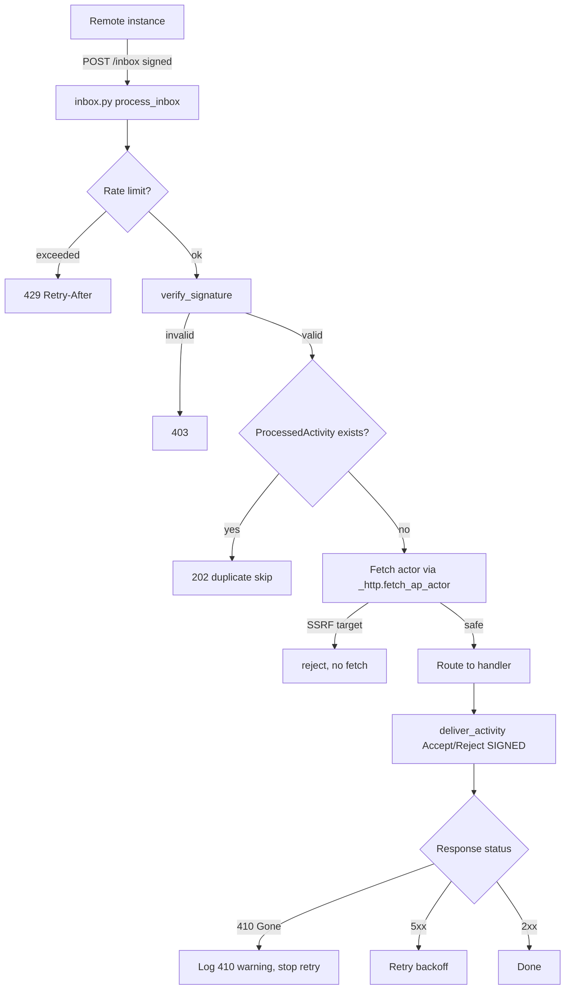

# Instruction: ActivityPub Federation Quick Wins

## Feature

- **Summary**: Apply the security/reliability quick wins from the federation audit — route the live inbox to the secured `inbox.py` implementation, mutualize the SSRF-safe actor fetch, add date skew protection, add 404-guard on inbox targets, sign all outgoing Accept/Reject activities, stop retrying on permanent 4xx (log and move on), and harden Celery delivery tasks with `acks_late` + exponential backoff + `time_limit`.
- **Stack**: `Python 3.11+`, `Django 5.0`, `Celery 5.3`, `httpx 0.27`, `cryptography 42`, `django-ratelimit 4.1`, `pytest 8 + pytest-django + pytest-mock`
- **Branch name**: `feat/ap-federation-quick-wins`
- **Parent Plan**: `none`
- **Sequence**: `standalone`
- Confidence: 9/10
- Time to implement: ~6h

## Architecture projection

<!-- Validated with the user 2026-05-29. -->

### Files to modify

- `suddenly/activitypub/urls.py` - route the 3 inboxes to `inbox.py` instead of `views.py` (F0-1)
- `suddenly/activitypub/views.py` - delete the 3 dead inbox stubs `user_inbox`/`game_inbox`/`character_inbox` (F0-1)
- `suddenly/activitypub/signatures.py` - `_fetch_public_key` delegates to `_http.fetch_ap_actor` (F0-2); add date skew ±30s check in `verify_signature` (F0-3)
- `suddenly/activitypub/inbox.py` - `get_or_create_remote_user` fetches via `_http.fetch_ap_actor` (F0-2); add 404 check for non-existent local actor target in the 3 inbox functions
- `suddenly/activitypub/tasks.py` - sign Accept/Reject deliveries (F1-2); handle permanent 4xx/410 in `deliver_activity` without retry (F1-3); add `acks_late`/`time_limit`/exponential backoff; fetch via `_http` in `get_or_create_remote_user` + `fetch_remote_actor` (F0-2)
- `suddenly/activitypub/federation_views.py` - `_fetch_actor` delegates to the shared helper (DRY)
- `pyproject.toml` - remove `inbox.py`/`tasks.py` from `coverage.omit` so the new tests count

### Files to create

- `suddenly/activitypub/_http.py` - `fetch_ap_actor(url) -> dict | None` with SSRF guard (DNS resolution + private/loopback/link-local block), extracted from `federation_views._fetch_actor`
- `tests/activitypub/test_quick_wins.py` - SSRF block, date skew reject, signed delivery, 4xx no-retry, inbox signature+idempotency (uses `pytest-mock`, no extra dependency)

### Files to delete

- None (only function-level removal inside `views.py`)

## Applicable rules

| Tool   | Name   | Path                                  | Why it applies |
| ------ | ------ | ------------------------------------- | -------------- |
| claude | ap-pivots-django-activitypub | `.claude/rules/07-quality/ap-pivots-django-activitypub.md` | Normative checklist §1/§2/§3/§9 driving the 4 fixes |
| claude | 08-activitypub | `.claude/rules/08-domain/08-activitypub.md` | Outgoing Content-Type, keyId format, signature-before-process, SSRF |
| claude | dry-refactor | `.claude/rules/07-quality/dry-refactor.md` | SSRF fetch duplicated 4× → extract before applying |
| claude | perf-pivots-celery | `.claude/rules/07-quality/perf-pivots-celery.md` | 410 = permanent error, must not retry |
| claude | perf-pivots-httpx | `.claude/rules/07-quality/perf-pivots-httpx.md` | `_http.py` timeout + error handling |
| claude | 05-pytest | `.claude/rules/05-testing/05-pytest.md` | Test patterns for critical AP paths |
| claude | 03-django-views | `.claude/rules/03-frameworks-and-libraries/03-django-views.md` | Thin views |
| claude | file-language-and-style | `.claude/rules/01-standards/file-language-and-style.md` | Plan FR, code/comments EN |

## User Journey

## Risk register

| Risk     | Impact                        | Mitigation                            |
| -------- | ----------------------------- | ------------------------------------- |
| inbox.py processes synchronously in-request (vs current `.delay()` async) | Slower inbox response; sync httpx fetch in request path | Acceptable — fetch only on unknown actor (slow path), guarded by SSRF + 10s timeout; rate limit runs first |
| inbox.py + tasks.py have divergent duplicate handlers | After F0-1, `process_incoming_activity` task handlers become partly dead | Out of scope for quick wins; flag as follow-up. Do not delete tasks.py handlers (used elsewhere) |
| Removing `views.py` inbox stubs breaks `from . import views` imports | NameError / NoReverseMatch | urls.py actor routes still import `views`; only the 3 stub functions are removed, not the module |
| 410 Gone handling | Destructive cascade if remote User is deleted | No deletion in quick wins — 410 → log + return without retry only; proper unfederate (actor removal) is a separate planned task |
| SSRF helper extraction changes federation_views behavior | Regression in federated search | Keep `_fetch_actor` signature; delegate body to shared helper; covered by existing tests |

## Implementation phases

### Phase 1: Mutualize SSRF-safe actor fetch (F0-2)

> Extract the robust SSRF guard into one shared helper, replace all 4 unprotected fetches.

#### Tasks

1. Create `suddenly/activitypub/_http.py` with `fetch_ap_actor(url, *, timeout=10) -> dict | None` containing the DNS-resolution + private/loopback/link-local block from `federation_views._fetch_actor`.
2. Refactor `federation_views._fetch_actor` to delegate to `fetch_ap_actor`.
3. Replace the raw `httpx.Client().get(actor_url)` in `signatures.py:_fetch_public_key`, `inbox.py:get_or_create_remote_user`, `tasks.py:get_or_create_remote_user` with `fetch_ap_actor(url)` (default timeout 10s). For `tasks.py:fetch_remote_actor` (periodic refresh), pass `fetch_ap_actor(actor_url, timeout=30)` to preserve its current 30s timeout.

#### Acceptance criteria

- [ ] No raw `httpx` actor fetch remains outside `_http.py` (`grep -rn "httpx" suddenly/activitypub --include="*.py"` shows only `_http.py` + `deliver_activity` POST)
- [ ] `fetch_ap_actor("http://localhost/actor")` returns None without network call
- [ ] `mypy suddenly/activitypub` passes

### Phase 2: Wire the secured inbox + date skew (F0-1, F0-3)

> Route live inbox traffic to the implementation that already does signature + idempotency + rate limit. Add date skew protection and 404 guards.

#### Tasks

1. In `urls.py`, import inbox views from `.inbox` and point `user-inbox`/`game-inbox`/`character-inbox` to `inbox.user_inbox`/`game_inbox`/`character_inbox`.
2. Remove the 3 dead inbox stub functions from `views.py` (keep actor/outbox/well-known views untouched).
3. Change the rate-limit rejection in `inbox.py:process_inbox` to return `429` with `Retry-After: 60` header instead of `403`.
4. Add a 404 guard to each of the 3 inbox functions in `inbox.py` — return 404 if `get_local_actor(actor_type, actor_identifier)` is None (keep consistent with `views.py` behavior).
5. In `signatures.py:verify_signature`, after the algorithm check, parse the `Date` request header with `django.utils.http.parse_http_date`. If the header is absent or unparseable, skip the check (do not reject — some AP implementations omit it). If present and parseable, reject with `(False, "Date skew")` if the absolute difference from `timezone.now()` exceeds 30 seconds.

#### Acceptance criteria

- [ ] POST to any `/inbox` with no/invalid `Signature` returns 403
- [ ] POST with an already-seen `activity_id` returns 202 without re-processing
- [ ] Rate-limited request returns 429 with `Retry-After`
- [ ] POST to `/users/nonexistent/inbox` returns 404
- [ ] POST with `Date` header >30s in the past returns 403 (verify_signature returns False, process_inbox returns HttpResponseForbidden)
- [ ] `python manage.py check` passes (URL resolution intact)

### Phase 3: Sign Accept/Reject deliveries (F1-2)

> Stop sending unsigned Accept/Reject that remote instances will reject.

#### Tasks

1. In `tasks.py:send_accept_follow`, resolve signing keys via `get_actor_signing_keys(target)` and pass `actor_key_id`/`private_key_pem` to `deliver_activity.delay`.
2. Same for `send_accept_activity` (sign as `creator`) and `send_reject_activity` (sign as `creator`).

#### Acceptance criteria

- [ ] All `deliver_activity.delay(...)` calls in `tasks.py` pass `actor_key_id` and `private_key_pem` (`grep` shows no bare 2-arg delivery)
- [ ] A test asserts `deliver_activity.delay` is called with a non-None `actor_key_id` kwarg

### Phase 4: Harden delivery task (F1-1, F1-2 Celery, F1-3)

> Stop retrying on permanent errors. Harden delivery with `acks_late`, exponential backoff, and `time_limit`.

#### Tasks

1. In `tasks.py:deliver_activity`, after the POST, handle status codes:
   - `410 Gone` → `logger.warning("AP delivery 410 Gone: %s", inbox_url)` and `return` (no retry, no deletion — proper unfederate is a separate task).
   - Any other `4xx` → `logger.warning("AP permanent delivery failure %s → %s", inbox_url, status_code)` and `return` (no retry).
   - `5xx` or `httpx.RequestError` → `self.retry(countdown=2 ** self.request.retries * 60)` (exponential: 60s, 120s, 240s, 480s, 960s).
2. Update the `@shared_task` decorator on `deliver_activity` to add `acks_late=True`, `reject_on_worker_lost=True`, `max_retries=5`, `soft_time_limit=120`, `time_limit=150` (30s httpx timeout + overhead leaves ample headroom).
3. Update `process_incoming_activity` retry to use the same exponential backoff (`2 ** retries * 60`) instead of the current linear countdown.

#### Acceptance criteria

- [ ] A 410 response logs a warning and does NOT call `self.retry`
- [ ] A 4xx response (e.g. 404) does NOT call `self.retry`
- [ ] A 5xx response calls `self.retry` with exponential countdown
- [ ] `deliver_activity` decorator includes `acks_late=True` and `time_limit=150`

### Phase 5: Tests + coverage

> Lock the critical AP paths with deterministic tests.

#### Tasks

1. Remove `inbox.py`/`tasks.py` from `pyproject.toml` `coverage.omit`.
2. Write `tests/activitypub/test_quick_wins.py` using `pytest-mock` (`mocker.patch`) — no new dependencies needed. Single test strategy: mock `.delay` for enqueue checks; call `deliver_activity.apply(args=[...])` directly (in-process, no broker) for internal behavior checks:
   - SSRF block: call `fetch_ap_actor("http://127.0.0.1/actor")` directly → assert returns None, no network call (mock `httpx.Client`)
   - Date skew reject: call `verify_signature(request)` with a `Date` header 60s in the past → assert returns `(False, "Date skew")`
   - Inbox signature reject: Django `Client().post("/users/<u>/inbox", ...)` without `Signature` header → 403
   - Inbox idempotency: two identical Django test `Client().post(...)` calls with `mocker.patch("suddenly.activitypub.inbox.verify_signature", return_value=(True, "https://remote.example/actor#main-key"))` → second returns 202, `ProcessedActivity.objects.count() == 1`
   - Signed Accept delivery: `mocker.patch("suddenly.activitypub.tasks.deliver_activity.delay")`, trigger `send_accept_follow.apply(...)` → assert `.delay` called with non-None `actor_key_id` kwarg
   - 4xx no-retry: `deliver_activity.apply(args=[activity, inbox_url], kwargs={...})` with `mocker.patch("httpx.Client")` returning status 404 → assert `self.retry` not raised
   - 5xx retry: same with status 503 → assert `celery.exceptions.Retry` raised

#### Acceptance criteria

- [ ] `pytest tests/activitypub/test_quick_wins.py` exits 0
- [ ] Coverage for `inbox.py` and `tasks.py` delivery path > 0 (no longer omitted)

## Amendments

<!-- AI-initiated changes during implementation. Each entry is prefixed with 🤖. -->

## Log

<!-- APPEND ONLY. One entry per step attempt. Never rewrite. -->

## Validation flow demonstration

1. Start the stack; send a signed `Follow` POST to `/users/<u>/inbox` from a test remote actor → response 202, a `Follow` + `ProcessedActivity` row created.
2. Replay the identical POST → 202, no second `Follow` row (idempotency).
3. Send the same POST with a tampered body → 403 (digest/signature mismatch).
4. Send a `Follow` whose `actor` resolves to `127.0.0.1` → actor fetch blocked, no internal request made.
5. Inspect the outgoing `Accept` delivery → it carries a valid `Signature` header.
6. Point a follower's `inbox_url` at an endpoint returning 410 → delivery logs a warning and schedules no retry; the remote actor row remains (no cascade deletion in quick wins scope).
