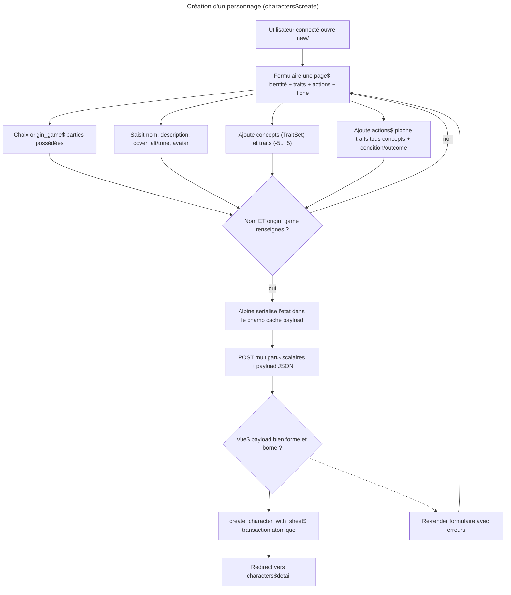

# Instruction : Vue de création de personnage (`characters:create`)

## Feature

- **Summary** : fusionner les conventions Django existantes (`character_edit`, `trait_views.py`, `game_form.html`) avec le système d'interaction du wireframe `aidd_docs/wireframes/suddenly-character-create.html` — identité, traits par concept, actions transverses, fiche externe, assemblés sur une seule page, un seul geste de création (« Créer »).
- **Stack** : `Django (Python 3.12+)` · `PostgreSQL` · `HTMX` · `Alpine.js` · `UnoCSS` · `pytest-django` · `mypy` · `ruff`
- **Branch name** : `feat/characters-create-view`
- **Parent Plan** : `none`
- **Sequence** : `standalone`
- Confidence : 10/10 (0 deal breaker / 0 suggestion après 3 itérations de challenge)
- Time to implement : ~1 journée

### Décisions déjà actées (AskUserQuestion)

1. **Cover** : deux `CharField` texte (`cover_alt`/`cover_tone`) sur `Character` via migration — pas d'upload d'image séparé, l'avatar existant couvre le visuel.
2. **Actions** : élargissement du modèle `Action` pour piloter des traits à travers **tous** les `TraitSet` du personnage (aujourd'hui un seul). Migration en 3 étapes avec backfill. `trait_views.py`/`ActionForm`/l'éditeur existant restent **strictement inchangés et rétrocompatibles**.
3. **Avatar** : on garde le pattern d'upload existant (`character_edit` + `components/form_image_upload.html`), pas d'avatar auto-généré (l'initiale SVG du wireframe reste un rendu client, hors périmètre modèle).
4. **Brouillon** : bouton supprimé. Une seule action « Créer », persistance directe et atomique.

## Architecture projection

<!-- Validée avec l'utilisateur avant finalisation. -->

### Files to modify

- `suddenly/characters/models.py` — ajout `cover_alt`/`cover_tone` sur `Character` ; `Action.character` (FK) + `Action.trait_set` nullable ; `Action.__str__` fallback.
- `suddenly/characters/trait_views.py` — `action_create` : renseigner `action.character = trait_set.character` avant `.save()` (sans quoi la migration 0016 casse l'éditeur HTMX existant, `character` devenant `NOT NULL`).
- `suddenly/characters/services.py` — nouvelle fonction `create_character_with_sheet(...)` (construction atomique du personnage + sous-objets).
- `suddenly/characters/front_views.py` — nouvelle vue `character_create` (GET formulaire, POST → parse payload JSON + service).
- `suddenly/characters/front_urls.py` — route `new/` avant les patterns `<slug:slug>/`.
- `templates/characters/character_form.html` — retirer la branche morte « New character »/« Create » (titre, bouton, fallback `characters:list`) : aucune route n'appelle jamais ce template avec `character=None` (seul appelant : `character_edit`, toujours avec un `character` réel), et `character_create.html` devient le seul template de création. Simplifier ce fichier en formulaire d'édition pur.
- `templates/characters/detail.html` — bloc « Actions transverses » (`character.actions.filter(trait_set__isnull=True)`), affiché si non vide.
- `templates/characters/traits_editor.html` — même bloc « Actions transverses » côté éditeur.

### Files to create

- `suddenly/characters/migrations/0013_character_cover_fields.py` — `AddField` ×2 (`cover_alt`, `cover_tone`).
- `suddenly/characters/migrations/0014_action_character_add.py` — `AddField('action','character', null=True)`.
- `suddenly/characters/migrations/0015_action_character_backfill.py` — `RunPython` backfill (`action.character = action.trait_set.character`) + reverse noop.
- `suddenly/characters/migrations/0016_action_character_finalize.py` — `AlterField` character `null=False` + trait_set `null=True, blank=True`.
- `templates/characters/character_create.html` — page de création (Alpine `x-data`, champ caché `payload` JSON).
- `tests/characters/test_character_create.py` — tests vue + service + rétrocompat `action_create`.

### Files to delete

- `aidd_docs/tasks/character-create-view.plan.md` — brouillon plat non conforme, remplacé par ce fichier (convention `tasks/<yyyy_mm>/`).

## Applicable rules

| Tool   | Name                         | Path                                                              | Why it applies |
| ------ | ---------------------------- | ----------------------------------------------------------------- | -------------- |
| claude | 03-django-models             | `.claude/rules/03-frameworks-and-libraries/03-django-models.md`   | `on_delete` explicite, `BaseModel`, pas de logique métier dans le modèle. |
| claude | 03-django-services           | `.claude/rules/03-frameworks-and-libraries/03-django-services.md` | Service atomique, signature domaine (pas de `HttpRequest`), builders partagés. |
| claude | 03-m2m-edit-views            | `.claude/rules/03-frameworks-and-libraries/03-m2m-edit-views.md`  | `Action.traits` M2M — `.set()` après `.save()` ; migration en 3 étapes. |
| claude | 03-htmx-patterns             | `.claude/rules/03-frameworks-and-libraries/03-htmx-patterns.md`   | `@require_POST` sur mutation, `|escapejs` sur data-*, namespace `characters:` dans ``. |
| claude | 03-alpine-patterns           | `.claude/rules/03-frameworks-and-libraries/03-alpine-patterns.md` | Composant Alpine sérialisant l'état vers `payload` ; pas d'interpolation `{{ }}` dans le JS. |
| claude | 08-characters                | `.claude/rules/08-domain/08-characters.md`                        | Statuts `Character` (création en `PC`) et invariants domaine. |
| claude | 08-i18n-patterns             | `.claude/rules/08-domain/08-i18n-patterns.md`                     | Chaînes UI via `gettext` dans le template, pas dans les settings. |
| claude | mobile-first                 | `.claude/rules/08-design/mobile-first.md`                         | Tokens, touch targets ≥ 44px, icônes Lucide (pas d'emoji), a11y AA. |
| claude | file-language-and-style      | `.claude/rules/01-standards/file-language-and-style.md`           | Ce plan (`aidd_docs/tasks/**`) est human-consumed → rédigé en français. |

## User Journey

## Risk register

| Risk | Impact | Mitigation |
| ---- | ------ | ---------- |
| Régression de l'éditeur de traits HTMX (`trait_views.py`) après élargissement d'`Action`. | Le flux d'édition existant casse (create/delete action) — `IntegrityError` dès que 0016 rend `character` `NOT NULL` si `action_create` n'est pas corrigé. | `trait_set` reste posé par `action_create` ; ajout de `action.character = trait_set.character` (Phase 1, tâche 3bis) ; `ActionForm` et sa queryset restreinte inchangés. Test de non-régression obligatoire. |
| `templates/characters/character_form.html` contient déjà une branche « New character »/« Create » non câblée (code mort — aucune route n'appelle ce template avec `character=None`), redondante avec le nouveau `character_create.html`. | Confusion sur le template canonique de création, code mort persistant. | Retirer la branche « New character » de `character_form.html` (Phase 4, tâche 9) ; ce fichier redevient un formulaire d'édition pur. |
| `Action.__str__` lève `AttributeError` quand `trait_set` est `None`. | 500 à l'admin / au repr des actions transverses. | Fallback `f"{name} → {character.name}"` si `trait_set is None`. |
| Actions sans `trait_set` invisibles (les blocs concept bouclent sur `set.actions.all`). | Actions créées via le nouveau flux jamais affichées. | Bloc « Actions transverses » sur `detail.html`/`traits_editor.html` via `character.actions.filter(trait_set__isnull=True)`. |
| Migration 3 étapes appliquée partiellement en prod (backfill manquant avant `null=False`). | Migration finale échoue sur lignes `character` NULL. | 4 migrations distinctes, ordonnées ; `RunPython` idempotent ; `makemigrations --check` en success_condition. |
| Payload JSON en champ caché = pattern nouveau dans le projet (déviation du formulaire Django classique). | Surface d'attaque / données malformées. | `json.loads` gardé ; validation de forme minimale (types, tailles bornées) ; `full_clean()` sur chaque objet ; `@require_POST` + `@login_required` ; pas de `value` validator (interdit par le modèle), clamp -5/+5 client seulement. |
| `new/` capturé comme un `<slug:slug>`. | La route de création résout vers `character_detail`. | Placer `new/` dans le groupe des routes fixes (`search/`, `dashboard/`, `bulk-delete/`), avant tout pattern à slug. |

## Implementation phases

> Chaque phase laisse le système fonctionnel et déployable indépendamment (compat ascendante).

### Phase 1 : Migrations modèle (Character cover + élargissement Action)

> Faire évoluer le schéma sans toucher au comportement existant.

#### Tasks

1. `Character` : ajouter `cover_alt = CharField(max_length=280, blank=True)` et `cover_tone = CharField(max_length=80, blank=True)` — calqués sur `RapportMedia.alt`/`.tone` (`suddenly/games/models.py:365-374`), sans `ImageField` ni `OneToOne`.
2. `Action` : ajouter `character = FK(Character, on_delete=CASCADE, related_name="actions", null=True)` (étape 1).
3. `Action` : `__str__` → fallback `f"{self.name} → {self.character.name}"` si `trait_set is None`.
3bis. `trait_views.action_create` : ajouter `action.character = trait_set.character` avant `action.save()` — sans cela, la migration 0016 (`character` `NOT NULL`) casse la création d'action via l'éditeur HTMX existant.
4. Générer migration cover (`0013`), migration `AddField` character (`0014`).
5. Migration `RunPython` (`0015`) : `for a in Action.objects.all(): a.character = a.trait_set.character; a.save(update_fields=["character"])` ; reverse = noop.
6. Migration finale (`0016`) : `AlterField` `character` `null=False` + `AlterField` `trait_set` `null=True, blank=True`.
7. Ne **pas** ajouter de validator sur `Trait.value` (interdit par la docstring du modèle).

#### Acceptance criteria

- [ ] `python manage.py makemigrations --check --dry-run` exit 0 (aucune migration manquante).
- [ ] `python manage.py migrate` applique 0013→0016 sans erreur sur une base peuplée.
- [ ] `trait_views.action_create` renseigne explicitement `action.character = trait_set.character` (tâche 3bis) et crée toujours une action valide (test) : `trait_set` renseigné ET `character` renseigné.
- [ ] `Action.__str__` ne lève pas quand `trait_set is None`.

### Phase 2 : Service `create_character_with_sheet`

> Persistance atomique du personnage complet, sans passer par un `ModelForm` imbriqué.

#### Tasks

1. Nouvelle fonction dans `suddenly/characters/services.py`, décorée `@transaction.atomic`, signature domaine (pas de `HttpRequest`) :
   `create_character_with_sheet(*, user, name, description, origin_game, sheet_url, avatar, cover_alt, cover_tone, trait_sets, actions) -> Character`.
2. Structures attendues : `trait_sets = [{"label": str, "traits": [{"name": str, "value": int|None, "note": str}]}]` ; `actions = [{"name": str, "trait_refs": [[set_index, trait_index]], "condition": str, "outcome": str}]` (listes JSON à deux éléments, pas des tuples Python — le payload transite par `json.loads`).
3. Construire `Character` (`status=PC`, `owner=user`, `creator=user`, `origin_game`) → `full_clean(exclude=["slug"])` → `save()` (`slug` encore vide à cet instant, auto-généré dans `save()` — même précédent défensif que `create_scene_post`/`full_clean(exclude=["report"])`).
4. Créer chaque `TraitSet` (`order=index`), `full_clean()`, `save()`, puis ses `Trait` (`order=index`), `full_clean()`, `save()` — même idiome que `Character`/`Action` (`03-django-services.md`), en mémorisant les instances pour résoudre `trait_refs`.
5. Créer chaque `Action` (`character=character`, `trait_set=None`, `order=index`), `full_clean()`, `save()`, puis `.traits.set(resolved)` **après** `save()` (règle m2m-edit-views).
6. Aucune validation de plage sur `Trait.value`.

#### Acceptance criteria

- [ ] Un appel avec 2 concepts + 1 action transverse crée 1 `Character`, 2 `TraitSet`, N `Trait`, 1 `Action` liée aux bons traits.
- [ ] `trait_refs` invalide (index hors borne) lève proprement (test) sans laisser d'objets orphelins (rollback atomique).
- [ ] Aucune requête N+1 non maîtrisée (construction en boucle bornée, pas de refetch).

### Phase 3 : Vue + URL + parsing payload

> Exposer `characters:create`, lire les scalaires + le payload JSON, appeler le service.

#### Tasks

1. `front_views.character_create` : `@login_required` ; GET rend `character_create.html` ; POST (implicitement, mutation gardée par la présence du POST) parse.
2. Scalaires lus directement : `name`, `description`, `origin_game` (via `request.POST`), `avatar` (via `request.FILES`), `cover_alt`, `cover_tone`, `sheet_url`.
3. `origin_game` : `<select>` alimenté par `Game.objects.filter(owner=request.user)` — queryset passé au contexte template sur le GET (`games=...`) ; validé côté POST comme appartenant à `request.user` ; obligatoire (modèle non-null).
4. `payload = json.loads(request.POST["payload"])` ; valider forme minimale (listes/dicts, tailles bornées) ; mapper vers `trait_sets`/`actions` du service (traduire `name`→`label` pour un TraitSet, résoudre les références de traits par index).
5. Succès → `redirect(reverse("characters:detail", kwargs={"slug": character.slug}))`.
6. Échec (payload malformé, nom vide, origin_game absent/non possédé) → re-render `character_create.html` avec `error` + `form_data`, status 422.
7. `front_urls.py` : `path("new/", front_views.character_create, name="create")` dans le groupe des routes fixes, avant `<slug:slug>/`.

#### Acceptance criteria

- [ ] `GET /characters/new/` (authentifié) rend 200 avec le `<select>` limité aux parties possédées.
- [ ] `POST` valide crée le personnage et redirige (302) vers son détail.
- [ ] `POST` avec `payload` malformé ou nom vide rend 422, ne crée rien.
- [ ] `POST` avec `origin_game` non possédé par l'utilisateur est rejeté.
- [ ] `reverse("characters:create")` résout ; `/characters/new/` ne matche pas `character_detail`.

### Phase 4 : Template + affichage actions transverses

> Page de création alignée sur les conventions réelles du projet ; rendre visibles les actions sans concept.

#### Tasks

1. `templates/characters/character_create.html` : structure reprise de `game_form.html` (`x-data`, `@submit`, `enctype="multipart/form-data"`) + classes réelles (`form-input`, `card card-body`, `btn-primary`) — **pas** le CSS du wireframe (`.chip`/`.tset`/`.dock`, variables `--c-*`).
2. Section Identité : `name`, `description`, `origin_game` (`<select>`), `cover_alt`/`cover_tone` (texte, modèle du « Content warning »), avatar via ``.
3. Section Traits : concepts/traits ajoutables/supprimables en Alpine, `value` -5..+5 (clamp client, même sélecteur que `trait_set.html`) ; aucune persistance avant soumission.
4. Section Actions : nom + sélection de traits **tous concepts confondus** (par référence d'index) + `condition`/`outcome` (texte libre, jamais évalué).
5. Fiche externe : `sheet_url`.
6. Un seul bouton « Créer » (pas de brouillon), désactivé tant que `name` + `origin_game` manquent.
7. À la soumission : composant Alpine sérialise l'état dans le champ caché `payload` (transposition de `buildPayload()` du wireframe vers les vrais noms de champs), puis POST normal (pas de `fetch`) ; `|escapejs` sur toute valeur injectée en `data-*`.
8. Bloc « Actions transverses » sur `detail.html` et `traits_editor.html` : `character.actions.filter(trait_set__isnull=True)`, affiché uniquement si non vide, avec ses traits liés.
9. `templates/characters/character_form.html` : retirer la branche « New character »/« Create » (titre, bouton, fallback `characters:list`) — code mort, jamais atteinte (`character_edit` n'appelle ce template qu'avec un `character` réel). Le fichier redevient un formulaire d'édition pur (`` / bouton « Save » uniquement).

#### Acceptance criteria

- [x] Le bouton « Créer » est désactivé sans nom ou sans partie, actif sinon. *(vérifié structurellement : `canSubmit` = `hasName && hasGame`, binding `:disabled="!canSubmit"` confirmé présent par `test_renders_alpine_scaffold_and_hidden_payload` ; pas de test navigateur live — cf. Log.)*
- [x] Une action transverse créée apparaît dans le bloc « Actions transverses » du détail ET de l'éditeur. *(`test_transverse_action_shown_on_detail`, `test_transverse_action_shown_on_traits_editor`.)*
- [x] Une action de l'éditeur classique (avec `trait_set`) reste affichée dans son bloc concept, pas en transverse. *(`test_classic_action_with_trait_set_not_in_transverse_block`.)*
- [x] Aucune interpolation `{{ }}` dans une string JS ; icônes Lucide, pas d'emoji ; touch targets ≥ 44px. *(relecture intégrale de `character_create.html` : uniquement `i-lucide-*`, aucun emoji, badges traits en `min-h-11`.)*
- [x] `character_form.html` n'affiche plus que le mode édition (plus de branche « New character » / bouton « Create » / fallback `characters:list`) ; `character_edit` reste fonctionnel sans régression. *(`tests/characters/test_character_edit.py`, 4 tests, nouveau fichier — aucune couverture préexistante sur cette vue.)*

## Points de déviation signalés

1. **Payload JSON en champ caché** plutôt qu'un formset Django imbriqué ou un endpoint API — seule option praticable (les lignes se référencent entre elles par index avant d'exister, aucune n'a de PK). Pattern nouveau dans le projet, assumé.
2. **`origin_game` limité aux parties possédées** (`owner`) — pas de notion de « membre » au-delà d'`owner` dans `games/models.py`.
3. **Bloc « Actions transverses »** sur `detail.html`/`traits_editor.html` — nouveau bloc UI, absent du wireframe d'édition existant, nécessaire pour ne pas perdre les actions sans concept.
4. **`cover_alt`/`cover_tone` = simples `CharField`** sans image — intention confirmée (pas d'upload de couverture séparé de l'avatar).

## Confidence assessment

- Niveau : **10/10** (après 2 itérations de challenge — 0 deal breaker, 0 suggestion en itération 3).
- ✓ Codebase intégralement lu et vérifié (modèles, forms, `trait_views`, `front_views`, `front_urls`, `services`, templates, wireframe, `RapportMedia`).
- ✓ Décisions structurantes déjà tranchées avec l'utilisateur ; migration 4 étapes calquée sur le pattern documenté (`03-m2m-edit-views.md`), adapté à un FK (pas un M2M).
- ✓ Rétrocompatibilité de l'éditeur existant assurée par ajout-seulement (aucune suppression de champ/comportement) et par la tâche 3bis (`trait_views.action_create`).
- ✓ Duplication avec `character_form.html` identifiée et résolue (branche morte retirée).
- ✓ Idiome `full_clean()` + `save()` appliqué uniformément à `Character`, `TraitSet`, `Trait`, `Action` dans le service.
- ✗ Risque résiduel assumé : forme exacte de la validation du payload JSON (bornes, messages d'erreur) à affiner à l'implémentation — hors périmètre d'un plan (détail de code).
- ✗ Risque résiduel assumé : parité visuelle avec le wireframe non garantie (choix assumé d'utiliser le design system réel, pas le CSS du wireframe).

## Amendments

<!-- Changements initiés par l'IA en cours d'implémentation. Préfixe 🤖. -->

🤖 Itération 1 (challenge, confiance 60%) : ajout tâche `trait_views.action_create` → `action.character` (deal breaker rétrocompat) ; retrait de la branche morte « New character » de `character_form.html` (deal breaker duplication) ; ajout du passage du queryset `games` au contexte GET (suggestion) ; `full_clean(exclude=["slug"])` sur `Character` (suggestion, précédent `create_scene_post`).

🤖 Itération 2 (challenge, confiance 85%) : `trait_refs` reformulé en listes JSON à deux éléments plutôt qu'en tuples Python (suggestion, clarté du contrat payload) ; `full_clean()` ajouté explicitement sur `TraitSet`/`Trait` dans le service, pour homogénéité avec `Character`/`Action` (suggestion, cohérence avec `03-django-services.md`) ; section « Confidence assessment » resynchronisée avec l'historique de challenge réel.

🤖 Itération 3 (challenge, confiance 100%) : 0 deal breaker, 0 suggestion — seuil atteint, boucle arrêtée.

🤖 Implémentation, Phase 1 (deal breaker découvert post-migration 0016) : deux autres appelants créent des `Action` sans passer par `trait_views.action_create`, non couverts par le plan initial. `Action.character` devenant `NOT NULL`, les deux cassaient :
- `suddenly/activitypub/inbox.py::_ingest_trait_sets` (`Action.objects.create(...)` sans `character=`) — confirmé par échec de `tests/activitypub/test_trait_federation.py` (`IntegrityError`). Fix : passer `character=character` (la `Character` déjà en scope dans la boucle).
- `suddenly/characters/admin.py::ActionInline` (sous `TraitSetAdmin`) — `character` absent du formulaire inline (seul `trait_set` est le FK parent détecté par Django), donc toute création d'`Action` via l'admin lèverait `IntegrityError`. Fix : `TraitSetAdmin.save_formset` backfill `instance.character = instance.trait_set.character` avant `.save()`, même idiome que la tâche 3bis.
Les deux fixes sont scope-additions à la Phase 1 (fichiers touchés en plus de la liste initiale : `suddenly/activitypub/inbox.py`, `suddenly/characters/admin.py`), nécessaires pour que la migration 0016 ne régresse pas de code existant hors du périmètre `characters/` initialement listé.

## Log

<!-- APPEND ONLY. Une entrée par tentative d'étape. Ne jamais réécrire. -->

🤖 Phase 2 (service `create_character_with_sheet`) : implémentée dans `suddenly/characters/services.py` (`Character` → `full_clean(exclude=["slug"])` → `save()` ; `TraitSet`/`Trait` créés en boucle avec `order=index`, indexés dans `traits_by_ref` par `(set_index, trait_index)` ; `Action(trait_set=None)` créée puis `.traits.set(resolved)` après `.save()`). Index `trait_refs` hors borne : `KeyError` naturel (documenté dans la docstring, à charge de la Phase 3 de le catcher), rollback complet garanti par `@transaction.atomic`. Tests ajoutés dans `tests/characters/test_character_create.py` (création 2 concepts + action transverse, valeur de trait hors plage non rejetée, rollback sur ref invalide, borne de requêtes). `ruff check suddenly/characters` ✅, `mypy suddenly/characters` ✅ (16 fichiers), `pytest tests/characters/test_character_create.py` (4 passed) et `pytest tests/characters/` (98 passed, suite complète sans régression). Aucune commande git exécutée (working tree laissé en l'état, non commité, conformément à la contrainte).

🤖 Phase 3 (vue `characters:create` + URL + parsing payload) : `suddenly/characters/front_views.py` — vue `character_create` (`@login_required`, GET+POST combinés, pas de branche HTMX) ; scalaires lus directement sur `request.POST`/`request.FILES` ; `origin_game` validé par appartenance via `Game.objects.filter(owner=request.user)` (queryset passé en contexte GET, `.get(pk=...)` catché sur POST) ; `payload` JSON parsé et validé par `_parse_character_create_payload` (bornes `MAX_TRAIT_SETS/TRAITS/ACTIONS/TRAIT_REFS = 50`, garde `_is_plain_int` contre le piège `bool` sous-classe d'`int`, `name`→`label` pour les TraitSet, `trait_refs` en `[int,int]`) avant appel à `create_character_with_sheet` (Phase 2). Tout échec (payload malformé/hors bornes, nom vide, `origin_game` absent/non possédé, `KeyError`/`ValidationError` du service) → re-render 422 avec `error`+`form_data`, rien de créé ; succès → redirect 302 vers `characters:detail`. `suddenly/characters/front_urls.py` — `path("new/", front_views.character_create, name="create")` ajouté dans le groupe à patterns fixes, avant le bloc `<slug:slug>/`. `templates/characters/character_create.html` créé en stub minimal explicitement marqué « PHASE-4 remplacera ce fichier », suffisant pour satisfaire le contrat de vue (champs identité + `<input type="hidden" name="payload">`). Tests ajoutés dans `tests/characters/test_character_create.py` (11 nouveaux : résolution URL ×2, GET ×2, POST ×7) portant le fichier à 15 tests. `ruff check suddenly/characters` ✅, `mypy suddenly/characters` ✅ (16 fichiers), `python manage.py makemigrations --check --dry-run` → « No changes detected », `pytest tests/characters/test_character_create.py` (15 passed) et `pytest tests/characters/` (109 passed, suite complète sans régression, 162.15s). Aucune commande git exécutée ; fichiers de la session concurrente (`admin.py`, `_list_results.html`, `list.html`, `static/dist/*`, etc.) non touchés.

🤖 Phase 4 (template + affichage actions transverses) : `templates/characters/character_create.html` réécrit sur les conventions réelles de `game_form.html` (`x-data="characterCreate"`, `@submit`, `enctype="multipart/form-data"`, classes `form-input`/`card card-body`/`btn-primary`, pas le CSS du wireframe) — sections Identité (`name`, `description`, `origin_game`, `cover_alt`/`cover_tone`, avatar via `components/form_image_upload.html`), Traits (concepts/traits ajoutables/supprimables, valeur clampée -5..+5 côté client), Actions (sélecteur de traits toutes concepts confondues par référence positionnelle, `condition`/`outcome` en texte libre), Fiche externe (`sheet_url`), bouton unique « Créer » (`:disabled="!canSubmit"`). Composant Alpine `characterCreate` ajouté dans `frontend/src/main.js` : sérialise l'état vers le champ caché `payload` (`buildPayload()`) au format exact attendu par `_parse_character_create_payload` (résolution positionnelle `_resolveRef`, nettoyage des `traitIds` pendants à la suppression d'un set/trait). Bug de nesting de guillemets corrigé (`title=""` → guillemets simples internes, ×3 occurrences). Bloc « Actions transverses » (`character.actions.filter(trait_set__isnull=True)`, créé en Phase précédente dans `templates/characters/partials/transverse_actions.html`) confirmé inclus sur `detail.html` et `traits_editor.html`. `character_form.html` confirmé édition seule (branche « New character » retirée, code mort — `character_edit` ne fournit jamais `character=None`). Tests ajoutés : `tests/characters/test_trait_views.py` (+4, classe `TestTransverseActions` : affichage détail/éditeur, absence si aucune action transverse, non-fuite d'une action classique `trait_set` non-null) ; `tests/characters/test_character_edit.py` (nouveau fichier, 4 tests — GET édition-seule, 404 pour un tiers, POST valide + redirect, POST nom vide → 200 + erreur ; aucune couverture préexistante sur `character_edit`) ; `tests/characters/test_character_create.py` (+1, smoke structurel scaffold Alpine + champ payload caché + absence de `{% trans` non rendu). `ruff check suddenly/characters` ✅, `mypy suddenly/characters` ✅, `python manage.py makemigrations --check --dry-run` → « No changes detected », `pytest tests/characters/` (118 passed en 166.22s ; gate de couverture globale du projet à 45.55% — attendu et non bloquant sur un sous-répertoire, cf. pattern déjà observé en Phase 3). Test navigateur Playwright MCP non tenté : le composant `characterCreate` a été ajouté à la source `frontend/src/main.js` mais aucun build Vite n'a été lancé (interdit explicitement par la contrainte de session — `static/dist/*` appartient à la session concurrente), donc `static/dist/js/main.js` ne contient pas encore le nouveau composant et un smoke test navigateur serait non concluant. Aucune commande git exécutée ; tous les fichiers de la liste d'exclusion (`base.html`, `list.html`, `_list_results.html`, `_user_menu_items.html`, `static/dist/*`, `alwaysdata-deployment.md`, `inbox.py`, `admin.py`, `test_trait_federation.py`) confirmés non touchés via `git status --short` (modifiés par la session concurrente, pas par cette implémentation).

## Validation flow demonstration

1. Se connecter, posséder au moins une partie (`Game.owner = user`).
2. Ouvrir `/characters/new/`.
3. Choisir la partie d'origine, saisir un nom, une description, `cover_alt`/`cover_tone`, un avatar.
4. Ajouter deux concepts avec quelques traits (dont un à valeur négative et un sans valeur).
5. Ajouter une action piochant des traits de **deux** concepts différents, avec condition et effet.
6. Cliquer « Créer » → redirection vers la fiche du personnage.
7. Vérifier sur le détail : identité, traits par concept, et l'action listée dans « Actions transverses ».
8. Ouvrir l'éditeur de traits (`/characters/<slug>/traits/`) et confirmer que l'éditeur HTMX classique (ajout d'action liée à un concept) fonctionne toujours.
