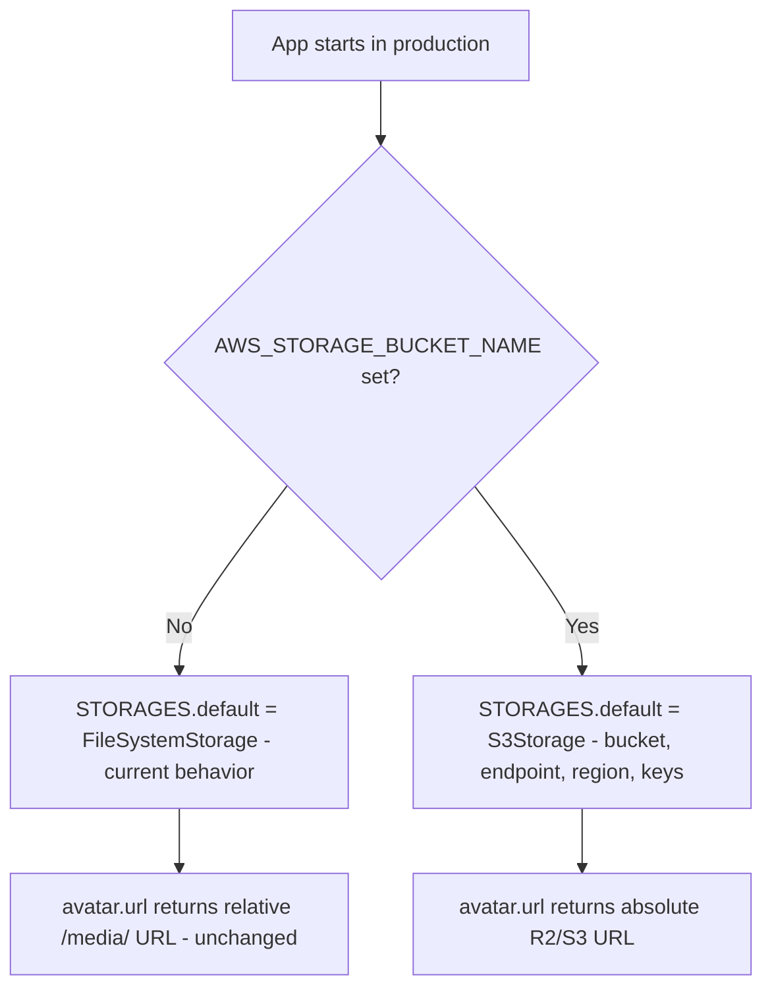

# Instruction: Conditional S3/R2 storage config

## Feature

- **Summary**: Add `django-storages[s3]` and make `STORAGES["default"]` switch to S3/R2 when `AWS_STORAGE_BUCKET_NAME` is set in production, falling back to the existing `FileSystemStorage` otherwise (dev and self-hosted stay untouched).
- **Stack**: `Django 5.0`, `django-storages[s3]` (S3Storage backend), `boto3` (transitive dependency)
- **Branch name**: `feature/media-storage-s3r2`
- **Parent Plan**: `2026_07_06-#94-media-storage-s3r2-master.md`
- **Sequence**: `1 of 4`
- Confidence: 9/10
- Time to implement: 0.5 day

## Existing files

- @pyproject.toml
- @config/settings/base.py
- @config/settings/production.py

### New file to create

- not found in current project - no comments

## User Journey

## Implementation phases

### Phase 1: Add dependency

> Make django-storages available without touching any existing dependency.

1. Add `django-storages[s3]` to `pyproject.toml` dependencies
2. Reinstall/lock via `pnpm`-equivalent for Python (`pip install -e ".[dev,federation]"` or project's lock command) — verify no version conflict with Django 5.0

### Phase 2: Conditional STORAGES override in production.py

> Replicate the existing `REDIS_URL`/`EMAIL_HOST` conditional-env pattern already used in this file — do not introduce a new config paradigm (no django-environ, no pydantic-settings).
>
> **Critical**: `STORAGES` (and `CACHES`, already in the file) is imported via `from .base import *`, which binds a reference to the *same* dict object, not a copy. Never mutate it via item assignment (`STORAGES["default"] = {...}`) — that corrupts `base.STORAGES` in place for every other module that shares the reference (e.g. `development.py`). Always **rebind the name to a brand-new dict**, exactly like the existing `CACHES = {...}` block does.

1. Read `AWS_STORAGE_BUCKET_NAME` via `os.environ.get(...)`
2. If present, rebind `STORAGES` to a new dict: `STORAGES = {**STORAGES, "default": {"BACKEND": "storages.backends.s3.S3Storage", "OPTIONS": {...}}}` (preserves the existing `staticfiles` key by spreading, without mutating the original object)
   - `OPTIONS`: `bucket_name`, `endpoint_url` (`AWS_S3_ENDPOINT_URL`), `region_name` (`AWS_S3_REGION_NAME`, default `"auto"` — this default is R2-specific; real AWS S3 deployments must set it explicitly), `access_key` (`AWS_ACCESS_KEY_ID`), `secret_key` (`AWS_SECRET_ACCESS_KEY`), `querystring_auth=False`, `file_overwrite=False`
   - Do **not** set `default_acl` — Cloudflare R2's public-access model is bucket-level (Public Development URL or custom domain), not per-object ACL like AWS S3; an unsupported ACL header can cause R2 to reject the request. Public accessibility is a Phase 0 external prerequisite (see master plan), not a code setting.
3. If absent, leave `base.py`'s `FileSystemStorage` default untouched (no-op, and `STORAGES` stays the same object — no rebind happens)

## Validation flow

1. Run `manage.py check --settings=config.settings.production` with `AWS_STORAGE_BUCKET_NAME` unset (plus other required prod env vars stubbed: `SECRET_KEY`, `DOMAIN`, `DATABASE_URL`) → confirms filesystem storage stays active, no crash
2. Run the same check with `AWS_STORAGE_BUCKET_NAME` and dummy S3 env vars set → confirms `S3Storage` backend loads without error at settings-parse time (no live network call needed for this check)
3. Confirm `docker-compose.yml` self-hosted path is unaffected (no `AWS_STORAGE_BUCKET_NAME` set there → stays on filesystem + existing persistent volume)
4. Confirm `base.STORAGES` is unmodified after importing `config.settings.production` with `AWS_STORAGE_BUCKET_NAME` set — i.e. the override is a rebind, not a mutation of the shared object
