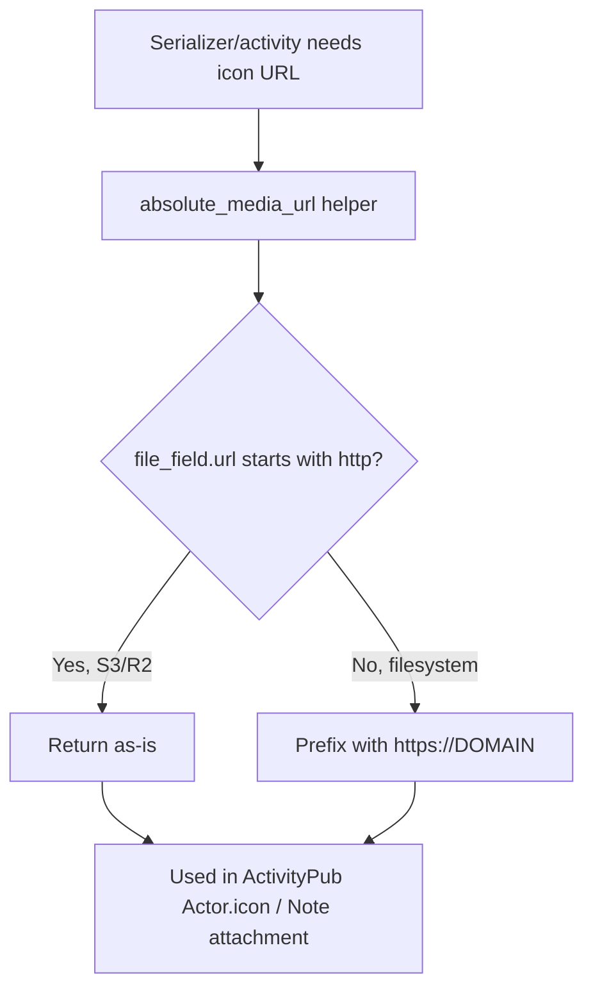

# Instruction: Federated URL reliability (DRY helper)

## Feature

- **Summary**: Extract the "build absolute avatar/icon URL" logic — currently duplicated in 3 places with a `https://{domain}` prefix that only works for relative (filesystem) URLs — into a single helper that works whether `.url` is already absolute (S3/R2) or relative (filesystem).
- **Stack**: `Django 5.0`, plain Python (no new dependency)
- **Branch name**: `feature/media-storage-s3r2`
- **Parent Plan**: `2026_07_06-#94-media-storage-s3r2-master.md`
- **Sequence**: `2 of 4`
- Confidence: 9/10
- Time to implement: 0.5 day

## Existing files

- @suddenly/activitypub/activities.py
- @suddenly/activitypub/serializers.py

### New file to create

- `suddenly/activitypub/url_utils.py` — shared `absolute_media_url(file_field)` helper

## User Journey

## Implementation phases

### Phase 1: Extract shared helper

> Rule of Three triggered — 3 call sites duplicate the same domain-prefixing logic today.

1. Create `suddenly/activitypub/url_utils.py` with `absolute_media_url(file_field) -> str`: if `file_field.url` already starts with `http://` or `https://`, return unchanged; else prefix with `f"https://{settings.DOMAIN}"`
2. Replace the manual concatenation at `suddenly/activitypub/activities.py:61` with a call to the helper
3. Replace the manual concatenation at `suddenly/activitypub/serializers.py:54` (User) with a call to the helper
4. Replace the manual concatenation at `suddenly/activitypub/serializers.py:125` (Character) with a call to the helper

## Validation flow

1. With filesystem storage active (dev default): confirm serialized `Actor.icon`/`Note` output is byte-identical to before the refactor (relative `.url` still gets the domain prefix)
2. With a mocked `.url` property returning an absolute URL (simulating S3/R2 without needing real credentials): confirm the helper returns it unchanged, no double-domain corruption
3. Manually inspect one federated payload (e.g. via existing ActivityPub test fixtures) to confirm `icon` field is a valid single URL
