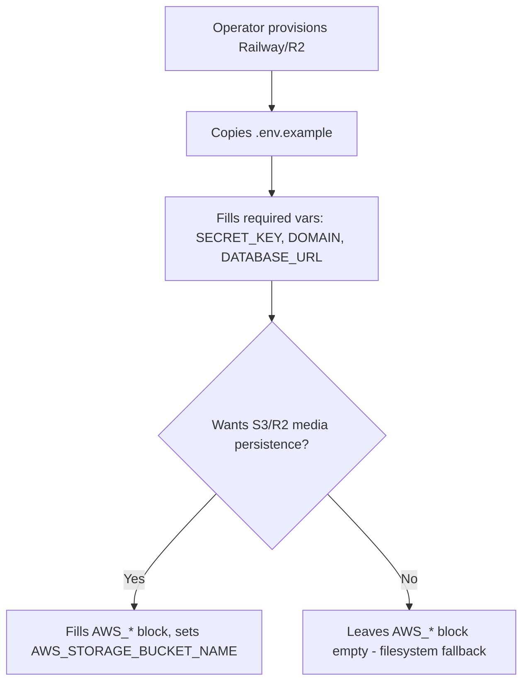

# Instruction: Operational documentation

## Feature

- **Summary**: Create `.env.example` (currently missing from the repo) documenting every environment variable `config/settings/production.py` reads, with the new S3/R2 variables clearly grouped and commented (including the `AWS_S3_REGION_NAME` gap found during investigation).
- **Stack**: plain text / dotenv format, no code
- **Branch name**: `feature/media-storage-s3r2`
- **Parent Plan**: `2026_07_06-#94-media-storage-s3r2-master.md`
- **Sequence**: `3 of 4`
- Confidence: 9/10
- Time to implement: 0.5 day

## Existing files

- @config/settings/production.py

### New file to create

- `.env.example`

## User Journey

## Implementation phases

### Phase 1: Document existing required/optional vars

> Base this strictly on what `production.py` actually reads — no speculative vars.

1. Required (fail-fast today): `SECRET_KEY`, `DOMAIN`, `DATABASE_URL`
2. Optional with fallback: `ALLOWED_HOSTS`, `REDIS_URL`, `EMAIL_HOST` (+ `EMAIL_PORT`, `EMAIL_HOST_USER`, `EMAIL_HOST_PASSWORD`, `EMAIL_USE_TLS`, `DEFAULT_FROM_EMAIL`), `DJANGO_LOG_LEVEL`
3. Railway-provided (informational only, not user-set): `RAILWAY_PUBLIC_DOMAIN`

### Phase 2: Document new S3/R2 block

1. Add `AWS_STORAGE_BUCKET_NAME`, `AWS_S3_ENDPOINT_URL`, `AWS_S3_REGION_NAME` (comment: required with custom endpoint; `"auto"` default applies to R2 only — real AWS S3 must set a real region explicitly), `AWS_ACCESS_KEY_ID`, `AWS_SECRET_ACCESS_KEY`
2. Add inline comment block: leave this section empty to keep local filesystem storage (fine for dev and self-hosted with the existing Docker volume)
3. Add a short comment noting `AWS_QUERYSTRING_AUTH=False` and `AWS_S3_FILE_OVERWRITE=False` are hardcoded in settings (not env-configurable) and why (public avatars, no silent overwrite)
4. Add an explicit warning comment: these env vars alone are **not sufficient** — the bucket must also have public read access configured at the infrastructure level (R2 Public Development URL or custom domain; see master plan Phase 0), otherwise avatar URLs will 403 despite correct settings
5. Add a comment noting that avatars set before this fix are not migrated automatically and users will need to re-upload once

## Validation flow

1. Diff `.env.example` variable names against every `os.environ[...]`/`os.environ.get(...)` call in `production.py` — zero mismatches
2. A new operator following only `.env.example` + this plan's part-1 can deploy without needing to read `production.py` source
