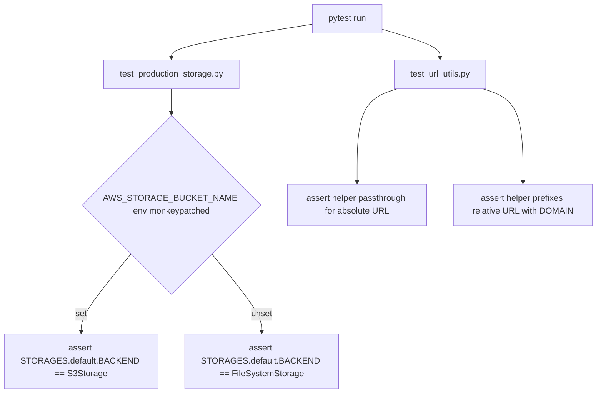

# Instruction: Tests

## Feature

- **Summary**: Cover the two pieces of new logic with unit tests — conditional storage backend selection (part 1) and the absolute-URL helper (part 2). No live S3/R2 round-trip (no credentials in CI); tests target logic only.
- **Stack**: `pytest-django` (existing project test stack)
- **Branch name**: `feature/media-storage-s3r2`
- **Parent Plan**: `2026_07_06-#94-media-storage-s3r2-master.md`
- **Sequence**: `4 of 4`
- Confidence: 8/10
- Time to implement: 1 day

## Existing files

- @suddenly/activitypub/activities.py
- @suddenly/activitypub/serializers.py

### New file to create

- `tests/core/test_production_storage.py` — backend-selection logic
- `tests/activitypub/test_url_utils.py` — `absolute_media_url` helper

## User Journey

## Implementation phases

### Phase 1: Backend-selection tests

> `production.py` is never loaded by the default test settings (`config.settings.development`) — test by importing/reloading the module directly with monkeypatched env vars, not by running the full test suite under production settings. Reloading only rebuilds the plain-Python attributes of the `production` module object — it does not touch the active `django.conf.settings` (still `development`), so this is safe as long as the override is a rebind (per part-1) and not a mutation of the shared `base.STORAGES` object.

1. Monkeypatch the 3 required env vars (`SECRET_KEY`, `DOMAIN`, `DATABASE_URL`) with dummy values in all tests below — the module raises `KeyError` on import otherwise
2. Test: with `AWS_STORAGE_BUCKET_NAME` unset, reloading `config.settings.production` yields `STORAGES["default"]["BACKEND"] == "django.core.files.storage.FileSystemStorage"`, and the reloaded module's `STORAGES` is the same object as `config.settings.base.STORAGES` (no rebind happened)
3. Test: with `AWS_STORAGE_BUCKET_NAME` + dummy `AWS_S3_ENDPOINT_URL`/`AWS_S3_REGION_NAME`/keys set, reloading yields `STORAGES["default"]["BACKEND"] == "storages.backends.s3.S3Storage"` with the expected `OPTIONS` (bucket name, `querystring_auth=False`, `file_overwrite=False`, no `default_acl` key)
4. Test: after test 3, `config.settings.base.STORAGES["default"]["BACKEND"]` is still `"django.core.files.storage.FileSystemStorage"` — confirms the override didn't leak into the shared `base` object (regression guard for the mutation risk found during planning)

### Phase 2: URL helper tests

1. Test: `absolute_media_url` given a mock file field whose `.url` starts with `https://` returns it unchanged
2. Test: `absolute_media_url` given a mock file field whose `.url` is relative (`/media/avatars/x.jpg`) returns `f"https://{settings.DOMAIN}{url}"`, matching current pre-refactor behavior
3. Test: existing ActivityPub serializer tests (User/Character) still pass unchanged after the Phase 2 (part-2) refactor — regression guard

## Validation flow

1. `pytest tests/core/test_production_storage.py tests/activitypub/test_url_utils.py` — all green
2. Full existing suite (`pytest`) still green — no regression introduced in ActivityPub serialization tests
