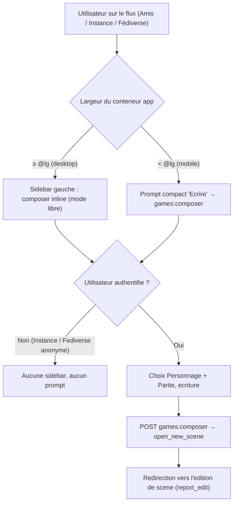

# Sidebar composer sur les pages de flux

## Objectif

Rendre le composer de post atteignable depuis le flux. Aujourd'hui la route `games:composer`
est orpheline (aucun bouton, aucun lien). La maquette `aidd_docs/wireframes/suddenly-composer.html`
décrit un composer **plein écran mobile** ; son équivalent desktop, d'après la paire sanctionnée
« bottom sheet → side panel » (`.claude/rules/08-design/mobile-first.md` §3), est un **panneau
latéral persistant**. On l'installe à gauche des trois pages de flux, à partir de `@lg`.

En dessous de `@lg`, la sidebar disparaît ; l'utilisateur mobile garde un **point d'entrée compact**
(prompt/bouton `i-lucide-pencil`) qui pointe vers la page composer autonome `games:composer`
(déjà construite, jusqu'ici orpheline). On **remplace, on ne duplique pas** (mobile-first §3).

## Parcours utilisateur

## Contexte technique vérifié

| Élément | Emplacement | Rôle |
|--------|-------------|------|
| Partial composer | `templates/games/_composer.html` | Réutilisable en mode libre (`report` absent → sélecteurs Personnage + Partie, POST `games:composer`) |
| Builder de contexte | `suddenly/games/front_views.py:1488` `_composer_context(...)` | **Privé** → à déplacer en service public (frontière cross-app) |
| Vue composer | `suddenly/games/front_views.py:1554` `composer()` | Ajoute `games` (`build_game_queryset`) et `personnages` avant rendu |
| Services games | `suddenly/games/services.py` | Contient déjà `build_game_queryset`, `is_game_master`, `build_actor_pool`, `available_kinds`, `build_game_cast` |
| Vues flux | `suddenly/core/feed_views.py` | `feed_home` (`@login_required`), `feed_instance` / `feed_fediverse` (anonymes) — toutes via `htmx_render(full=feed/home.html, partial=feed/_feed_items.html)` |
| Template flux | `templates/feed/home.html` | Colonne unique `container-app max-w-3xl`, pas de sidebar |
| Patron sidebar | `templates/users/settings_base.html` | `@lg:flex @lg:gap-10` + `<aside @lg:sticky @lg:top-4>` + `<main flex-1 min-w-0>` |
| Conteneur nommé | `frontend/src/base.css:24` | `container-name: app` sur `body` → variantes `@sm/@md/@lg/@xl`, jamais `@media` |
| Route | `suddenly/games/front_urls.py:15` | `games:composer` = `compose/post/` → `front_views.composer` |

Points confirmés :
- `htmx_render` ne rend `full_template` **qu'au premier chargement** (non-HTMX) ; les changements
  d'onglet ne remplacent que `#feed-content`. La sidebar n'a donc à être peuplée **qu'au premier
  chargement** — inutile de construire son contexte lors des swaps HTMX.
- Le composer exige un utilisateur authentifié ; `feed_instance` / `feed_fediverse` sont accessibles
  aux anonymes (`.claude/rules/08-domain/08-public-discovery-nav.md`). Sidebar et construction de
  contexte **conditionnées à `user.is_authenticated`** sur les 3 vues.
- Le formulaire du composer cible déjà `games:composer` (action + `hx-get` de recompute) : il
  fonctionne tel quel une fois embarqué dans le flux, sans modification du partial.

## Projection d'architecture

### Modifier
- `suddenly/games/services.py` — accueille `build_composer_context(...)` (déplacé, rendu public) + `build_composer_feed_context(user)` (mode libre : ajoute `games` + `personnages`).
- `suddenly/games/front_views.py` — `composer()` consomme les services ; suppression de `_composer_context` privé.
- `suddenly/core/feed_views.py` — helper local partagé peuplant la sidebar sous condition `is_authenticated` + non-HTMX, injecté dans les 3 vues.
- `templates/feed/home.html` — passage en layout 2 colonnes (`@lg:flex`), `<aside>` composer + `<main>` flux + prompt mobile `@lg:hidden`.

### Créer
- `templates/feed/_composer_sidebar.html` — enveloppe de la sidebar (titre + ``), incluse sous ``.
- `tests/core/test_feed_sidebar.py` — test présence sidebar (auth) / absence (anonyme) / point d'entrée mobile.

### Ajouter (fichier existant)
- `tests/games/test_post_composer_services.py` — ajout de `test_build_composer_feed_context` (fichier déjà dédié aux fonctions composer de `services.py` : `is_game_master`, `build_actor_pool`, `available_kinds`…).

### Supprimer
- Aucun fichier. Seule la fonction privée `_composer_context` de `front_views.py` disparaît (migrée en service).

## Règles applicables

| Nom | Chemin | Pourquoi |
|-----|--------|----------|
| django-services | `.claude/rules/03-frameworks-and-libraries/03-django-services.md` | `build_composer_context` doit vivre en service public — « Never import a builder from another view — services are the only cross-app boundary » (core/feed_views importe games) |
| dry-refactor | `.claude/rules/07-quality/dry-refactor.md` | Règle de trois : 3 vues de flux → un seul helper de contexte sidebar |
| mobile-first | `.claude/rules/08-design/mobile-first.md` | Paire « side panel ↔ bottom sheet » ; enrichissement additif `@container`, jamais `@media` ; icône Lucide, `i-lucide-pencil` |
| htmx-patterns | `.claude/rules/03-frameworks-and-libraries/03-htmx-patterns.md` | `getattr(request, "htmx", False)` pour ne peupler la sidebar qu'au premier chargement |
| public-discovery-nav | `.claude/rules/08-domain/08-public-discovery-nav.md` | `feed_instance`/`feed_fediverse` restent anonymes ; la sidebar est conditionnelle |
| i18n-patterns | `.claude/rules/08-domain/08-i18n-patterns.md` | Chaînes nouvelles via `` / `gettext` |

## Phases

### Phase 1 — Service : centraliser le contexte du composer
Objectif : un point unique, public, réutilisable par la vue composer **et** les vues de flux.

- Déplacer le corps de `_composer_context` de `front_views.py` vers `services.py` sous le nom
  public `build_composer_context(user, *, report=None, game=None, character=None, selected_actor="", selected_actor_label="")` (signature à paramètres domaine, jamais `HttpRequest`).
- Ajouter `build_composer_feed_context(user)` : appelle `build_composer_context(user)` puis complète
  avec `games = build_game_queryset(user)` et `personnages` (Character filtrés `owner=user | creator=user`,
  `select_related("origin_game")`, `distinct()`) — exactement ce que `composer()` construit aujourd'hui.
- Résoudre l'import interne : `build_composer_context` utilise `Character`, `CharacterStatus`,
  `Rapport` — déjà importables dans `services.py` (voir en-tête du module).
- `composer()` dans `front_views.py` : remplacer l'appel privé par `build_composer_feed_context(request.user)` ;
  supprimer `_composer_context` et les additions inline `ctx["games"]` / `ctx["personnages"]`.
- Vérifier : `mypy suddenly/games/services.py suddenly/games/front_views.py` sans régression ; type de
  retour `dict[str, object]`.

### Phase 2 — Backend flux : helper sidebar conditionnel
Objectif : peupler la sidebar une seule fois, sans tripler la logique, sans casser l'accès anonyme.

- Dans `feed_views.py`, helper local `_composer_sidebar_context(request) -> dict[str, object]` :
  retourne `{}` si `not request.user.is_authenticated` **ou** si `getattr(request, "htmx", False)`
  (les swaps d'onglet ne re-rendent pas la sidebar) ; sinon retourne `build_composer_feed_context(request.user)`.
- Fusionner le résultat dans le `context` des 3 vues via `**_composer_sidebar_context(request)`
  (les clés du composer ne collisionnent pas avec `feed_items`/`reports`/`npcs`/`active_tab`).
- Aucune modification de signature de vue ; `feed_instance`/`feed_fediverse` restent sans `@login_required`.

### Phase 3 — Template : layout 2 colonnes + entrée mobile
Objectif : sidebar desktop persistante, prompt mobile compact, aucune divergence de contenu.

- `templates/feed/home.html` : remplacer `container-app max-w-3xl` par le patron `settings_base` —
  `container-app` > `@lg:flex @lg:gap-8` > `<aside>` (composer) + `<main flex-1 min-w-0>` (h1 + tabs + `#feed-content`).
- `<aside class="flex-shrink-0 @lg:w-80 hidden @lg:block @lg:sticky @lg:top-4">` : n'apparaît qu'à
  partir de `@lg` ; à l'intérieur ``.
- Créer `templates/feed/_composer_sidebar.html` : titre court (``) + ``
  (mode libre — `report` absent, le partial affiche les sélecteurs Personnage/Partie).
- Point d'entrée mobile dans `<main>`, au-dessus des tabs, `class="@lg:hidden"`, `` :
  lien vers `` avec `i-lucide-pencil` (convention établie du dépôt, **pas**
  `i-lucide-feather`) — cible tactile ≥ 44px, libellé accessible.
- Ne rien masquer de critique en dessous de `@lg` : le prompt mobile ouvre le même composer plein écran.

### Phase 4 — Tests + vérification
- `tests/games/test_post_composer_services.py` — ajouter `test_build_composer_feed_context` : renvoie `games`, `personnages`, `kinds`, `frozen=False` pour un user donné.
- `tests/core/test_feed_sidebar.py` (nouveau, miroir de `tests/games/test_post_composer_views.py` — convention services vs. views déjà en place dans `tests/games/`) :
  - `test_feed_home_sidebar_present` : GET `feed:home` authentifié → `#composer` / sélecteurs dans le HTML.
  - `test_feed_instance_anonymous_no_sidebar` : GET anonyme → pas de composer, page 200.
  - `test_feed_htmx_swap_no_sidebar` : GET avec en-tête `HX-Request` → `feed/_feed_items.html` seul, pas de contexte composer construit.
  - `test_feed_mobile_entry_point` : lien vers `games:composer` présent pour l'utilisateur authentifié.
- `ruff check suddenly && mypy ...` ; vérif visuelle rapide via `run` aux breakpoints `@lg` / mobile.

## Points de vigilance
- **Collision de clés de contexte** : vérifier qu'aucune clé de `build_composer_feed_context`
  (`game`, `report`, `frozen`, `reports`…) n'écrase une clé de flux au moment du `**merge`. `reports`
  (flux) est pluriel, `report` (composer) est `None` en mode libre — pas de conflit constaté, à confirmer.
- **Coût requêtes** : la sidebar ajoute `build_game_queryset` + queryset `personnages` au premier
  chargement de chaque flux authentifié. Acceptable (une fois, non-HTMX). Garder `select_related`.
- **Assets UnoCSS** : les utilitaires `@lg:w-80`, `@lg:sticky`, `@lg:block`, `hidden` doivent être
  générés (présents via `settings_base` pour la plupart) ; relancer le build front si une classe manque.
- **CSRF / HTMX du composer embarqué** : `_composer.html` porte déjà `` et son
  `hx-get` de recompute ; rien à recâbler.

## Évaluation de confiance : 9/10

Raisons (✓)
- Contexte pré-vérifié contre le code réel ; chemins, lignes et signatures confirmés.
- Patron sidebar existant (`settings_base.html`) à copier presque tel quel.
- Route `games:composer` et partial déjà fonctionnels et testables isolément.
- Score de risque 2 (< 3) : aucune migration, aucune API publique cassée, plan simple mono-fichier.

Risques (✗)
- Fusion de contextes par `**` : collision de clés à confirmer par test (mitigé Phase 4).
- Génération des utilitaires UnoCSS `@lg:*` non 100 % garantie sans build (mitigé : vérif visuelle).
