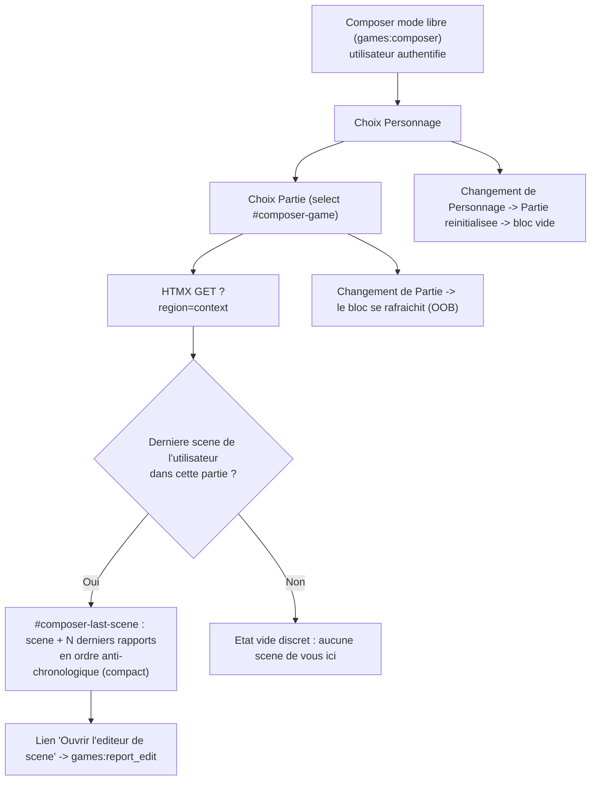

# Dernière scène sous le composer (mode libre)

## Objectif

Donner au joueur, dans le composer **mode libre** (`games:composer`, `report` absent), le contexte
narratif de la Partie qu'il vient de choisir : afficher **la dernière scène** de cette partie, ses
derniers rapports en **ordre anti-chronologique** (le plus récent en haut), en présentation
**compacte** (quelques posts, pas tout le fil), avec un **lien vers l'éditeur de scène**
(`games:report_edit`).

Vocabulaire « **scène** » cohérent en surface (jamais « rapport »/« report » côté libellé).
Fonctionnalité réservée au **mode libre** (absente en mode figé/`frozen`) et à l'**utilisateur
authentifié** (le composer est déjà `@login_required`).

## Décisions à confirmer avant implémentation (bloquant)

Deux points sont porteurs de sens et déterminent la requête + le lien. Recommandation par défaut
retenue dans le plan ci-dessous ; à valider.

- **D1 — Quelle « dernière scène » ?**
  Le composer mode libre **ouvre toujours une nouvelle scène** (`open_new_scene`) ; il n'ajoute pas
  à la scène affichée. « À quoi son post va s'ajouter » désigne donc le fil narratif de l'auteur.
  `games:report_edit` est **auteur-seul** (`get_object_or_404(..., author=request.user)`) : un lien
  « éditeur de scène » n'est valide que si l'utilisateur est l'auteur de la scène.
  - **Recommandé (A)** : la **dernière scène de l'utilisateur** dans cette partie
    (`author=user`, la plus récente). Le lien éditeur est toujours valide ; parfaitement aligné sur
    « à quoi son post va s'ajouter ». S'il n'en a aucune → n'afficher qu'un état vide discret.
  - Alternative (B) : la dernière scène **publiée** de la partie, tous auteurs confondus (contexte
    narratif global). Impose un fallback pour D2 quand l'utilisateur n'est pas l'auteur.
- **D2 — Cible du lien quand l'utilisateur n'est pas l'auteur** (uniquement si D1=B) :
  soit lecture (`games:report_detail`), soit masquer le lien éditeur. N/A si D1=A.

Le reste du plan suppose **D1=A** (le plus cohérent et le plus sûr). Si D1=B est retenu, seule la
signature/queryset du service change (Phase 1) ; l'architecture template/HTMX est identique.

## Parcours utilisateur

## Contexte technique vérifié

| Élément | Emplacement | Rôle |
|--------|-------------|------|
| Partial composer unique | `templates/games/_composer.html` | Mode libre (`report` absent) = sélecteurs + POST `games:composer` ; mode figé (`frozen`) sinon. Racine Alpine `#composer` |
| Région recomputée | `templates/games/_composer_context.html` | Kinds + acteur ; **rendue seule** sur changement de partie via `?region=context` (`hx-target="#composer-context"`, `innerHTML`) |
| Champ Partie | `templates/games/_composer_game_field.html` | `<select #composer-game>` : `hx-get games:composer ?region=context` → `#composer-context` ; recompute sur `change` |
| Vue composer | `suddenly/games/front_views.py:1489` `composer()` | Branche `region=game_field` (l.1548) et `region=context` (l.1560) ; POST → `open_new_scene` → redirect `report_edit` |
| Contexte composer | `suddenly/games/services.py:168` `build_composer_context()` / `:232` `build_composer_feed_context()` | Source unique du partial ; `frozen`, `game`, `is_gm`, `kinds`, `reply_targets`… |
| Fil d'une scène | `suddenly/games/front_views.py:1676` `_scene_rapports(report)` | Rapports `select_related("actor")` + prefetch, **ordre séquence** (`order, created_at`) |
| Éditeur de scène | `suddenly/games/front_views.py:743` `report_edit` → `templates/games/report_form.html` | **Auteur-seul** ; contient `#rapports-list` (le fil) et le composer figé |
| Rendu lecture compact | `templates/games/partials/rapport_read.html` | Rendu read-only d'un rapport (discussion = dialogue attribué, sinon bordure + kind) — réutilisable |
| Overlay / sidebar | `templates/games/_composer_overlay.html`, `templates/feed/_composer_sidebar.html`, `templates/games/composer.html` | Tous incluent `_composer.html` → un bloc placé dans `#composer` couvre les 3 surfaces sans duplication |

Points confirmés :
- Le changement de Partie déclenche **une seule** requête HTMX ciblant `#composer-context`. Pour
  rafraîchir un bloc situé **sous le formulaire** dans la même requête, le pattern idiomatique est
  un **swap Out-Of-Band** (`hx-swap-oob`) — cf. `.claude/rules/03-frameworks-and-libraries/03-htmx-patterns.md`.
- `_composer_context.html` est **partagé** par `cast_npc_create` (création PNJ) et par le mode
  figé (`scene_post_create` → `_composer_after_post.html`). Le bloc dernière-scène doit donc être
  **hors** de `_composer_context.html` (sinon il fuiterait en mode figé et à la création de PNJ) et
  gaté ``.
- `report_edit` étant auteur-seul, le lien « éditeur de scène » n'est sûr que sous D1=A (ou avec le
  fallback D2 sous D1=B).
- Aucune migration : lecture pure (Report/Rapport existants). `RapportStatus.PUBLISHED` filtre les
  rapports visibles ; l'auteur voit aussi ses brouillons dans sa propre scène (cf. `report_edit`).

## Projection d'architecture

### Modifier
- `suddenly/games/services.py` — ajouter `latest_own_scene(user, game) -> Report | None` (dernière
  scène `author=user` du jeu, `-created_at`) et `latest_scene_rapports(report, limit=3)` (rapports
  `select_related("actor")`, **anti-chrono** `-order, -created_at`, borné). Enrichir
  `build_composer_context(...)` : en mode libre avec `game` fourni, injecter `last_scene` +
  `last_scene_rapports` (sinon `None`/`[]`).
- `suddenly/games/front_views.py` — dans `composer()`, branche `region=context` : rendre la région
  **et** le bloc dernière-scène en OOB (via nouveau `_composer_context_swap.html`). Vérifier le gate
  mode libre.
- `templates/games/_composer.html` — après `</form>`, dans `#composer`, ajouter
  `

`.

### Créer
- `templates/games/_composer_last_scene.html` — bloc compact : titre « Dernière scène » (``),
  libellé de la scène, N derniers rapports **anti-chrono** (réutilise `rapport_read.html` ou rendu
  ligne compact tronqué), lien `i-lucide-pencil` « Ouvrir l'éditeur de scène » →
  `` (cible ≥ 44px). État vide discret si
  `last_scene` absent. Rien si pas de `game`.
- `templates/games/_composer_context_swap.html` — réponse HTMX `region=context` :
  `` + `

`.

### Ajouter (fichiers existants)
- `tests/games/test_post_composer_services.py` — `latest_own_scene`, `latest_scene_rapports` (ordre
  anti-chrono + borne), présence de `last_scene` dans le contexte mode libre.
- `tests/games/test_post_composer_views.py` — `region=context` renvoie le fragment OOB
  `#composer-last-scene` + lien `report_edit` (auteur) ; mode figé ne le renvoie pas ; anonyme → 302 login.

### Supprimer
- Aucun fichier.

## Règles applicables

| Nom | Chemin | Pourquoi |
|-----|--------|----------|
| htmx-patterns | `.claude/rules/03-frameworks-and-libraries/03-htmx-patterns.md` | Swap OOB pour rafraîchir un bloc hors cible ; `getattr(request, "htmx", False)` ; `` namespacé `games:` |
| django-services | `.claude/rules/03-frameworks-and-libraries/03-django-services.md` | `latest_own_scene`/`latest_scene_rapports` en service, paramètres domaine (jamais `HttpRequest`), `select_related` |
| django-models | `.claude/rules/03-frameworks-and-libraries/03-django-models.md` | `select_related("actor")` sur la requête rapports ; pas de logique en modèle |
| mobile-first | `.claude/rules/08-design/mobile-first.md` | Icône Lucide `i-lucide-pencil`, cible ≥ 44px, compact, ne rien masquer de critique, pas d'emoji |
| i18n-patterns | `.claude/rules/08-domain/08-i18n-patterns.md` | Nouvelles chaînes via `` ; « scène » côté FR |
| file-language-and-style | `.claude/rules/01-standards/file-language-and-style.md` | Ce plan (human-consumed) en français ; templates suivent les règles de code |
| dry-refactor | `.claude/rules/07-quality/dry-refactor.md` | Réutiliser `rapport_read.html` plutôt que dupliquer un rendu de rapport |

## Phases

### Phase 1 — Service : dernière scène + rapports anti-chrono
- `latest_own_scene(user, game) -> Report | None` : `game.reports.filter(author=user).order_by("-created_at").first()` (sous D1=A). `select_related("game")` si le template en a besoin.
- `latest_scene_rapports(report, limit=3) -> list[Rapport]` : `report.rapports.select_related("actor").order_by("-order", "-created_at")[:limit]` — **anti-chronologique**, borné (compact).
- `build_composer_context(...)` : en mode libre (`report is None`) avec `game is not None`, poser `last_scene = latest_own_scene(user, game)` et `last_scene_rapports = latest_scene_rapports(last_scene) if last_scene else []` ; sinon `None`/`[]`. Ne rien changer au mode figé.
- Type de retour `dict[str, object]` conservé ; `mypy` sans régression.

### Phase 2 — Vue : réponse HTMX region=context avec OOB
- Dans `composer()`, branche `region=context` : rendre `games/_composer_context_swap.html` (au lieu de `_composer_context.html` seul) avec le même `ctx`.
- Conserver intact : branche `region=game_field`, POST `open_new_scene`, rendu plein `composer.html`/`_composer.html`.
- `cast_npc_create` et le mode figé continuent de rendre `_composer_context.html` seul (pas de bloc dernière-scène).

### Phase 3 — Templates : bloc compact + lien éditeur
- `_composer_last_scene.html` : gate `` ; si `last_scene` → libellé scène + boucle sur `last_scene_rapports` (rendu compact, `rapport_read.html`), lien éditeur `games:report_edit`. Sinon → note discrète « Aucune scène de vous dans cette partie. » Vocabulaire « scène ».
- `_composer_context_swap.html` : include contexte + OOB `#composer-last-scene` gaté ``.
- `_composer.html` : insérer `#composer-last-scene` après `</form>`, dans `#composer`, gaté ``. (Couvre page autonome, sidebar, overlay.)

### Phase 4 — Tests + vérification
- `tests/games/test_post_composer_services.py` : ordre anti-chrono, borne `limit`, `last_scene`=scène propre la plus récente, `None` si aucune / si autre partie.
- `tests/games/test_post_composer_views.py` : GET `games:composer?region=context&character=…&game=…` (auteur, HTMX) → `#composer-last-scene` OOB + `report_edit` ; mode figé absent ; anonyme redirigé login.
- `ruff check suddenly && mypy suddenly/games/services.py suddenly/games/front_views.py` ; vérif visuelle rapide (`run`) : changement de partie rafraîchit le bloc, changement de personnage le vide.

## Points de vigilance
- **Staleness au changement de personnage** : sélectionner un personnage renvoie `region=game_field`
  et remet `game=''` sans requête `region=context`. Le bloc dernière-scène (comme la région kinds/acteur
  aujourd'hui) peut alors rester affiché tant qu'aucune partie n'est choisie. Si partie unique, l'auto-select
  refire `region=context` (OK). Sinon, aligner le comportement en ajoutant un OOB de vidage
  `#composer-last-scene` à la réponse `region=game_field` (parité avec la région déjà en place).
- **Réutilisation de `_composer_context.html`** : NE PAS y mettre le bloc — il fuiterait en mode figé et
  à la création de PNJ. D'où le wrapper `_composer_context_swap.html` dédié au chemin HTMX.
- **`report_edit` auteur-seul** : sous D1=A le lien est toujours valide. Sous D1=B, appliquer D2.
- **Coût requêtes** : +2 requêtes bornées (dernière scène + ≤3 rapports) par changement de partie.
  Acceptable ; garder `select_related("actor")`.
- **Compacité** : borne stricte (`limit=3`) + troncature du contenu — respecter « pas de messages partout ».

## Évaluation de confiance : 9/10

Raisons (✓)
- Chemins, lignes, signatures et cycle HTMX vérifiés contre le code réel.
- Aucune migration, aucune API publique cassée, périmètre `games` mono-app (score de risque ~1 → plan simple).
- Pattern OOB déjà idiomatique du dépôt (`_composer_after_post.html`) ; rendu rapport réutilisable.
- Placement dans `#composer` couvre page/sidebar/overlay sans duplication.

Risques (✗)
- Décisions produit D1/D2 non tranchées : sous D1=A le plan est complet et sûr ; D1=B ne déplace que
  la requête (Phase 1) mais impose D2.
- Staleness au changement de personnage : comportement hérité de la région existante, à confirmer/aligner.
