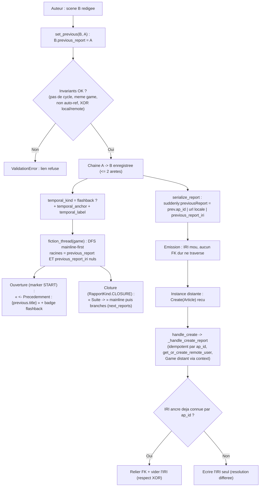

# Ordre de fiction des `Report` — chaînage inter-scènes + flashbacks + fédération (émission + réception câblée) + suppression legacy

## Objectif

Donner à chaque partie un **ordre de fiction explicite**, distinct de l'ordre de publication
(`published_at`), de création ou de `session_date`. Source de vérité unique : une FK
auto-référentielle `previous_report` sur `Report`. La relation inverse `next_reports` donne les
suites → **bifurcations gratuites** (arbre/forêt). Deux scènes peuvent porter une étiquette
chronologique (`temporal_kind` flashback/flashforward + `temporal_anchor` + `temporal_label`) tout
en restant **dans la chaîne de lecture**. Le lien **fédère en IRI mou** (`suddenly:previousReport`,
`suddenly:temporalAnchor`) : **aucun FK dur ne traverse la fédération**.

Le design est **figé par la spec** (`2026_07_15-fiction-order-reports.spec.md`). Ce plan ne
re-débat rien : il découpe en milestones exécutables, ordonne, et pose critères d'acceptation +
commande de vérification par milestone.

> Spec d'entrée : `app/aidd_docs/tasks/2026_07/2026_07_15-fiction-order-reports.spec.md`

## Changements de périmètre — itération 1 (VALIDÉS, non négociables)

Deux extensions actées par la spec révisée transforment l'itération 0 :

1. **Réception fédérée CÂBLÉE** (plus de helper dormant). `handle_create` (`inbox.py:315`) route
   désormais aussi `obj_type == "Article"` → nouveau `_handle_create_report()`, calqué sur
   `_handle_create_character` (`inbox.py:333`) : idempotent par `ap_id`, `get_or_create_remote_user`,
   Game distant `get_or_create`. La résolution IRI→FK (`previous_report` / `temporal_anchor`) est
   **dans le périmètre**. C'est un milestone à part entière avec tests d'ingestion
   (`assertNumQueries` + idempotence : double POST = **un seul** Report).
2. **Suppression du legacy**. `build_note()` (`activities.py:78`) **et** `build_create_activity()`
   (`activities.py:118`) sont supprimés — code mort confirmé (`build_create_activity` référencé
   nulle part hors docs ; `build_note` appelé uniquement par `build_create_activity` à
   `activities.py:141`). Aucun `__all__` à mettre à jour dans `suddenly/activitypub/`. Vérif :
   `ruff` + `mypy` propres, suite `tests/activitypub` verte.

Le reste du design (modèle `previous_report`/`temporal_*`, service `fiction_thread`/`set_previous`,
émission `serialize_report`, UI ouverture/clôture, backfill optionnel) est **inchangé** — seulement
re-découpé en milestones ordonnés.

## Décision de périmètre (tranchée)

- **Émission fédération = chemin actif `serialize_report()`** (`activitypub/serializers.py:227`) —
  confirmé : c'est lui qui alimente l'outbox et la livraison. `AP_CONTEXT` (`serializers.py:26`) est
  une **liste dont le dernier élément est un dict** de mappings de termes ; les 4 nouveaux termes
  s'ajoutent dans ce dict.
- **Réception = câblée** (extension 1). `_handle_create_report()` ingère un `Create(Article)` distant.
  La résolution IRI→FK est **tolérante et différée** : si l'IRI ancre est déjà connue par `ap_id`,
  on relie le FK ; sinon on garde l'IRI seul (résolvable plus tard quand la scène ancre arrive).
- **Legacy = supprimé** (extension 2), pas contourné : `build_note()` + `build_create_activity()`
  retirés du fichier. Un seul sérialiseur de Report subsiste (`serialize_report`), pas de divergence.

## Parcours utilisateur



## Contexte technique vérifié

| Élément | Emplacement | Rôle |
|--------|-------------|------|
| Modèle cible | `suddenly/games/models.py:105` `Report(BaseModel)` | Champs à ajouter ; `Meta.ordering` (l.173) **conservé** ; `Meta.constraints` **absent** (à créer) ; `Meta.indexes` présent (`game`,`published_at`, l.179). **Ne PAS ajouter d'index explicite sur `previous_report`/`temporal_anchor`** : une `ForeignKey` Django pose déjà `db_index=True` — un `Index(fields=[...])` dupliquerait cet index (écart assumé vs la formulation de la spec) |
| Enum kind narratif | `suddenly/games/models.py:296` `RapportKind.CLOSURE` = `"closure"` | Cible du rendu « Suite → » |
| Marker ouverture | `suddenly/games/models.py:449` `MarkerKind.START` | Cible du rendu « ← Précédemment » |
| Services games | `suddenly/games/services.py` | Services domaine (import `ValidationError`, `transaction`, `Q` déjà en tête) ; y ajouter validation + lecture + `set_previous` (jamais dans le modèle) |
| Sérialiseur actif | `suddenly/activitypub/serializers.py:227` `serialize_report()` | Émission AP ; `AP_CONTEXT` (l.26) = liste, dernier élément = dict de termes `suddenly:` |
| Sérialiseur legacy | `suddenly/activitypub/activities.py:78` `build_note()` + `:118` `build_create_activity()` | **À SUPPRIMER** — code mort |
| Inbox Create | `suddenly/activitypub/inbox.py:315` `handle_create()` | Route `Character` ; **ajouter route `Article` → `_handle_create_report`** |
| Patron d'ingestion | `suddenly/activitypub/inbox.py:333` `_handle_create_character()` | Modèle à calquer (skip si `ap_id` connu, `get_or_create_remote_user`, Game distant `get_or_create`) |
| Idempotence inbox | `inbox.py:159-175` `ProcessedActivity.get_or_create(ap_id=...)` | Dédup transport déjà en place (règle `ap-pivots §1`) — la dédup métier par `ap_id` reste requise dans le handler |

Points confirmés :
- Migration **purement additive** : tous les nouveaux champs nullables/`default` → **aucun backfill
  obligatoire**. Backfill chronologique = **optionnel** (milestone 8, hors `success_condition`).
- `Meta.ordering` existant (`session_date`, `-published_at`, `-created_at`) **inchangé** : l'ordre de
  fiction passe **uniquement** par `fiction_thread()`.
- `on_delete=SET_NULL` sur `previous_report` et `temporal_anchor` → descendance d'un report supprimé
  **devient racine** (pas de cascade). Cohérent avec « racine = previous nul ».
- **XOR local/remote** : les 2 `CheckConstraint` interdisent d'avoir **à la fois** le FK et l'IRI
  non vides. Conséquence directe pour la réception : quand `_handle_create_report` **résout** le FK,
  il doit **vider l'IRI correspondant** (le FK EST le lien ; l'IRI n'était que le transport).
- `serialize_report` émet `attributedTo = author.actor_url` et `context = game.actor_url` : la
  réception lit `attributedTo`/`actor` pour l'auteur et `context` pour la partie distante.
- Aucun `__all__` dans `suddenly/activitypub/*.py` : la suppression du legacy ne touche aucun export.

## Projection d'architecture

### Modifier
- `suddenly/games/models.py` — `ReportTemporalKind(TextChoices)` ; sur `Report` les 7 champs
  (`previous_report` FK self `SET_NULL` `related_name="next_reports"`, `previous_report_iri`
  `URLField max_length=500`, `branch_order` `PositiveIntegerField default=0`, `temporal_kind`
  `CharField choices`, `temporal_anchor` FK self `SET_NULL` `related_name="temporal_referrers"`,
  `temporal_anchor_iri` `URLField max_length=500`, `temporal_label` `CharField max_length=120`).
  Ajouter `Meta.constraints` (2 `CheckConstraint` XOR). **Pas d'index explicite sur les 2 FK self**
  (déjà `db_index=True` par défaut → doublon). **Zéro logique métier dans le modèle.**
- `suddenly/games/services.py` — `validate_fiction_links(report)`, `fiction_thread(game)`,
  `set_previous(report, new_previous)` (+ helpers privés de tri des enfants).
- `suddenly/activitypub/serializers.py` — enrichir le dict de `AP_CONTEXT` (4 termes
  `previousReport`, `temporalKind`, `temporalAnchor`, `temporalLabel`) et `serialize_report()`
  (émission conditionnelle IRI mou).
- `suddenly/activitypub/inbox.py` — router `obj_type == "Article"` dans `handle_create` ; ajouter
  `_handle_create_report(activity, obj)` (ingestion câblée, idempotente) + résolution IRI→FK.
- `suddenly/activitypub/activities.py` — **supprimer** `build_note()` et `build_create_activity()`.
- `.claude/rules/08-domain/08-activitypub.md` — compléter « Custom properties used » avec les 4 termes.
- `templates/games/` — rendu « ← Précédemment » (ouverture) et « Suite → » (clôture).
- `aidd_docs/memory/architecture.md` — section normative « Ordre de fiction des Report » (convention
  durable : source de vérité `previous_report`, IRI mou en fédération, ordre de fiction ≠ ordering).
- `aidd_docs/memory/CODEBASE_MAP.md` — pointer les nouveaux symboles (`fiction_thread`, `set_previous`,
  `_handle_create_report`, champs `Report`).
- `docs/index.md` — référencer la nouvelle page de doc humaine (voir « Créer »).

### Créer
- Migration `suddenly/games/migrations/0022_report_fiction_order.py` (générée, additive ; numéro à
  confirmer — dernière = `0021_report_muses_summary_proposal.py`).
- `templates/games/_fiction_previously.html` — « ← Précédemment : {title} » + badge flashback.
- `templates/games/_fiction_next.html` — « Suite → » : mainline puis branches. **Aucun id stocké**.
- `tests/games/test_fiction_order.py` — modèle, invariants, `fiction_thread`, `set_previous`, UI.
- `tests/activitypub/test_fiction_federation.py` — émission `serialize_report` + `@context` ;
  **réception câblée** (`_handle_create_report` : ingestion, `assertNumQueries`, idempotence,
  résolution IRI→FK, respect XOR).
- `docs/fiction-order.md` — **design doc humaine** (français) : le modèle à deux axes (lecture vs
  chronologie), le contrat de fédération (émission IRI mou + réception + résolution IRI→FK), les
  invariants, et les limites assumées (résolution différée, UI branches minimale). Cible : un
  contributeur qui doit comprendre pourquoi l'ordre de fiction n'est pas `Meta.ordering`.

### Supprimer
- Fonctions `build_note()` et `build_create_activity()` dans `suddenly/activitypub/activities.py`
  (aucun fichier entier supprimé ; aucun import/`__all__` à nettoyer — vérifié).

## Règles applicables

| Nom | Chemin | Pourquoi |
|-----|--------|----------|
| django-models | `.claude/rules/03-frameworks-and-libraries/03-django-models.md` | `BaseModel` (UUID PK), `on_delete` explicite, `Meta.constraints`/`indexes`, **zéro logique métier dans le modèle** |
| django-services | `.claude/rules/03-frameworks-and-libraries/03-django-services.md` | Invariants + lecture + `set_previous` en service ; paramètres domaine ; `transaction.atomic` pour la réécriture d'arêtes |
| activitypub (domain) | `.claude/rules/08-domain/08-activitypub.md` | Namespace `suddenly:` stable ; compléter « Custom properties used » ; Report = `Article` ; `URLField max_length=500` ; Mastodon ignore les termes inconnus |
| ap-pivots-django-activitypub | `.claude/rules/07-quality/ap-pivots-django-activitypub.md` | §1 idempotence inbox (dédup métier par `ap_id` dans le handler, rejouable) ; §8 `Create` porte l'objet complet ; IRI mou = aucun FK dur traversant |
| data-pivots-django-orm | `.claude/rules/07-quality/data-pivots-django-orm.md` | `select_related("author")` + `prefetch_related("next_reports")` dans `fiction_thread` ; index `previous_report` ; `assertNumQueries` borné (lecture ET ingestion) |
| pytest | `.claude/rules/05-testing/05-pytest.md` | factory-boy, `pytest.raises` sur invariants, un comportement par test, pas de réseau (mock des fetch distants) |
| i18n-patterns | `.claude/rules/08-domain/08-i18n-patterns.md` | Libellés « Précédemment », « Suite » via `` / `gettext_lazy` |
| file-language-and-style | `.claude/rules/01-standards/file-language-and-style.md` | Plan (`aidd_docs/tasks/**`) en français ; règle `08-activitypub.md` (LLM-consumed) en anglais |

## Milestones

Chaque milestone est **indépendamment livrable et testable** ; l'ordre est un ordre de dépendance.
Chaîne : 1 → 2 → 3 (cœur games). 4, 5, 6 dépendent de 1 (4 et 6 des champs modèle ; 5 indépendant).
7 dépend de 3. 8 optionnel dépend de 1.

```
M1 (modèle) ──┬─> M2 (validation) ─> M3 (fiction_thread/set_previous) ─> M7 (UI)
              ├─> M4 (émission serialize_report)
              ├─> M6 (réception câblée _handle_create_report)
              └─> M8 (backfill, optionnel)
M5 (suppression legacy) — indépendant (après M4 par prudence : chemin actif confirmé)
M9 (documentation) — dernier : capture l'état réel de M1→M7 (dépend de leur complétion)
```

### Milestone 1 — Modèle + migration additive
- `ReportTemporalKind(TextChoices)` : `NORMAL="normal"`, `FLASHBACK="flashback"`,
  `FLASHFORWARD="flashforward"`.
- Sur `Report` : les 7 champs (spec « Modèle cible »), `on_delete=SET_NULL`, `related_name`
  `next_reports` / `temporal_referrers`, `null/blank` corrects, `default` pour
  `branch_order`/`temporal_kind`.
- `Meta.ordering` **inchangé**. `Meta.constraints` : `report_previous_local_xor_remote`,
  `report_anchor_local_xor_remote`. `Meta.indexes` **inchangé** — ne PAS ajouter d'index sur
  `previous_report`/`temporal_anchor` (la `ForeignKey` pose déjà `db_index=True` ; index explicite =
  doublon). La spec liste `Index(fields=["previous_report"])` : écart assumé et documenté ici.
- `makemigrations` → une migration additive ; aucun champ non-nullable sans default → pas de prompt.
- **Critères d'acceptation** : `makemigrations --check --dry-run` propre après commit ; `migrate`
  applique sans erreur ; création d'un `Report` avec `previous_report` fonctionne ; la
  CheckConstraint rejette un report ayant à la fois `previous_report` **et** `previous_report_iri`.
- **Vérification** :
  ```bash
  cd app && python manage.py makemigrations games && python manage.py migrate \
    && pytest tests/games/test_fiction_order.py -k "model or constraint" -q \
    && ruff check suddenly/games/models.py && mypy suddenly/games/models.py
  ```

### Milestone 2 — Service de validation des invariants
- `validate_fiction_links(report) -> None` dans `games/services.py`, lève `ValidationError` si :
  - `previous_report_id == report.pk` ou `temporal_anchor_id == report.pk` (auto-référence) ;
  - **cycle** dans la chaîne `previous_report` (remontée itérative `O(profondeur)`, borne de garde).
    `temporal_anchor` **n'est pas traversé** par `fiction_thread` (donc un cycle d'ancres n'est jamais
    fatal au rendu) : on garde l'auto-référence ci-dessus ; le cycle profond d'ancres n'est pas bloqué
    (hygiène de données, hors invariant dur) ;
  - `previous_report.game_id != report.game_id` (idem `temporal_anchor`) — même partie ;
  - `temporal_kind == NORMAL` avec `temporal_anchor`/`temporal_label` non vides, **ou** ancre/label
    posés avec `temporal_kind == NORMAL` ;
  - XOR local/remote violé (revalidation applicative du CheckConstraint, message exploitable).
- Validation **dans le service** (pas dans le modèle) ; appelable depuis `clean()`/forms plus tard.
- **Critères d'acceptation** : un test `pytest.raises(ValidationError)` par invariant ; un cas
  nominal passe sans lever.
- **Vérification** :
  ```bash
  cd app && pytest tests/games/test_fiction_order.py -k invariant -q \
    && ruff check suddenly/games/services.py && mypy suddenly/games/services.py
  ```

### Milestone 3 — Lecture `fiction_thread` + mutation `set_previous`
- `fiction_thread(game) -> list[Report]` : racines = `previous_report` **et** `previous_report_iri`
  nuls ; **DFS mainline-first**, enfants triés par (`branch_order`, `session_date`, `created_at`) ;
  flashbacks/flashforwards inclus **à leur place**, exposés avec `temporal_kind` + `temporal_label`.
  `select_related("author")` + `prefetch_related("next_reports")` → charger la forêt de la partie en
  une passe, DFS en mémoire → **coût requêtes borné, indépendant de la profondeur**.
- `set_previous(report, new_previous) -> None` : `transaction.atomic`, appelle `validate_fiction_links`
  **avant écriture**, réécrit **exactement 1 arête** (`report.previous_report`, `save(update_fields=["previous_report"])`).
  Les bifurcations étant permises, aucun sibling n'est reparenté. `branch_order` **n'est pas touché**
  par `set_previous` (départage des enfants assuré par le tri `branch_order, session_date, created_at`
  dans `fiction_thread` ; l'ordonnancement explicite des branches est un geste séparé, hors périmètre).
- **Critères d'acceptation** : ordre mainline-first correct sur un arbre à bifurcation ; un flashback
  apparaît à sa position de chaîne (pas en fin) ; `assertNumQueries(N)` borné (N indépendant du
  nombre de scènes au-delà du prefetch) ; `set_previous` refuse un lien créant un cycle et ne touche
  pas la DB en cas d'échec ; après suppression d'un report, ses `next_reports` réapparaissent racines.
- **Vérification** :
  ```bash
  cd app && pytest tests/games/test_fiction_order.py -k "thread or set_previous or numqueries or orphan" -q \
    && ruff check suddenly/games/services.py && mypy suddenly/games/services.py
  ```

### Milestone 4 — Fédération : émission IRI mou (chemin actif)
- `AP_CONTEXT` : dans le dict (dernier élément de la liste), ajouter
  `"previousReport": "suddenly:previousReport"`, `"temporalKind": "suddenly:temporalKind"`,
  `"temporalAnchor": "suddenly:temporalAnchor"`, `"temporalLabel": "suddenly:temporalLabel"`.
- `serialize_report()` :
  - `suddenly:previousReport` = `previous_report.ap_id` **ou** URL locale du prédécesseur si local,
    **sinon** `previous_report_iri` — clé omise si aucun prédécesseur.
  - Si `temporal_kind != NORMAL` : `suddenly:temporalKind`, `suddenly:temporalAnchor` (IRI :
    `ap_id`/URL locale ou `temporal_anchor_iri`), `suddenly:temporalLabel` (si non vide).
- Mettre à jour « Custom properties used » de `.claude/rules/08-domain/08-activitypub.md`.
- **Critères d'acceptation** : report chaîné local → `suddenly:previousReport` = IRI du prédécesseur ;
  report distant chaîné → valeur = `previous_report_iri` ; report `NORMAL` sans prédécesseur →
  **aucune** de ces clés ; `@context` contient les 4 termes.
- **Vérification** :
  ```bash
  cd app && pytest tests/activitypub/test_fiction_federation.py -k "serialize or context" -q \
    && ruff check suddenly/activitypub/serializers.py && mypy suddenly/activitypub/serializers.py
  ```

### Milestone 5 — Suppression du sérialiseur legacy
- Supprimer `build_note()` (`activities.py:78`) **et** `build_create_activity()` (`activities.py:118`)
  du fichier. `build_note` n'est appelé que par `build_create_activity` (`activities.py:141`) ;
  `build_create_activity` n'est référencé nulle part hors docs. Aucun `__all__` ni import à nettoyer
  (vérifié : `signals.py:124` importe `build_follow_activity`, `inbox.py:259` importe `get_context` —
  aucun ne touche les deux fonctions supprimées).
- **Critères d'acceptation** : `grep -rn "build_note\|build_create_activity" suddenly/` ne renvoie
  plus rien ; `ruff` (F401/imports morts) propre ; `mypy suddenly/activitypub/activities.py` propre ;
  suite `tests/activitypub` verte.
- **Vérification** :
  ```bash
  cd app && ! grep -rn "build_note\|build_create_activity" suddenly/ \
    && ruff check suddenly/activitypub/activities.py \
    && mypy suddenly/activitypub/activities.py \
    && pytest tests/activitypub -q
  ```

### Milestone 6 — Fédération : réception CÂBLÉE (ingestion des Report distants)
- Dans `handle_create` (`inbox.py:315`) : ajouter la branche `if obj_type == "Article":
  _handle_create_report(activity, obj)` (à côté de `Character`).
- `_handle_create_report(activity, obj) -> None`, calqué sur `_handle_create_character` :
  - `ap_id = obj.get("id")` ; return si absent.
  - **Idempotence** : `if Report.objects.filter(ap_id=ap_id).exists(): return` (double POST → 1 report).
  - Auteur : `get_or_create_remote_user(activity["actor"] | obj["attributedTo"])`.
  - Partie : Game distant `get_or_create` via `obj.get("context")` (IRI de la partie) — fallback motif
    domaine comme `_handle_create_character` si `context` absent.
  - Persister `remote=True`, `ap_id`, `title` (`obj.get("name")`), `content`, `published_at`
    (parser `obj.get("published")`), visibilité (inférée de `to`/`cc`, défaut public), tolérant.
- **Résolution IRI→FK** (dans le périmètre) : lire `suddenly:previousReport` / `suddenly:temporalAnchor`
  (tolérer aussi la forme expansée, comme `_ingest_trait_sets` gère `suddenly:traitSet`) :
  - Si l'IRI correspond à un `Report` connu par `ap_id` → **relier le FK** (`previous_report` /
    `temporal_anchor`) **et laisser l'IRI vide** (respect du CheckConstraint XOR).
  - Sinon → **écrire l'IRI seul** (`previous_report_iri` / `temporal_anchor_iri`), FK nul
    (résolution différée quand l'ancre arrivera).
  - Lire `suddenly:temporalKind` + `suddenly:temporalLabel` si présents (cohérence NORMAL/ancre).
  - Tolérant : bloc absent = no-op ; malformé = ignoré.
- **Critères d'acceptation** :
  - `Create(Article)` distant ingéré → un `Report(remote=True, ap_id=...)` créé, auteur et partie
    distants résolus.
  - **Idempotence** : deux POST du même `Create(Article)` (même `ap_id`) → **un seul** Report, pas
    d'écrasement destructif.
  - `assertNumQueries` borné sur l'ingestion (pas de N+1 ; fetch distant mocké — pas de réseau).
  - IRI ancre déjà connue → FK relié **et** IRI vide (constraint XOR satisfaite) ; ancre inconnue →
    `*_iri` peuplé, FK nul ; bloc absent → report chaîné à rien.
- **Vérification** :
  ```bash
  cd app && pytest tests/activitypub/test_fiction_federation.py -k "receive or ingest or idempotent or numqueries" -q \
    && ruff check suddenly/activitypub/inbox.py && mypy suddenly/activitypub/inbox.py
  ```

### Milestone 7 — UI : rendu du lien ouverture/clôture
- Ouverture (scène ayant un `RapportMarker` `START`) → `_fiction_previously.html` :
  « ← Précédemment : {previous_report.title} » + badge `temporal_kind`/`temporal_label` si flashback.
  Rien si `previous_report` et `previous_report_iri` nuls.
- Clôture (rapport `RapportKind.CLOSURE`) → `_fiction_next.html` : « Suite → » = mainline
  (`next_reports` trié) puis branches. Mainline d'abord ; branches optionnelles/discrètes.
- **La donnée reste sur `Report`** ; les partials **ne stockent aucun id**, ils rendent le lien.
  Libellés via ``. Réutiliser les données préfetchées (`fiction_thread`/`next_reports`) —
  pas de requête par item dans le template.
- **Critères d'acceptation** : partial « Précédemment » présent ssi un prédécesseur existe ; badge
  présent ssi `temporal_kind != normal` ; partial « Suite → » liste la mainline avant les branches ;
  aucune requête N+1 (données préfetchées).
- **Vérification** :
  ```bash
  cd app && pytest tests/games/test_fiction_order.py -k "template or render" -q \
    && ruff check suddenly && python manage.py check
  ```

### Milestone 8 — Backfill chronologique (OPTIONNEL, non requis)
- Management command idempotente : pour chaque partie, chaîner les scènes existantes par
  `session_date` croissant (ordre de fiction initial = chronologique). `previous_report` posé
  uniquement s'il est nul (rejouable).
- **Hors `success_condition`** (spec : « aucun backfill obligatoire »). À livrer seulement si
  l'utilisateur veut un ordre initial peuplé.
- **Critères d'acceptation** : commande rejouable sans doublon d'arêtes ; ne modifie jamais un
  `previous_report` déjà posé.
- **Vérification** :
  ```bash
  cd app && pytest tests/games/test_fiction_order.py -k backfill -q
  ```

### Milestone 9 — Documentation du mécanisme (point structurant)
Ce mécanisme est un **point important du projet** : l'ordre de fiction est *contre-intuitif*
(distinct de `Meta.ordering`, non total, arbre) et son contrat de fédération est subtil (IRI mou,
résolution IRI→FK sous contrainte XOR). Sans documentation, un contributeur re-triera par
`published_at` ou tentera un FK dur cross-instance. Trois surfaces, chacune pour un lecteur distinct
(cf. `file-language-and-style.md` : LLM-consumed = anglais, human-consumed = français) :

- **Design doc humaine** — `docs/fiction-order.md` (français, prose) : à écrire **après** M1→M7 pour
  refléter le code réel, pas l'intention. Contenu :
  - Les **deux axes** (ordre de lecture `previous_report` vs chronologie `temporal_*`) et pourquoi ils
    sont orthogonaux ; schéma S1→S2(flashback)→S3.
  - Pourquoi l'ordre de fiction **n'est pas** `Meta.ordering` (ordre non total, arbre) et passe
    **uniquement** par `fiction_thread()`.
  - Le **contrat de fédération** : émission IRI mou (`suddenly:previousReport`/`temporalAnchor`),
    réception `_handle_create_report`, résolution IRI→FK + règle « FK relié ⟹ IRI vidé » (XOR).
  - Les **limites assumées** : résolution différée (pas de reconnexion rétroactive), UI branches
    minimale, inférence `to/cc → visibility`.
  - Référencer la page depuis `docs/index.md`.
- **Mémoire normative** — `aidd_docs/memory/architecture.md` (anglais, bullets) : ajouter une section
  courte « Report fiction order » énonçant les **conventions durables** (must/never) : source de vérité
  = `previous_report` ; **jamais** trier l'ordre de fiction dans un manager/`Meta.ordering` ; **jamais**
  de FK dur traversant la fédération (IRI mou) ; en réception, relier le FK **implique** vider l'IRI.
  Éviter la redite du design doc — ici seulement le normatif auto-chargé (cf. `normative-vs-archive.md`).
- **Carte du code** — `aidd_docs/memory/CODEBASE_MAP.md` : pointer les nouveaux symboles
  (`Report.previous_report`/`temporal_*`, `services.fiction_thread`/`set_previous`,
  `inbox._handle_create_report`, `serialize_report` termes AP).

- **Critères d'acceptation** : `docs/fiction-order.md` existe, décrit les deux axes + le contrat de
  fédération + les limites, et est **lié depuis `docs/index.md`** ; `architecture.md` porte la section
  normative sans dupliquer la prose ; `CODEBASE_MAP.md` référence les symboles réellement livrés (noms
  vérifiés contre le code post-M6) ; aucun lien mort.
- **Vérification** (revue manuelle — pas de test runnable, comme M8 le backfill) :
  ```bash
  cd app && grep -rn "fiction-order" docs/index.md \
    && grep -rn "fiction order\|previous_report" aidd_docs/memory/architecture.md aidd_docs/memory/CODEBASE_MAP.md
  ```

## Points de vigilance
- **XOR local/remote vs résolution IRI→FK** (nouveau, critique) : `report_previous_local_xor_remote`
  interdit FK + IRI simultanés. En réception, « relier le FK » **implique vider l'IRI** ; ne pas
  poser les deux → `IntegrityError`. Couvrir par un test explicite.
- **Réception idempotente** : la dédup transport `ProcessedActivity` (`inbox.py`) ne suffit pas — le
  handler doit **aussi** court-circuiter sur `Report.objects.filter(ap_id=...).exists()` (règle
  `ap-pivots §1`). Double POST du même `ap_id` = un seul Report.
- **`Meta.ordering` intouché** : trier par ordre de fiction dans le manager est un piège (ordre non
  total, arbre). L'ordre de fiction n'existe **que** via `fiction_thread`.
- **`SET_NULL` = descendance orpheline devient racine** : après suppression d'un report, ses
  `next_reports` réapparaissent racines dans `fiction_thread` — comportement voulu, testé.
- **Coût requêtes** : `fiction_thread` charge la forêt en une passe puis DFS en mémoire
  (`prefetch_related("next_reports")`) ; l'ingestion évite le N+1 (fetch distant mocké). Borner via
  `assertNumQueries`.
- **Suppression legacy sans régression** : après retrait de `build_note`/`build_create_activity`,
  faire tourner **toute** la suite `tests/activitypub` (pas seulement les tests fiction) pour prouver
  qu'aucun chemin ne dépendait d'eux.
- **Cycle detection** : borne de garde sur la profondeur de remontée (défense contre données
  corrompues pré-contrainte) en plus de la comparaison d'identité.

## Évaluation de confiance : 9/10

Raisons (✓)
- Design figé par la spec ; symboles vérifiés contre le code réel : `serialize_report` actif,
  `build_note`/`build_create_activity` prouvés morts (grep : 0 référence hors docs, `build_note`
  appelé seulement par `build_create_activity`), aucun `__all__` à nettoyer, `handle_create` limité à
  `Character`, `_handle_create_character` disponible comme patron, `AP_CONTEXT` = liste+dict,
  `RapportKind.CLOSURE`, `MarkerKind.START`, `Meta.constraints` absent, dernière migration `0021`.
- Migration purement additive, nullable → pas de backfill obligatoire, pas de rupture d'API.
- Chaque milestone est indépendamment vérifiable (commande pytest/ruff/mypy dédiée) ; les deux
  extensions (réception câblée, suppression legacy) sont des milestones à part entière avec critères
  d'acceptation testables (idempotence double-POST, `assertNumQueries`, XOR respecté, `grep` vide).
- Règles projet cartographiées (`03-django-models`, `03-django-services`, `08-activitypub`,
  `ap-pivots §1/§8`, `data-pivots assertNumQueries`, pytest, i18n).

Risques (✗)
- **Visibilité en réception** : `serialize_report` mappe `visibility → to/cc` ; le reverse (`to/cc →
  visibility`) est une inférence — défaut `public` tolérant retenu, à confirmer si un mapping fin est
  exigé.
- **Résolution différée** : une scène ancre arrivant après coup ne reconnecte pas rétroactivement les
  FK des reports déjà ingérés (l'IRI reste seul). Reconnexion rétroactive = travail ultérieur non
  couvert (l'IRI mou reste correct et fédérable en attendant).
- **UI branches (Milestone 7)** : rendu des bifurcations volontairement minimal (mainline d'abord) ;
  ergonomie fine laissée ouverte par la spec.
- **Noms de fichiers de tests** (`tests/games/test_fiction_order.py`,
  `tests/activitypub/test_fiction_federation.py`) — à créer ; alignés sur la convention `tests/<app>/`.
