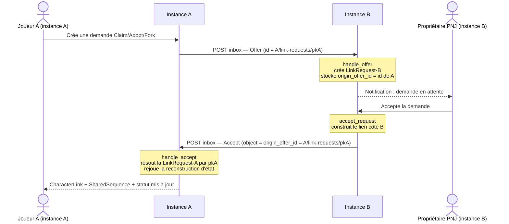

# ADR/DEC-038 — Mise en place : boucle Offer fédérée complète (Claim / Adopt / Fork)

> Réf. décision : `aidd_docs/decisions/DEC-038-offer-federation-format.md`
> Statut de départ : **Accepté, partiellement implémenté**. La *réception* de l'Offer
> (parsing du format canonique `serialize_link_request`) est déjà en place. Ce plan traite
> uniquement la section **« Reste à faire »** de la décision + l'extrait normatif à propager.

## Contexte

La réception d'un Offer reconstruit désormais une `LinkRequest` correcte côté instance de la
cible (garde-fou : `TestLinkOfferFederation.test_serialized_claim_offer_round_trips_into_a_link_request`).
Mais la **boucle retour** (Accept) est cassée et l'**état** n'est pas reconstruit côté demandeur :

1. **Round-trip de l'id → Accept** : l'Accept renvoyé par l'instance qui accepte référence
   l'`id` de **sa** `LinkRequest` locale (PK inexistante chez le demandeur) → `handle_accept`
   ne matche rien (`DoesNotExist`).
2. **Reconstruction d'état à l'Accept** : `handle_accept` se contente de flipper le statut ;
   ni `CharacterLink`, ni `SharedSequence`, ni transition de statut ne sont rejoués côté demandeur.
3. **Résolution du PJ distant** : `proposedCharacter` est best-effort → `null` si le PJ distant
   est inconnu localement (bloque la reconstruction d'un CLAIM côté récepteur).
4. **Doublon mort** : `tasks.py::process_incoming_activity` route vers des stubs no-op
   (`handle_offer`/`handle_accept`/`handle_reject`) qui doublonnent `inbox.py` → ambiguïté à lever.

## Parcours utilisateur (boucle cross-instance visée)

## Découpage en parties (phases indépendantes)

| Partie | Portée | Dépend de | Livrable vérifiable |
| ------ | ------ | --------- | ------------------- |
| **Part 1** | Corrélation par l'`id` de l'Offer d'origine (round-trip id → Accept) | — | Un Accept émis par B flippe la bonne `LinkRequest` côté A |
| **Part 2** | Reconstruction d'état à l'Accept côté demandeur (CharacterLink + SharedSequence + statut) | Part 1 | Après Accept, l'état est reconstruit côté A |
| **Part 3** | Résolution du PJ distant (`proposedCharacter`) via fetch AP | **prérequis dur pour tout CLAIM cross-instance** | Un CLAIM avec PJ distant inconnu résout le personnage sans crash à l'acceptation |
| **Part 4** | Suppression du dispatcher mort + propagation de l'extrait normatif | — | Un seul chemin de réception ; règle mise à jour |

- Part 1 est le socle. Part 2 en dépend (corréler avant de reconstruire).
- **Part 3 n'est pas optionnelle pour le CLAIM.** Côté récepteur (B), `accept_request` fait `source = request.proposed_character` et `CharacterLink.source` est **non-null** (`models.py:411`). Un `proposed_character` null (PJ distant non résolu) → `IntegrityError` à l'acceptation. Donc : soit Part 3 résout le PJ, soit l'acceptation d'un CLAIM au `proposed_character` null doit être **bloquée** (rejet/mise en attente), jamais laissée crasher. **À faire avant d'activer le CLAIM cross-instance.**
- Part 4 est du nettoyage/documentation, livrable à tout moment.
- **Contrainte** : chaque partie doit rester livrable seule (pas de régression si les suivantes ne sont pas faites). Exception : le **CLAIM** cross-instance exige Part 3 ; ADOPT/FORK n'en dépendent pas.

## Projection d'architecture (agrégée)

### À modifier
- `suddenly/characters/models.py` — nouveau champ `origin_offer_id` (URLField, blank/null) sur `LinkRequest` (Part 1)
- `suddenly/activitypub/inbox.py` — `handle_offer` (stocke `origin_offer_id` + fetch PJ distant), `handle_accept`/`handle_reject` (résolution + reconstruction) (Parts 1-3)
- `suddenly/activitypub/tasks.py` — `send_accept_activity`/`send_reject_activity` référencent l'`id` d'origine ; suppression des stubs morts (Parts 1, 4)
- `suddenly/characters/services.py` — `LinkService` : méthode de reconstruction côté demandeur (Part 2)
- `.claude/rules/08-domain/08-activitypub.md` — extrait normatif DEC-038 (Part 4)
- `tests/test_activitypub.py` — extension de `TestLinkOfferFederation` (Parts 1-3)

### À créer
- `suddenly/characters/migrations/00XX_linkrequest_origin_offer_id.py` — migration du champ (Part 1)
- Helper `get_or_create_remote_character(actor_url)` dans `inbox.py` (Part 3)

### À supprimer
- `suddenly/activitypub/tasks.py::process_incoming_activity` + stubs no-op `handle_offer`/`handle_accept`/`handle_reject`/`handle_create`/… — **après vérification qu'aucun `.delay()` ne les appelle** (Part 4)

## Règles applicables

| Tool | Name | Path | Pourquoi |
| ---- | ---- | ---- | -------- |
| claude | 08-activitypub | `.claude/rules/08-domain/08-activitypub.md` | Format Offer canonique, réception, cible AP — destination de l'extrait normatif |
| claude | 08-characters | `.claude/rules/08-domain/08-characters.md` | `LinkService` seul point de transition ; `origin_game` non-null pour tout Character distant |
| claude | 03-django-services | `.claude/rules/03-frameworks-and-libraries/03-django-services.md` | Reconstruction en service atomique, jamais inline dans un handler |
| claude | 03-django-models | `.claude/rules/03-frameworks-and-libraries/03-django-models.md` | Champ FK/URLField avec `on_delete`, migration via `makemigrations` |
| claude | ap-pivots-django-activitypub | `.claude/rules/07-quality/ap-pivots-django-activitypub.md` | Idempotence inbox, SSRF sur fetch acteur, signature avant traitement |
| claude | perf-pivots-celery | `.claude/rules/07-quality/perf-pivots-celery.md` | Tasks passent des IDs, idempotence, `soft_time_limit` |
| claude | 05-pytest | `.claude/rules/05-testing/05-pytest.md` | Factories, mock des appels HTTP (fetch acteur), pas de réseau en test |

## Assomptions & risques

- **Précondition d'émission (hors scope, à supposer acquise)** : pour que A émette l'Offer vers B, le miroir distant du PNJ sur A doit avoir un `creator` distant avec `inbox_url` (`send_offer_activity` livre à `target_character.creator`). C'est la même infra de miroir qui a permis à A d'afficher le PNJ ; ce plan traite la **réception** et suppose cette émission fonctionnelle.
- **Le fetch d'acteur passe obligatoirement par `_http.fetch_ap_json`** (SSRF hardening), jamais `httpx` brut — aucun helper de fetch de Character n'existe encore (à créer, Part 3).
- **`LinkService.accept_request` est écrit du point de vue de l'instance-cible** (le récepteur) : il crée le PC pour un FORK avec `owner=requester`, transfère l'ownership sur ADOPT, etc. Côté **demandeur** (A), le requester est local mais la cible est un Character distant — réutiliser `accept_request` tel quel est risqué (double side-effects, re-déclenchement d'Accept). Part 2 introduit donc une **méthode de reconstruction dédiée** plutôt qu'un appel direct. **Risque principal du plan.**
- La réception **bypasse** `validate_claim` (choix assumé DEC-038) : la reconstruction fait confiance à la validation faite sur l'instance émettrice.
- **Idempotence** : `handle_accept` peut être rejoué (retry, replay) → la reconstruction doit être idempotente (guard sur statut déjà `ACCEPTED` / lien déjà existant).
- **Crash à l'acceptation d'un CLAIM au `source` null** (récepteur B) : `accept_request` ne garde pas contre `proposed_character=None`. Part 3 le résout ; ajouter en filet un guard qui bloque/rejette une acceptation de CLAIM sans PJ résolu plutôt que de laisser l'`IntegrityError` remonter. **Ne pas activer le CLAIM cross-instance sans ce filet.**
- **ADOPT cross-instance — modèle d'ownership à poser avant Part 2** : côté demandeur (A), la cible est un miroir distant (`remote=True`). Faut-il transférer `owner` local sur ce miroir ? transitionner son `status` ? Le miroir n'est qu'un reflet de l'objet autoritatif (B). Décider explicitement (probable : le PC adopté est représenté par un objet **local** distinct, pas par mutation du miroir) — c'est le risque principal de Part 2.
- `process_incoming_activity` semble mort (aucun `.delay()` trouvé dans `suddenly/activitypub/*.py`) — **à confirmer par grep global** avant suppression (Part 4).

## Évaluation de confiance : 8/10

✓ Décision DEC-038 explicite sur le format canonique et les 4 items restants
✓ Code des deux chemins lu (inbox.py, tasks.py, serializers.py, services.py, models.py)
✓ Garde-fou de non-régression déjà en place (`TestLinkOfferFederation`)
✓ Phases indépendantes (sauf CLAIM → Part 3, dépendance dure explicitée après challenge)
✓ Challenge appliqué : dépendance Part 3, filet anti-crash `source=null`, attribution Part 2 corrigés
✗ **Modèle d'ownership ADOPT cross-instance non tranché** (mutation du miroir vs objet local distinct) — à figer avant de coder Part 2, principal facteur de risque restant
✗ Confirmation finale requise que `process_incoming_activity` est bien mort (grep global à exécuter, Part 4)

## Enfants

- `2026_07_18-adr-038-offer-federation-loop-part-1.md` — Corrélation par l'id d'origine
- `2026_07_18-adr-038-offer-federation-loop-part-2.md` — Reconstruction d'état à l'Accept
- `2026_07_18-adr-038-offer-federation-loop-part-3.md` — Résolution du PJ distant
- `2026_07_18-adr-038-offer-federation-loop-part-4.md` — Nettoyage code mort + normatif

## Clôture 🤖 (2026-07-19)

- **Les 4 parties sont livrées, testées et vérifiées.** Boucle Offer fédérée complète.
- Résolution des 2 items ✗ de l'évaluation de confiance :
  - Ownership ADOPT cross-instance **tranché** (Part 2 §amendements) : le lien pointe sur le miroir distant sans muter son `owner`/`status` ; le miroir suit l'objet autoritatif via `Update`. FORK crée un vrai PC local.
  - `process_incoming_activity` **confirmé mort** et supprimé (Part 4 §amendements) : aucun `.delay()`/appel direct ; dispatcher + stubs `handle_*` retirés de `tasks.py`, réception unifiée dans `inbox.py`.
- Vérification `success_condition` : `pytest tests/test_activitypub.py tests/characters` → **161 passed, 4 skipped** (fresh DB) ; `mypy suddenly/activitypub suddenly/characters` → **no issues** (33 fichiers).
- ⚠ Note d'env (hors plan) : le test DB réutilisé (`--reuse-db`) était en retard sur la migration `users/0002_user_language_prefs` (`content_language`) → `test_trait_views.py` en erreur tant que non recréé. `--create-db` (ou migration du test DB) requis. N'affecte pas le code du plan.
