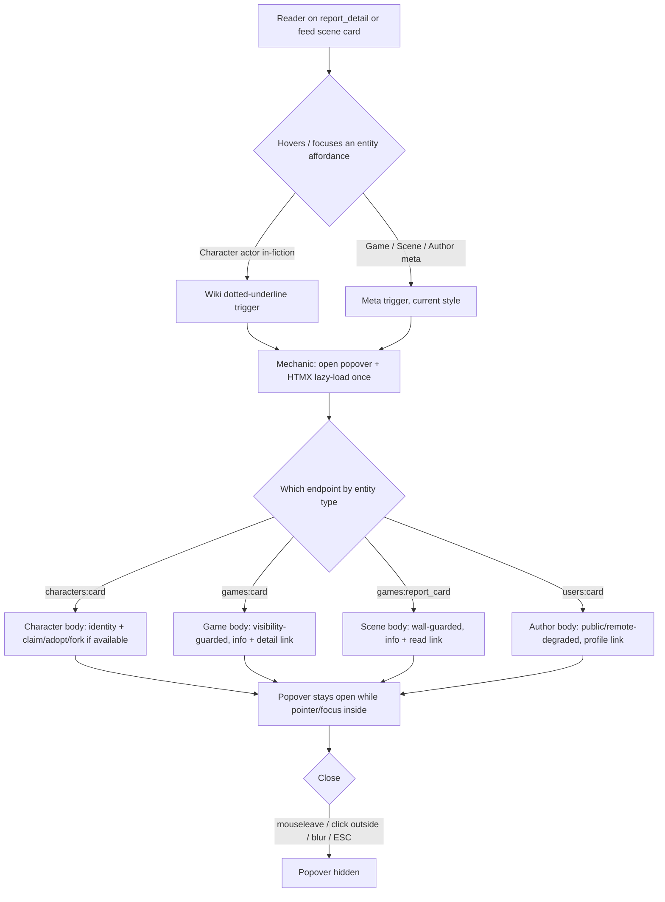

<!-- AI INSTRUCTIONS ONLY — do not output. Amendments prefixed 🤖. Log append-only. -->

# Instruction: Generalize the immersion hover-card to four structured entities (DRY, one mechanic)

## Feature

- **Summary**: Promote the existing character hover-card into a single reusable *mechanic* component (popover shell, HTMX lazy-load, mobile toggle, arrow, open/close, keyboard a11y). Parameterize the *content* by entity type — Character, Game (Partie), Scene (Report), Author (@user) — via one card body partial + one lazy endpoint per entity. Apply on the scene thread (`report_detail`) and the feed scene cards. Wiki dotted-underline affordance ONLY on the in-fiction character-actor; meta surfaces (breadcrumb game › scene, @author) keep their current style and merely gain the hover-card. Claim/adopt/fork actions remain Character-only; Game/Scene/Author get info + a single link.
- **DRY mechanic contract (params)**: `endpoint`, `href`, `label`, `variant` (`wiki`|`meta`), `trigger_class` (per-surface passthrough so meta triggers keep their exact current classes — the mechanic never hardcodes meta styling), optional `remote`/`icon` for meta glyphs. The `wiki` variant applies dotted-underline **in-contract utilities** (`underline decoration-dotted underline-offset-2 decoration-semantic-muted/40`), NOT a new component class — no `design:adjust` re-freeze needed.
- **In-fiction actor renders in TWO shared partials, not one**: `rapport_content.html` (scene reader) AND `rapport_read.html` (feed excerpt + Friends feed + composer preview). Both must carry the Character wiki trigger to cover the two target surfaces — but both are also used by non-target contexts (composer preview, editor), so the wiki trigger is gated by a `hovercards` context flag passed only by `report_detail` and the feed scene card. The actor wrap is additionally guarded on `rapport.actor and rapport.actor.slug` (actor can be `None` → "Personnage supprimé"), and the existing remote/PNJ badges stay OUTSIDE the trigger `<a>`.
- **Stack**: `Django 5.x (Python 3.12)`, `HTMX`, `Alpine.js`, `UnoCSS (design contract: design/tokens.json + design/components.json)`, `pytest-django`
- **Branch name**: `feat/hovercard-entities`
- **Parent Plan**: `none`
- **Sequence**: `standalone`
- Confidence: 9/10
- Time to implement: ~1 day

## Architecture projection

### Files to modify

- `templates/characters/_char_link.html` — refactor to delegate popover to the new mechanic; keep its public include signature (`character=` / `slug=`+`label=`) so `_cast_box.html` and `quotes/_quote_card.html` need no change.
- `templates/characters/_character_card.html` — align body markup to shared `.hovercard__body` scoping (rename away from `.char-pop__body`); content unchanged otherwise.
- `templates/games/partials/rapport_content.html` — wrap the in-fiction discussion actor name with the Character hover-card, `wiki` variant (dotted underline), gated on `hovercards` flag + `rapport.actor and rapport.actor.slug`; remote/PNJ badges stay outside the trigger.
- `templates/games/partials/rapport_read.html` — same Character `wiki` wrap (feed-scale actor name), same `hovercards` + actor guards. This is the partial the feed scene excerpt actually renders (`_scene_excerpt.html` → `rapport_read.html`).
- `templates/games/report_detail.html` — pass `hovercards=True` into the rapport render context; wrap breadcrumb `game.title` link (Game meta hover-card) and `@author` byline (Author meta hover-card) with `trigger_class` = their current classes.
- `templates/feed/_scene_card.html` — pass `hovercards=True` into the excerpt include; wrap `game` link (line 10-11 classes), `scene` link (line 13-14 classes), `@author` (line 20) with meta hover-cards, each preserving its current `trigger_class`. Note: `report_detail` uses `games:report_detail game_pk=… pk=…` kwargs — reuse `game_pk`+`pk` for `games:report_card`.
- `suddenly/games/front_urls.py` — add `games:card` (game, `pk`) and `games:report_card` (scene, `game_pk`+`pk`) routes.
- `suddenly/games/front_views.py` — add `game_card` and `report_card` lazy views with visibility guards.
- `suddenly/users/urls.py` — add `users:card` route (before the `<str:username>/` catch-all; use a distinct path shape e.g. `card/<str:username>/` to be shadow-proof regardless of order).
- `suddenly/users/views.py` — add `user_card` lazy view.
- No new design component class: the `wiki` dotted underline uses in-contract utilities only (see mechanic contract) — `design/components.json` untouched, no re-freeze.

### Files to create

- `templates/components/_hovercard.html` — THE single mechanic. Owns Alpine open-state, `@mouseenter/@mouseleave/@touchstart/@click.outside`, focus/blur + ESC a11y, HTMX `hx-get="{{ endpoint }}"` lazy-load into `find .hovercard__body`, popover shell, arrow, loading skeleton. Params: `endpoint`, `href`, `label`, `variant` (`wiki`|`meta`), `trigger_class` (per-surface class passthrough), `wrapper_class` (default `relative inline-block`; flex callers add `min-w-0 truncate`), optional `remote`/`icon` for meta glyphs.
- `templates/components/hovercards/_game_card.html` — Game content body (title, cover/avatar, system, owner, single detail link). Info-only — NO follow, no claim/adopt/fork.
- `templates/components/hovercards/_scene_card.html` — Scene (Report) content body (breadcrumb, state pill, byline, excerpt, "read the scene" link). No claim/adopt/fork.
- `templates/components/hovercards/_author_card.html` — Author (@user) content body (avatar, handle, remote/globe, profile link). No claim/adopt/fork.
- `tests/games/test_hovercards.py` — visibility + degradation tests for `game_card` / `report_card`.
- `tests/users/test_hovercards.py` — author card (public + remote degradation).

### Files to delete

- none

## Applicable rules

| Tool   | Name | Path | Why it applies |
| ------ | ---- | ---- | -------------- |
| claude | htmx-patterns | `.claude/rules/03-frameworks-and-libraries/03-htmx-patterns.md` | Lazy-load fragment scoping (`find .hovercard__body`), GET-only read endpoints, `|escapejs` on JS-injected data, namespaced `` |
| claude | alpine-patterns | `.claude/rules/03-frameworks-and-libraries/03-alpine-patterns.md` | Alpine open-state lifecycle; no `{{ var }}` interpolation into JS strings; data-attr injection |
| claude | dry-refactor | `.claude/rules/07-quality/dry-refactor.md` | Rule of Three — extract the mechanic once, never duplicate the popover across 4 entities (the core constraint) |
| claude | enforce | `.claude/rules/08-design/01-enforce.md` | Color/utility tokens only, Lucide icons only, no raw hex, container queries not media |
| claude | mobile-first | `.claude/rules/08-design/mobile-first.md` | Touch target ≥44px, focus visible, ESC/keyboard reach, status = icon+text, `prefers-reduced-motion` |
| claude | display-vocabulary | `.claude/rules/08-domain/08-display-vocabulary.md` | `Report` → "scene/scène" in UI strings, never "report/rapport" |
| claude | characters | `.claude/rules/08-domain/08-characters.md` | Claim/Adopt/Fork semantics + availability gating on the Character card only |
| claude | django-models | `.claude/rules/03-frameworks-and-libraries/03-django-models.md` | `select_related` on card views |
| claude | data-pivots-django-orm | `.claude/rules/07-quality/data-pivots-django-orm.md` | Object-level access scoping; never leak a private game / unpublished scene |

## User Journey

## Risk register

| Risk | Impact | Mitigation |
| ---- | ------ | ---------- |
| Duplicating the popover logic per entity (violates the hard DRY constraint) | 4× maintenance surface, drift | Single `_hovercard.html`; entities differ only by `endpoint` + body partial + `variant`. Grep proves Alpine/HTMX popover markup appears once |
| Visibility leak via card endpoint (private game / unreleased scene) | Data exposure | `game_card` mirrors `game_detail` visibility Q; `report_card` mirrors `report_detail` wall check (`PUBLISHED && is_released` else editors only); degraded card, never a raw 404 that confirms/leaks content |
| Name collision `templates/feed/_scene_card.html` vs a scene hover-card body | Wrong template resolves | Namespace hover-card bodies under `templates/components/hovercards/` |
| `_char_link.html` signature change breaks `_cast_box.html` / `_quote_card.html` | Regression on cast + quotes | Keep the exact include signature; only its internals delegate to the mechanic |
| `find .hovercard__body` mis-scopes when an entity appears multiple times | Wrong popover filled | Preserve the class-scoped (no-id) HTMX target; one wrapper instance per trigger |
| Multiple `hx-get` per scene (many actors) → request bursts | Perf | `hx-trigger="... once"`; lazy on first hover/focus only; `select_related` in card views |
| `users:card` shadowed by `<str:username>/` catch-all | 404 / wrong view | Shadow-proof path shape (`card/<str:username>/`) and/or register before the username catch-all |
| Wiki underline bleeding onto meta or prose mentions | Spec violation | `variant=wiki` applied ONLY to the discussion actor name; meta triggers use `variant=meta` |
| Null/deleted actor (`rapport.actor is None`) → `NoReverseMatch` on `characters:card slug=` | 500 on any scene with a deleted actor | Wrap guarded on ``; badges/`"Personnage supprimé"` render outside the trigger |
| Wiki trigger leaking into composer preview / editor (shared partials `rapport_content.html` + `rapport_read.html`) | Affordance out of validated scope | Trigger gated by `hovercards` context flag, passed ONLY by `report_detail` and the feed scene card; composer/editor omit it |
| Feed surface missing the wiki affordance (plan only touched `rapport_content.html`) | Spec surface not covered | Feed excerpt renders `rapport_read.html`, not `rapport_content.html`; the Character wiki wrap is added to BOTH partials |
| `variant=meta` hardcoding classes → meta links lose their current per-surface style | Spec violation ("méta garde son style actuel") | Mechanic takes a `trigger_class` passthrough; each meta call passes its exact current classes |
| Remote/federated actor with no resolvable local card | Broken/empty card | Wrap only when `actor.slug` present; card degrades for remote (globe + `ap_id`), no local actions |

## Implementation phases

### Phase 1: Extract the single hover-card mechanic

> One reusable popover component; character hover-card keeps working through it; keyboard a11y added once, for all entities.

#### Tasks

1. Create `templates/components/_hovercard.html`: Alpine open-state + `@mouseenter/@mouseleave/@touchstart.prevent/@click.outside`; add `@focusin="open=true"`, `@focusout` (guarded via `relatedTarget` — stay open if focus moves inside the card), `@keydown.escape.window="open=false"`; HTMX `hx-get="{{ endpoint }}"`, `hx-trigger="mouseenter once, touchstart once, focus once"`, `hx-target="find .hovercard__body"`, `hx-swap="innerHTML"`; popover shell + arrow + loading skeleton; render trigger `<a href="{{ href }}" class="{{ trigger_class }}">` where callers pass classes — `wiki` variant class-string = `underline decoration-dotted underline-offset-2 decoration-semantic-muted/40` (in-contract utilities); `meta` variant passes the surface's exact current classes verbatim. Respect `prefers-reduced-motion` on the x-transition.
2. (removed — no new design component class; the dotted underline is in-contract utilities, so no `design:adjust` re-freeze.)
3. Refactor `templates/characters/_char_link.html` to `` passing `endpoint=`, `href`, `label`, and `trigger_class="link"` (its current class). Keep the public include signature (`character=` / `slug=`+`label=`).
4. Rename `.char-pop__body` → `.hovercard__body` in `_character_card.html` and any reference.
5. Verify `_cast_box.html` and `quotes/_quote_card.html` still render the character card unchanged.

#### Acceptance criteria

- [ ] `_hovercard.html` is the only file containing the Alpine/HTMX popover markup (grep proves single occurrence).
- [ ] Character hover-card on the cast box and quote card is visually and behaviorally unchanged.
- [ ] Trigger opens on keyboard focus and closes on ESC.
- [ ] `node design/lint/lint-files.mjs templates/components/_hovercard.html` exits 0.

### Phase 2: Per-entity content bodies + lazy endpoints (visibility-guarded)

> Three new card bodies and three new GET endpoints; Character card unchanged; every endpoint enforces visibility and degrades remote entities.

#### Tasks

1. `templates/components/hovercards/_game_card.html`: identity (cover/avatar, title, system, owner), detail link; remote → globe + `ap_id` + external link; no claim/adopt/fork.
2. `templates/components/hovercards/_scene_card.html`: breadcrumb `game › scene`, state pill, byline, short excerpt, "read the scene" link; UI wording uses "scene/scène"; no claim/adopt/fork.
3. `templates/components/hovercards/_author_card.html`: avatar, `@handle`, remote/globe degradation, profile link; no claim/adopt/fork.
4. `games:card` → `game_card(request, pk)` view: visibility `Q(is_public=True) | Q(owner=request.user)`; if not visible, render a minimal degraded card (no title/description leak). `select_related("owner")`.
5. `games:report_card` → `report_card(request, game_pk, pk)` view: mirror `report_detail` wall check (`status==PUBLISHED and is_released`, else `can_edit_scene`); if not visible, degraded card, never confirm hidden content. `select_related("game","author")`.
6. `users:card` → `user_card(request, username)` view; route uses a shadow-proof path shape (`card/<str:username>/`, or registered before the `<str:username>/` catch-all); public identity; remote degraded.
7. Add URL entries; namespace all `` in bodies. `games:report_card` uses `game_pk`+`pk` kwargs (same as `games:report_detail`).

#### Acceptance criteria

- [ ] Anonymous GET on a private game's card returns a degraded card (no title/description), not the full card.
- [ ] GET on an unpublished / unreleased scene's card returns a degraded card for non-editors; full card for the author/GM.
- [ ] Remote game/scene/author render the globe + external link and no local actions.
- [ ] No card body contains claim/adopt/fork except the Character card.
- [ ] `python manage.py check` exits 0; new routes reverse correctly.

### Phase 3: Wire the surfaces

> Attach hover-cards to the two target surfaces with the correct variant per role.

#### Tasks

1. `report_detail.html`: pass `hovercards=True` into the rapport render context; wrap breadcrumb `game.title` with Game meta hover-card and `@author` byline with Author meta hover-card, each passing its current classes as `trigger_class`. Do not add a hover-card on the current scene's own title (self).
2. `feed/_scene_card.html`: pass `hovercards=True` into the `_scene_excerpt.html` include; wrap `game` link, `scene` link, `@author` with meta hover-cards, each passing its current classes as `trigger_class`.
3. `rapport_content.html` AND `rapport_read.html`: wrap the discussion actor name with the Character hover-card, `wiki` dotted-underline `trigger_class`, gated `` — the only wiki affordance; remote/PNJ badges stay outside the trigger; leave narration/action/description prose untouched. When the flag is absent (composer preview, editor), render the actor exactly as today.
4. Confirm meta surfaces keep their current typography/color (the `trigger_class` passthrough carries the exact current classes; the mechanic only adds the popover, never restyles).
5. Flex-truncation gotcha: the breadcrumb links carry `truncate` inside a `flex` row — the mechanic's wrapper `` must carry `min-w-0` (and pass `truncate` through `trigger_class`) or truncation silently breaks. Expose a `wrapper_class` param (default `relative inline-block`) so flex-context callers add `min-w-0 truncate`.

#### Acceptance criteria

- [ ] On `report_detail`, hovering the game breadcrumb and the `@author` opens the correct entity card; the in-fiction actor shows a dotted underline and opens the character card.
- [ ] On a feed scene card, game / scene / author each open their entity card; the in-fiction actor in the excerpt (`rapport_read.html`) shows the dotted underline too.
- [ ] Composer preview and the editor show NO dotted underline and NO character popover (flag absent) — actor renders exactly as before.
- [ ] A scene whose actor is deleted (`actor is None`) renders "Personnage supprimé" with no trigger and no 500.
- [ ] Meta triggers (game/scene/author) keep their exact current classes/color — only the popover is added.
- [ ] Dotted underline appears ONLY on the character-actor, nowhere on meta or prose.
- [ ] `node design/lint/lint-files.mjs` on all touched templates exits 0.

### Phase 4: Tests, a11y, DRY verification

> Prove visibility, degradation, keyboard a11y, and single-mechanic DRY.

#### Tasks

1. `tests/games/test_hovercards.py`: private game card hidden from anon/non-owner; unreleased scene card hidden from non-editor, visible to author; remote degradation.
2. `tests/users/test_hovercards.py`: public author card; remote author degraded.
3. `tests/games/test_hovercards.py` (rendering guards): `report_detail`/feed render the wiki trigger for a normal actor; composer preview / editor (no `hovercards` flag) render the actor WITHOUT trigger; a scene with `actor is None` renders safely (no 500, no reverse).
4. Manual/a11y pass: Tab reaches trigger → card opens; ESC closes; card stays open while focus/pointer inside; `prefers-reduced-motion` respected.
5. DRY check: grep confirms popover Alpine/HTMX markup exists only in `_hovercard.html`.
6. Run the success condition end-to-end.

#### Acceptance criteria

- [ ] `pytest tests/games tests/users tests/characters -q --no-cov -o addopts=''` passes.
- [ ] Grep shows the popover mechanic markup in exactly one file.
- [ ] Success condition command exits 0.

## Amendments

<!-- 🤖 entries during implementation -->

## Log

<!-- APPEND ONLY -->

## Validation flow demonstration

1. Log in, open a released scene at `games:report_detail`. Hover the game breadcrumb → Game card lazy-loads with a detail link (no claim/adopt/fork). Hover `@author` → Author card with profile link.
2. Hover an in-fiction character-actor (dotted underline) → Character card with Claim/Adopt/Fork when the character is available.
3. Tab to any trigger with the keyboard → card opens on focus; press ESC → card closes.
4. As anonymous, request a private game's card URL and an unreleased scene's card URL → each returns a degraded card, no leaked title/content.
5. Open the feed; on a scene card hover game / scene / author → each opens its entity card; the scene link card respects the wall.
