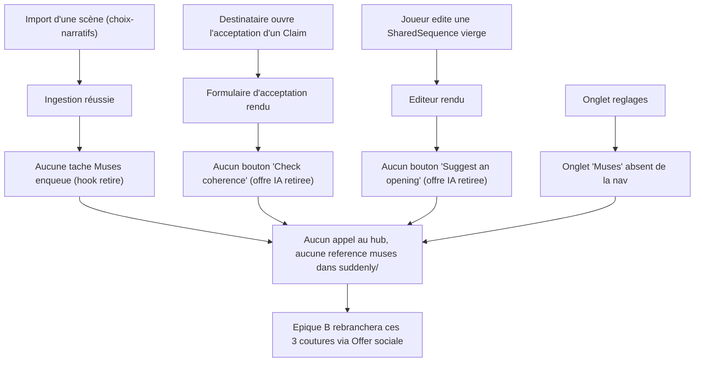

<!-- AI INSTRUCTIONS ONLY — ne pas produire ce bloc. Amendements préfixés 🤖. Log append-only. -->

# Instruction : Retrait complet de Muses (IA) — Épique A (#131)

## Feature

- **Summary** : Retirer entièrement l'intégration IA « Muses » de l'instance : app `suddenly.muses`, onglet de réglages, champs modèle, constantes settings, entrée d'énumération de notification, et les 3 points d'appel. Les 3 points d'appel (import post-ingestion, cohérence de claim, ouverture de séquence) **dégradent proprement** : les flux sous-jacents continuent de fonctionner, sans aucune offre IA ni appel au hub. L'épique B (Offer sociale) ré-branchera ces 3 coutures plus tard, avec son propre mécanisme.
- **Stack** : `Django 5.x (Python 3.12)`, `PostgreSQL`, `Celery`, `HTMX`, `Alpine.js`, `pytest-django`, `ruff`, `mypy`
- **Branch name** : `epic-a/remove-muses` (déjà créée, arbre propre — ne pas committer/brancher ici)
- **Parent Plan** : `none`
- **Sequence** : `standalone`
- Confidence : 9/10
- Time to implement : ~0.5 jour

## Décision de découpage (plan simple, pas master)

- Score de risque formel ≥ 3 (migrations DB ×3 apps + 5 modules touchés) → normalement plan master.
- **Décidé : plan simple.** Un retrait est atomique : un retrait partiel laisse des imports/colonnes cassés, donc les phases **ne sont pas indépendamment livrables** (violerait « chaque partie doit être faisable sans les suivantes »). Découper en child plans ajouterait du couplage inter-fichiers sans bénéfice. Les phases ci-dessous sont **ordonnées** pour que le code compile à chaque frontière (lecteurs retirés avant l'app et les colonnes).

## Périmètre vérifié (anchors confirmés + 3 références hors brief)

Confirmés vs le brief : app `suddenly/muses/` (pas de `models.py`, **pas de dossier `migrations/`** → aucune table DB, retrait de `INSTALLED_APPS` sans migration d'app) ; 3 champs `User` (`muses_enabled`, `muses_credits`, `muses_post_ingest_optin`) ; onglet réglages (`settings_muses` vue/url/form/template + lien nav) ; constantes `SUDDENLY_MUSES_*` (uniquement `config/settings/base.py`, absentes de `production.py`/`development.py`).

**Non listés dans le brief — trouvés par grep, à traiter aussi** (sinon « plus aucune référence » échoue) :
- `suddenly/characters/muses_context.py` — fichier entier de builders de payloads (`character_sheet`, `axial_tags`, `corpus_content`, `anchor_reports`).
- `suddenly/games/models.py` — champ `Report.muses_summary_proposal` (`TextField`) → **nouvelle migration `games` (RemoveField)**.
- `suddenly/core/models.py` — `NotificationType.MUSES_SUGGESTION` → **nouvelle migration `core` (AlterField choices)**.
- `suddenly/games/ingest.py` — hook `_queue_muses_assist` + son appel, et le logger `"suddenly.muses"`.
- `suddenly/games/tasks.py` — **seule tâche du module** est `muses_post_ingest` → fichier entier supprimable.
- Templates portant les déclencheurs UI : `link_request_accept_form.html`, `sequence_edit.html`, `settings_base.html` (lien nav).

## Architecture projection

### Files to modify

- `config/settings/base.py` — retirer `"suddenly.muses"` de `INSTALLED_APPS` (l.41) + le bloc constantes `SUDDENLY_MUSES_*` (l.293-306).
- `suddenly/games/ingest.py` — supprimer `_queue_muses_assist` (l.182-194) + son appel (l.173) ; renommer le logger `"suddenly.muses"` → logger générique (`"suddenly.games"`) ; l'import fera défaut sinon.
- `suddenly/characters/link_views.py` — supprimer la vue `link_request_check_coherence` (l.204-283) et ses imports locaux muses.
- `suddenly/characters/sequence_views.py` — supprimer la vue `sequence_suggest_opening` (l.84-150) et ses imports locaux muses.
- `suddenly/characters/front_urls.py` — retirer les routes `link_request_check_coherence` (l.33-35) et `sequence_suggest_opening` (l.61-63).
- `suddenly/users/settings_views.py` — supprimer la vue `settings_muses` (l.47-70) + l'import `MusesSettingsForm` (l.21).
- `suddenly/users/urls.py` — retirer `settings/muses/` → `settings_muses` (l.12).
- `suddenly/users/forms.py` — supprimer la classe `MusesSettingsForm` (l.77-84).
- `suddenly/users/models.py` — supprimer les 3 champs `muses_*` (l.59-80).
- `suddenly/games/models.py` — supprimer `Report.muses_summary_proposal` (l.212-219).
- `suddenly/core/models.py` — retirer `MUSES_SUGGESTION` de `NotificationType` (l.52).
- `templates/users/settings_base.html` — retirer le lien nav « Muses » (l.30-35).
- `templates/characters/link_request_accept_form.html` — retirer le bloc bouton « Check coherence » gardé par `user.muses_enabled` (l.17-32).
- `templates/characters/sequence_edit.html` — retirer le bloc bouton « Suggest an opening » gardé par `user.muses_enabled` (l.92-102).

### Files to create

- `suddenly/users/migrations/00NN_remove_user_muses_fields.py` — `RemoveField` ×3 (généré par `makemigrations users`).
- `suddenly/games/migrations/00NN_remove_report_muses_summary_proposal.py` — `RemoveField` (généré par `makemigrations games`).
- `suddenly/core/migrations/00NN_alter_notification_type_remove_muses.py` — `AlterField` sur `Notification.type` (généré par `makemigrations core`) ; optionnellement une `RunPython` supprimant les `Notification.objects.filter(type="muses_suggestion")` orphelines.

### Files to delete

- `suddenly/muses/` — package entier (`__init__.py`, `apps.py`, `client.py`, `credits.py`, `exceptions.py`).
- `suddenly/characters/muses_context.py` — builders de payloads Muses.
- `suddenly/games/tasks.py` — module dont l'unique tâche est `muses_post_ingest`.
- `templates/users/settings_muses.html` — template de l'onglet réglages Muses.
- `templates/characters/_claim_coherence.html` — panneau HTMX de cohérence.
- `templates/characters/_sequence_suggestion.html` — panneau HTMX de suggestion.
- `tests/muses/` (dir : `test_client.py`, `test_credits.py`), `tests/games/test_muses_ingest.py`, `tests/users/test_settings_muses.py`, `tests/characters/test_sequence_suggestion.py`, `tests/characters/test_claim_coherence.py`.

## Applicable rules

| Tool   | Name | Path | Why it applies |
| ------ | ---- | ---- | -------------- |
| claude | perf-pivots-celery | `.claude/rules/07-quality/perf-pivots-celery.md` | Retrait d'une tâche `@shared_task` (`muses_post_ingest`) et de son enqueue dans `ingest.py` — autodiscover Celery tolère l'absence de module `tasks` |
| claude | django-models | `.claude/rules/03-frameworks-and-libraries/03-django-models.md` | Retrait de champs modèle → migrations propres, pas de logique en modèle |
| claude | data-pivots-django-orm | `.claude/rules/07-quality/data-pivots-django-orm.md` | `makemigrations`/`sqlmigrate` reviewés ; `RemoveField`/`AlterField` non destructifs de tables |
| claude | htmx-patterns | `.claude/rules/03-frameworks-and-libraries/03-htmx-patterns.md` | Retrait de déclencheurs `hx-post` + slots ; `` namespacé côté templates restants |
| claude | i18n-patterns | `.claude/rules/08-domain/08-i18n-patterns.md` | Suppression de chaînes `` → `make check` recompile les `.po`/`.mo` (étape `i18n-check`) |
| claude | admin-roles | `.claude/rules/08-domain/08-admin-roles.md` | Les crédits Muses étaient octroyés par l'admin (#86) ; retrait sans casser d'autre surface admin |
| claude | file-language-and-style | `.claude/rules/01-standards/file-language-and-style.md` | Ce plan (`aidd_docs/tasks/**`) est human-consumed → français ; symboles/chemins verbatim |

## User Journey

## Risk register

| Risk | Impact | Mitigation |
| ---- | ------ | ---------- |
| Ordre de retrait cassant les imports (app supprimée alors qu'un lecteur l'importe encore) | `ImportError` au démarrage / aux tests | Phase 1 retire tous les lecteurs (dont `games/tasks.py` top-level import) **avant** que Phase 2 supprime l'app |
| Suppression de `games/tasks.py` casse l'autodiscover Celery | Worker/tests en échec | `autodiscover_tasks` tolère l'absence de module `tasks` ; `muses_post_ingest` était l'unique tâche du module (vérifié) — pas d'autre `@shared_task` dans `games/` |
| Champs modèle retirés mais colonnes/rows orphelines | Schéma incohérent, `AlterField` refusé | `makemigrations` génère `RemoveField`/`AlterField` ; `migrate` sur la DB dev ; optionnel `RunPython` purge les notifications `type="muses_suggestion"` |
| `NotificationType.MUSES_SUGGESTION` retiré mais des `Notification` existantes gardent la chaîne | Choix orphelin en base (non contraint en Postgres) | Migration data optionnelle de suppression ; sinon inoffensif (CharField sans check constraint) |
| Couverture (`make check`) qui chute après retrait code + tests | `test` échoue sur le seuil coverage | Retirer **ensemble** code muses et ses tests dédiés ; ne pas supprimer de test couvrant du code survivant ; re-mesurer |
| `i18n-check` échoue à cause de msgids obsolètes | `make check` rouge | `makemessages` marque obsolètes (`#~`) sans casser `compilemessages` ; vérifier `tests/core/test_i18n.py` |
| Références résiduelles hors anchors (templates de notification, JS) | Acceptance « plus aucune référence » échoue | Balayage `git grep -i muses` en Phase 4 comme critère d'acceptation dur (dans `success_condition`) |
| Références `muses` dans `templates/` (hors `suddenly/`) | Onglet/boutons fantômes | Templates traités en Phases 1-2 ; l'acceptance #131 vise `suddenly/`, mais on nettoie aussi `templates/` |

## Implementation phases

### Phase 1 : Débrancher les 3 points d'appel (dégradation propre)

> Retirer toute offre IA aux 3 coutures ; les flux sous-jacents (import, acceptation, édition) restent fonctionnels. Après cette phase, plus aucun code n'importe l'app `muses`.

#### Tasks

1. `games/ingest.py` : supprimer l'appel `self._queue_muses_assist(report.id)` (l.173) et la méthode `_queue_muses_assist` (l.182-194) ; remplacer le logger `getLogger("suddenly.muses")` par `getLogger("suddenly.games")` (ou retirer si inutilisé). L'ingestion crée toujours le Report.
2. `characters/link_views.py` : supprimer la vue `link_request_check_coherence` et ses imports locaux (`suddenly.muses.*`, `.muses_context`).
3. `characters/front_urls.py` : retirer la route `characters:link_request_check_coherence`.
4. `templates/characters/link_request_accept_form.html` : retirer le bloc `` (bouton + slot).
5. `templates/characters/_claim_coherence.html` : supprimer le fichier.
6. `characters/sequence_views.py` : supprimer la vue `sequence_suggest_opening` et ses imports locaux muses.
7. `characters/front_urls.py` : retirer la route `characters:sequence_suggest_opening`.
8. `templates/characters/sequence_edit.html` : retirer le bloc `` (bouton + slot).
9. `templates/characters/_sequence_suggestion.html` : supprimer le fichier.
10. `suddenly/games/tasks.py` : supprimer le fichier (unique tâche = `muses_post_ingest`).
11. `suddenly/characters/muses_context.py` : supprimer le fichier.

#### Acceptance criteria

- [ ] `python manage.py check` passe (aucun import muses résiduel côté code applicatif chargé).
- [ ] `git grep -i muses -- suddenly/characters suddenly/games` ne renvoie plus que `models.py` (champ/enum, traités en Phase 3) et migrations historiques.
- [ ] L'import d'une scène, l'acceptation d'un Claim et l'édition d'une séquence vierge rendent sans bouton IA et sans 500.

### Phase 2 : Supprimer l'onglet réglages, l'app et les constantes settings

> Retirer la surface de configuration Muses et l'app elle-même.

#### Tasks

1. `templates/users/settings_base.html` : retirer le lien nav « Muses » (l.30-35).
2. `users/settings_views.py` : supprimer la vue `settings_muses` + l'import `MusesSettingsForm`.
3. `users/urls.py` : retirer la route `users:settings_muses`.
4. `users/forms.py` : supprimer `MusesSettingsForm`.
5. `templates/users/settings_muses.html` : supprimer le fichier.
6. `config/settings/base.py` : retirer `"suddenly.muses"` d'`INSTALLED_APPS` + le bloc constantes `SUDDENLY_MUSES_*`.
7. `suddenly/muses/` : supprimer le package entier (aucun dossier `migrations/`, aucune table).

#### Acceptance criteria

- [ ] `python manage.py check` passe ; l'app `suddenly.muses` n'est plus dans `INSTALLED_APPS`.
- [ ] `GET /settings/preferences/` (ou équivalent) rend sans onglet « Muses » ; l'URL `users:settings_muses` n'existe plus (`NoReverseMatch` attendu si référencée).
- [ ] `git grep -i "SUDDENLY_MUSES"` ne renvoie plus rien.

### Phase 3 : Dropper les champs modèle + l'énumération via nouvelles migrations

> Retirer les 3 champs `User`, `Report.muses_summary_proposal`, et `NotificationType.MUSES_SUGGESTION` avec des migrations neuves (jamais éditer l'historique).

#### Tasks

1. `users/models.py` : supprimer `muses_enabled`, `muses_credits`, `muses_post_ingest_optin` → `python manage.py makemigrations users` (RemoveField ×3).
2. `games/models.py` : supprimer `Report.muses_summary_proposal` → `makemigrations games` (RemoveField).
3. `core/models.py` : retirer `MUSES_SUGGESTION` de `NotificationType` → `makemigrations core` (AlterField `Notification.type`) ; ajouter optionnellement une `RunPython` purgeant `Notification.objects.filter(type="muses_suggestion")`.
4. `python manage.py migrate` sur la DB dev ; revoir le SQL via `sqlmigrate` pour chaque migration générée.
5. Vérifier qu'aucun code/template restant ne lit `muses_enabled`/`muses_credits`/`muses_summary_proposal`/`MUSES_SUGGESTION`.

#### Acceptance criteria

- [ ] `python manage.py makemigrations --check --dry-run` ne détecte aucune migration manquante.
- [ ] `python manage.py migrate` applique les 3 nouvelles migrations sans erreur.
- [ ] `git grep -i muses -- suddenly '*.py' ':(exclude)suddenly/*/migrations/*'` ne renvoie plus rien.

### Phase 4 : Tests, balayage résiduel, `make check`

> Retirer les tests dédiés Muses, corriger toute référence incidente, prouver l'absence totale de référence et la santé de la CI.

#### Tasks

1. Supprimer `tests/muses/`, `tests/games/test_muses_ingest.py`, `tests/users/test_settings_muses.py`, `tests/characters/test_sequence_suggestion.py`, `tests/characters/test_claim_coherence.py`.
2. Balayer les autres tests : `git grep -in muses -- tests` → corriger toute référence incidente (ex. un test d'ingestion mockant `_queue_muses_assist`).
3. Balayer templates/JS : `git grep -in muses -- templates static` → nettoyer tout résidu (fantômes de nav/boutons/notifications).
4. Exécuter `make check` (lint ruff + mypy + pytest/coverage + i18n-check) ; corriger msgids obsolètes si `i18n-check` le signale.
5. Vérifier le `success_condition` de bout en bout.

#### Acceptance criteria

- [ ] `make check` passe (lint + typecheck + test/coverage + i18n).
- [ ] `git grep -nI -i muses -- suddenly ':(exclude)suddenly/*/migrations/*'` ne renvoie rien (exit 1).
- [ ] `success_condition` (commande combinée) sort en 0.

## Amendments

<!-- 🤖 entrées pendant l'implémentation -->

## Log

<!-- APPEND ONLY -->

## Validation flow demonstration

1. `python manage.py migrate` puis `python manage.py check` — démarrage sans l'app `muses`, sans migration manquante.
2. Importer une scène depuis choix-narratifs → la scène est créée, aucune notification/tâche Muses, aucun appel réseau au hub.
3. Ouvrir l'acceptation d'un Claim → le formulaire s'affiche sans bouton « Check coherence ».
4. Éditer une SharedSequence vierge → l'éditeur s'affiche sans bouton « Suggest an opening ».
5. Ouvrir les réglages → aucun onglet « Muses ».
6. Lancer `make check && ! git grep -nI -i muses -- suddenly ':(exclude)suddenly/*/migrations/*'` → sort en 0.

## Évaluation de confiance : 9/10

Raisons (✓)
- Tous les anchors du brief vérifiés contre le code réel + 3 références supplémentaires trouvées (`muses_context.py`, `Report.muses_summary_proposal`, `NotificationType.MUSES_SUGGESTION`, hook `ingest.py`, logger, blocs boutons templates).
- App `muses` sans `models.py` ni `migrations/` → retrait d'`INSTALLED_APPS` sans migration d'app, aucune table à dropper.
- `games/tasks.py` confirmé mono-tâche → suppression sûre ; constantes muses uniquement dans `base.py`.
- Phases ordonnées pour compilation à chaque frontière ; `success_condition` prouve les deux critères d'acceptation (`make check` + zéro référence).

Risques (✗)
- Seuil de couverture après retrait code+tests : à re-mesurer (mitigation : retrait apparié code/tests).
- `i18n-check` peut signaler des msgids obsolètes après retrait de `` (mitigation : recompilation, inoffensif).
- Interprétation « les 3 vues/tâches fonctionnent » : retenue = les 3 **flux** restent fonctionnels, les shells nommés `muses` sont supprimés (imposé par « plus aucune référence à muses »). Épique B ré-introduira son propre câblage Offer.
