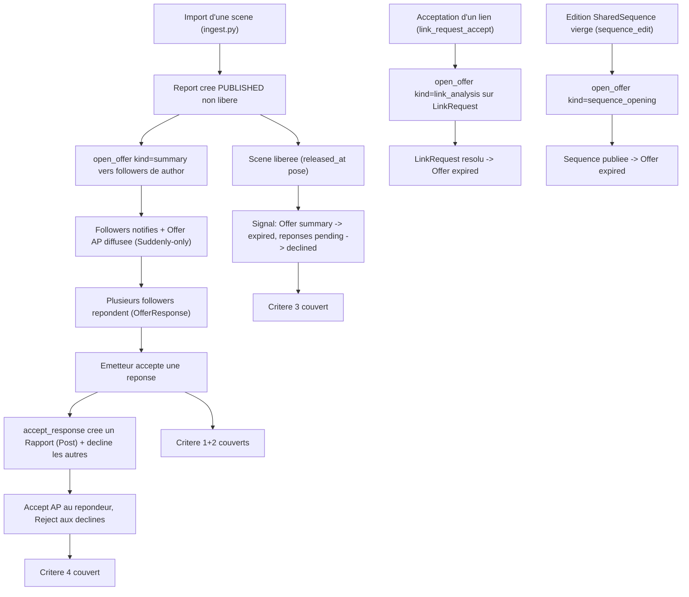

<!-- AI INSTRUCTIONS ONLY — ne pas produire ce bloc. Amendements préfixés 🤖. Log append-only. -->

# Instruction : Offer sociale (intelligence collective) — Épique B (#132)

## Feature

- **Summary** : L'Épique A a retiré Muses en laissant 3 coutures qui « dégradent proprement » (aucun appel au hub). L'Épique B ré-branche ces 3 coutures avec un mécanisme social : à chaque point, l'émetteur ouvre une **Offer sociale** adressée à ses **followers** (relation `Follow` — Épique C supposée mergée). Plusieurs followers répondent ; l'émetteur **accepte une réponse** (ce qui **crée un Post** — un `Rapport` — et **décline automatiquement** les autres) ou **décline**. La réponse « prend la place exacte de ce que Muses produisait ». **Arbitrage #132 (validé)** : « crée un Post » = un `Rapport` **littéral sur les 3 coutures** (option (b)), réalisé via un `Report` porteur DRAFT pour les coutures 2/3 (voie (ii), DEC-B4). L'Offer **expire** avec le cycle de vie de son **objet porteur**. Offers et réponses **fédèrent** entre instances Suddenly. **Point critique** : l'AP `Offer` est **déjà** utilisé pour les demandes de liens (Claim/Adopt/Fork) — la nouvelle Offer sociale doit s'en distinguer sans régresser DEC-038.
- **Stack** : `Django 5.x (Python 3.12)`, `PostgreSQL`, `Celery` (fallback sync via `_safe_delay`), `HTMX`, `Alpine.js`, `httpx`, `pytest-django` + `respx`, `ruff`, `mypy`.
- **Branch name** : `epic-b/offer-mechanism` (worktree `.claude/worktrees/epic-b` — l'implémenteur committe ici, ne touche pas la copie de travail principale).
- **Parent Plan** : `none`
- **Sequence** : `standalone`
- Confidence : 8/10
- Time to implement : ~2 jours

## Hypothèses de dépendance (NE PAS re-planifier)

- **Épique A (#131) retrait Muses = mergée sur main** (`a4e7c95`, confirmé ancêtre de HEAD ; `git grep -i muses -- suddenly` hors migrations = vide). Les 3 coutures sont en dégradation propre : aucune trace de `_queue_muses_assist`, `muses_context`, `link_request_check_coherence`, `sequence_suggest_opening`. Ce plan **ré-introduit son propre câblage** aux mêmes emplacements, jamais du code `muses`.
- **Épique C (#133) follow-federation** : supposée **mergée avant l'implémentation de B**. Le modèle `Follow` (polymorphe User/Character/Game, GFK, `remote`/`ap_id`) et la notion de follower **existent déjà sur main pré-C** (`characters.models.Follow` l.605, `broadcast_activity` fan-out l.95 de `tasks.py`). **Ne PAS re-planifier la fédération Follow.** B s'appuie sur la relation follower pour cibler les Offers.

## Décision de découpage (plan simple, pas master)

- Les phases partagent le modèle `SocialOffer`/`OfferResponse` et sont **ordonnées** autour d'une unique frontière migration (Phase 1). Après la Phase 1, les Phases 2-4 sont livrables ; la Phase 5 (tests batchés) valide l'ensemble.
- **Décidé : plan simple.** Découper en child plans indépendants ajouterait du couplage inter-fichiers (modèle ↔ service ↔ inbox ↔ UI) sans bénéfice. Le code compile à chaque frontière.
- **Convention tests batchés (à partir de cet épique)** : Phases 1-4 = **CODE SEUL** (aucun test écrit). Chaque phase code se clôt par un run **ciblé des tests EXISTANTS du périmètre** (`python -m pytest <scope> --create-db --no-cov -p no:cacheprovider -q`) — jamais d'écriture de test. **Phase 5** écrit toute la couverture des 4 critères d'un coup, puis `make check`.
- **`--create-db` obligatoire sur tout pytest** : la DB de test est partagée entre worktrees, son schéma dérive (cf. note d'env DEC-038/Épique C : `--reuse-db` en retard sur une migration récente casse des tests hors périmètre).
- **i18n** : le wrapping `` / `gettext` **inline** est du **code** (fait dans les phases code). La traduction `.po` + `compilemessages` est **différée en Phase 5**.

## Existant confirmé (NE PAS re-planifier — déjà câblé et testé)

Vérifié contre le code du worktree :

- **Porteur seam 1 (résumé d'import)** — `games/ingest.py::IngestReportView.post` (l.110-175) : crée un `Report` `status=PUBLISHED` mais **`released_at=None`** (non libéré, derrière le « mur » SUD-V1), dans une `transaction.atomic`. **Aucun** hook post-ingestion ne subsiste (Muses retiré). Point de ré-branchement = après le commit de la transaction.
- **Cycle de vie Report** : deux axes orthogonaux — `status` (DRAFT/PUBLISHED, `games/models.py` l.150) et **libération** `released_at` (l.164, « le mur »). Libération posée par `report_views.report_release` (l.145, `released_at = now()` ou re-fermeture si non fédéré). `ReportQuerySet.released()` = `released_at` + PUBLISHED + PUBLIC.
- **Porteur seam 2 (analyse de liens)** — `LinkRequest` (`characters/models.py` l.352), statuts `PENDING/QUEUED/ACCEPTED/REJECTED/CANCELLED/EXPIRED`. Résolution via `LinkService.accept_request`/`reject_request`/`cancel_request`/`expire_stale_requests` (`characters/services.py`). Vue-couture = `link_views.link_request_accept` (l.175).
- **Porteur seam 3 (ouverture de séquence)** — `SharedSequence` (`characters/models.py` l.457), statuts DRAFT/PUBLISHED. Publiée via `LinkService.publish_sequence` (l.482) → PUBLISHED. Vue-couture = `sequence_views.sequence_edit` (l.53).
- **Post = `Rapport`** (`games/models.py` l.396) créé par `games/services.create_scene_post` (l.406) : `Rapport(report=…, kind, content, actor, status)`. **Contrainte dure : `Rapport.report` = FK non-null `on_delete=CASCADE`** (l.397) — **34 sites consomment `rapport.report`/`report_id`** (voir DEC-B4). `Rapport.clean` : NARRATION/CLOSURE interdisent un actor, ACTION/DISCUSSION l'exigent (l.422) → NARRATION+actor=None est valide. `RapportStatus` (DRAFT/PUBLISHED) est orthogonal à `Report.status`.
- **`Report` porteur DRAFT = invisible partout (vérifié)** : tous les listings filtrent `status=PUBLISHED` (`game_views` l.96, `activitypub/views` l.300, `games/views` l.71, `core/serializers` l.82, `games/services` l.301) ; `ReportQuerySet.released()` exige `released_at`+PUBLISHED+PUBLIC ; **aucun listing de brouillons exposé** ; `activitypub/signals.report_post_save` (l.37) ne broadcast qu'à `status=="published"`. `Report.game`/`author` non-null ; **`Character.origin_game` non-null** (`characters/models.py` l.80). Base de la voie (ii) de DEC-B4.
- **Offer de lien AP (à NE PAS régresser — DEC-038)** : `serializers.serialize_link_request` (l.348) → `{"@context": AP_CONTEXT, "type": "Offer", "object": {"type": "suddenly:Claim|Adopt|Fork"}}`. Routage inbox par `activity_type=="Offer"` → `inbox.handle_offer` (l.190, l.722), qui mappe `object.type` ∈ {`suddenly:Claim/Adopt/Fork`} (l.741-743). Émission `tasks.send_offer_activity` (l.178) vers `target_character.creator` **uniquement**, **garde Suddenly-only** (`FederatedServer.is_suddenly_instance()`, l.216). Accept/Reject de lien : `handle_accept`/`handle_reject` (l.965/984), corrélation par `origin_offer_id` (DEC-038 Part 1).
- **Fan-out followers** : `tasks.broadcast_activity` (l.95) — `Follow.objects.filter(content_type=…, object_id=…)`, livre à `{f.follower.inbox_url}` via `sign_and_deliver`. **Mécanisme de ciblage réutilisable pour l'émetteur d'une Offer sociale.**
- **Livraison signée** : `_http.sign_and_deliver`, `deliver_activity` (task), `_safe_delay` (fallback sync). Dédup inbox : `ProcessedActivity` (get_or_create atomique, l.163-179).
- **Notifications** : `core.Notification` (GFK vers LinkRequest/Report/Character/SharedSequence), `NotificationType` (`core/models.py` l.39). Signaux post_save dans `core/notification_signals.py` (`notify_on_link_request`, `notify_on_follow` l.61, `notify_on_report_published` l.88). **Aucun** `NotificationType` pour une Offer sociale n'existe (à ajouter).
- **Discrimination d'activité partagée déjà pratiquée** : Épique C discrimine `Accept(Follow)` vs `Accept(Offer)` dans un `handle_accept` partagé (précédent direct pour DEC-B1/B6).

## Manques identifiés (le périmètre réel de #132)

1. **Aucun modèle d'Offer sociale ni de réponses multiples** : rien ne matérialise « une Offer adressée aux followers » ni « N réponses, une acceptée, les autres déclinées ». (→ DEC-B2, Phase 1)
2. **Aucun câblage aux 3 coutures** : `ingest.py`, `link_request_accept`, `sequence_edit` ne créent aucune Offer (Muses retiré, rien remis). (→ Phase 2/3)
3. **Aucune matérialisation « crée un Post » à l'acceptation** ni déclin en cascade. (→ DEC-B4, Phase 2)
4. **Aucune expiration liée au cycle de vie du porteur** : rien ne clôt une Offer quand la scène est libérée / le link request résolu / la séquence publiée. (→ DEC-B3, Phase 2)
5. **AP `Offer` non discriminé** : `handle_offer` traite tout `type:"Offer"` comme une demande de lien ; une Offer sociale entrerait en collision de routage. Pas de sérialiseur d'Offer sociale, pas de handler de réponse, pas de fan-out d'Offer vers les followers. (→ DEC-B1/B6, Phase 4)
6. **Aucune notification de followers à l'émission** ni type de notification dédié. (→ DEC-B5, Phase 1/3)

## Décisions de conception (DEC-Bx — prises, conservatrices)

### DEC-B1 — Distinction AP : Offer sociale vs Offer de lien **(décision critique #132)**
- **Conserver le type d'activité AP `Offer`** au niveau activité (une Offer sociale EST sémantiquement une offre : proposer une tâche collaborative à ses followers), et **discriminer par `object.type`** :
  - Offer de lien (existant, inchangé) : `object.type` ∈ {`suddenly:Claim`, `suddenly:Adopt`, `suddenly:Fork`}.
  - **Offer sociale (nouveau)** : `object.type == "suddenly:AssistOffer"`, avec un champ `suddenly:offerKind` ∈ {`summary`, `link_analysis`, `sequence_opening`} portant la couture.
- **Routage** : dans `inbox.handle_offer`, **brancher en tête sur `object.type`** — si `suddenly:AssistOffer` → nouveau `handle_social_offer` ; sinon chemin `LinkRequest` **strictement inchangé** (non-régression DEC-038). Précédent : discrimination `Accept(Follow)` vs `Accept(Offer)` de l'Épique C.
- **Justification** : un seul type d'activité standard, aucune nouvelle route top-level, namespace `suddenly:*` déjà gaté par la garde Suddenly-only en livraison. Rejeté : inventer un type d'activité `suddenly:AssistOffer` top-level (ne route pas via le registre existant, moins standard).

### DEC-B2 — Modèle de données (réponses multiples + accept/décline) + emplacement
- **Nouvelle app `suddenly.offers`** (conforme à la convention app-par-domaine : characters/games/activitypub/core/users) portant :
  - `SocialOffer(BaseModel)` : `emitter` FK User ; `kind` (TextChoices `summary`/`link_analysis`/`sequence_opening`) ; **porteur polymorphe** via GFK `content_type`+`object_id`+`target` (`limit_choices_to` report/linkrequest/sharedsequence) ; `status` (`open`/`resolved`/`expired`/`cancelled`, défaut `open`) ; `remote` Bool ; `ap_id` URLField unique null. Index `(content_type, object_id)`, `(emitter, status)`.
  - `OfferResponse(BaseModel)` : `offer` FK(SocialOffer, `related_name="responses"`) ; `responder` FK User (local ou miroir distant) ; `content` TextField ; `status` (`pending`/`accepted`/`declined`, défaut `pending`) ; `remote` Bool ; `ap_id` URLField unique null ; **`created_post` FK(`games.Rapport`, null=True, `on_delete=SET_NULL`)** — trace le Post littéral matérialisé à l'acceptation (idempotence + linkage seam→UI, DEC-B4). `unique_together (offer, responder)`.
- **Justification** : porteur cross-domaine (Report∈games, LinkRequest/SharedSequence∈characters) → aucune app métier ne les possède tous ; le GFK mirroir de `core.Notification`/`Follow` est le pattern maison. App dédiée plutôt que `core` : `core` s'alourdit, et l'Offer a sa propre surface AP/service/signaux. **Le `NotificationType` reste dans `core`** (DEC-B5). Aucune logique métier dans les modèles (règle `django-models`).

### DEC-B3 — Expiration par cycle de vie du porteur (signaux idempotents)
- **Un receiver post_save par type de porteur**, dans `offers/signals.py` (`@receiver(post_save, sender="games.Report" | "characters.LinkRequest" | "characters.SharedSequence")`), **idempotent** : si le porteur est désormais dans un **état terminal pour sa couture**, clôturer toute `SocialOffer` `open` pointant dessus (statut → `expired`, réponses `pending` → `declined`, Reject fédéré best-effort).
  - Report (kind `summary`) : terminal quand **libéré** (`released_at` non nul) — critère #3 « scène publiée/libérée ». (le Report naît déjà PUBLISHED à l'ingestion ; l'événement discriminant est la **libération**.)
  - LinkRequest (kind `link_analysis`) : terminal quand `status` ∈ {ACCEPTED, REJECTED, CANCELLED, EXPIRED}.
  - SharedSequence (kind `sequence_opening`) : terminal quand `status == PUBLISHED`.
- **Justification** : les porteurs émettent déjà des post_save (exploités par `notification_signals`/`activitypub.signals`) ; un receiver idempotent évite d'éparpiller des appels d'expiration dans 4+ sites (`report_release`, `accept_request`, `reject_request`, `publish_sequence`) — DRY, aucun oubli. Idempotent = rejouable sans double effet (garde sur `status=open`).

### DEC-B4 — Création d'un Post LITTÉRAL à l'acceptation (sur les 3 coutures) + déclin en cascade
- **Arbitrage rendu (humain, validé)** : accepter une réponse **crée un `Rapport` (Post) littéral sur LES 3 coutures**, y compris seams 2 (analyse de liens) et 3 (ouverture de séquence) qui n'ont pas de scène native. Le changement de modèle induit est **dans le périmètre** de l'Épique B. L'option conservatrice « écrire dans le puits du porteur » (ancienne (a)) est **abandonnée**.
- **Workflow uniforme** (service `OfferService.accept_response(response)`), `transaction.atomic`, `select_for_update` sur l'Offer : `response.status=accepted` ; **frères → `declined`** ; `offer.status=resolved` ; **matérialisation d'un `Rapport`** ; `response.created_post` renseigné (idempotence) ; puis Accept/Reject AP best-effort (DEC-B6).
- **Matérialisation « crée un Post »** — un `Rapport` exige un `Report` (FK non-null, contrainte dure). Uniformément :
  - **Seam 1 (summary)** : le porteur EST un `Report` → `create_scene_post(report=<porteur>, kind=NARRATION, content=response.content, status=PUBLISHED)`.
  - **Seams 2 (link_analysis) & 3 (sequence_opening)** : **fabriquer un `Report` porteur dédié** (voie (ii) ci-dessous), puis `create_scene_post(report=<porteur fabriqué>, kind=NARRATION, actor=None, content=response.content, status=PUBLISHED)`. NARRATION+actor=None est valide (`Rapport.clean` l'autorise ; `validate_actor_for_role(actor=None)` retourne immédiatement — vérifié).
  - Le contenu du Post accepté est rendu **inline à la couture** (UI link-accept / sequence-edit) — « prend la place exacte de ce que Muses produisait » ; pour le seam 3, le contenu **seede en plus** `SharedSequence.content` (fonction propre de « l'ouverture »).

- **Voie technique retenue : (ii) `Report` porteur fabriqué, gardé `status=DRAFT`.** (Sous-arbitrage tranché par le planner.)
  - **Fabrication** : à l'acceptation, créer `Report(game=<origin_game du personnage porteur>, author=<émetteur de l'Offer>, status=DRAFT, title="Analyse de lien — …" / "Ouverture de séquence — …")`. Game dérivé de `target_character.origin_game` (seam 2) / `link.target.origin_game` (seam 3) — **`Character.origin_game` est non-null (vérifié)**. Puis y créer le `Rapport`.
  - **Pourquoi (ii) et pas (i) FK `Report` nullable** :
    - **(i) est trop invasive** : `Rapport.report` est une FK **non-null `on_delete=CASCADE`**, avec **34 sites consommateurs** de `rapport.report`/`report_id` (ordering intra-scène, `next_rapport_order`, `publish_report`, `serialize_report`, `RapportLink`, cast, composer, feed). La rendre nullable force un traitement défensif `None` partout et régresse l'invariant « un post vit dans une scène » sur le modèle le plus sollicité. Blast radius large, risque mypy/tests élevé.
    - **(ii) est localisée et sûre** : un `Report` `DRAFT` est **invisible partout** — vérifié : tous les listings filtrent `status=PUBLISHED` (`game_views` l.96, `activitypub/views` l.300, `core/serializers` l.82, `games/views` l.71, `games/services` l.301) ; `ReportQuerySet.released()` exige `released_at`+PUBLISHED+PUBLIC ; **aucun listing de brouillons exposé** ; le broadcast AP `report_post_save` est **gaté sur `status=="published"`** → un porteur DRAFT ne fédère jamais comme scène. **Aucun filtrage supplémentaire à écrire, aucune migration `games`.** Les 34 consommateurs de `rapport.report` restent inchangés (report toujours présent).
  - **Coût de (ii)** : des `Report` « techniques » DRAFT s'accumulent (un par acceptation seam 2/3). Sans impact fonctionnel (invisibles, non fédérés, rattachés à un game — pas orphelins). Purge éventuelle hors périmètre MVP.
- **Justification globale** : Post littéral uniforme (critère #2 sur les 3 coutures) au coût le plus bas, en respectant la contrainte `Rapport→Report` sans toucher au modèle games ni au chemin chaud du composer.

### DEC-B5 — Ciblage followers + notifications
- **Ciblage** : l'émetteur d'une `SocialOffer` est un `User` ; livraison AP aux followers via le fan-out **`broadcast_activity`** existant (`Follow` par content_type=User/object_id=emitter). Aucun nouveau moteur de fan-out.
- **Notifications** : **ajouter `NotificationType.OFFER`** (« Nouvelle offre à laquelle répondre », followers locaux à l'émission) **et `NotificationType.OFFER_RESPONSE`** (« Votre offre a reçu une réponse », émetteur). Migration `core` `AlterField(Notification.type choices)` — même geste additif que l'Épique A. Émission : à la création d'une Offer, `Notification` pour chaque follower **local** ; les followers distants reçoivent l'Offer AP dans leur inbox (leur instance notifie). À l'acceptation, notifier le répondeur (réutiliser `OFFER_RESPONSE` côté émetteur ; répondeur informé via Accept AP + notification locale si local).
- **Justification** : `NotificationType` est un CharField sans check-constraint DB → ajout additif sûr ; le fan-out follower est déjà éprouvé.

### DEC-B6 — Fédération inter-instances Suddenly
- **Émission Offer** : `tasks.send_social_offer_activity(offer_id)` → `serializers.serialize_social_offer` (`type:"Offer"`, `object.type:"suddenly:AssistOffer"`, `suddenly:offerKind`, `id`=IRI de l'Offer), **broadcast aux followers** de l'émetteur, **garde Suddenly-only** (l'Offer porte le namespace `suddenly:*`, comme l'Offer de lien).
- **Réception Offer** : `handle_social_offer` (branché depuis `handle_offer`, DEC-B1) → crée un miroir `SocialOffer(remote=True, ap_id=…)` + notifie les followers locaux de l'émetteur distant.
- **Réponse** : un follower répond → activité `Create` enveloppant un `suddenly:OfferResponse` (`inReplyTo` = IRI de l'Offer), livrée à l'inbox de l'émetteur. Réception : `handle_create` branché sur `object.type=="suddenly:OfferResponse"` → crée `OfferResponse(remote=True)`.
- **Accept/Reject** : l'émetteur accepte → `Accept` référençant l'`ap_id` de la réponse, livré au répondeur ; `Reject` aux réponses déclinées. Réception : **brancher `handle_accept`/`handle_reject` sur le type de l'objet interne** (réponse d'Offer vs LinkRequest vs Follow) — même patron de discrimination que DEC-038 / Épique C — et mettre à jour l'`OfferResponse` local.
- **Justification** : réutilise intégralement les patrons de discrimination et de livraison signée déjà en place ; ne fédère du `suddenly:*` qu'aux instances Suddenly.

## Arbitrage rendu (humain) — résolu

- **Question** : « accepter une réponse **crée un Post** » (critère #2) doit-il produire un `Rapport` littéral **sur les 3 coutures** ? Un `Rapport` exige un `Report` (contrainte modèle) ; les seams 2 (LinkRequest) et 3 (SharedSequence) n'ont **pas** de scène native.
- **Décision (utilisateur, validée)** : **oui — option (b), Post littéral partout.** Le changement de modèle induit est **dans le périmètre** de l'Épique B.
- **Sous-arbitrage technique (tranché par le planner)** : **voie (ii)** — `Report` porteur fabriqué et gardé `DRAFT` — retenue face à (i) FK `Report` nullable. Détail, justification et vérifications dans **DEC-B4**. Plus aucun point bloquant : le plan est entièrement déterminé.

## Architecture projection

### Files to create
- `suddenly/offers/__init__.py`, `suddenly/offers/apps.py` — app `suddenly.offers` (déclarer `ready()` pour brancher `signals`).
- `suddenly/offers/models.py` — `SocialOffer`, `OfferResponse` (+ TextChoices), `OfferResponse.created_post` FK→`games.Rapport` (DEC-B2/B4).
- `suddenly/offers/services.py` — `OfferService` : `open_offer(kind, carrier, emitter)`, `respond(offer, responder, content)`, `accept_response(response)` (accept + déclin + **matérialisation d'un `Rapport` littéral** ; fabrique un `Report` porteur DRAFT pour seams 2/3, voie (ii) DEC-B4), `decline_response(response)`, `expire_for_carrier(carrier)` (DEC-B3), helper `_ensure_carrier_report(offer)`.
- `suddenly/offers/signals.py` — receivers post_save d'expiration sur Report/LinkRequest/SharedSequence (DEC-B3) ; émission de notifications followers à la création d'Offer (DEC-B5).
- `suddenly/offers/migrations/0001_initial.py` — `SocialOffer` + `OfferResponse` (FK vers `core.User`, `contenttypes`, `games.Rapport`) (`makemigrations offers`).
- `suddenly/offers/urls.py` + `suddenly/offers/views.py` — endpoints HTMX : liste des réponses d'une Offer, formulaire de réponse, accept/décline (mutations `@require_POST`, patron 3-templates `03-htmx-patterns.md`).
- `templates/offers/_offer_panel.html`, `_response_form.html`, `_response_list.html`, `_response_item.html`, `_offer_resolved.html` — surfaces HTMX (déclencheur + réponses + résolution).
- `tests/offers/__init__.py`, `tests/offers/test_offer_mechanism.py` (critères 1-3 : émission/visibilité/réponse, accept crée Post + décline, expiration par cycle de vie), `tests/offers/test_offer_federation.py` (critère 4 : round-trips Offer/réponse/Accept/Reject inter-instances + non-régression DEC-038).

### Files to modify
- `config/settings/base.py` — ajouter `"suddenly.offers"` à `INSTALLED_APPS`.
- `suddenly/core/models.py` — `NotificationType.OFFER` + `OFFER_RESPONSE` (DEC-B5) → migration `core` `AlterField`.
- `suddenly/games/ingest.py` — après commit de la transaction d'ingestion : `OfferService.open_offer(kind=summary, carrier=report, emitter=report.author)` (seam 1).
- `suddenly/characters/link_views.py` — dans `link_request_accept` (GET) : exposer/ouvrir l'Offer sociale `link_analysis` sur le `LinkRequest` (seam 2) ; brancher le panneau HTMX de réponses.
- `suddenly/characters/sequence_views.py` — dans `sequence_edit` (séquence DRAFT/vierge) : ouvrir/exposer l'Offer `sequence_opening` (seam 3) ; brancher le panneau HTMX.
- `templates/characters/link_request_accept_form.html`, `templates/characters/sequence_edit.html` — inclure le panneau Offer (déclencheur + réponses) aux emplacements des anciens boutons Muses.
- `suddenly/activitypub/serializers.py` — `serialize_social_offer(offer)`, `serialize_offer_response(response)` (namespace `suddenly:AssistOffer`/`suddenly:OfferResponse`, `suddenly:offerKind`).
- `suddenly/activitypub/inbox.py` — brancher `handle_offer` (→ `handle_social_offer` si `suddenly:AssistOffer`), `handle_create` (→ réponse d'Offer si `suddenly:OfferResponse`), `handle_accept`/`handle_reject` (discriminer réponse d'Offer) — sans toucher au chemin LinkRequest/Follow.
- `suddenly/activitypub/tasks.py` — `send_social_offer_activity(offer_id)`, `send_offer_response_activity(response_id)`, `send_offer_accept_activity`/`send_offer_reject_activity(response_id)` (livraison signée + garde Suddenly-only ; fan-out via `broadcast_activity`).
- `suddenly/activitypub/signals.py` — post_save sur `SocialOffer`/`OfferResponse` → `_safe_delay` des tasks d'émission (miroir de `link_request_post_save`).
- `suddenly/urls.py` — inclure `offers/urls.py`.

### Non modifié (voie (ii) DEC-B4)
- **`suddenly/games/models.py` — AUCUN changement de schéma.** `Rapport.report` reste non-null ; le Post littéral des seams 2/3 vit dans un `Report` fabriqué DRAFT (créé au runtime, pas de migration). Voie (i) FK nullable écartée (34 consommateurs). Aucune migration `games`.

### Files to delete
- Aucun.

## Applicable rules

| Tool | Name | Path | Why it applies |
| ---- | ---- | ---- | -------------- |
| claude | 08-activitypub | `.claude/rules/08-domain/08-activitypub.md` | Format Offer canonique, `object.type` discriminant, garde Suddenly-only, `fetch_ap_json` unique point d'entrée, `URLField(max_length=500)` |
| claude | ap-pivots-django-activitypub | `.claude/rules/07-quality/ap-pivots-django-activitypub.md` | Idempotence inbox (`ProcessedActivity`), signature avant traitement, SSRF, Accept/Reject AS2 |
| claude | 03-django-models | `.claude/rules/03-frameworks-and-libraries/03-django-models.md` | `SocialOffer`/`OfferResponse` via migration, GFK + `on_delete`, `Meta.indexes`, aucune logique métier en modèle |
| claude | 03-django-services | `.claude/rules/03-frameworks-and-libraries/03-django-services.md` | `OfferService` : accept/décline/matérialisation/expiration en service atomique, `transaction.atomic` + `select_for_update`, jamais inline dans une vue/handler |
| claude | 03-htmx-patterns | `.claude/rules/03-frameworks-and-libraries/03-htmx-patterns.md` | `@require_POST` sur mutations (accept/décline/répondre), `getattr(request,"htmx",False)`, patron 3-templates + `` namespacé, `|escapejs` si injection JS |
| claude | perf-pivots-celery | `.claude/rules/07-quality/perf-pivots-celery.md` | Tasks passent des IDs, idempotence, fallback sync `_safe_delay`, `soft_time_limit` |
| claude | data-pivots-django-orm | `.claude/rules/07-quality/data-pivots-django-orm.md` | `select_related`/`prefetch_related` sur listes de réponses ; `makemigrations`/`sqlmigrate` reviewés ; pas de N+1 |
| claude | i18n-patterns | `.claude/rules/08-domain/08-i18n-patterns.md` | Chaînes UI FR via `` ; `.po`/`.mo` recompilés en Phase 5 |
| claude | display-vocabulary | `.claude/rules/08-domain/08-display-vocabulary.md` | « scène » (Report), « post » (Rapport) — jamais « report » en libellé |
| claude | dry-refactor | `.claude/rules/07-quality/dry-refactor.md` | Discrimination d'activité factorisée si 3+ sites ; fan-out réutilisé (`broadcast_activity`) |
| claude | file-language-and-style | `.claude/rules/01-standards/file-language-and-style.md` | Ce plan (`aidd_docs/tasks/**`) human-consumed → français ; symboles/chemins verbatim |

## User Journey

## Risk register

| Risk | Impact | Mitigation |
| ---- | ------ | ---------- |
| `handle_offer` route une Offer sociale vers le chemin LinkRequest (ou l'inverse) | Crash / demande de lien fantôme | Discriminer sur `object.type` **avant** toute logique LinkRequest (DEC-B1) ; tester les deux formes + non-régression DEC-038 (Accept/Reject/Offer de lien intacts) |
| `Report` porteur fabriqué (seams 2/3) pollue un listing ou fédère par erreur | Scène fantôme visible/fédérée | Porteur gardé **DRAFT** : tous les listings filtrent `status=PUBLISHED`, `released()` exige released_at, aucun listing de brouillons, `report_post_save` gaté published (tout vérifié) ; test dédié Phase 5 (invisibilité + non-fédération) |
| Accumulation de `Report` techniques DRAFT (un par acceptation seam 2/3) | Croissance de rows inertes | Sans impact fonctionnel (invisibles, rattachés à un game — pas orphelins) ; purge hors périmètre MVP |
| Voie (i) FK `Report` nullable régresse le composer (34 consommateurs) | Blast radius large si mal choisie | Écartée au profit de (ii) ; `games/models.py` intact (aucune migration games) |
| Détection de transition (`released_at` null→set, statut→terminal) via post_save | Offer non expirée ou expirée en boucle | Receiver **idempotent** : expirer si porteur en état terminal ET Offer encore `open` (garde de statut) ; rejouable sans double effet |
| Race accept/décline sur réponses concurrentes | Deux réponses acceptées / IntegrityError | `select_for_update` sur `SocialOffer` dans `accept_response` (précédent `reconstruct_remote_accept`) ; déclin des frères dans la même transaction |
| Fan-out Offer sociale vers instance non-Suddenly (namespace `suddenly:*` illisible) | Non-conformité / bruit fédéré | Garde Suddenly-only (`FederatedServer.is_suddenly_instance()`), même patron que `send_offer_activity` l.216 |
| Réponse distante d'un follower non résolu localement | `OfferResponse.responder` non-null → crash | Résoudre/miroir le répondeur distant via `get_or_create_remote_user` (infra existante) ; sinon dégrader (log), jamais 500 |
| Ajout `NotificationType.OFFER/OFFER_RESPONSE` marque des rows historiques orphelines | Choix orphelin | CharField sans check-constraint → additif inoffensif ; migration `AlterField` seule |
| Couverture < 80 % après ajout de code | `make check` rouge | Tests appariés aux 4 critères (Phase 5) ; `respx` + `CELERY_TASK_ALWAYS_EAGER` pour la fédération |
| Nouvelle app `offers` casse l'autodiscover / migrations | `manage.py check` rouge | `apps.py` minimal + `INSTALLED_APPS` ; `makemigrations --check --dry-run` en critère d'acceptation Phase 1 |
| Épique C non mergée au moment d'implémenter B | `Follow`/fan-out incomplets | Hypothèse de dépendance explicite ; l'implémenteur vérifie la présence de `Follow` + `broadcast_activity` avant Phase 3/4 |

## Implementation phases

> **Rappel batched tests** : Phases 1-4 = CODE SEUL. Chaque phase se clôt par un run **ciblé des tests EXISTANTS** du périmètre (aucun test écrit). Phase 5 écrit toute la couverture. `--create-db` sur tout pytest. `` inline = code (phases 1-4) ; `.po`/`compilemessages` = Phase 5.

### Phase 1 : App `offers` + modèles + migration + type de notification (CODE SEUL)

> Poser le socle : app, `SocialOffer`/`OfferResponse`, `NotificationType.OFFER/OFFER_RESPONSE`. Frontière migration.

#### Tasks
1. Créer l'app `suddenly/offers/` (`__init__.py`, `apps.py` avec `default_auto_field`, `name="suddenly.offers"`, `ready()` important `signals`) ; ajouter `"suddenly.offers"` à `INSTALLED_APPS` (`config/settings/base.py`).
2. `offers/models.py` : `SocialOffer` + `OfferResponse` + TextChoices (DEC-B2), GFK `limit_choices_to` report/linkrequest/sharedsequence, `OfferResponse.created_post` FK→`games.Rapport` (`null=True, on_delete=SET_NULL`), index et `unique_together`. Aucune logique métier.
3. `core/models.py` : ajouter `OFFER` et `OFFER_RESPONSE` à `NotificationType`.
4. `python manage.py makemigrations offers core` → `migrate` ; revoir le SQL via `sqlmigrate`. **Aucune migration `games` attendue** (voie (ii) : `Rapport.report` reste non-null, le Report porteur est fabriqué au runtime).

#### Acceptance criteria
- [ ] `python manage.py makemigrations --check --dry-run` : aucune migration manquante (offers/0001 + core AlterField ; **pas de migration `games`**).
- [ ] `python manage.py check` passe ; `suddenly.offers` dans `INSTALLED_APPS`.
- [ ] Run ciblé tests existants : `python -m pytest tests/core tests/games tests/characters --create-db --no-cov -p no:cacheprovider -q` (vert, aucune régression).

### Phase 2 : Service (émission, accept/décline, matérialisation, expiration) + câblage des 3 coutures (CODE SEUL)

> Le cœur local : `OfferService` + signaux d'expiration + ouverture d'Offer aux 3 seams.

#### Tasks
1. `offers/services.py` : `OfferService.open_offer` / `respond` / `accept_response` (accept + déclin frères + matérialisation DEC-B4 + hook AP best-effort) / `decline_response` / `expire_for_carrier`, `transaction.atomic` + `select_for_update` sur l'Offer.
2. Matérialisation **Post littéral uniforme** (DEC-B4, voie (ii)) : seam 1 → `create_scene_post(report=<porteur Report>, kind=NARRATION, actor=None, content=response.content, status=PUBLISHED)` ; seams 2/3 → `_ensure_carrier_report(offer)` fabrique un `Report(game=<origin_game du personnage porteur>, author=<émetteur>, status=DRAFT)` puis `create_scene_post(...)` dedans. Renseigner `response.created_post` (idempotence : ré-acceptation retourne le Post existant). Seam 3 : seeder aussi `SharedSequence.content`. **Ne PAS toucher `games/models.py`.**
3. `offers/signals.py` : receivers post_save d'expiration idempotents sur `games.Report` (libéré), `characters.LinkRequest` (résolu), `characters.SharedSequence` (publiée) → `expire_for_carrier` (DEC-B3).
4. Câbler les 3 seams : `games/ingest.py` (post-commit, seam 1) ; `characters/link_views.link_request_accept` (seam 2) ; `characters/sequence_views.sequence_edit` (seam 3) — appel `OfferService.open_offer`.

#### Acceptance criteria
- [ ] Importer une scène → une `SocialOffer` `summary` `open` existe sur le Report.
- [ ] Accepter une réponse crée un `Rapport` **sur les 3 coutures** (seams 2/3 via `Report` porteur DRAFT), renseigne `created_post`, passe les frères à `declined` et l'Offer à `resolved`. Le `Report` porteur reste DRAFT (absent des listings publics).
- [ ] Libérer la scène / résoudre le link request / publier la séquence passe l'Offer correspondante à `expired` (idempotent).
- [ ] Run ciblé : `python -m pytest tests/games tests/characters --create-db --no-cov -p no:cacheprovider -q` (vert).

### Phase 3 : UI HTMX (déclencheur + réponses + accept/décline) + notifications followers (CODE SEUL)

> Rendre l'Offer visible et répondable ; notifier les followers locaux.

#### Tasks
1. `offers/views.py` + `offers/urls.py` (inclus dans `suddenly/urls.py`) : panneau de réponses, formulaire de réponse, accept/décline — mutations `@require_POST` (avant `@login_required`), patron 3-templates (`03-htmx-patterns.md`), `getattr(request,"htmx",False)`.
2. Templates `templates/offers/*.html` (panneau, form, liste, item, résolu) — `` inline, `` namespacé, `|escapejs` sur toute valeur injectée en JS.
3. Inclure le panneau aux emplacements des anciens boutons Muses : `link_request_accept_form.html`, `sequence_edit.html`, et une surface pour la scène importée (feed/detail du Report — au plus proche du point d'import).
4. `offers/signals.py` (ou service) : à la création d'une `SocialOffer`, `Notification(type=OFFER)` pour chaque follower **local** de l'émetteur (DEC-B5) ; à l'acceptation, `Notification(type=OFFER_RESPONSE)`/notification du répondeur local.

#### Acceptance criteria
- [ ] Un follower voit l'Offer et peut répondre (POST) ; l'émetteur voit N réponses et peut accepter/décliner (POST, patron 3-templates).
- [ ] Les followers locaux reçoivent une `Notification(type=OFFER)` à l'émission.
- [ ] Run ciblé : `python -m pytest tests/offers tests/core --create-db --no-cov -p no:cacheprovider -q` (vert ; note : aucun test *écrit* ici, on exécute l'existant).

### Phase 4 : Fédération AP (Offer/réponse/Accept/Reject inter-instances) (CODE SEUL)

> Faire circuler Offers et réponses entre instances Suddenly, sans régresser DEC-038.

#### Tasks
1. `activitypub/serializers.py` : `serialize_social_offer` (`type:"Offer"`, `object.type:"suddenly:AssistOffer"`, `suddenly:offerKind`, `id`=IRI) + `serialize_offer_response` (`suddenly:OfferResponse`, `inReplyTo`).
2. `activitypub/inbox.py` : brancher `handle_offer` → `handle_social_offer` si `suddenly:AssistOffer` (chemin LinkRequest inchangé) ; `handle_create` → réponse si `suddenly:OfferResponse` ; `handle_accept`/`handle_reject` → discriminer réponse d'Offer (mettre à jour `OfferResponse`) sans toucher LinkRequest/Follow.
3. `activitypub/tasks.py` : `send_social_offer_activity` (broadcast followers via `broadcast_activity`, garde Suddenly-only), `send_offer_response_activity`, `send_offer_accept_activity`/`send_offer_reject_activity` (livraison signée).
4. `activitypub/signals.py` : post_save sur `SocialOffer`/`OfferResponse` → `_safe_delay` des tasks (miroir `link_request_post_save`).
5. **Aucune sérialisation AP du Post à ajouter** : le `Rapport` matérialisé (seams 2/3) vit dans un `Report` porteur **DRAFT** → `report_post_save` (gaté `status=="published"`) ne le broadcast jamais comme scène. L'issue de l'acceptation circule via l'`Accept`/`Reject` de la réponse (Task 2/3), pas via un Create de scène. Vérifier cette non-fédération du porteur DRAFT dans les tests Phase 5.

#### Acceptance criteria
- [ ] Une Offer sociale émise est diffusée aux followers de l'émetteur (fan-out) et gatée Suddenly-only.
- [ ] Un `Accept(Offer de lien)` (Claim/Adopt/Fork) suit toujours le chemin LinkRequest inchangé (non-régression DEC-038).
- [ ] Run ciblé : `python -m pytest tests/activitypub tests/test_activitypub.py --create-db --no-cov -p no:cacheprovider -q` (vert).

### Phase 5 : Tests batchés (4 critères) + i18n + `make check`

> Écrire toute la couverture d'un coup ; prouver les 4 critères et la santé CI.

#### Tasks
1. `tests/offers/test_offer_mechanism.py` : critère 1 (Offer visible + répondable par les followers) ; critère 2 (accept crée un Post + décline les autres, `select_for_update`) ; critère 3 (expiration par cycle de vie sur les 3 porteurs, idempotence).
2. `tests/offers/test_offer_federation.py` (`respx` + `CELERY_TASK_ALWAYS_EAGER`) : critère 4 (round-trips Offer/réponse/Accept/Reject inter-instances) ; **non-régression DEC-038** (Accept/Reject/Offer de lien inchangés) ; garde Suddenly-only.
3. i18n : `makemessages` + `compilemessages` pour les nouvelles chaînes FR ; committer `.mo`.
4. `make check` (ruff + mypy strict + pytest/coverage ≥ 80 + i18n) ; corriger jusqu'au vert.
5. Vérifier le `success_condition` de bout en bout.

#### Acceptance criteria
- [ ] `make check` passe (lint + typecheck + test/coverage ≥ 80 + i18n).
- [ ] `python -m pytest tests/offers/test_offer_mechanism.py tests/offers/test_offer_federation.py --create-db --no-cov -p no:cacheprovider -q` sort en 0.
- [ ] Les 4 critères #132 sont couverts par au moins un test nommé.

## Amendments

<!-- 🤖 entrées pendant l'implémentation -->

## Log

<!-- APPEND ONLY -->

## Validation flow demonstration

1. `python manage.py migrate` puis `python manage.py check` — app `offers` en place, aucune migration manquante.
2. Importer une scène → `SocialOffer` `summary` `open` créée, followers locaux notifiés, Offer AP diffusée (Suddenly-only).
3. Deux followers répondent → 2 `OfferResponse` `pending` ; l'émetteur accepte l'une → un `Rapport` est créé, l'autre réponse passe `declined`, l'Offer `resolved`.
4. Libérer la scène → l'Offer (si encore ouverte) passe `expired` ; idem link request résolu / séquence publiée.
5. Round-trip inter-instances : une réponse distante crée un `OfferResponse(remote=True)` ; l'Accept renvoyé met à jour son statut ; l'Accept d'un Offer de lien suit toujours le chemin LinkRequest.
6. `make check && python -m pytest tests/offers/test_offer_mechanism.py tests/offers/test_offer_federation.py --create-db --no-cov -p no:cacheprovider -q` → sort en 0.

## Évaluation de confiance : 8/10

Raisons (✓)
- Existant vérifié ligne à ligne : 3 porteurs et leurs cycles de vie (Report/`released_at`, LinkRequest/résolution, SharedSequence/publication), Offer de lien AP + routage `handle_offer`, fan-out `broadcast_activity`, `create_scene_post`, `core.Notification`/signaux — non re-planifiés.
- Décision critique DEC-B1 (discrimination par `object.type`, chemin LinkRequest intact) alignée sur les patrons DEC-038 / Épique C déjà en place.
- **Arbitrage DEC-B4 rendu et déterminé** : Post littéral partout (option (b)), voie technique (ii) `Report` porteur DRAFT tranchée et **vérifiée contre le code réel** (invisibilité DRAFT sur tous les listings, non-fédération, 34 consommateurs de `rapport.report` écartant (i), `Character.origin_game` non-null). Plus aucun point bloquant.
- Phases ordonnées autour de l'unique frontière migration (Phase 1) ; convention tests batchés respectée ; `success_condition` exécutable.

Risques (✗)
- Fédération de la réponse (`suddenly:OfferResponse` via `Create` + discrimination `handle_accept`/`handle_reject`) : forme AP à figer finement ; mitigée par les patrons existants et les tests dédiés Phase 5.
- Dépendance dure à l'Épique C mergée (Follow + fan-out) : hypothèse explicite, vérifiée avant Phase 3/4.
- Accumulation de `Report` techniques DRAFT (inerte, sans impact fonctionnel) — purge hors périmètre MVP.
