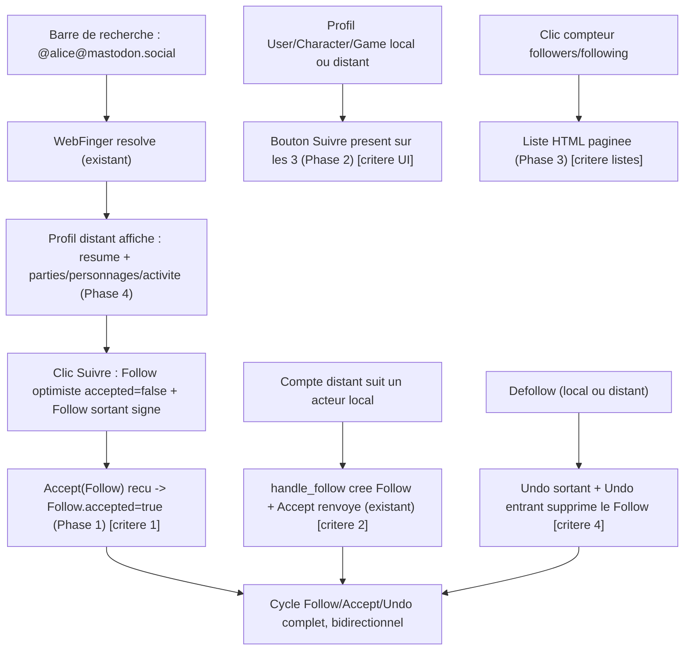

<!-- AI INSTRUCTIONS ONLY — ne pas produire ce bloc. Amendements préfixés 🤖. Log append-only. -->

# Instruction : Follow fediverse — fédération complète + UI — Épique C (#133)

## Feature

- **Summary** : Le modèle `Follow` (polymorphe User/Character/Game via `GenericForeignKey`, champs `remote`/`ap_id`) et une grande partie de l'infra existent déjà. Ce chantier **complète les coutures manquantes** pour que le cycle Follow/Accept/Undo soit fonctionnel et observable de bout en bout, et pour que l'UI couvre les 3 acteurs (locaux et distants). Il ne réécrit PAS l'existant (voir « Existant confirmé »).
- **Stack** : `Django 5.x (Python 3.12)`, `PostgreSQL`, `Celery` (fallback sync), `HTMX`, `Alpine.js`, `httpx`, `cryptography`, `pytest-django` + `respx`, `ruff`, `mypy`.
- **Branch name** : `epic-c/follow-federation` (déjà créée dans le worktree `.claude/worktrees/epic-c` — l'implémenteur committe ici, ne touche pas le working copy principal).
- **Parent Plan** : `none`
- **Sequence** : `standalone`
- Confidence : 8/10
- Time to implement : ~1,5 jour

## Décision de découpage (plan simple, pas master)

- Les 5 phases partagent le modèle `Follow` et sont **ordonnées** : la Phase 1 pose l'état de cycle de vie (`accepted` + migration) sur lequel s'appuient l'UI (Phase 2) et les listes (Phase 3). Découper en child plans indépendants ajouterait du couplage inter-fichiers sans bénéfice.
- **Décidé : plan simple.** Après la Phase 1 (frontière migration), les Phases 2-4 sont indépendamment livrables ; la Phase 5 valide l'ensemble. Le code démarre à chaque frontière.

## Existant confirmé (NE PAS re-planifier — déjà câblé et testé)

Vérifié contre le code du worktree :

- **Modèle** `characters.models.Follow` (l.605) : `follower` FK User, `content_type`+`object_id`+`target` GFK (`limit_choices_to` user/character/game), `remote`, `ap_id` (unique), `unique_together`, index. Migration `characters/0001_initial`.
- **Follow sortant** : `activitypub.tasks.send_follow_activity` (l.224) + `serializers.create_follow_activity` (l.408) — signe et livre via `sign_and_deliver`.
- **Undo sortant** : `activitypub.tasks.send_undo_follow_activity` (l.250) + `serializers.create_undo_follow_activity` (l.428) — supprime le `Follow` local après livraison.
- **Follow entrant** : `inbox.handle_follow` (l.215) — crée le `Follow`, renvoie un `Accept` signé (couvre le **critère 2**).
- **Undo(Follow) entrant** : `inbox.handle_undo` (l.265) — supprime le `Follow` (couvre une moitié du **critère 4**).
- **Recherche WebFinger** : `federation_views.federated_search` (l.22) + `_lookup_webfinger` (l.176) — résout `@user@instance` / URL / recherche locale, via `fetch_ap_json` SSRF-safe.
- **Profil distant + toggle** : `federation_views.remote_profile` (l.52), `remote_follow_toggle` (l.111) — crée un `Follow` optimiste + enqueue `send_follow_activity` ; template `federation/remote_profile.html`, composant `components/remote_follow_button.html`.
- **Toggle local (polymorphe)** : `characters.follow_views.follow_toggle` (l.19) — user/game/character via `actor_model_for` ; route `characters:follow_toggle` ; composant `components/follow_button.html`.
- **Boutons follow câblés** : `templates/users/profile.html` (l.43, user), `templates/games/detail.html` (l.48, game). Contexte `is_following` fourni par `users/views.py` (l.69-77) et `games/front_views.py` (l.251-267).
- **Collection AP followers (User)** : `views.user_followers` (l.243), route `activitypub:user-followers`.
- **Import/export follows CSV** : `users/settings_views` (`export_follows_csv`/`import_follows_csv`), `users/tasks.py`.
- **fediverse_auth** = « Sign in with Mastodon » (OAuth login), **hors périmètre** — ne pas confondre avec la recherche-pour-suivre.

## Manques identifiés (le périmètre réel de #133)

1. **Accept(Follow) / Reject(Follow) entrants non traités** : `inbox.handle_accept` (l.965) et `handle_reject` (l.984) ne gèrent QUE les `Offer`/`LinkRequest` (via `_resolve_authorized_link_request`). Un `Accept` renvoyé par le serveur distant pour NOTRE Follow sortant est silencieusement ignoré → le **critère 1 (« Accept reçu »)** n'est pas observable. Le `Follow` sortant est créé de façon optimiste sans état de confirmation.
2. **Pas d'état de cycle de vie sur `Follow`** : aucun champ `accepted`/pending → impossible de distinguer « demande en attente » d'un follow confirmé, ni de matérialiser l'Accept reçu.
3. **Character sans bouton follow** : `templates/characters/detail.html` n'inclut pas `follow_button` ; `characters.front_views.character_detail` (l.194) ne fournit pas `is_following`. Le **critère UI** exige User/Character/Game.
4. **Follow distant limité à User** : `remote_follow_toggle` ne cible que `UserModel` ; suivre un Character/Game distant (instance Suddenly) n'est pas supporté.
5. **Collection AP `following` absente** : le document acteur annonce `{actor_url}/following` (`serializers.py` l.132) mais aucune vue ne la sert → 404 pour un crawler distant. Idem followers/following pour Character/Game (seul User a `followers`).
6. **Pas de listes HTML followers/following** : `profile.html` n'affiche que des **compteurs** (l.58-63), non cliquables. Le **critère « Listes followers/following sur le profil »** n'est pas rempli.
7. **Profil distant non enrichi** : `remote_profile.html` n'affiche que nom/résumé de l'acteur ; il ne récupère pas l'outbox/les collections pour montrer **parties/personnages/activité** (**critère 3**).

## Décisions de conception (prises, conservatrices)

- **DEC-C1 — Ajouter `Follow.accepted` (BooleanField, default=True)** : local + entrant auto-accepté → `True` ; Follow **sortant vers un distant** créé avec `accepted=False` (pending), passé à `True` à réception de l'`Accept(Follow)`. Justification : sans état, « Accept reçu » (critère 1) n'est ni vérifiable ni affichable ; c'est la sémantique AP standard (Mastodon affiche « en attente » jusqu'à l'Accept). Coût : 1 migration additive non destructive.
- **DEC-C2 — Corrélation de l'Accept(Follow)** : matcher notre `Follow` optimiste par l'`ap_id` du Follow (`object.id` de l'activité Follow ré-embarquée dans l'Accept) ; fallback sur `(actor distant, object == notre actor_url)`. Aucune authz lourde de type DEC-038 : un Accept(Follow) ne fabrique aucune ressource, il ne fait que confirmer un Follow déjà émis par nous et adressé à ce distant.
- **DEC-C3 — Reject(Follow) entrant** : supprimer le `Follow` optimiste (le distant refuse). Notifier le follower (best-effort).
- **DEC-C4 — Follow distant Character/Game réservé aux instances Suddenly** : un acteur Mastodon/BookWyrm n'expose que `Person`. Pour un Character/Game distant (Suddenly), généraliser `remote_follow_toggle`. Non-Suddenly → seul `Person` suivable (comportement actuel préservé).
- **DEC-C5 — Enrichissement profil distant tolérant** : pour un distant Suddenly, fetch outbox/collections (SSRF-safe `fetch_ap_json`) → sections parties/personnages/activité ; pour non-Suddenly, afficher résumé + activité récente si disponible, **rien de Suddenly-spécifique** (conforme au brief). Toute erreur de fetch dégrade en profil minimal, jamais de 500.

## Architecture projection

### Files to modify

- `suddenly/characters/models.py` — ajouter `Follow.accepted = BooleanField(default=True, db_index=True)` (aucune logique métier dans le modèle).
- `suddenly/activitypub/inbox.py` — `handle_accept`/`handle_reject` : router selon le type de l'objet interne ; si `object` (ou `object.type`) est un `Follow` → `_handle_accept_follow` / `_handle_reject_follow` (nouveaux helpers) ; sinon conserver le chemin `LinkRequest` existant inchangé.
- `suddenly/activitypub/federation_views.py` — `remote_follow_toggle` : résoudre le type d'acteur distant (Person/Group + `suddenly:*`) et créer un `Follow` polymorphe (DEC-C4) ; créer le Follow sortant avec `accepted=False`. `remote_profile` : appeler l'enrichissement (DEC-C5).
- `suddenly/characters/front_views.py` — `character_detail` : ajouter `is_following` au contexte (scoped `request.user`, `getattr(request,'htmx',False)` non requis ici).
- `suddenly/activitypub/views.py` — ajouter `user_following` (+ `game_followers`/`game_following`, `character_followers`/`character_following` selon Phase 3) ; `totalItems` sur le queryset de base, `select_related('follower')`.
- `suddenly/activitypub/urls.py` — routes `users/<username>/following` (+ collections game/character).
- `suddenly/characters/follow_views.py` — passer le garde méthode à `@require_POST` (avant `@login_required`) conformément à `03-htmx-patterns.md` (mutation d'état).
- `suddenly/users/views.py` — vues listes `followers`/`following` (HTML paginé, sentinel infinite-scroll) alimentant les compteurs cliquables.
- `suddenly/users/urls.py` — routes `<username>/followers/` et `<username>/following/`.
- `templates/characters/detail.html` — inclure `components/follow_button.html` (target_type="character") gardé sur `user != creator/owner`.
- `templates/users/profile.html` — rendre les compteurs followers/following cliquables (liens vers les listes).
- `templates/federation/remote_profile.html` — sections parties/personnages/activité (états vides/erreur gracieux).

### Files to create

- `suddenly/characters/migrations/00NN_follow_accepted.py` — `AddField` `Follow.accepted` (généré par `makemigrations characters`).
- `suddenly/activitypub/follow_federation.py` **(optionnel)** — helpers d'enrichissement du profil distant (`fetch_remote_actor_collections`) si `federation_views` devient trop dense ; sinon inline. Décision laissée à l'implémenteur (règle Rule-of-Three).
- `templates/users/followers_list.html` + `templates/users/_followers_page.html` — liste + partial paginé (sentinel HTMX).
- `templates/users/following_list.html` + `templates/users/_following_page.html` — idem.
- `templates/federation/_remote_profile_sections.html` — partial parties/personnages/activité distants.
- `tests/activitypub/test_follow_federation.py` — round-trips fédération (critères 1,2,4).
- `tests/activitypub/test_follow_ui.py` — boutons + listes + profil distant (critères UI + 3).

### Files to delete

- Aucun.

## Applicable rules

| Tool   | Name | Path | Why it applies |
| ------ | ---- | ---- | -------------- |
| claude | ap-pivots-django-activitypub | `.claude/rules/07-quality/ap-pivots-django-activitypub.md` | Idempotence inbox (`ProcessedActivity`), Accept/Reject AS2, livraison via Celery, SSRF sur fetch collections distantes |
| claude | activitypub (domain) | `.claude/rules/08-domain/08-activitypub.md` | WebFinger, `fetch_ap_json` unique point d'entrée, détection Suddenly via NodeInfo, `URLField(max_length=500)`, ne pas envoyer d'activités Suddenly-only à un non-Suddenly |
| claude | htmx-patterns | `.claude/rules/03-frameworks-and-libraries/03-htmx-patterns.md` | `@require_POST` sur mutations follow, `getattr(request,'htmx',False)`, `` namespacé, sentinel infinite-scroll pour les listes |
| claude | django-models | `.claude/rules/03-frameworks-and-libraries/03-django-models.md` | `Follow.accepted` via migration, aucune logique en modèle, `on_delete` explicite, `Meta.indexes` |
| claude | django-services | `.claude/rules/03-frameworks-and-libraries/03-django-services.md` | Logique de confirmation/annulation Follow hors des vues ; services testables ; `transaction.atomic` sur mutations multi-étapes |
| claude | data-pivots-django-orm | `.claude/rules/07-quality/data-pivots-django-orm.md` | `select_related('follower')`/pagination sur les collections + listes ; `assertNumQueries` sur les listes |
| claude | perf-pivots-celery | `.claude/rules/07-quality/perf-pivots-celery.md` | `send_follow_activity`/`send_undo_follow_activity` : IDs (pas d'objets), idempotence, fallback sync |
| claude | i18n-patterns | `.claude/rules/08-domain/08-i18n-patterns.md` | Chaînes UI FR via `` ; recompilation `.po`/`.mo` dans `make check` |
| claude | display-vocabulary | `.claude/rules/08-domain/08-display-vocabulary.md` | UI : « scène » (Report), « post » (Rapport) — jamais « report » en libellé |
| claude | file-language-and-style | `.claude/rules/01-standards/file-language-and-style.md` | Ce plan (`aidd_docs/tasks/**`) human-consumed → français ; symboles/chemins verbatim |

## User Journey

## Risk register

| Risk | Impact | Mitigation |
| ---- | ------ | ---------- |
| `handle_accept` route à tort un Accept(Follow) vers le chemin `LinkRequest` (ou l'inverse) | Accept ignoré / crash | Discriminer sur le type de l'objet interne (`Follow` vs `suddenly:Claim/Adopt/Fork`) **avant** `_resolve_authorized_link_request` ; tests des deux formes |
| Corrélation de l'Accept(Follow) au mauvais `Follow` | Mauvais follow confirmé | Matcher par `ap_id` (DEC-C2) ; fallback `(actor, object=our actor_url)` ; unicité `ap_id` déjà garantie par le modèle |
| Migration `Follow.accepted` avec des rows existantes | Follows historiques marqués pending | `default=True` → toutes les rows existantes = accepted ; seul le nouveau chemin sortant écrit `False` |
| Follow distant Character/Game sur instance non-Suddenly | 404/actor non typé | DEC-C4 : ne créer un Follow Character/Game que si l'acteur distant est un `Group`/`Person` Suddenly ; sinon Person only |
| Collection `following` annoncée mais absente → crawler distant en 404 | Non-conformité AP | Phase 3 ajoute la vue `user_following` (et game/character) alignée sur les IRIs annoncées par le serializer |
| Fetch outbox/collections distantes lent ou hostile | TTFB profil distant / SSRF | Tout fetch via `fetch_ap_json` (IP-pin, no-redirect) ; timeouts ; dégradation en profil minimal (DEC-C5) ; jamais dans une boucle non bornée |
| Listes followers/following non paginées | N+1 / page lourde | `select_related('follower')` + pagination + sentinel infinite-scroll (`03-htmx-patterns.md`) ; `assertNumQueries` |
| Couverture < 80 % après ajout de code | `make check` rouge | Tests fédération + UI appariés au code ; `respx` pour les distants |
| `@require_POST` déplacé casse les tests existants du toggle local | Régression | Vérifier `tests/` du toggle ; le garde méthode manuel actuel est équivalent, remplacer proprement |

## Implementation phases

### Phase 1 : Cycle de vie du Follow + Accept/Reject(Follow) entrants

> Rendre l'Accept reçu observable (critère 1) et le Reject géré ; poser l'état `accepted`. Après cette phase, un Follow sortant reste `pending` jusqu'à l'Accept.

#### Tasks

1. `characters/models.py` : ajouter `Follow.accepted = models.BooleanField(default=True, db_index=True)` → `python manage.py makemigrations characters` (AddField) puis `migrate`.
2. `federation_views.remote_follow_toggle` : créer le `Follow` sortant avec `accepted=False` (branche création) ; inchangé pour l'Undo.
3. `inbox.py` : dans `handle_accept`, discriminer l'objet interne — si c'est un `Follow` (dict `type=="Follow"` ou string ap_id d'un Follow connu) → `_handle_accept_follow(activity)` ; sinon le chemin `LinkRequest` existant. Idem `handle_reject` → `_handle_reject_follow`.
4. `inbox.py` : `_handle_accept_follow` — résoudre notre `Follow` par `ap_id` (DEC-C2), `Follow.objects.filter(ap_id=..., accepted=False).update(accepted=True)` ; best-effort notification `NEW_FOLLOWER`/confirmation si applicable.
5. `inbox.py` : `_handle_reject_follow` — supprimer le `Follow` optimiste correspondant (DEC-C3) ; log.
6. Déplacer la logique de confirmation/annulation dans `characters/services.py` (ou `activitypub` service) si elle dépasse quelques lignes (django-services) ; vues/handlers restent minces.
7. Vérifier que `handle_follow` (entrant) crée le `Follow` avec `accepted=True` et émet la notification `NEW_FOLLOWER` (l'ajouter si absente).

#### Acceptance criteria

- [x] `python manage.py makemigrations --check --dry-run` : aucune migration manquante après commit.
- [x] Un `Accept` entrant enveloppant un `Follow` (matché par `ap_id`) passe le `Follow` local de `accepted=False` à `True`.
- [x] Un `Reject` entrant enveloppant un `Follow` supprime le `Follow` optimiste.
- [x] Un `Accept` d'`Offer` (Claim/Adopt/Fork) suit toujours le chemin `LinkRequest` inchangé (non-régression DEC-038).

### Phase 2 : Boutons follow sur les 3 acteurs (locaux ET distants)

> Compléter la couverture UI : Character (manquant) + follow distant Character/Game (Suddenly).

#### Tasks

1. `characters/front_views.character_detail` : ajouter `is_following` au contexte (`Follow.objects.filter(follower=request.user, content_type=<character CT>, object_id=character.pk).exists()`, seulement si authentifié).
2. `templates/characters/detail.html` : inclure `components/follow_button.html` avec `target=character target_type="character" is_following=is_following`, gardé pour ne pas s'auto-suivre (créateur/owner).
3. `characters/follow_views.follow_toggle` : passer à `@require_POST` (avant `@login_required`), retirer le garde méthode manuel (équivalent) — conforme `03-htmx-patterns.md`.
4. `federation_views.remote_follow_toggle` : généraliser au-delà de User (DEC-C4) — détecter le type d'acteur distant (`Person`→User, `Group`+Suddenly→Game, `Person`+`suddenly:*`→Character) et créer un `Follow` polymorphe ; non-Suddenly → Person only.
5. `components/remote_follow_button.html` : porter le type d'acteur (data-attrs échappés `|escapejs` si injectés en JS) ; cohérence visuelle avec `follow_button.html`.

#### Acceptance criteria

- [ ] Le profil d'un Character local affiche un bouton Suivre/Ne plus suivre fonctionnel (toggle HTMX, pas d'auto-follow).
- [ ] Les 3 profils locaux (User/Character/Game) exposent un bouton follow ; les mutations sont en POST (`@require_POST`).
- [ ] Suivre un Character/Game distant Suddenly crée un `Follow` polymorphe ; un acteur Mastodon reste Person-only (pas de 500).

### Phase 3 : Collections followers/following (AP) + listes HTML

> Rendre les compteurs cliquables et servir les collections AP annoncées.

#### Tasks

1. `activitypub/views.py` : ajouter `user_following` (`OrderedCollection`, `totalItems` sur queryset de base, `select_related('follower')`) ; aligner sur l'IRI `{actor_url}/following` annoncée par le serializer. Ajouter game/character followers+following si le document acteur les annonce (éviter les 404).
2. `activitypub/urls.py` : routes correspondantes (namespacées).
3. `users/views.py` : vues `followers_list`/`following_list` (HTML paginé, `getattr(request,'htmx',False)` pour servir le partial en scroll) ; `select_related('follower')`.
4. `users/urls.py` : routes `<username>/followers/` et `<username>/following/`.
5. Templates : `followers_list.html`+`_followers_page.html`, `following_list.html`+`_following_page.html` (sentinel infinite-scroll `hx-trigger="revealed"` `hx-swap="outerHTML"`).
6. `templates/users/profile.html` : rendre les compteurs (l.58-63) cliquables → liens vers les listes.

#### Acceptance criteria

- [ ] `GET {user actor}/following` renvoie un `OrderedCollection` conforme (pas de 404) ; `totalItems` = total réel.
- [ ] Les compteurs followers/following du profil sont cliquables et ouvrent une liste HTML paginée.
- [ ] `assertNumQueries` borne les listes (pas de N+1 sur `follower`).

### Phase 4 : Enrichissement du profil distant (parties/personnages/activité)

> Couvrir le critère 3 : afficher ce qui est disponible pour un compte distant.

#### Tasks

1. `federation_views.remote_profile` (ou helper `fetch_remote_actor_collections`) : pour un acteur Suddenly (détecté NodeInfo/`suddenly:*`), fetch outbox + collections via `fetch_ap_json` (SSRF-safe) ; extraire parties (Group), personnages (Person+`suddenly:*`), activité récente (Articles/Notes).
2. Non-Suddenly (Mastodon) : afficher résumé + activité récente (outbox notes) si accessible ; aucune section Suddenly-spécifique.
3. `templates/federation/remote_profile.html` + `_remote_profile_sections.html` : sections avec états vides/erreur ; jamais de 500 sur fetch en échec (DEC-C5).
4. Borne dure sur le nombre d'items fetchés/affichés (pagination distante non suivie au-delà de la 1re page au MVP).

#### Acceptance criteria

- [ ] Le profil d'un compte distant Suddenly affiche parties/personnages/activité disponibles.
- [ ] Le profil d'un compte Mastodon affiche résumé + activité récente sans section Suddenly ni erreur.
- [ ] Un fetch distant en échec dégrade en profil minimal (pas de 500).

### Phase 5 : Tests, i18n, `make check`

> Prouver les 4 critères d'acceptation et la santé CI.

#### Tasks

1. `tests/activitypub/test_follow_federation.py` (`respx` pour mocker le distant, `CELERY_TASK_ALWAYS_EAGER`) :
   - Follow sortant enqueue une livraison signée **puis** un `Accept(Follow)` entrant passe le `Follow` à `accepted=True` (**critère 1**).
   - `Follow` entrant → `Follow` créé + `Accept` livré (**critère 2**).
   - `Undo(Follow)` sortant supprime le `Follow` ; `Undo(Follow)` entrant supprime le `Follow` (**critère 4**).
   - Non-régression : `Accept(Offer)` suit le chemin `LinkRequest`.
2. `tests/activitypub/test_follow_ui.py` :
   - Bouton follow présent + toggle sur User/Character/Game (local + distant Suddenly) ; mutations en POST.
   - Listes followers/following rendues et paginées ; compteurs cliquables.
   - Profil distant : sections parties/personnages/activité (Suddenly) ; minimal gracieux (Mastodon) (**critère 3**).
3. i18n : `makemessages` + `compilemessages` pour les nouvelles chaînes FR ; committer `.mo`.
4. `make check` (ruff + mypy strict + pytest/coverage ≥ 80 + i18n) ; corriger jusqu'au vert.
5. Vérifier le `success_condition` de bout en bout.

#### Acceptance criteria

- [ ] `make check` passe (lint + typecheck + test/coverage ≥ 80 + i18n).
- [ ] `pytest tests/activitypub/test_follow_federation.py tests/activitypub/test_follow_ui.py -q` sort en 0.
- [ ] Les 4 critères #133 sont couverts par au moins un test nommé.

## Amendments

<!-- 🤖 entrées pendant l'implémentation -->

🤖 Phase 1, Task 6 (règle DRY) : la logique de confirmation/annulation (`_handle_accept_follow`/`_handle_reject_follow`) reste dans `inbox.py`, pas déplacée vers `characters/services.py`. Chaque helper n'a qu'un seul appelant réel (`handle_accept`/`handle_reject` respectivement) — la règle des trois occurrences (`dry-refactor.md`) ne s'applique pas. La duplication d'extraction/résolution entre les deux helpers a quand même été factorisée dans `_follow_ap_id_from_activity`/`_resolve_outbound_follow` (2 appelants, bloc substantiel), par prudence DRY locale au fichier.

🤖 Phase 1, Task 4 (DEC-C2, fallback) : le plan dit « fallback `(actor, object=our actor_url)` » — formulation ambiguë (une chaîne littérale à comparer n'a pas de sens ici, puisque `object` porte l'id du `Follow` distant, pas notre `actor_url`). Interprété et implémenté comme : si l'`ap_id` du `Follow` ne matche rien, résoudre l'expéditeur de l'Accept/Reject (`activity["actor"]`) vers un `User` distant connu, puis matcher notre `Follow` sortant (`remote=False`) pointant vers ce `User`. Couvre le cas d'un pair qui renvoie un `object` ne portant pas l'id exact de notre `Follow`.

🤖 Phase 1, Task 7 : le signal `notify_on_follow` (`suddenly/core/notification_signals.py`, `post_save` sur `characters.Follow`) existait déjà et couvre intégralement ce critère (notification `NEW_FOLLOWER` sur tout nouveau `Follow` ciblant un `User`) — aucun code ajouté.

## Log

<!-- APPEND ONLY -->

🤖 2026-07-19 — Phase 1, critère 1 : `Follow.accepted = BooleanField(default=True, db_index=True)` ajouté (`characters/models.py`) + migration `0019_follow_accepted` (AddField, additive). `makemigrations --check --dry-run` confirmé propre.

🤖 2026-07-19 — Phase 1, critère 2 : `remote_follow_toggle` crée le `Follow` sortant avec `accepted=False` (`federation_views.py`) ; `handle_accept` discrimine Follow vs Offer (`_follow_ap_id_from_activity`, `_resolve_outbound_follow`, `_handle_accept_follow`) sans toucher au chemin `LinkRequest`. Tests : `tests/activitypub/test_follow_federation.py::TestAcceptFollow` (4 tests — dict/string object, fallback par actor, aucun match).

🤖 2026-07-19 — Phase 1, critère 3 : `handle_reject` discrimine Follow vs Offer (même logique que `handle_accept`, DEC-C2/C3) et route vers `_handle_reject_follow`, qui supprime le `Follow` optimiste sortant correspondant. Tests : `tests/activitypub/test_follow_federation.py::TestRejectFollow` (2 tests — dict/string object).

🤖 2026-07-19 — Phase 1 complète (critère 4) : `TestAcceptOfferNonRegression` prouve qu'un `Accept(Offer)` (Claim/Adopt/Fork) suit toujours `LinkService.reconstruct_remote_accept` via `_resolve_authorized_link_request`, y compris en présence d'un `Follow` sortant non lié (pas de faux-positif sur un `object` bare-string). Phase 1 terminée : `Follow.accepted` (migration `0019_follow_accepted`), `remote_follow_toggle` crée le `Follow` sortant avec `accepted=False`, `handle_accept`/`handle_reject` discriminent Follow vs Offer sans régression du chemin `LinkRequest` (DEC-038). Tests : `tests/activitypub/test_follow_federation.py` (8 tests, 3 classes) — couvre les 4 critères d'acceptation. `make check` cible `suddenly/` uniquement pour mypy (`tests/` hors périmètre, cohérent avec les fichiers de test existants du repo).

## Validation flow demonstration

1. `python manage.py migrate` puis `python manage.py check` — `Follow.accepted` en place, aucune migration manquante.
2. Rechercher `@alice@mastodon.social` → profil distant enrichi ; cliquer Suivre → `Follow` `accepted=False` + livraison signée ; injecter un `Accept(Follow)` → `Follow.accepted=True` (critère 1).
3. Injecter un `Follow` entrant vers un acteur local → `Follow` créé + `Accept` livré (critère 2).
4. Ouvrir un profil Character local → bouton Suivre fonctionnel ; idem User/Game (critère UI).
5. Cliquer le compteur followers → liste HTML paginée (critère listes).
6. Défollow local et distant → `Undo` propagé ; `Undo` entrant supprime le `Follow` (critère 4).
7. `make check && pytest tests/activitypub/test_follow_federation.py tests/activitypub/test_follow_ui.py -q` → sort en 0.

## Évaluation de confiance : 8/10

Raisons (✓)
- Existant vérifié ligne à ligne : modèle `Follow`, Follow/Undo sortants, Follow/Undo entrants, WebFinger, profil distant, toggle local polymorphe, collection followers User, import/export CSV — non re-planifiés.
- Manques isolés précisément (Accept/Reject Follow entrants, état `accepted`, bouton Character, follow distant Character/Game, collection `following`, listes HTML, enrichissement profil distant) et mappés aux 4 critères.
- Phases ordonnées autour de l'unique frontière migration (Phase 1) ; `success_condition` exécutable prouvant `make check` + les 4 critères via tests nommés.

Risques (✗)
- Discrimination Accept(Follow) vs Accept(Offer) dans un `handle_accept` partagé : à tester des deux côtés (mitigé par tests dédiés + non-régression DEC-038).
- Enrichissement du profil distant dépend de la forme réelle des outbox distantes (Mastodon vs Suddenly) : tolérance/bornage requis (DEC-C5).
- Généralisation du follow distant Character/Game : dépend de la détection Suddenly (NodeInfo/`suddenly:*`) — Person-only en fallback sûr.
