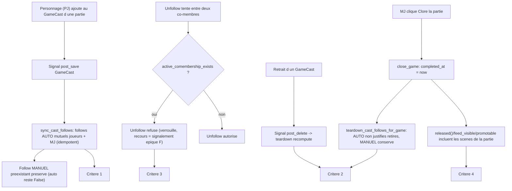

<!-- AI INSTRUCTIONS ONLY — ne pas produire ce bloc. Amendements préfixés 🤖. Log append-only. -->

# Instruction : Auto-follow du cast + clôture de partie — Épique D (#134)

## Feature

- **Summary** : Rendre le cast d'une partie socialement cohérent. Dès qu'un personnage entre au **`GameCast`** d'une partie, son propriétaire (joueur) et tous les autres joueurs du cast, plus le **MJ (`game.owner`)**, deviennent **followers mutuels** — via des `Follow` marqués **AUTO**. Ces follows AUTO sont **verrouillés** (pas d'unfollow entre co-membres tant que la partie est active ; recours = signalement, épique F) et **retirés** quand ils ne sont plus justifiés : retrait du cast ou **clôture de la partie**. Un follow **MANUEL** (créé par le bouton suivre) **survit** à tout cela. Nouveau : `Game.completed_at` (la partie n'a aujourd'hui que `is_public`), posé par une action MJ « clore la partie ». Une fois posé, **toutes les scènes de la partie sont réputées libérées** — évolution du filtre unique `ReportQuerySet.released()` (point d'extension SUD-V1).
- **Stack** : `Django 5.0 (Python 3.12)`, `PostgreSQL`, `Celery` (fallback sync `_safe_delay`), `HTMX`, `Alpine.js`, `pytest-django`, `ruff`, `mypy` strict.
- **Branch name** : `epic-d/auto-follow-completed` (worktree `.claude/worktrees/epic-d` — l'implémenteur committe ici, base `main` + Épique C mergée, HEAD `77f21a9`. Ne pas toucher la copie de travail principale ni les autres worktrees).
- **Parent Plan** : `none`
- **Sequence** : `standalone`
- Confidence : 7/10
- Time to implement : ~1 à 1,5 jour

## Hypothèses de dépendance (NE PAS re-planifier)

- **Épique C (#133) follow-federation = mergée** (HEAD `77f21a9`). Le modèle `Follow` (`characters/models.py` l.605) est polymorphe (GFK User/Character/Game), possède `remote`, `ap_id`, et **`accepted` BooleanField db_index** (migration `characters/0019_follow_accepted.py`). `unique_together = (follower, content_type, object_id)`. La fédération du follow (`activitypub/signals.follow_post_save` l.121, **n'émet un `Follow` AP que si la cible est `remote`**) est **acquise** — ne pas la re-planifier. L'Épique D **ajoute un attribut** au `Follow` et une logique de synchronisation cast↔follow, rien de la fédération de base.

## Existant vérifié (NE PAS re-planifier — lu ligne à ligne)

- **`GameCast`** (`games/models.py` l.353) : `game` FK, `character` FK (`related_name="castings"`), `added_by` FK User nullable, `unique_together (game, character)`. Déclare qu'un personnage est *disponible* dans une partie.
- **Points de création d'un `GameCast`** (le déclencheur du ticket) :
  - `games/services.py::add_to_cast` (l.346) — `get_or_create` idempotent, appelé depuis `open_new_scene` (l.558/560, protagoniste + actor distinct).
  - `games/services.py::create_npc_in_cast` (l.373) — `GameCast.objects.create` (nouveau PNJ, `owner=None`).
  - `core/management/commands/seed_demo.py` l.561, `admin.py`.
  - → **Il n'existe pas UN choke point applicatif unique.** Le seul point de convergence de TOUTE création est un **signal `post_save` sur `GameCast`** (DEC-D2).
- **`cast_add` / `cast_remove`** (`games/report_views.py` l.450 / l.493) opèrent sur **`ReportCast`** (cast de scène, US-13), **PAS** sur `GameCast`. La référence du ticket « `cast_remove` — games/front_views.py:777 » est **périmée** : `front_views.py` fait 94 lignes (shim de ré-export) et `cast_remove` vit dans `report_views.py` sur `ReportCast`. Le déclencheur et la fin d'auto-follow portent sur **`GameCast`**, jamais `ReportCast` (cf. DEC-D2, ambiguïté #134 tranchée).
- **`Game`** (`games/models.py` l.14) : n'a que `is_public` comme axe de visibilité ; pas de `completed_at`. `owner` FK User = le MJ (`is_game_master`, `services.py` l.109 : `game.owner_id == user.pk`).
- **`ReportQuerySet.released()`** (`games/models.py` l.94-102) : `released_at__isnull=False` ∧ `status=PUBLISHED` ∧ `visibility=PUBLIC`. **Docstring SUD-V1** : « If liberation ever moves to the Game level, only this method changes. » ⇒ `completed_at` **EST** exactement cette montée au niveau Game — extension prévue.
- **Duplication du « mur » (rule-of-three)** : le test `released_at__isnull=False` est **répliqué** à 3 endroits :
  - `ReportQuerySet.released()` (`games/models.py` l.98) — critère #4 explicite.
  - `ReportQuerySet.feed_visible()` (`games/models.py` l.113-116) — `Q(remote=True) | Q(released_at__isnull=False)`.
  - `QuoteQuerySet.promotable()` (`characters/models.py` l.196-201) — `report__released_at__isnull=False`.
  - → cohérence requise (DEC-D6) : une partie close doit libérer scènes **et** citations **et** feed, sinon incohérence latente.
- **Follow — points de création/suppression** : `characters/follow_views.py::follow_toggle` (l.22, HTMX POST, `existing.delete()` = unfollow) ; `characters/views.py` l.377 ; `activitypub/inbox.py` l.246 ; `federation_views.py` l.229 (`accepted=False`). Le **verrou d'unfollow** (critère #3) se pose dans **`follow_toggle`** avant `existing.delete()`.
- **Signal fédération follow** (`activitypub/signals.py::follow_post_save` l.121) : **n'émet un `Follow` AP que si `target.remote`**. Deux joueurs **locaux** d'un même cast → auto-follows purement locaux, **aucune activité fédérée émise** (pas de bruit). Il n'existe **aucun** `post_delete` sur `Follow` émettant un `Undo(Follow)` : supprimer un auto-follow local ne fédère rien (voir Risk register pour le cas remote).
- **Règle signaux** (`.claude/rules/03-frameworks-and-libraries/03-django-signals.md`) : connecter en `AppConfig.ready()` avec `dispatch_uid` unique, imports lazy, effets fédération via `transaction.on_commit`.

## Manques identifiés (le périmètre réel de #134)

1. Aucun moyen de **distinguer** un follow AUTO d'un follow MANUEL. (→ DEC-D1, Phase 1)
2. Aucune **synchronisation cast → follows** à l'ajout d'un `GameCast`. (→ DEC-D2/D3, Phase 2)
3. Aucun **retrait ciblé** des follows AUTO au retrait du cast / à la clôture, **préservant les MANUELS**. (→ DEC-D4, Phase 2)
4. Aucun **verrou d'unfollow** entre co-membres d'un cast actif. (→ DEC-D5, Phase 3)
5. Aucun `Game.completed_at`, aucune **action MJ de clôture**. (→ DEC-D7, Phase 1/3)
6. `released()` (et ses jumeaux) **ignore** la clôture de partie. (→ DEC-D6, Phase 3)

## Décisions de conception (DEC-Dx — prises, conservatrices, justifiées)

### DEC-D1 — Marquer un follow AUTO : **champ booléen `auto` sur `Follow`** (pas de table de liaison)
- **Décision** : ajouter `Follow.auto = models.BooleanField(default=False, db_index=True)`. Migration `characters/0020_follow_auto.py` (`AddField`, additif, `default=False` ⇒ tous les follows historiques restent MANUELS — comportement voulu).
- **Justification** :
  - Un booléen suffit car la **justification d'un follow AUTO est recalculée depuis l'état courant** du `GameCast` au moment du teardown (DEC-D4), **jamais** stockée. On n'a donc **pas** besoin de mémoriser *quelle* partie a créé le follow → pas de table de liaison `AutoFollow(follow, game)`.
  - `db_index=True` : le teardown et le verrou filtrent par `auto=True`.
  - Le `Follow` est déjà polymorphe et sans logique métier (règle `django-models`) ; un champ additif ne casse ni la fédération, ni `unique_together`, ni les 40+ sites consommateurs de `Follow.objects` (tous restent valides, `auto` optionnel).
- **Rejeté** : table de liaison `AutoFollow(follow FK, game FK)` traçant l'origine — plus lourde, impose de la maintenir à chaque mutation de cast, et **inutile** puisque la justification est dérivable de l'état (`GameCast` + `completed_at`). On préfère un modèle *stateless-justifié* : la vérité vit dans le cast, pas dans une trace figée.

### DEC-D2 — Déclencheur = **signal `post_save`/`post_delete` sur `GameCast`** (pas un appel dans `add_to_cast`)
- **Décision** : brancher deux receivers dans un nouveau module `suddenly/games/signals.py`, connectés en `GamesConfig.ready()` (`games/apps.py`) avec `dispatch_uid` (`games.cast_follow_sync`, `games.cast_follow_teardown`), imports lazy :
  - `post_save(GameCast)` `created=True` → `sync_cast_follows(game)`.
  - `post_delete(GameCast)` → `teardown_cast_follows_for_game(game)` (recompute, DEC-D4).
- **Justification** : `GameCast` naît via **≥3 chemins** (`add_to_cast`, `create_npc_in_cast`, `seed`/`admin`) ; le signal est le **seul point de convergence** garantissant l'idempotence et zéro oubli (règle `dry-refactor`, rule-of-three). Un appel inline dans `add_to_cast` raterait `create_npc_in_cast` et l'admin.
- **Portée** : la logique **pure** (calcul des paires, création/suppression des `Follow`) vit dans un module dédié `suddenly/games/cast_follow.py` (fonctions testables sans signal) ; les receivers de `signals.py` ne font qu'appeler ces fonctions. Les créations de `Follow` sont des écritures DB ; la fédération éventuelle est laissée au `follow_post_save` existant (remote-only). Respecter `transaction.on_commit` seulement si un effet réseau est ajouté (ici : aucun).

### DEC-D3 — Qui suit qui : **User↔User** entre **joueurs** (propriétaires des PJ) **et le MJ**
- **Décision** : la synchronisation crée des `Follow` **`content_type=User`** (cible User), mutuels, entre tous les membres de l'ensemble :
  - `players = { c.owner for c in GameCast(game) if c.owner_id is not None }` (les personnages sans propriétaire — PNJ, `owner=None` — n'introduisent aucun joueur).
  - `members = players ∪ { game.owner }` (le MJ).
  - Pour chaque paire ordonnée distincte `(a, b)` de `members`, `a ≠ b` : `Follow.objects.get_or_create(follower=a, content_type=User_ct, object_id=b.pk, defaults={"auto": True, "accepted": True})`.
- **Idempotence & préservation du MANUEL** : `get_or_create` **ne modifie jamais** un follow existant → un follow **MANUEL** préexistant (`auto=False`) reste MANUEL (critère #2 : il survit). Seuls les follows **créés** par la sync portent `auto=True`.
- **Justification** : le ticket parle de « joueurs … followers entre eux et avec le MJ » — ce sont des **Users**. On ne suit ni les `Character` ni le `Game` ici (hors périmètre). Les PNJ (owner null) ne sont pas des joueurs.
- **Exclusion self-follow** : `unique_together` + garde `a ≠ b` (le modèle interdit déjà un follow où follower == cible User via la logique de `follow_toggle`, mais la sync doit garder `a ≠ b` explicitement).

### DEC-D4 — Retrait des follows AUTO : **recompute « co-membership active »**, jamais un delete aveugle
- **Décision** : un follow AUTO entre `a` et `b` n'est supprimé que s'**il n'existe plus aucune partie active** (`completed_at IS NULL`) où `a` et `b` sont **tous deux membres** (au sens DEC-D3 : joueur-propriétaire d'un PJ casté **ou** MJ). Fonction pivot :
  - `active_comembership_exists(a, b) -> bool` : ∃ `Game` avec `completed_at IS NULL` tel que `a ∈ members(game)` ET `b ∈ members(game)`.
  - `teardown_cast_follows_for_game(game)` : pour chaque paire d'anciens membres impactés, si `not active_comembership_exists(a, b)` et que le `Follow(a→b)` existe avec `auto=True` → le supprimer (idem `b→a`). **Ne touche jamais** `auto=False`.
- **Justification** : deux joueurs peuvent partager **plusieurs** parties actives ; retirer l'un d'un cast ne doit pas casser un auto-follow encore justifié ailleurs. Le recompute depuis l'état courant est **correct sur les recouvrements multi-parties** et **idempotent** (rejouable). C'est ce qui rend le booléen `auto` suffisant (DEC-D1).
- **Clôture** = cas particulier : poser `completed_at` rend la partie **inactive** → ses membres perdent cette co-membership ; on rappelle `teardown_cast_follows_for_game(game)` après la clôture (les follows AUTO non justifiés ailleurs tombent). Unifié avec le retrait de cast.

### DEC-D5 — Verrou d'unfollow entre co-membres d'un cast actif (critère #3)
- **Décision** : dans `follow_toggle` (`characters/follow_views.py`), **avant** `existing.delete()`, si la cible est un **User** et que `active_comembership_exists(request.user, target)` est vrai, **refuser l'unfollow** : ne pas supprimer, renvoyer le bouton dans son état « suivi » (HTMX) avec un indice visuel « verrouillé (partie en cours) » ; recours = signalement (épique F, hors périmètre). Le **follow** (toggle vers suivre) reste permis.
- **Portée** : le verrou vaut pour **tout** follow entre co-membres actifs — qu'il soit AUTO ou MANUEL — car le critère parle de « pas d'unfollow entre co-joueurs tant que la partie est active ». (Un MANUEL entre co-membres actifs est donc gelé le temps de la partie ; il **redevient** dé-suivable une fois la partie close, et n'est **pas** supprimé par le teardown puisque `auto=False`.)
- **Justification** : `follow_toggle` est le point unique d'unfollow front (`existing.delete()` l.58). Le verrou y est atomique et couvre l'UI. Réutilise le pivot `active_comembership_exists` (DRY avec DEC-D4).

### DEC-D6 — Évolution de `released()` + cohérence des jumeaux du « mur » (critère #4)
- **Décision** : une scène passe le mur si elle est libérée **OU si sa partie est close**. Introduire un **helper unique** dans `games/models.py` matérialisant la disjonction, réutilisé par les 3 sites (rule-of-three) :
  - `released()` : `... .filter(status=PUBLISHED, visibility=PUBLIC).filter(Q(released_at__isnull=False) | Q(game__completed_at__isnull=False))`.
  - `feed_visible()` : ajouter le disjoint `Q(game__completed_at__isnull=False)` au côté local — `Q(remote=True) | Q(released_at__isnull=False) | Q(game__completed_at__isnull=False)`.
  - `QuoteQuerySet.promotable()` (`characters/models.py`) : `report__released_at__isnull=False` → `Q(report__released_at__isnull=False) | Q(report__game__completed_at__isnull=False)`.
- **Forme du helper** : une fonction/constante retournant un `Q` **paramétrable par préfixe** (`""` pour Report direct, `"report__"` pour Quote), ex. `wall_open_q(prefix="") -> Q`. Localisée dans `games/models.py` (propriétaire du mur SUD-V1), importée par `characters/models.py`.
- **Justification** : le critère #4 n'exige littéralement que `released()`, mais laisser `feed_visible`/`promotable` sur l'ancien test créerait une **incohérence latente** (scène d'une partie close visible en « stories » mais absente du feed, citations non remontées). La docstring SUD-V1 promet « only this method changes » : honorer cette promesse impose un **point unique** — d'où le helper. Blast radius maîtrisé (3 filtres, tous lus).
- **Rétro-compat** : `completed_at IS NULL` par défaut ⇒ **aucune** partie existante n'est close ⇒ `released()` renvoie **exactement** l'ancien ensemble sur les données actuelles (le disjoint est vide). Additif, non régressif. Tester explicitement : sans `completed_at`, l'ensemble `released()` est inchangé.

### DEC-D7 — `Game.completed_at` + action MJ « clore la partie »
- **Décision** :
  - Modèle : `Game.completed_at = models.DateTimeField(null=True, blank=True, db_index=True)`. Migration `games` (`AddField`, additif). Aucune contrainte croisée.
  - Service : `close_game(game, user)` — garde `is_game_master(user, game)`, idempotent (si déjà clos, no-op), pose `completed_at = timezone.now()`, sauve `update_fields`, puis `teardown_cast_follows_for_game(game)` (DEC-D4). Optionnel : `reopen_game` non requis par #134 (hors périmètre — ne pas planifier de réouverture).
  - Vue : `game_close` dans `games/game_views.py` (`@require_POST` + `@login_required`, owner-only), URL `games:game_close` dans `front_urls.py` (`<uuid:pk>/close/`), bouton MJ dans `templates/games/detail.html` (au bloc actions owner, à côté de edit/delete), ``.
- **Justification** : miroir exact du pattern owner-gated existant (`game_edit`/`game_delete` dans `game_views.py`). `completed_at` symétrique de `released_at` (DateTimeField nullable, db_index). La clôture est **le** moment métier qui libère la partie (critère #4) ET déclenche le teardown (critère #2) — un seul geste.

## Ambiguïtés #134 tranchées (conservatrices)

- **« cast_remove — front_views.py:777 »** : référence périmée. Le déclencheur et la fin d'auto-follow portent sur **`GameCast`** (cast de partie), pas `ReportCast` (cast de scène). Le retrait de cast est capté par le **`post_delete(GameCast)`** (DEC-D2), indépendamment de toute UI. **Note d'implémentation** : il n'existe aujourd'hui **aucune** vue de suppression d'un `GameCast` (seule la création existe). Pour rendre le critère #2 « retrait du cast » démontrable au-delà de la clôture, l'implémenteur ajoute un **endpoint MJ minimal** de retrait d'un `GameCast` (`@require_POST`, owner-only) OU, à défaut de surface UI, le teardown reste pleinement couvert par les tests appelant `GameCast.delete()` + la clôture. Surface UI de retrait = **thin/optionnelle** (le cœur est le signal + le service).
- **Champ AUTO** : nom retenu `auto` (pas `automatic`) — plus court, cohérent avec `accepted`/`remote`.
- **Cible du follow** : User↔User uniquement (DEC-D3), pas Character ni Game.

## Architecture projection

### Files to create
- `suddenly/games/cast_follow.py` — logique pure : `members_of(game)`, `sync_cast_follows(game)`, `active_comembership_exists(a, b)`, `teardown_cast_follows_for_game(game)`. Aucune dépendance aux signaux ; testable directement.
- `suddenly/games/signals.py` — receivers `post_save`/`post_delete` sur `GameCast` (DEC-D2), imports lazy, appellent `cast_follow`.
- `suddenly/characters/migrations/0020_follow_auto.py` — `AddField Follow.auto` (`makemigrations characters`).
- `suddenly/games/migrations/00XX_game_completed_at.py` — `AddField Game.completed_at` (`makemigrations games`, numéro auto).
- `tests/games/test_cast_auto_follow.py` — critères 1 & 2 (création idempotente ; teardown préserve MANUEL ; recompute multi-parties).
- `tests/characters/test_follow_lock.py` — critère 3 (verrou d'unfollow entre co-membres actifs ; dé-suivable après clôture).
- `tests/games/test_game_completion.py` — critère 4 (`completed_at` → `released()` ; rétro-compat sans `completed_at` ; cohérence `feed_visible`/`promotable`).

### Files to modify
- `suddenly/characters/models.py` — `Follow.auto` (DEC-D1) ; `QuoteQuerySet.promotable()` importe et applique `wall_open_q("report__")` (DEC-D6).
- `suddenly/games/models.py` — `Game.completed_at` (DEC-D7) ; helper `wall_open_q(prefix="")` ; `ReportQuerySet.released()` + `feed_visible()` l'utilisent (DEC-D6).
- `suddenly/games/services.py` — `close_game(game, user)` (DEC-D7) ; réutilise `is_game_master`.
- `suddenly/games/apps.py` — `GamesConfig.ready()` connecte `signals` avec `dispatch_uid` (DEC-D2).
- `suddenly/games/game_views.py` — `game_close` (`@require_POST`, owner-only).
- `suddenly/games/front_views.py` — ré-exporter `game_close` (shim `__all__`).
- `suddenly/games/front_urls.py` — `path("<uuid:pk>/close/", front_views.game_close, name="game_close")`.
- `suddenly/characters/follow_views.py` — verrou d'unfollow dans `follow_toggle` (DEC-D5).
- `templates/games/detail.html` (surface actions owner) — bouton « Clore la partie » (``, ``, HTMX).
- `templates/components/follow_button.html` — état « verrouillé » quand co-membership active (indice visuel, DEC-D5).

### Non modifié (à surveiller)
- `activitypub/signals.py::follow_post_save` — **inchangé** : émet un `Follow` AP seulement si cible remote ; les auto-follows locaux ne fédèrent pas. Ne pas ajouter d'`Undo(Follow)` au teardown (hors périmètre MVP, cf. Risk register).
- `games/report_views.py::cast_remove` / `cast_add` — **inchangés** : ils gèrent `ReportCast`, sans rapport avec l'auto-follow (DEC-D2).

### Files to delete
- Aucun.

## Applicable rules

| Tool | Name | Path | Why it applies |
| ---- | ---- | ---- | -------------- |
| claude | 03-django-models | `.claude/rules/03-frameworks-and-libraries/03-django-models.md` | `Follow.auto` / `Game.completed_at` via migration ; `db_index` ; aucune logique métier en modèle ; helper `wall_open_q` = pur `Q`, pas de règle métier cachée |
| claude | 03-django-signals | `.claude/rules/03-frameworks-and-libraries/03-django-signals.md` | Receivers `GameCast` connectés en `ready()` avec `dispatch_uid` unique, imports lazy ; effet réseau (aucun ici) via `on_commit` si ajouté |
| claude | 03-django-services | `.claude/rules/03-frameworks-and-libraries/03-django-services.md` | `sync_cast_follows` / `teardown` / `close_game` en service (module `cast_follow.py` + `services.py`), jamais inline dans une vue/handler ; `transaction.atomic` sur la clôture |
| claude | 03-django-views | `.claude/rules/03-frameworks-and-libraries/03-django-views.md` | `game_close` owner-gated, `@login_required` ; parité avec `game_edit`/`game_delete` |
| claude | 03-htmx-patterns | `.claude/rules/03-frameworks-and-libraries/03-htmx-patterns.md` | `@require_POST` avant `@login_required` sur `game_close` et sur l'unfollow ; `getattr(request,"htmx",False)` ; `` namespacé `games:` ; `|escapejs` si injection JS |
| claude | dry-refactor | `.claude/rules/07-quality/dry-refactor.md` | Rule-of-three : `wall_open_q` factorise le test du mur (3 sites) ; `active_comembership_exists` pivote verrou + teardown |
| claude | data-pivots-django-orm | `.claude/rules/07-quality/data-pivots-django-orm.md` | Éviter N+1 dans `members_of` / recompute (`values_list`, `select_related`) ; `makemigrations`/`sqlmigrate` reviewés |
| claude | i18n-patterns | `.claude/rules/08-domain/08-i18n-patterns.md` | Chaînes UI FR (« Clore la partie », « verrouillé ») via `` ; `.po`/`.mo` recompilés en phase finale |
| claude | display-vocabulary | `.claude/rules/08-domain/08-display-vocabulary.md` | « partie » (Game), « scène » (Report) — libellés cohérents ; « clore la partie » |
| claude | file-language-and-style | `.claude/rules/01-standards/file-language-and-style.md` | Ce plan (`aidd_docs/tasks/**`) human-consumed → français ; symboles/chemins verbatim |
| claude | 05-pytest | `.claude/rules/05-testing/05-pytest.md` | Tests batchés en phase finale ; `--create-db` ; DB isolée (voir ci-dessous) |

## Convention batched tests + isolation DB (pour l'implémenteur)

- **Phases 1-3 = CODE SEUL** : aucun test écrit. Chaque phase code se clôt par un run **ciblé des tests EXISTANTS** du périmètre (`python -m pytest <scope> --create-db --no-cov -p no:cacheprovider -q`) pour prouver zéro régression — jamais d'écriture de test.
- **Phase 4** écrit toute la couverture des 4 critères d'un coup, puis i18n, puis `make check`.
- **`` / `gettext` inline = code** (fait en phases 1-3). La traduction `.po` + `compilemessages` est **différée en Phase 4**.
- **Isolation DB (impératif)** :
  - Base dédiée **`suddenly_epicd`** (à créer au moment de l'implémentation, propre au worktree epic-d).
  - `DATABASE_URL` fournie **inline dans la MÊME commande** que `pytest` (jamais exportée globalement, jamais via `make check`), ex. `DATABASE_URL=postgres://.../suddenly_epicd python -m pytest ... --create-db ...`.
  - **`--create-db` obligatoire** sur tout `pytest` : le schéma dérive entre worktrees (Follow.auto + Game.completed_at sont des migrations récentes ; `--reuse-db` casserait des tests hors périmètre).
  - **Un seul run pytest à la fois** (verrou DB partagée — cf. note mémoire projet « DB-lock »).
  - `make check` (lint + mypy + pytest/coverage + i18n) exécuté **une seule fois**, en fin de Phase 4, sur la base par défaut du worktree.

## Implementation phases

> **Rappel batched** : Phases 1-3 = CODE SEUL (run ciblé des tests EXISTANTS, aucun test écrit). Phase 4 écrit toute la couverture + i18n + `make check`. `--create-db` + `DATABASE_URL` inline (base `suddenly_epicd`) sur tout pytest.

### Phase 1 : Schéma — `Follow.auto` + `Game.completed_at` + migrations (CODE SEUL)

> Poser les deux champs additifs. Unique frontière migration de l'épique.

#### Tasks
1. `characters/models.py` : ajouter `Follow.auto = models.BooleanField(default=False, db_index=True)` (DEC-D1). Docstring courte : « AUTO = créé par la synchro cast (Épique D) ; MANUEL = default False ».
2. `games/models.py` : ajouter `Game.completed_at = models.DateTimeField(null=True, blank=True, db_index=True)` (DEC-D7). Docstring : « posé par la clôture MJ ; libère toutes les scènes (SUD-V1) ».
3. `python manage.py makemigrations characters games` → `characters/0020_follow_auto.py` + `games/00XX_game_completed_at.py` ; revoir le SQL via `sqlmigrate` ; `migrate`.

#### Acceptance criteria
- [ ] `python manage.py makemigrations --check --dry-run` : aucune migration manquante (characters 0020 + games AddField uniquement).
- [ ] `python manage.py check` passe.
- [ ] Run ciblé tests existants : `DATABASE_URL=...suddenly_epicd python -m pytest tests/characters tests/games --create-db --no-cov -p no:cacheprovider -q` (vert, aucune régression ; les défauts `False`/`NULL` ne changent aucun ensemble existant).

### Phase 2 : Synchro cast↔follow — module `cast_follow` + signaux `GameCast` (CODE SEUL)

> Le cœur : création idempotente des follows AUTO à l'entrée au cast ; teardown recompute au retrait ; pivot co-membership.

#### Tasks
1. `games/cast_follow.py` (logique pure, DEC-D2/D3/D4) :
   - `members_of(game) -> set[User]` : propriétaires (`owner_id not None`) des personnages castés ∪ `{game.owner}`.
   - `sync_cast_follows(game)` : pour chaque paire distincte de `members_of(game)`, `Follow.objects.get_or_create(follower=a, content_type=User_ct, object_id=b.pk, defaults={"auto": True, "accepted": True})` (idempotent ; ne modifie jamais un follow existant → MANUEL préservé).
   - `active_comembership_exists(a, b) -> bool` : ∃ `Game(completed_at IS NULL)` avec `a` et `b` ∈ `members_of`.
   - `teardown_cast_follows_for_game(game)` : supprime les `Follow(auto=True)` entre anciens membres **non** justifiés par une autre partie active (recompute). Ne touche jamais `auto=False`.
   - Attention N+1 (règle `data-pivots-django-orm`) : construire les ensembles via `values_list`/`select_related`.
2. `games/signals.py` : `post_save(GameCast, created)` → `sync_cast_follows(instance.game)` ; `post_delete(GameCast)` → `teardown_cast_follows_for_game(instance.game)`. Imports lazy.
3. `games/apps.py` : `GamesConfig.ready()` importe et connecte `signals` avec `dispatch_uid` (`games.cast_follow_sync`, `games.cast_follow_teardown`). Vérifier que `ready()` existe déjà (sinon l'ajouter sans écraser d'éventuelles connexions existantes).

#### Acceptance criteria
- [ ] Ajouter un `GameCast` (PJ possédé) → follows mutuels AUTO créés entre son propriétaire, les autres joueurs et le MJ ; ré-exécution idempotente (aucun doublon, `unique_together`).
- [ ] Un `GameCast` de PNJ (owner null) n'introduit aucun joueur, ne crée aucun follow le concernant.
- [ ] Supprimer un `GameCast` retire les follows AUTO **non** justifiés par une autre partie active, **préserve** tout follow MANUEL et tout AUTO encore justifié.
- [ ] Run ciblé : `DATABASE_URL=...suddenly_epicd python -m pytest tests/games tests/characters --create-db --no-cov -p no:cacheprovider -q` (vert).

### Phase 3 : Verrou d'unfollow + clôture MJ + extension `released()` (CODE SEUL)

> Rendre le verrou effectif (critère 3), la clôture opérable (critère 4 + teardown), et le mur cohérent.

#### Tasks
1. `games/models.py` : helper `wall_open_q(prefix="") -> Q` (`Q(**{f"{prefix}released_at__isnull": False}) | Q(**{f"{prefix}game__completed_at__isnull": False})`) ; `released()` et `feed_visible()` l'appliquent (DEC-D6). `characters/models.py::QuoteQuerySet.promotable()` : appliquer `wall_open_q("report__")`.
2. `games/services.py` : `close_game(game, user)` (`@transaction.atomic`, garde `is_game_master`, idempotent, pose `completed_at`, puis `teardown_cast_follows_for_game(game)`).
3. `games/game_views.py` : `game_close` (`@require_POST` + `@login_required`, owner-only, renvoie le detail ou un fragment HTMX). Ré-exporter dans `front_views.py` (`__all__`) ; ajouter la route `games:game_close` (`<uuid:pk>/close/`) dans `front_urls.py`. Bouton MJ dans `templates/games/detail.html` (``).
4. `characters/follow_views.py` : dans `follow_toggle`, avant `existing.delete()`, si cible=User et `active_comembership_exists(request.user, target)` → refuser l'unfollow, renvoyer `follow_button.html` en état « suivi + verrouillé » (DEC-D5). Adapter `components/follow_button.html` (indice « partie en cours »).
5. (Optionnel, ambiguïté #134) endpoint MJ minimal de retrait d'un `GameCast` (`@require_POST`, owner-only) si une surface UI est jugée nécessaire ; sinon le `post_delete` couvre le teardown, testé via `GameCast.delete()`.

#### Acceptance criteria
- [ ] Poser `Game.completed_at` → toutes les scènes PUBLISHED/PUBLIC de la partie passent `released()` (et `feed_visible`, `promotable`) ; sans `completed_at`, l'ensemble `released()` est **identique** à l'ancien (rétro-compat).
- [ ] `game_close` (MJ uniquement) pose `completed_at` et déclenche le teardown des follows AUTO ; un non-MJ reçoit 403.
- [ ] Unfollow refusé entre deux co-membres d'une partie active ; autorisé une fois la partie close ; le follow MANUEL entre eux n'est jamais supprimé.
- [ ] Run ciblé : `DATABASE_URL=...suddenly_epicd python -m pytest tests/games tests/characters tests/core --create-db --no-cov -p no:cacheprovider -q` (vert).

### Phase 4 : Tests batchés (4 critères) + i18n + `make check`

> Écrire toute la couverture d'un coup ; prouver les 4 critères et la santé CI.

#### Tasks
1. `tests/games/test_cast_auto_follow.py` : critère 1 (ajout GameCast → follows AUTO mutuels joueurs+MJ, idempotent, PNJ sans follow) ; critère 2 (retrait cast / clôture → seuls les AUTO non justifiés retirés, MANUEL survit, recompute multi-parties actives).
2. `tests/characters/test_follow_lock.py` : critère 3 (verrou d'unfollow entre co-membres actifs ; dé-suivable après clôture ; MANUEL jamais supprimé par teardown).
3. `tests/games/test_game_completion.py` : critère 4 (`completed_at` → `released()`/`feed_visible`/`promotable` incluent les scènes de la partie ; rétro-compat sans `completed_at` : ensemble `released()` inchangé ; `close_game` owner-only 403).
4. i18n : `makemessages` + `compilemessages` pour les nouvelles chaînes FR ; committer `.mo`.
5. `make check` (ruff + mypy strict + pytest/coverage ≥ 80 + i18n) sur la base par défaut du worktree ; corriger jusqu'au vert.
6. Vérifier le `success_condition` de bout en bout.

#### Acceptance criteria
- [ ] `make check` passe (lint + typecheck + test/coverage ≥ 80 + i18n).
- [ ] `make check && python -m pytest tests/games/test_cast_auto_follow.py tests/characters/test_follow_lock.py tests/games/test_game_completion.py --create-db --no-cov -p no:cacheprovider -q` sort en 0.
- [ ] Les 4 critères #134 sont couverts par au moins un test nommé.

## Risk register

| Risk | Impact | Mitigation |
| ---- | ------ | ---------- |
| `GameCast` naît par ≥3 chemins → un appel inline raterait des cas | Follows manquants (non idempotent) | Signal `post_save(GameCast)` = point de convergence unique (DEC-D2) ; test via chaque chemin de création |
| Teardown supprime un follow AUTO encore justifié par une autre partie active | Rupture sociale erronée | Recompute `active_comembership_exists` (DEC-D4), jamais un delete aveugle ; test multi-parties recouvrantes |
| Teardown ou verrou touche un follow MANUEL | Perte d'un lien voulu / critère #2 KO | `get_or_create` ne modifie jamais l'existant ; teardown filtre `auto=True` ; test dédié MANUEL survivant |
| Extension `released()` régresse l'ensemble existant | Scènes libérées à tort | `completed_at` défaut NULL ⇒ disjoint vide sur données actuelles ; test rétro-compat « sans completed_at, released() inchangé » |
| Incohérence `feed_visible`/`promotable` non alignés sur `released()` | Scène close visible en stories mais pas en feed | Helper unique `wall_open_q` appliqué aux 3 sites (DEC-D6, rule-of-three) |
| Auto-follow d'un membre **remote** : suppression sans `Undo(Follow)` fédéré | État de follow distant incohérent | Hors périmètre MVP (épiques fédération/F) ; `follow_post_save` n'émet que vers cible remote, cast local = cas nominal ; noter la limite |
| Signal dupliqué (`--reuse-db`, autoreload) | Handlers tirés deux fois | `dispatch_uid` unique par `connect` (règle signaux) ; connexion en `ready()` uniquement |
| N+1 dans `members_of` / recompute sur gros casts | Latence à l'ajout de cast | `values_list`/`select_related` ; ensembles en mémoire, requêtes bornées (règle `data-pivots-django-orm`) |
| Aucune vue de retrait `GameCast` aujourd'hui | Critère #2 « retrait du cast » non démontrable en UI | `post_delete` couvre le teardown (testé via `GameCast.delete()`) ; endpoint MJ minimal optionnel (Phase 3 tâche 5) |
| Verrou d'unfollow bloque aussi un MANUEL entre co-membres actifs | Frustration utilisateur perçue comme bug | Comportement **voulu** (critère #3 : « pas d'unfollow tant que la partie est active ») ; redevient dé-suivable après clôture ; documenté dans le libellé « verrouillé (partie en cours) » |
| Base de test partagée entre worktrees dérive | Tests hors périmètre cassés | Base dédiée `suddenly_epicd` + `DATABASE_URL` inline + `--create-db`, un seul run à la fois |

## User Journey

## Amendments

<!-- 🤖 entrées pendant l'implémentation -->

## Log

<!-- APPEND ONLY -->

## Validation flow demonstration

1. `python manage.py migrate` puis `python manage.py check` — `Follow.auto` + `Game.completed_at` en place, aucune migration manquante.
2. Ajouter un PJ au `GameCast` d'une partie à deux joueurs + MJ → 3 paires de follows AUTO mutuels créés ; ré-ajout idempotent (aucun doublon).
3. Créer un follow MANUEL entre deux joueurs, puis retirer l'un du cast → le follow MANUEL survit, l'AUTO non justifié tombe.
4. Tenter un unfollow entre deux co-membres d'une partie active → refusé ; clore la partie → unfollow désormais permis.
5. Clore une partie (`completed_at`) → ses scènes PUBLISHED/PUBLIC passent `released()` / `feed_visible` / `promotable` ; sur une partie non close, l'ensemble `released()` est inchangé.
6. `make check && python -m pytest tests/games/test_cast_auto_follow.py tests/characters/test_follow_lock.py tests/games/test_game_completion.py --create-db --no-cov -p no:cacheprovider -q` → sort en 0.

## Évaluation de confiance : 7/10

Raisons (✓)
- Existant vérifié ligne à ligne : `GameCast` et ses ≥3 points de création, `Follow` + `accepted` (Épique C), `follow_toggle` (unfollow), `follow_post_save` (fédération remote-only), `released()`/`feed_visible`/`promotable` (les 3 sites du mur), `is_game_master`, pattern owner-gated `game_edit`/`game_delete`.
- Décisions conservatrices et DRY : booléen `auto` justifié par le recompute (DEC-D1/D4), signal `GameCast` comme convergence unique (DEC-D2), pivot `active_comembership_exists` partagé verrou/teardown, helper `wall_open_q` unique pour le mur (SUD-V1 honoré).
- Rétro-compat garantie par les défauts `False`/`NULL` (aucun ensemble existant modifié), testée explicitement.

Risques (✗)
- **Ambiguïté #134 « cast_remove »** : la référence pointe `ReportCast` alors que le déclencheur est `GameCast` ; tranchée (DEC-D2) mais l'absence de vue de retrait `GameCast` rend l'UI de retrait thin/optionnelle (le signal `post_delete` porte la sémantique).
- **Cohérence du mur au-delà du critère #4 strict** : extension de `feed_visible`/`promotable` = choix de cohérence (DEC-D6), légèrement au-delà de la lettre du critère ; blast radius maîtrisé (3 filtres lus) mais à valider en revue.
- **Fédération du teardown remote** : pas d'`Undo(Follow)` émis à la suppression d'un auto-follow distant — acceptable MVP, noté, hors périmètre.
- `templates/games/detail.html` et `follow_button.html` non lus intégralement ici : l'implémenteur situe précisément le bloc actions owner et l'état du bouton.
