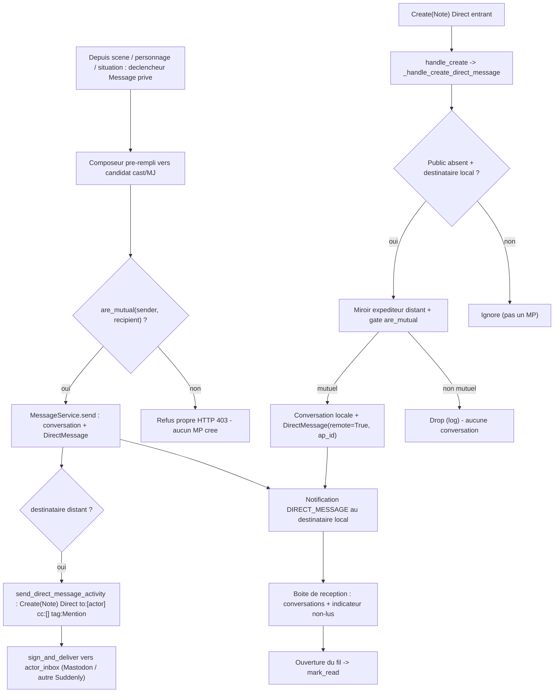

<!-- AI INSTRUCTIONS ONLY — ne pas produire ce bloc. Amendements préfixés 🤖. Log append-only. -->

# Instruction : Messages privés fédérés — Épique E (#135)

## Feature

- **Summary** : Introduire les messages privés (MP) entre deux comptes, **fédérés dès le départ** en visibilité **Direct ActivityPub**. Cas central : demander une précision sur une scène / un personnage / une situation à un co-joueur ou au MJ. **Autorisation stricte** : un MP ne peut viser qu'un **follower mutuel** (A suit B ET B suit A, tous deux `accepted=True`). Les MP forment des **conversations 2-à-2** (fil unique par paire de comptes), avec **boîte de réception** et **indicateur de non-lus**. Un MP sortant est délivré en **Direct AP** à l'inbox du destinataire (peut atteindre Mastodon / une autre instance Suddenly) ; un **Direct entrant** crée la conversation locale. **Notification à la réception** via `core.Notification`. **Points d'entrée contextuels** : depuis une scène (`Report`), un personnage (`Character`) ou une situation, ouvrir un composeur de MP vers un joueur du cast ou le MJ (`game.owner`).
- **Stack** : `Django 5.x (Python 3.12)`, `PostgreSQL`, `Celery` (fallback sync via `_safe_delay`), `HTMX`, `Alpine.js`, `httpx`, `pytest-django` + `respx`, `ruff`, `mypy`.
- **Branch name** : `epic-e/federated-dm` (worktree `.claude/worktrees/epic-e` — l'implémenteur committe ici, ne touche jamais la copie de travail principale ni un autre worktree).
- **Parent Plan** : `none`
- **Sequence** : `standalone`
- Confidence : 8/10
- Time to implement : ~2 jours

## Isolation DB (worktree epic-e — IMPÉRATIF pour l'implémenteur)

- **Base de test dédiée `suddenly_epice`** (la DB de test est partagée entre worktrees ; un schéma qui dérive casse des tests hors périmètre — cf. note d'env Épiques B/C).
- **`DATABASE_URL` inline** devant chaque pytest, jamais via `make check` global tant qu'on itère :
  ```bash
  DATABASE_URL="postgres://<user>:<pwd>@localhost:5432/suddenly_epice" \
    python -m pytest <scope> --create-db --no-cov -p no:cacheprovider -q
  ```
- **`--create-db` obligatoire** sur tout run pytest (jamais `--reuse-db`).
- **Un seul run pytest à la fois** dans ce worktree (pas de parallélisme inter-worktrees sur la même DB).
- `make check` (qui recrée sa propre DB) n'est lancé qu'en **Phase 5**, une fois le code stabilisé.

## Hypothèses de dépendance (NE PAS re-planifier)

- **Épique C (#133) follow-federation = mergée sur main** (HEAD `77f21a9`, Épique C intégrée). Vérifié dans le worktree :
  - Modèle **`Follow`** polymorphe (`suddenly/characters/models.py` l.605) : `follower` FK User, GFK `content_type`+`object_id`+`target` (`user`/`character`/`game`), `remote` Bool, `ap_id` URLField unique, **`accepted` Bool `db_index=True`**, `unique_together (follower, content_type, object_id)`.
  - Pipeline AP entrant : `inbox.process_inbox` + registre `handle_*` (`handle_create` l.294 route `Create(Character|Article)`, **`Note` non traité → point d'extension**), dédup `ProcessedActivity`, SSRF-safe, signatures vérifiées avant traitement.
  - Livraison signée **directed** : `_http.sign_and_deliver(activity, inbox_url, signer=actor_obj)` ; précédent direct **`send_like_activity`** (`tasks.py` l.421) livre un `Like` à `report.author.actor_inbox` — **exactement le patron d'un MP Direct** (pas un fan-out followers).
  - Résolution d'acteur distant : **`get_or_create_remote_user(actor_url)`** (`_http.py` l.188 / `tasks.py` l.558), `get_remote_user` (`inbox.py` l.1206).
  - Mapping visibilité → `to`/`cc` : `serializers.py` l.270-282 (public/unlisted/followers) ; **`_infer_visibility`** (`inbox.py` l.441) lit `to`/`cc` — **Direct = ni `Public` dans `to` ni dans `cc`, `to` visant un acteur nommé**.
- **Épique D (#134) auto-follow du cast = plan en cours, NON mergé** — cf. `gh issue view 134`. **Découplage assumé** : E ne dépend **pas** de l'implémentation de D. E vérifie la **mutualité générique** via `Follow` (DEC-E2) — elle est vraie que le follow soit **manuel** (déjà possible post-C) ou **auto-créé par D** (cast actif). Quand D mergera, « MP à son cast » sera automatiquement satisfait sans changement dans E. **NE PAS re-planifier D ni le marquage auto-follow.** Les points d'entrée contextuels (DEC-E7) résolvent des **candidats** (cast/MJ) mais l'**autorisation** reste le gate de mutualité.

## Existant confirmé (NE PAS re-planifier — déjà câblé)

Vérifié contre le code du worktree epic-e :

- **Livraison directed signée** : `_http.sign_and_deliver(activity, inbox_url, signer)` ; `deliver_activity` task (retry/backoff, 410/4xx/5xx gérés) ; `_safe_delay` fallback sync. Dédup inbox : `ProcessedActivity` (get_or_create atomique).
- **`User`** (`users/models.py`) : `inbox_url` (l.65), `actor_url` (l.96, `AP_BASE_URL/users/<username>`), `actor_inbox` (l.103, fallback `inbox_url`), `display_name`/`username`. `remote` Bool + `db_index`.
- **`core.Notification`** (`core/models.py` l.54) : `recipient` FK User, `type` CharField(choices `NotificationType`), `actor` FK User null, GFK `target`, `message` TextField, `is_read` Bool `db_index`, index `(recipient, is_read, -created_at)`. Créée par **signaux post_save** dans `core/notification_signals.py` (`notify_on_follow` l.62 = patron exact : filtre `created`, résout le destinataire, `Notification.objects.create(...)`). **Aucun `NotificationType` de MP n'existe → à ajouter.**
- **Inbox reception** : `handle_create` (l.294) discrimine sur `obj.get("type")` ; `_infer_visibility` (l.441) lit `to`/`cc`. **`Note` n'est pas routé** → branche à ajouter pour un `Create(Note)` Direct.
- **Discrimination d'objet AP déjà pratiquée** : Épique C (`Accept(Follow)` vs `Accept(Offer)`), Épique B (`object.type` = `suddenly:*`) — précédent pour brancher `handle_create` sur `Note` Direct sans toucher `Article`/`Character`.

## Manques identifiés (le périmètre réel de #135)

1. **Aucun modèle de conversation / message privé** ni d'état de lecture (non-lus). (→ DEC-E1, Phase 1)
2. **Aucun helper de mutualité** (A suit B ET B suit A) réutilisable côté envoi ET réception. (→ DEC-E2, Phase 1)
3. **Aucun service d'envoi** appliquant le gate de mutualité, le threading de conversation et le marquage lu/non-lu. (→ DEC-E5, Phase 2)
4. **Aucune sérialisation ni livraison AP d'un MP Direct** (`Note` Direct, Mastodon-compatible) ni réception d'un `Create(Note)` Direct. (→ DEC-E3/E4, Phases 2-3)
5. **Aucune boîte de réception** (liste des conversations + non-lus) ni fil de conversation. (→ Phase 4)
6. **Aucune notification de MP** ni type de notification dédié. (→ DEC-E6, Phase 4)
7. **Aucun point d'entrée contextuel** depuis scène / personnage / situation. (→ DEC-E7, Phase 4)

## Décisions de conception (DEC-Ex — prises, conservatrices)

### DEC-E1 — Modèle de données (conversation 2-à-2 + messages + non-lus) + emplacement
- **Nouvelle app `suddenly.messaging`** (convention app-par-domaine : characters/games/activitypub/core/users). `core` s'alourdirait et le MP a sa propre surface AP/service/vues.
- **`Conversation(BaseModel)`** : fil **unique entre deux comptes**. Deux FK ordonnées canoniquement — `participant_low` / `participant_high` FK User (`related_name="+"`), où l'assignation impose `low.pk < high.pk` (ordre déterministe sur l'UUID) — avec **`unique_together (participant_low, participant_high)`** garantissant un seul fil par paire. `last_message_at` DateTime `db_index` (tri boîte de réception). `remote` Bool (au moins un participant distant). Pas de logique métier dans le modèle (règle `django-models`) : l'ordonnancement canonique passe par le **service** (`get_or_create_conversation`), pas par `save()`.
- **`ConversationMembership(BaseModel)`** (table de lecture, 2 rows/conversation) : `conversation` FK(`related_name="memberships"`), `user` FK User, `last_read_at` DateTime null. `unique_together (conversation, user)`. **Non-lus dérivés** (pas de compteur dénormalisé) : `messages` de la conversation avec `created_at > last_read_at` ET `sender != user`. Évite des rows de lecture par message (fil 2-à-2).
- **`DirectMessage(BaseModel)`** : `conversation` FK(`related_name="messages"`), `sender` FK User (local ou miroir distant), `body` TextField, `remote` Bool, `ap_id` URLField unique null (idempotence inbox), `created_at` (de `BaseModel`). Index `(conversation, created_at)`.
- **Justification** : paire de comptes → deux FK ordonnées + `unique_together` est la forme la plus sûre pour « un fil par paire » (un M2M `participants` ne contraint pas l'unicité de paire). Membership porte l'état de lecture par participant ; non-lus **calculés** = pas de dénormalisation à maintenir en cohérence.

### DEC-E2 — Helper de mutualité (gate envoi ET réception) **(décision centrale #135, critère 1)**
- **`FollowManager.are_mutual(user_a, user_b) -> bool`** (manager/queryset sur `characters.Follow`, à côté de `promotable`/`released()` — data-access, pas de logique métier interdite) : vrai ssi il existe **deux `Follow` `accepted=True`** ciblant des **Users** :
  - `Follow(follower=user_a, content_type=<User>, object_id=user_b.pk, accepted=True)` **ET** le symétrique `(follower=user_b, object_id=user_a.pk, accepted=True)`.
  - Ciblage **User uniquement** (le `content_type` est `user`, pas character/game — un MP relie deux comptes).
- **Gate appliqué aux DEUX bouts** :
  - **Envoi** (`MessageService.send`) : refus propre si `not are_mutual(sender, recipient)` → exception métier `NotMutualFollowers` → **HTTP 403** (vue) avec message FR, **jamais** de MP créé/fédéré.
  - **Réception** (`handle_create` Note Direct, DEC-E4) : si le couple (expéditeur distant miroir, destinataire local) **n'est pas mutuel**, **droper** (log INFO, aucune conversation créée). Ne jamais 500.
- **Justification** : un seul point de vérité pour « followers mutuels », réutilisé des deux côtés (règle `dry-refactor`, 2 sites → factorisation). S'appuie sur `Follow.accepted` (Épique C) — un follow distant non encore accepté ne rend pas mutuel. Découple E de D : la mutualité est vraie que le follow soit manuel ou auto-cast.

### DEC-E3 — Mapping AP Direct : `Create(Note)` Mastodon-compatible **(décision AP centrale #135, critère 2)**
- **Type d'objet = `Note`** (pas `Article` — `Article` = scène/`Report`). Un MP est un `Note`, forme standard Mastodon d'un message court adressé.
- **Adressage Direct** (le point critique) :
  - `to`: **`[<recipient.actor_url>]`** — l'acteur destinataire **nommé**, et **lui seul**.
  - **`cc`: `[]`** — vide. **`Public` n'apparaît NI dans `to` NI dans `cc`** (c'est la définition AS2 d'une visibilité Direct ; `_infer_visibility` le confirme : Public absent partout + `to` non vide = adressé nommément).
  - **`tag`: `[{"type": "Mention", "href": <recipient.actor_url>, "name": "@<user>@<domain>"}]`** — **requis pour que Mastodon classe le Note en « Direct / mentioned people only »** et le route vers le bon destinataire.
  - `Note.attributedTo` = `sender.actor_url` ; `Note.content` = corps (HTML échappé) ; `Note.id` = IRI stable du message (`<AP_BASE_URL>/messages/<dm.pk>`).
- **Activité enveloppe = `Create`** : `{"type": "Create", "actor": sender.actor_url, "to": [...], "cc": [], "object": <Note>}` (l'adressage est **répété** au niveau activité ET objet, comme Mastodon).
- **Livraison = directed** : `sign_and_deliver(activity, recipient.actor_inbox, signer=sender)` — **un seul inbox**, jamais `broadcast_activity` (un MP n'est pas un fan-out followers). Patron identique à `send_like_activity`.
- **Justification** : `Note` + `to:[actor]` + `cc:[]` + `Mention` = la recette Direct interopérable Mastodon (vérifiée contre `_infer_visibility` local). Livraison directed déjà éprouvée (`send_like_activity`). Rejeté : réutiliser `Article`/`Report` (pollue le domaine scène, listings, `report_post_save`).

### DEC-E4 — Réception d'un `Create(Note)` Direct (crée la conversation locale)
- **Brancher `handle_create` sur `obj_type == "Note"`** → `_handle_create_direct_message(activity, obj)` (chemins `Character`/`Article` **inchangés**).
- Séquence, **idempotente et gardée** :
  1. **Confirmer le Direct** : `_infer_visibility`-like → Public absent de `to`/`cc` ; sinon ignorer (ce n'est pas un MP).
  2. **Identifier le destinataire local** : résoudre l'acteur local nommé dans `to` (`AP_BASE_URL/users/<username>`) ; s'il n'est pas local, ignorer.
  3. **Miroir de l'expéditeur distant** : `get_or_create_remote_user(activity["actor"])`.
  4. **Gate mutualité** (DEC-E2) : si non mutuel → **droper** (log INFO), pas de conversation. (critère 1 côté réception)
  5. **Idempotence** : `DirectMessage.objects.filter(ap_id=obj["id"]).exists()` → sortir (double POST = 1 message).
  6. **Threading** : `MessageService.get_or_create_conversation(local_user, remote_user)` (ordre canonique) ; créer `DirectMessage(remote=True, ap_id=..., sender=remote_user, body=<content sanitizé>)` ; toucher `conversation.last_message_at`.
  7. **Notification** (DEC-E6) via signal post_save.
- **Justification** : calqué sur `_handle_create_character`/`_handle_create_report` (idempotence `ap_id`, miroir `get_or_create_remote_user`). Le gate en réception ferme la porte à un MP distant non autorisé.

### DEC-E5 — Service d'envoi + threading + lecture (atomique)
- **`MessageService`** (`messaging/services.py`, `transaction.atomic`) :
  - `get_or_create_conversation(user_a, user_b)` : ordonne canoniquement (low/high par UUID), `get_or_create` sur `(participant_low, participant_high)`, crée les 2 `ConversationMembership` si besoin.
  - `send(sender, recipient, body)` : **gate `are_mutual`** (DEC-E2) sinon `raise NotMutualFollowers` ; `get_or_create_conversation` ; `DirectMessage.objects.create(...)` ; `last_message_at = now()` ; **hook AP best-effort** (`_safe_delay(send_direct_message_activity, dm.pk)` — seulement si `recipient.remote` ou destinataire hors instance) ; retourne le `DirectMessage`.
  - `mark_read(conversation, user)` : `membership.last_read_at = now()` (idempotent).
  - `unread_count(user)` / `unread_for(conversation, user)` : dérivé (messages après `last_read_at`, `sender != user`).
- **Justification** : logique d'accès/mutation hors des vues (règle `django-services`), atomicité sur la création conversation+message, gate centralisé.

### DEC-E6 — Notification à la réception (core.Notification, critère 4)
- **`NotificationType.DIRECT_MESSAGE`** (`core/models.py`) → migration `core` `AlterField(Notification.type choices)` (additif, CharField sans check-constraint — même geste que Épiques A/B).
- **Signal** `notify_on_direct_message` (`core/notification_signals.py`, `@receiver(post_save, sender="messaging.DirectMessage")`, connecté dans `CoreConfig.ready()`) : à la création, `Notification(recipient=<autre participant>, type=DIRECT_MESSAGE, actor=sender, target=<conversation>, message="@<sender> vous a envoyé un message")`. **Vaut pour un MP local ET un MP entrant distant** (les deux créent un `DirectMessage` local).
- **Justification** : réutilise le patron `notify_on_follow` (signal post_save, résolution du destinataire). Un seul point de création de notif couvre local + fédéré.

### DEC-E7 — Points d'entrée contextuels (scène / personnage / situation)
- **Résolution de candidats** : depuis un `Report` (scène) / `Character` / une situation de partie, exposer un **composeur de MP** ciblant **un joueur du cast** ou le **MJ** (`game.owner`). Les candidats sont dérivés du `GameCast` de la partie porteuse (cast + owner) — lecture seule, **aucune écriture de follow** (c'est le périmètre de D).
- **Autorisation = gate de mutualité** (DEC-E2), pas la présence au cast : le composeur n'affiche/n'autorise que les candidats **mutuels** avec l'utilisateur courant. Post-D (cast auto-mutuel), tout le cast sera éligible ; pré-D, seuls les mutuels manuels le sont — **dégradation propre**, aucun couplage dur à D.
- **Surface** : un déclencheur HTMX « Message privé » sur la carte personnage / l'en-tête de scène / la vue partie → ouvre le composeur pré-rempli (`recipient` = candidat). Mutations `@require_POST`, `|escapejs` sur toute valeur injectée en JS (règle `03-htmx-patterns`).
- **Justification** : satisfait le cas central (« demander une précision à un co-joueur ou au MJ ») sans dépendre de l'implémentation D ; le gate reste l'unique arbitre d'autorisation.

## Architecture projection

### Files to create
- `suddenly/messaging/__init__.py`, `suddenly/messaging/apps.py` — app `suddenly.messaging` (`ready()` important `signals` si besoin).
- `suddenly/messaging/models.py` — `Conversation`, `ConversationMembership`, `DirectMessage` (DEC-E1). Aucune logique métier.
- `suddenly/messaging/services.py` — `MessageService` (`get_or_create_conversation`, `send`, `mark_read`, `unread_count`, `unread_for`) + exception `NotMutualFollowers` (DEC-E5).
- `suddenly/messaging/views.py` + `suddenly/messaging/urls.py` — boîte de réception, fil de conversation, composeur, envoi (`@require_POST`), marquage lu ; endpoints contextuels (composeur pré-rempli). Patron 3-templates HTMX.
- `templates/messaging/inbox.html`, `_conversation_list.html`, `_thread.html`, `_message_item.html`, `_composer.html`, `_dm_trigger.html` — surfaces HTMX (`` inline, `` namespacé, `|escapejs`).
- `suddenly/messaging/migrations/0001_initial.py` — `makemigrations messaging`.
- `tests/messaging/__init__.py`, `tests/messaging/test_dm.py` (critères 1/3/4 : gate mutualité + refus 403, threading, non-lus, notification), `tests/messaging/test_dm_federation.py` (critère 2 : Note Direct sortant vers inbox distant + Direct entrant crée la conversation, gate réception, idempotence `ap_id`, Mastodon-shape `to`/`cc`/`tag`).

### Files to modify
- `suddenly/settings.py` (ou `config/settings/base.py` selon le layout réel — **vérifier**) — ajouter `"suddenly.messaging"` à `INSTALLED_APPS`.
- `suddenly/urls.py` — inclure `messaging/urls.py`.
- `suddenly/characters/models.py` — `FollowManager.are_mutual(user_a, user_b)` (DEC-E2) ; brancher le manager sur `Follow.objects`.
- `suddenly/core/models.py` — `NotificationType.DIRECT_MESSAGE` (DEC-E6) → migration `core` `AlterField`.
- `suddenly/core/notification_signals.py` — `notify_on_direct_message` (post_save `messaging.DirectMessage`).
- `suddenly/activitypub/serializers.py` — `serialize_direct_message(dm)` (`Create(Note)` Direct : `to:[recipient]`, `cc:[]`, `tag:[Mention]`, `attributedTo`, `content`, `id` IRI) (DEC-E3).
- `suddenly/activitypub/inbox.py` — brancher `handle_create` → `_handle_create_direct_message` si `obj_type == "Note"` Direct (DEC-E4) ; réutiliser `_infer_visibility`/`get_or_create_remote_user`. **Chemins `Article`/`Character` inchangés.**
- `suddenly/activitypub/tasks.py` — `send_direct_message_activity(dm_id)` : sérialise + `sign_and_deliver(activity, recipient.actor_inbox, signer=sender)` (directed, best-effort, no-op si destinataire local pur).
- `suddenly/activitypub/signals.py` — post_save sur `messaging.DirectMessage` (local, non-remote) → `_safe_delay(send_direct_message_activity, dm.pk)` (miroir de la couture de livraison existante).
- **Points d'entrée contextuels (DEC-E7)** — inclure `_dm_trigger.html` dans les templates de carte personnage / en-tête de scène / vue partie (identifier les templates réels : `templates/characters/…`, `templates/games/…`) ; exposer les candidats cast/MJ en lecture seule (aucune vue de partie modifiée en écriture).

### Non modifié
- **`suddenly/games/models.py`, `suddenly/characters/Follow` (schéma)** — aucun changement de schéma. Mutualité = **lecture** de `Follow` existant ; MP = nouvel espace `messaging`. Le cast (`GameCast`) est lu, jamais muté (périmètre D).

### Files to delete
- Aucun.

## Applicable rules

| Tool | Name | Path | Why it applies |
| ---- | ---- | ---- | -------------- |
| claude | 08-activitypub | `.claude/rules/08-domain/08-activitypub.md` | Format `Create(Note)` Direct, `to`/`cc`/`tag` Mention, `URLField(max_length=500)`, point d'entrée `fetch_ap_json` |
| claude | ap-pivots-django-activitypub | `.claude/rules/07-quality/ap-pivots-django-activitypub.md` | Idempotence inbox (`ap_id`), signature avant traitement, SSRF, miroir acteur distant |
| claude | 03-django-models | `.claude/rules/03-frameworks-and-libraries/03-django-models.md` | `Conversation`/`Membership`/`DirectMessage` via migration, GFK/FK `on_delete`, `Meta.indexes`, aucune logique métier en modèle |
| claude | 03-django-services | `.claude/rules/03-frameworks-and-libraries/03-django-services.md` | `MessageService` : gate + threading + lecture en service atomique, `transaction.atomic`, jamais inline en vue |
| claude | 03-django-signals | `.claude/rules/03-frameworks-and-libraries/03-django-signals.md` | `notify_on_direct_message` + couture de livraison AP via post_save, connectés en `ready()` |
| claude | 03-htmx-patterns | `.claude/rules/03-frameworks-and-libraries/03-htmx-patterns.md` | `@require_POST` sur envoi/marquage, `getattr(request,"htmx",False)`, 3-templates, `` namespacé, `|escapejs` |
| claude | perf-pivots-celery | `.claude/rules/07-quality/perf-pivots-celery.md` | Tasks passent des IDs, idempotence, fallback sync `_safe_delay` |
| claude | data-pivots-django-orm | `.claude/rules/07-quality/data-pivots-django-orm.md` | `select_related`/`prefetch_related` sur boîte de réception ; pas de N+1 sur non-lus ; migrations reviewées |
| claude | i18n-patterns | `.claude/rules/08-domain/08-i18n-patterns.md` | Chaînes UI FR via `` ; `.po`/`.mo` recompilés en Phase 5 |
| claude | display-vocabulary | `.claude/rules/08-domain/08-display-vocabulary.md` | « scène » (`Report`), « post » (`Rapport`), « MJ » (`game.owner`) — vocabulaire cohérent |
| claude | dry-refactor | `.claude/rules/07-quality/dry-refactor.md` | Gate `are_mutual` factorisé (envoi + réception) ; livraison directed réutilisée |
| claude | file-language-and-style | `.claude/rules/01-standards/file-language-and-style.md` | Ce plan (`aidd_docs/tasks/**`) human-consumed → français ; symboles/chemins verbatim |

## User Journey



## Risk register

| Risk | Impact | Mitigation |
| ---- | ------ | ---------- |
| Adressage Direct mal formé (Public résiduel dans `to`/`cc`, `Mention` manquant) | MP fuit en public / Mastodon ne le classe pas Direct | DEC-E3 strict : `to:[recipient]`, `cc:[]`, `tag:[Mention]`, Public nulle part ; test de forme AP (`test_dm_federation`) asserte l'exact shape |
| Gate mutualité contourné d'un côté | MP non autorisé envoyé ou reçu | Gate unique `are_mutual` appliqué **envoi ET réception** (DEC-E2) ; test des deux bouts + du refus 403 et du drop réception |
| `handle_create` casse le chemin `Article`/`Character` | Régression Épique C | Brancher **après** discrimination `obj_type`, `Note` = nouvelle branche isolée ; run ciblé `tests/activitypub` en Phase 3 |
| Double livraison / double réception d'un MP | Messages dupliqués | Idempotence `DirectMessage.ap_id` unique (get-or-skip) + `ProcessedActivity` inbox ; test double POST = 1 message |
| Expéditeur distant non résolu localement | `DirectMessage.sender` non-null → crash | `get_or_create_remote_user` (infra C) ; si échec, log + drop, jamais 500 |
| Unicité de conversation non garantie (2 fils pour 1 paire) | Fils dupliqués, non-lus incohérents | Ordre canonique low/high + `unique_together` + `get_or_create` dans le service (DEC-E1/E5) |
| N+1 sur boîte de réception (non-lus par conversation) | Perf dégradée | `select_related` participants + agrégation des non-lus ; test/inspection requête |
| Couplage accidentel à l'Épique D (cast auto-follow) | E bloquée si D non mergé | Gate mutualité **générique** (manuel ou auto) ; candidats cast en lecture seule ; aucune écriture de follow (DEC-E7) |
| `NotificationType.DIRECT_MESSAGE` marque des rows historiques orphelines | Choix orphelin | CharField sans check-constraint → additif inoffensif ; `AlterField` seule |
| Couverture < 80 % après ajout de code | `make check` rouge | Tests appariés aux 4 critères (Phase 5) ; `respx` + `CELERY_TASK_ALWAYS_EAGER` pour la fédération |
| Nouvelle app `messaging` casse l'autodiscover / migrations | `manage.py check` rouge | `apps.py` minimal + `INSTALLED_APPS` ; `makemigrations --check --dry-run` en critère Phase 1 |
| Schéma DB partagé inter-worktrees dérive | Tests hors périmètre cassent | Base dédiée `suddenly_epice`, `DATABASE_URL` inline, `--create-db`, un run à la fois (section Isolation DB) |

## Implementation phases

> **Rappel batched tests** : Phases 1-4 = CODE SEUL (aucun test écrit). Chaque phase se clôt par un run **ciblé des tests EXISTANTS** du périmètre (`DATABASE_URL=…suddenly_epice python -m pytest <scope> --create-db --no-cov -p no:cacheprovider -q`). **Phase 5** écrit toute la couverture des 4 critères puis `make check`. `` / `gettext` inline = code (Phases 1-4) ; `.po`/`compilemessages` = Phase 5.

### Phase 1 : App `messaging` + modèles + migration + mutualité + type de notification (CODE SEUL)

> Poser le socle et la **frontière migration**.

#### Tasks
1. Créer l'app `suddenly/messaging/` (`__init__.py`, `apps.py` : `default_auto_field`, `name="suddenly.messaging"`, `ready()`) ; ajouter `"suddenly.messaging"` à `INSTALLED_APPS` (vérifier le fichier settings réel : `suddenly/settings.py`).
2. `messaging/models.py` : `Conversation` (participant_low/high ordonnés canoniquement, `unique_together`, `last_message_at` indexé, `remote`), `ConversationMembership` (`last_read_at`, `unique_together (conversation, user)`), `DirectMessage` (`conversation`, `sender`, `body`, `remote`, `ap_id` unique null, index `(conversation, created_at)`) — DEC-E1. Aucune logique métier.
3. `characters/models.py` : `FollowManager.are_mutual(user_a, user_b)` (DEC-E2) ; câbler `Follow.objects = FollowManager()`.
4. `core/models.py` : ajouter `DIRECT_MESSAGE` à `NotificationType`.
5. `python manage.py makemigrations messaging core` → `migrate` ; revoir le SQL via `sqlmigrate`. **Aucune migration `games` ni `characters` de schéma attendue** (le manager n'altère pas le schéma).

#### Acceptance criteria
- [ ] `python manage.py makemigrations --check --dry-run` : aucune migration manquante (messaging/0001 + core AlterField ; **pas de migration games/characters**).
- [ ] `python manage.py check` passe ; `suddenly.messaging` dans `INSTALLED_APPS`.
- [ ] `Follow.objects.are_mutual(a, b)` retourne `True` ssi deux `Follow accepted` réciproques ciblant des Users existent (vérifiable en shell).
- [ ] Run ciblé tests existants : `DATABASE_URL=…suddenly_epice python -m pytest tests/core tests/characters tests/activitypub --create-db --no-cov -p no:cacheprovider -q` (vert, aucune régression).

### Phase 2 : Service (envoi gaté + threading + lecture) + réception AP Direct (CODE SEUL)

> Le cœur : `MessageService` (gate mutualité, conversation, non-lus) + branche inbox `Create(Note)` Direct.

#### Tasks
1. `messaging/services.py` : `MessageService.get_or_create_conversation` / `send` (gate `are_mutual` sinon `raise NotMutualFollowers` ; `DirectMessage.create` ; `last_message_at` ; hook AP best-effort) / `mark_read` / `unread_count` / `unread_for` ; `transaction.atomic`. Exception `NotMutualFollowers`.
2. `activitypub/inbox.py` : brancher `handle_create` → `_handle_create_direct_message` si `obj_type == "Note"` Direct (DEC-E4) — confirmer Direct via `_infer_visibility`-like, résoudre destinataire local, miroir expéditeur (`get_or_create_remote_user`), **gate `are_mutual`**, idempotence `ap_id`, `get_or_create_conversation` + `DirectMessage(remote=True)`. Chemins `Article`/`Character` **inchangés**.

#### Acceptance criteria
- [ ] `MessageService.send(a, b, body)` crée conversation + message ssi mutuels ; sinon `NotMutualFollowers` (aucun message créé).
- [ ] Un `Create(Note)` Direct entrant d'un expéditeur **mutuel** crée la conversation locale + `DirectMessage(remote=True)` ; d'un **non-mutuel** → drop (aucune conversation).
- [ ] Double POST du même `Note` (`ap_id` identique) → un seul `DirectMessage`.
- [ ] Run ciblé : `DATABASE_URL=…suddenly_epice python -m pytest tests/activitypub tests/characters --create-db --no-cov -p no:cacheprovider -q` (vert).

### Phase 3 : Fédération AP sortante (`Create(Note)` Direct, Mastodon-compatible) (CODE SEUL)

> Émettre un MP Direct vers l'inbox distant, sans régresser l'AP existant.

#### Tasks
1. `activitypub/serializers.py` : `serialize_direct_message(dm)` (DEC-E3) — `Create(Note)`, `to:[recipient.actor_url]`, `cc:[]`, `tag:[Mention]`, `attributedTo`, `content` échappé, `id` IRI stable.
2. `activitypub/tasks.py` : `send_direct_message_activity(dm_id)` — charge le DM, sérialise, `sign_and_deliver(activity, recipient.actor_inbox, signer=sender)` (directed) ; no-op si destinataire local pur.
3. `activitypub/signals.py` : post_save sur `messaging.DirectMessage` (local, `remote=False`) → `_safe_delay(send_direct_message_activity, dm.pk)`.

#### Acceptance criteria
- [ ] Un MP local vers un destinataire **distant** produit un `Create(Note)` Direct livré à `actor_inbox` (forme `to`/`cc`/`tag` exacte).
- [ ] L'envoi vers un destinataire **purement local** ne fédère pas (no-op AP), le MP reste local.
- [ ] Aucune régression sur `Create(Article)`/`Create(Character)` (run ciblé `tests/activitypub`).
- [ ] Run ciblé : `DATABASE_URL=…suddenly_epice python -m pytest tests/activitypub --create-db --no-cov -p no:cacheprovider -q` (vert).

### Phase 4 : UI HTMX (boîte de réception + fil + composeur + non-lus) + notifications + entrées contextuelles (CODE SEUL)

> Rendre le MP utilisable ; notifier ; brancher les points d'entrée contextuels.

#### Tasks
1. `messaging/views.py` + `messaging/urls.py` (inclus dans `suddenly/urls.py`) : boîte de réception (liste conversations triées `last_message_at` + non-lus), fil (`mark_read` à l'ouverture), composeur, envoi (`@require_POST` avant `@login_required`) ; `getattr(request,"htmx",False)`. Envoi renvoie 403 propre sur `NotMutualFollowers`.
2. Templates `templates/messaging/*.html` (inbox, liste, fil, item, composeur, trigger) — `` inline, `` namespacé, `|escapejs` sur toute valeur injectée en JS ; badge non-lus.
3. `core/notification_signals.py` : `notify_on_direct_message` (post_save `messaging.DirectMessage`) → `Notification(type=DIRECT_MESSAGE, recipient=<autre participant>, actor=sender, target=conversation)` (DEC-E6). Connecté en `CoreConfig.ready()`.
4. **Entrées contextuelles (DEC-E7)** : inclure `_dm_trigger.html` dans carte personnage / en-tête de scène / vue partie ; résoudre les candidats cast + MJ (`game.owner`) en lecture seule, filtrés par `are_mutual`. Composeur pré-rempli `recipient`.

#### Acceptance criteria
- [ ] Boîte de réception liste les conversations avec un **indicateur de non-lus** ; ouvrir un fil remet à zéro (`mark_read`).
- [ ] Envoi vers un non-mutuel renvoie un **refus propre (403)**, aucun MP créé.
- [ ] Un MP reçu génère une `Notification(type=DIRECT_MESSAGE)` pour le destinataire.
- [ ] Déclencheur « Message privé » présent depuis une scène / un personnage / une partie, pré-remplissant le composeur vers un candidat cast/MJ mutuel.
- [ ] Run ciblé : `DATABASE_URL=…suddenly_epice python -m pytest tests/messaging tests/core --create-db --no-cov -p no:cacheprovider -q` (vert ; aucun test *écrit* ici, on exécute l'existant s'il y en a).

### Phase 5 : Tests batchés (4 critères) + i18n + `make check`

> Écrire toute la couverture d'un coup ; prouver les 4 critères #135 et la santé CI.

#### Tasks
1. `tests/messaging/test_dm.py` : critère 1 (envoi refusé si non mutuel — 403 / `NotMutualFollowers` ; autorisé si mutuel) ; critère 3 (boîte de réception + non-lus, `mark_read`) ; critère 4 (notification `DIRECT_MESSAGE` à la réception, local + distant) ; unicité de conversation (paire → 1 fil).
2. `tests/messaging/test_dm_federation.py` (`respx` + `CELERY_TASK_ALWAYS_EAGER`) : critère 2 (MP sortant = `Create(Note)` Direct livré à l'inbox distant, forme `to:[actor]`/`cc:[]`/`tag:Mention` exacte, Public nulle part ; Direct entrant crée la conversation locale ; gate réception non-mutuel = drop ; idempotence `ap_id`) ; non-régression `Article`/`Character`.
3. i18n : `makemessages` + `compilemessages` pour les nouvelles chaînes FR ; committer `.mo`.
4. `make check` (ruff + mypy strict + pytest/coverage ≥ 80 + i18n) ; corriger jusqu'au vert. **Ici seulement** `make check` (DB recréée par la CI).
5. Vérifier le `success_condition` de bout en bout.

#### Acceptance criteria
- [ ] `make check` passe (lint + typecheck + test/coverage ≥ 80 + i18n).
- [ ] `python -m pytest tests/messaging/test_dm.py tests/messaging/test_dm_federation.py --create-db --no-cov -p no:cacheprovider -q` sort en 0.
- [ ] Les 4 critères #135 sont couverts par au moins un test nommé.

## Amendments

<!-- 🤖 entrées pendant l'implémentation -->

## Log

<!-- APPEND ONLY -->

## Validation flow demonstration

1. `python manage.py migrate` puis `python manage.py check` — app `messaging` en place, aucune migration manquante.
2. Deux comptes mutuels (A suit B, B suit A, `accepted`) → A envoie un MP à B : conversation créée, B notifié, non-lu = 1 chez B.
3. A tente un MP vers C (non mutuel) → refus propre 403, aucun message.
4. B distant (autre instance / Mastodon mutuel) : le MP de A produit un `Create(Note)` Direct livré à l'inbox de B (`to:[B]`, `cc:[]`, `tag:Mention`, Public nulle part).
5. Un `Create(Note)` Direct entrant d'un mutuel crée la conversation locale + `DirectMessage(remote=True)` + notification ; d'un non-mutuel → drop ; double POST → un seul message.
6. Boîte de réception : conversations triées, indicateur de non-lus ; ouvrir le fil remet à zéro. Déclencheur « Message privé » depuis une scène / un personnage / une partie vers un candidat cast/MJ mutuel.
7. `make check && python -m pytest tests/messaging/test_dm.py tests/messaging/test_dm_federation.py --create-db --no-cov -p no:cacheprovider -q` → sort en 0.

## Évaluation de confiance : 8/10

Raisons (✓)
- Existant vérifié ligne à ligne : `Follow` (polymorphe, `accepted`), livraison directed `sign_and_deliver`/`send_like_activity`, `get_or_create_remote_user`, `_infer_visibility`, `handle_create` (discrimination `obj_type`), `core.Notification` + patron `notify_on_follow` — non re-planifiés.
- Décision AP centrale DEC-E3 (`Create(Note)` Direct, `to:[actor]`/`cc:[]`/`tag:Mention`) alignée sur la sémantique AS2 (confirmée par `_infer_visibility`) et la convention Direct Mastodon ; livraison directed déjà éprouvée (`send_like_activity`).
- Gate mutualité DEC-E2 factorisé et appliqué aux deux bouts (envoi + réception) — critère 1 fermé des deux côtés.
- Découplage D/E explicite : mutualité générique, cast lu en seule lecture, aucune écriture de follow — E implémentable avant merge de D.
- Phases ordonnées autour de l'unique frontière migration (Phase 1) ; convention tests batchés + isolation DB `suddenly_epice` documentées ; `success_condition` exécutable.

Risques (✗)
- Forme AP Direct fine (Mention Mastodon, répétition adressage activité/objet) à figer précisément — mitigée par test de shape dédié Phase 5.
- Emplacement exact des templates contextuels (carte personnage / en-tête scène / vue partie) à confirmer côté implémenteur (identifier les fichiers réels avant d'inclure `_dm_trigger.html`).
- Nom réel du module settings (`suddenly/settings.py` vs `config/settings/base.py`) à vérifier avant d'éditer `INSTALLED_APPS`.
</content>
</invoke>
