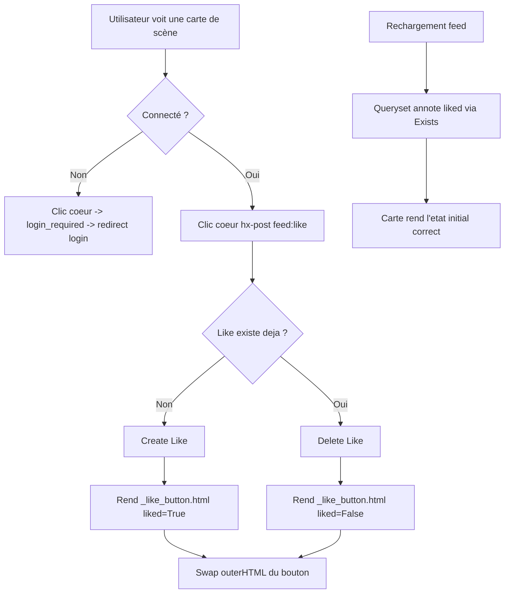

# Instruction: Like local d'une scène (#138 — part 1/2)

## Feature

- **Summary**: Rendre le bouton cœur du feed fonctionnel : toggle like/unlike persistant sur `Report`, état initial reflété au chargement, partial HTMX auto-swappé.
- **Stack**: `Python 3.12 · Django · PostgreSQL · HTMX · pytest-django`
- **Branch name**: `feat/138-scene-like`
- **Parent Plan**: `2026_07_19-138-scene-like-master.md`
- **Sequence**: `1 of 2`
- Confidence: 9/10
- Time to implement: ~0.5j

## Architecture projection

### Files to modify

- `suddenly/games/models.py` - ajouter le modèle `Like` (FK user + report, unique together, BaseModel)
- `suddenly/core/feed_views.py` - ajouter la vue `like_report` (toggle) ; annoter `liked` sur les querysets des 3 feeds
- `suddenly/core/front_urls.py` - route `feed/like/` name=`like`
- `templates/feed/_scene_card.html` - remplacer le `<button>` placeholder statique par ``

### Files to create

- `suddenly/games/migrations/00XX_like.py` - migration du modèle `Like`
- `templates/feed/_like_button.html` - partial branché `liked` / non-`liked`, `hx-post`, `hx-target="this"`, `hx-swap="outerHTML"`
- `tests/games/test_like.py` (ou `tests/core/test_feed_like.py`) - tests toggle, unicité, état initial, anonymat

### Files to delete

- none

## Applicable rules

| Tool   | Name                     | Path                                                                            | Why it applies                                                        |
| ------ | ------------------------ | ------------------------------------------------------------------------------- | -------------------------------------------------------------------- |
| claude | 03-htmx-patterns         | `.claude/rules/03-frameworks-and-libraries/03-htmx-patterns.md`                 | vue state-mutating `@require_POST` avant `@login_required` ; partial HTML, URL namespacée |
| claude | 03-django-models         | `.claude/rules/03-frameworks-and-libraries/03-django-models.md`                 | `Like` hérite `BaseModel` ; `Meta.constraints` unicité ; `on_delete` explicite |
| claude | data-pivots-django-orm   | `.claude/rules/07-quality/data-pivots-django-orm.md`                            | état `liked` via `Exists`/annotation — éviter le N+1 dans la boucle du feed |
| claude | 08-display-vocabulary    | `.claude/rules/08-domain/08-display-vocabulary.md`                              | UI dit « scène », jamais « report » dans les chaînes visibles         |
| claude | 08-i18n-patterns         | `.claude/rules/08-domain/08-i18n-patterns.md`                                   | libellés du partial via ``                                 |
| claude | 08-enforce / mobile-first| `.claude/rules/08-design/01-enforce.md`, `.claude/rules/08-design/mobile-first.md` | classes UnoCSS du contrat, icône Lucide, cible tap ≥44px, état ≠ couleur seule |

## User Journey

## Risk register

| Risk                                              | Impact                                        | Mitigation                                                                 |
| ------------------------------------------------- | --------------------------------------------- | ------------------------------------------------------------------------- |
| N+1 sur `liked` dans la boucle du feed            | 20 requêtes SQL par page de feed              | Annoter `liked=Exists(...)` sur le queryset ; jamais `report.likes.filter()` en template |
| Double-clic rapide → 2 créations concurrentes     | `IntegrityError` sur l'unicité `(user,report)`| `get_or_create` + toggle par existence ; contrainte DB comme filet        |
| GET déclenche le toggle (prefetch/``)        | Like fantôme                                  | `@require_POST` sur la vue                                                 |
| Bouton like sur feed anonyme (instance/fediverse) | Clic anon → swap avec page login              | Comportement aligné Recommend, accepté ; `liked=False` si non authentifié |

## Implementation phases

### Phase 1: Modèle + migration

> Persistance du like avec unicité utilisateur/scène.

#### Tasks

1. Ajouter `class Like(BaseModel)` dans `games/models.py` : FK `user` (`AUTH_USER_MODEL`, `on_delete=CASCADE`, `related_name="likes"`), FK `report` (`on_delete=CASCADE`, `related_name="likes"`).
2. `Meta.constraints = [UniqueConstraint(fields=["user", "report"], name="unique_user_report_like")]`.
3. `Meta.indexes` sur `(report,)` pour le futur `Count`, et ordering `-created_at`.
4. `makemigrations games` → migration générée.

#### Acceptance criteria

- [ ] `python manage.py makemigrations --check --dry-run` sort 0 (migration committée, rien de pendant)
- [ ] Créer deux `Like(user, report)` identiques lève `IntegrityError`
- [ ] `mypy suddenly/` sort 0

### Phase 2: Vue toggle + URL

> Endpoint HTMX qui bascule le like et renvoie le partial.

#### Tasks

1. `like_report(request)` dans `feed_views.py`, décorée `@require_POST` puis `@login_required` (ordre : `require_POST` au-dessus).
2. Lire `report_id` (POST), récupérer le `Report` publié ; 404 partial si absent.
3. Toggle : `Like.objects.filter(user, report).delete()` si existe, sinon `Like.objects.create(...)`.
4. Rendre `feed/_like_button.html` avec `{report, liked}`.
5. Ajouter `path("feed/like/", feed_views.like_report, name="like")` dans `front_urls.py`.

#### Acceptance criteria

- [ ] POST authentifié sur une scène non likée → crée le Like, réponse contient l'état `liked`
- [ ] Second POST → supprime le Like, réponse contient l'état non-`liked`
- [ ] GET sur l'endpoint → 405 (via `@require_POST`)
- [ ] POST anonyme → redirection login (302)

### Phase 3: Partial + câblage carte + état initial

> UI branchée et état reflété au chargement sans N+1.

#### Tasks

1. Créer `templates/feed/_like_button.html` sur le modèle de `_recommend_button.html` : branche `` (cœur plein/actif) / else (`hx-post `, `hx-vals` report_id, `hx-target="this"`, `hx-swap="outerHTML"`). Icône Lucide `i-lucide-heart`, `aria-label` traduit, cible ≥44px.
2. Dans `_scene_card.html`, remplacer le `<button>` placeholder commenté par ``.
3. Dans `feed_home`, `feed_instance`, `feed_fediverse` : annoter le queryset `Report` avec `liked=Exists(Like.objects.filter(report=OuterRef("pk"), user=user))` **uniquement si `request.user.is_authenticated`** ; sinon ne pas annoter (le template lit `report.liked|default:False`).
4. Vérifier que l'annotation n'ajoute pas de query par carte (compter via `django-debug-toolbar` ou `assertNumQueries`).

#### Acceptance criteria

- [ ] Le cœur reflète l'état réel au chargement (scène likée → cœur actif)
- [ ] Le toggle swap le bouton in-place sans rechargement de page
- [ ] `assertNumQueries` sur le feed : le nombre de requêtes ne croît pas avec le nombre de cartes (pas de N+1)
- [ ] `node design/lint/lint-files.mjs templates/feed/_like_button.html` sort 0

## Amendments

## Log

## Validation flow demonstration

1. Se connecter, aller sur `/feed/`.
2. Cliquer le cœur d'une carte de scène → il devient actif sans rechargement.
3. Rafraîchir la page → le cœur reste actif (état persisté et annoté).
4. Recliquer → le cœur redevient inactif ; rafraîchir → toujours inactif.
5. Se déconnecter, aller sur `/feed/instance/`, cliquer le cœur → redirection vers login.
