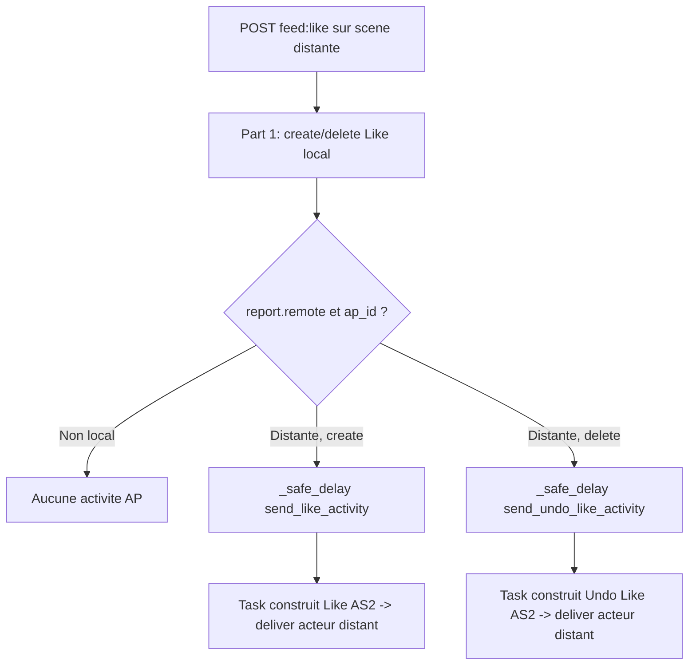

# Instruction: Fédération AP Like (#138 — part 2/2)

## Feature

- **Summary**: Étendre le toggle like local (part 1) pour émettre une activité ActivityPub `Like` vers l'acteur distant quand la scène est distante, et `Undo(Like)` à l'unlike. Aucun changement UX ni schéma.
- **Stack**: `Python 3.12 · Django · Celery (fallback sync) · httpx · ActivityPub`
- **Branch name**: `feat/138-scene-like`
- **Parent Plan**: `2026_07_19-138-scene-like-master.md`
- **Sequence**: `2 of 2`
- Confidence: 8/10
- Time to implement: ~0.5j

## Architecture projection

### Files to modify

- `suddenly/activitypub/tasks.py` - ajouter `send_like_activity` et `send_undo_like_activity` (modèle : `send_announce_activity`)
- `suddenly/core/feed_views.py` - dans `like_report`, déclencher `_safe_delay(send_like_activity, ...)` à la création et `send_undo_like_activity` à la suppression, si `report.remote`

### Files to create

- `tests/activitypub/test_like_federation.py` - Like émis sur scène distante, Undo à l'unlike, rien sur scène locale

### Files to delete

- none

## Applicable rules

| Tool   | Name                              | Path                                                                       | Why it applies                                                                 |
| ------ | --------------------------------- | -------------------------------------------------------------------------- | ------------------------------------------------------------------------------ |
| claude | 08-activitypub                    | `.claude/rules/08-domain/08-activitypub.md`                                | type AS2 `Like`/`Undo` ; `id` URL canonique ; livraison via Celery, pas HTTP en vue |
| claude | ap-pivots-django-activitypub      | `.claude/rules/07-quality/ap-pivots-django-activitypub.md`                 | §8 conformité AS2 (`Like` supporté) ; §3 fan-out via task, `transaction.on_commit`/`_safe_delay` |
| claude | perf-pivots-celery                | `.claude/rules/07-quality/perf-pivots-celery.md`                           | task idempotente, passer des IDs (pas des objets), `time_limit`                |
| claude | 03-htmx-patterns                  | `.claude/rules/03-frameworks-and-libraries/03-htmx-patterns.md`            | la vue reste HTML-only ; la fédération ne change pas la réponse                |

## User Journey

## Risk register

| Risk                                              | Impact                                     | Mitigation                                                            |
| ------------------------------------------------- | ------------------------------------------ | -------------------------------------------------------------------- |
| `id` d'activité non stable → doublons côté distant| Like/Undo mal corrélés chez le récepteur   | `id` déterministe `https://{domain}/users/{u}/like/{report.pk}` ; Undo réréférence l'`id` du Like |
| Envoi Like sur scène locale                       | Trafic AP inutile / boucle                 | Garde `if report.remote and report.ap_id` avant tout `_safe_delay`   |
| Ciblage : broadcast au lieu de dirigé             | Like spammé aux followers (mauvaise sémantique) | Livrer à l'inbox de l'auteur/objet distant, pas `broadcast_activity` followers |
| Task rejouée (acks_late)                          | Double envoi                               | Task idempotente ; le récepteur AP dédoublonne par `activity_id`     |

## Implementation phases

### Phase 1: Tasks AP Like / Undo(Like)

> Construire et livrer les activités AS2 vers l'acteur distant.

#### Tasks

1. `send_like_activity(user_id, report_id)` dans `tasks.py` : charger user+report (IDs), garder si `report.remote`. Construire `{"type": "Like", "id": f"https://{domain}/users/{user.username}/like/{report.pk}", "actor": user.actor_url, "object": report.ap_id, "published": ...}`.
2. Livrer en dirigé vers l'inbox de l'auteur distant (résoudre l'inbox via l'acteur du report, pas `broadcast_activity`). Réutiliser le chemin de livraison signée (`deliver_activity` / helper existant).
3. `send_undo_like_activity(user_id, report_id)` : envelopper le Like dans `{"type": "Undo", "object": {"type": "Like", "id": <même id>, ...}}`.
4. Décorateurs Celery cohérents avec les tasks existantes (`@shared_task`, `time_limit`).

#### Acceptance criteria

- [ ] `send_like_activity` sur report local (`remote=False`) → no-op (aucune livraison)
- [ ] `send_like_activity` sur report distant → 1 activité `Like` AS2 valide livrée
- [ ] L'`id` du `Undo` référence exactement l'`id` du `Like` correspondant
- [ ] `mypy suddenly/` sort 0

### Phase 2: Câblage dans la vue toggle

> Déclencher l'activité au bon moment sans bloquer la réponse HTMX.

#### Tasks

1. Dans `like_report` (part 1), après `create` : `if report.remote and report.ap_id: _safe_delay(send_like_activity, str(request.user.pk), str(report.pk))`.
2. Après `delete` : `_safe_delay(send_undo_like_activity, ...)` sous la même garde.
3. Importer `_safe_delay` depuis `suddenly.activitypub.signals` (comme `recommend_report`).
4. Vérifier que la réponse HTMX reste inchangée (le partial `_like_button.html`).

#### Acceptance criteria

- [ ] Like sur scène distante → `send_like_activity` mis en queue (patch/mock `_safe_delay`)
- [ ] Unlike sur scène distante → `send_undo_like_activity` mis en queue
- [ ] Like sur scène locale → aucune task fédération
- [ ] La réponse de la vue reste le partial HTML (pas de régression part 1)

## Amendments

## Log

## Validation flow demonstration

1. Sur une scène distante (`remote=True`, `ap_id` présent) du feed Fediverse, cliquer le cœur.
2. Vérifier (mock/queue Celery ou log delivery) qu'une activité `Like` part vers l'inbox de l'acteur distant.
3. Recliquer pour unliker → une activité `Undo(Like)` part avec le même `id` de Like.
4. Sur une scène locale, liker → aucune activité AP émise.
