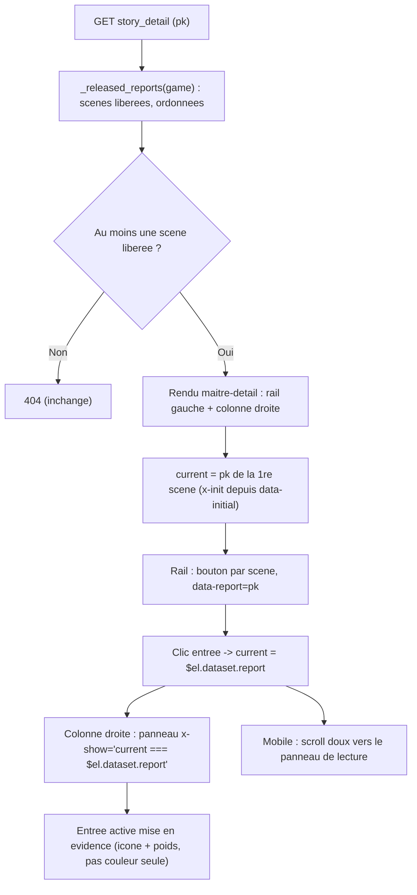

# #156 « histoires complètes » — lecture maître-détail (liste à gauche, scène à droite)

## Objectif

Sur la page d'une histoire (`story_detail`, template `stories/detail.html`), les scènes
libérées (`Report`) s'enchaînent aujourd'hui dans **une seule colonne continue** (`max-w-3xl`,
scènes séparées par un simple filet). Résultat rapporté par #156 : « on a une liste de textes et
on ne voit pas très bien quel report commence et où il finit ».

Cible : un **layout maître-détail**.
- **Rail gauche** = table des scènes (« Scène N · titre · date »), une entrée cliquable par
  `Report` libéré. Sur desktop : rail latéral sticky. Sur mobile : bande horizontale scrollable
  en tête (même pattern que `settings_base.html`).
- **Colonne droite** = lecture d'**une** scène à la fois (sélection dans le rail), avec un
  en-tête de scène net (bornes explicites). La première scène est affichée par défaut.

> Vocabulaire d'affichage (`08-display-vocabulary.md`) : `Report` = **scène** en UI (jamais
> « report »). Le libellé visible est « Scène » / « Scene », l'identifiant de code reste `Report`.

## Décision d'interaction (tranchée — modèle de sélection)

Trois lectures possibles de « liste à gauche, lire à droite » :

| Option | Interaction | Coût | Verdict |
|--------|-------------|------|---------|
| **A — Sélection 1-scène (Alpine, tout en DOM)** | rail sélectionne quelle scène est visible à droite ; toutes les scènes déjà rendues, show/hide client-side | 0 endpoint, 0 requête supplémentaire | **RETENUE** |
| B — Ancres + ToC scrollable | toutes les scènes empilées à droite, le rail est un sommaire qui scrolle vers l'ancre | 0 endpoint mais ne résout que partiellement « où finit une scène » (elles restent enchaînées) | rejetée |
| C — HTMX `hx-get` par scène | chaque clic charge le corps de la scène via un partial serveur | +1 endpoint, +1 requête/scène, alors que `_released_reports` charge déjà tout | rejetée (sur-ingénierie) |

**A retenue** : elle répond le plus littéralement à l'issue (une scène affichée = bornes
non ambiguës), sans endpoint ni requête additionnelle puisque `_released_reports(game)` fournit
déjà l'intégralité des scènes libérées + rapports + markers préfetchés. Le show/hide est du
**pur client-side** (pas de swap HTMX) → l'incompatibilité `tabs`↔HTMX-swap
(`03-alpine-patterns.md`) ne s'applique pas.

## Parcours utilisateur



## Contexte technique vérifié

| Élément | Emplacement | Rôle |
|---------|-------------|------|
| Vue cible | `suddenly/games/game_views.py:179` `story_detail` | Fournit déjà `game`, `reports` (liste), `quotes`. **Aucune modification requise** — le contexte suffit |
| Chargement scènes | `suddenly/games/_view_helpers.py:95` `_released_reports(game)` | `released()` + `select_related("author")` + `prefetch_related` rapports/markers/parent_links → tout est déjà en mémoire, pas de N+1 au rendu |
| Template à refondre | `templates/stories/detail.html` | Colonne unique `max-w-3xl` ; boucle `for report in reports` ; bloc `quotes` en bas ; retour « All stories » |
| Partial rapport (réutilisé) | `templates/stories/_rapport.html` | Rendu read-only d'un `Rapport` (prose serif ; DISCUSSION en aparté) — **inchangé**, réutilisé dans le panneau droit |
| Patron maître-détail existant | `templates/users/settings_base.html:7` | `@lg:flex @lg:gap-10` + `<aside @lg:w-52>` sticky + `overflow-x-auto` mobile + `<main flex-1 min-w-0>` — **patron à calquer** |
| Tests SUD-V3 | `tests/games/test_liberation_views.py:154-193` | `story_detail` : agrège released, 404 si vide, exclut non-public — **à préserver**, ajouter les tests de layout |
| Container queries | `base.html` (`container-app`) + `mobile-first.md` | Enrichir avec `@container app (min-width:…)` via `@lg:` — **jamais `@media`** |

Points confirmés :
- `report.pk` = UUID (charset `[0-9a-f-]`) → sûr comme identifiant d'ancrage / `data-*`.
- Aucune migration, aucun changement de modèle, aucun changement de vue → **périmètre front pur**.
- `quotes` : bloc « Citations retenues » en bas de `detail.html`. Les Quotes sont en cours de
  **purge** (#139 / sous-issue #145). **Hors périmètre #156** : ne pas en dépendre ni le
  supprimer ici — le conserver tel quel en pied de la colonne de lecture (il disparaîtra avec
  #145). Point de vigilance ci-dessous.

## Projection d'architecture

### Modifier
- `templates/stories/detail.html` — remplacer la colonne unique par le layout maître-détail :
  - Racine Alpine : `<div x-data="{ current: '' }" data-initial="{{ reports.0.pk }}"
    x-init="current = $el.dataset.initial">` (exception whitelistée `03-alpine-patterns.md` :
    valeur serveur à N choix fixes injectée via `data-*` + `x-init`).
  - Structure `@lg:flex @lg:gap-10` : `<aside>` rail gauche (inclut `_reading_nav.html`) +
    `<main flex-1 min-w-0>` colonne de lecture.
  - Colonne de lecture : boucle `for report in reports` → un `<article data-report="{{ report.pk }}"
    x-show="current === $el.dataset.report">` par scène, en-tête de scène net (numéro/titre/date),
    `content_warning`, `content`, boucle `_rapport.html`, markers en fin — **repris de l'existant**,
    mais **un seul visible à la fois** (plus de filet `border-t` inter-scènes : chaque scène est
    isolée).
  - Conserver breadcrumb, titre `h1`, ligne de compte, bloc `quotes`, lien retour.
- `tests/games/test_liberation_views.py` — ajouter les tests de layout (voir Milestone 3).

### Créer
- `templates/stories/_reading_nav.html` — le rail : une entrée par scène.
  - `<button type="button" data-report="{{ report.pk }}"
    @click="current = $el.dataset.report" :aria-current="current === $el.dataset.report ? 'true' : 'false'"
    :class="current === $el.dataset.report ? '<actif>' : '<inactif>'">`.
  - Libellé « Scène {{ forloop.counter }} » + `report.title` + date (`session_date` sinon
    `released_at`), tronqué proprement.
  - État actif = **icône + poids/fond** (jamais couleur seule — `01-enforce.md` / `mobile-first §6`).
  - Cible tactile ≥ 44×44 px (`--size-tap`).
  - Desktop : `@lg:flex-col` sticky ; mobile : `flex overflow-x-auto` (chips horizontaux).

### Supprimer
- Rien (aucun fichier, aucune fonction). Le filet inter-scènes `border-t` disparaît du template
  car les scènes ne sont plus empilées — ce n'est pas une suppression de symbole.

## Règles applicables

| Nom | Chemin | Pourquoi |
|-----|--------|----------|
| display-vocabulary | `.claude/rules/08-domain/08-display-vocabulary.md` | `Report` → « scène » / « scene » en UI ; jamais « report » visible |
| mobile-first | `.claude/rules/08-design/mobile-first.md` | Base = 1 colonne (rail empilé au-dessus) ; enrichir `@lg:` en 2 colonnes ; paire sanctionnée side-panel↔nav ; cible ≥44px ; état ≠ couleur seule ; icônes Lucide |
| enforce (design gate) | `.claude/rules/08-design/01-enforce.md` | Utilities couleur uniquement `color.*` (semantic/brand/neutral…) ; pas de hex inline ; `@container app`, pas `@media` ; lint `lint-files.mjs` exit 0 |
| alpine-patterns | `.claude/rules/03-frameworks-and-libraries/03-alpine-patterns.md` | Valeurs Django via `data-*` + `$el.dataset` (jamais `{{ }}` dans une string Alpine) ; exception `x-init` pour valeur à N choix ; pas de timer → `destroy()` N/A |
| htmx-patterns | `.claude/rules/03-frameworks-and-libraries/03-htmx-patterns.md` | Namespacer les `` (`games:stories`) ; vues front rendent du HTML — ici pas de nouvel endpoint (option A) |
| i18n-patterns | `.claude/rules/08-domain/08-i18n-patterns.md` | Libellés « Scène », « Scenes » via `` / `` |
| file-language-and-style | `.claude/rules/01-standards/file-language-and-style.md` | Ce plan (`aidd_docs/tasks/**`) en français |
| pytest | `.claude/rules/05-testing/05-pytest.md` | factory-boy, une assertion utile, `--no-cov` sur run ciblé (gate 50% sinon échoue) |

## Milestones

Chaîne : M1 (colonne de lecture 1-scène) → M2 (rail + sélection) → M3 (tests) → M4 (design gate).
M1 et M2 sont couplés (même template) mais M1 pose la structure droite avant que M2 la pilote.

### Milestone 1 — Colonne de lecture, une scène à la fois
- Dans `detail.html` : racine Alpine `x-data` + `data-initial="{{ reports.0.pk }}"` + `x-init`.
- Colonne `<main>` : chaque scène dans un `<article data-report="{{ report.pk }}"
  x-show="current === $el.dataset.report">`, avec en-tête de scène **explicite** (« Scène N » +
  titre + date), `content_warning`, `content|linebreaksbr`, boucle `_rapport.html`, markers en fin.
- Retirer le filet inter-scènes `border-t` (scènes désormais isolées, plus empilées).
- Conserver breadcrumb / `h1` / ligne de compte / bloc `quotes` / lien retour.
- **Critères d'acceptation** : la page rend 200 ; exactement une scène visible au chargement
  (les autres masquées par `x-show`) ; le contenu de chaque scène reste présent dans le HTML
  (tout en DOM) ; `_rapport.html` inchangé.
- **Vérification** :
  ```bash
  cd app && pytest tests/games/test_liberation_views.py -k story_detail -q --no-cov \
    && python manage.py check
  ```

### Milestone 2 — Rail gauche + sélection
- Créer `templates/stories/_reading_nav.html` (une entrée `<button data-report>` par scène) et
  l'inclure dans un `<aside>` calqué sur `settings_base.html` (sticky desktop, `overflow-x-auto`
  mobile).
- Layout `@lg:flex @lg:gap-10` ; `<aside @lg:w-56 flex-shrink-0>` + `<main flex-1 min-w-0>`.
- Sélection : `@click="current = $el.dataset.report"` ; état actif via `:class` + `:aria-current`
  (icône Lucide `i-lucide-*` + poids/fond, **pas couleur seule**). Cibles ≥44px.
- Mobile : après sélection, scroll doux vers la colonne de lecture (`$el`/`scrollIntoView`, geste
  additif non load-bearing).
- **Critères d'acceptation** : une entrée de rail par scène libérée ; clic sur l'entrée N affiche
  la scène N et masque les autres ; l'entrée active porte `aria-current="true"` ; le rail est
  scrollable horizontalement sous le breakpoint, sticky au-dessus ; aucune valeur `{{ }}` injectée
  dans une string Alpine (tout via `data-*` + `$el.dataset`).
- **Vérification** :
  ```bash
  cd app && python manage.py check && ruff check suddenly/games
  ```

### Milestone 3 — Tests de layout
- Ajouter à `tests/games/test_liberation_views.py` (préserver les 4 tests existants) :
  - `test_story_detail_lists_each_released_scene` : 2+ scènes libérées → chaque titre présent
    dans le rendu **et** un `data-report="{pk}"` par scène (le rail liste toutes les scènes).
  - `test_story_detail_reading_panel_per_scene` : un `<article>`/panneau `data-report` par scène,
    corps de chaque scène dans le HTML (tout en DOM, sélection client-side).
  - `test_story_detail_first_scene_is_initial` : `data-initial` = pk de la première scène du
    contexte `reports`.
  - (Comportement wall préservé : les 4 tests SUD-V3 existants restent verts.)
- Assertions sur le HTML rendu (`response.content`) + `response.context["reports"]` ; factory-boy.
- **Critères d'acceptation** : nouveaux tests verts ; `test_story_detail_aggregates_only_released`,
  `_404_when_no_released_content`, `_excludes_non_public_released`, `_stories_index_*` inchangés.
- **Vérification** :
  ```bash
  cd app && pytest tests/games/test_liberation_views.py -q --no-cov
  ```

### Milestone 4 — Design gate + i18n
- Lint design sur les deux templates ; libellés neufs (« Scène », « Scenes ») via ``
  et recompilation `.mo` (`08-i18n-patterns.md`) si de nouvelles chaînes sont ajoutées.
- **Critères d'acceptation** : `lint-files.mjs` exit 0 sur `detail.html` + `_reading_nav.html`
  (couleurs `color.*`, pas de hex inline, `@container` pas `@media`, état ≠ couleur seule,
  icône décorative `aria-hidden`) ; nouvelles chaînes extraites et traduites FR.
- **Vérification** :
  ```bash
  cd app && node design/lint/lint-files.mjs templates/stories/detail.html templates/stories/_reading_nav.html \
    && python manage.py makemessages -l fr --ignore=node_modules 2>/dev/null; true
  ```

## Points de vigilance
- **Bloc `quotes` (interaction #139/#145)** : les Quotes sont en cours de purge. Ne pas les
  supprimer ni s'y appuyer ici ; les laisser en pied de la colonne de lecture. Si #145 passe
  avant, le bloc disparaîtra sans impact sur ce layout.
- **Ordre de lecture** : `_released_reports` renvoie l'ordre `Meta.ordering`
  (`session_date`, `-published_at`, `-created_at`), **pas** l'ordre de fiction
  (`fiction_thread`, cf. plan `2026_07_15-fiction-order-reports`). #156 porte sur le **layout**,
  pas sur l'ordre : conserver l'ordre actuel. Basculer le rail sur `fiction_thread(game)` (filtré
  released) est un geste séparé, hors périmètre — le noter mais ne pas l'entreprendre ici.
- **Tout en DOM** : option A rend l'intégralité des scènes dans le HTML (masquées par `x-show`).
  Acceptable au volume actuel d'une histoire ; si une histoire devient très longue, migrer vers
  l'option C (HTMX par scène) — décision différée, pas de sur-ingénierie maintenant.
- **XSS / injection Alpine** : `report.pk` est un UUID sûr, mais respecter la règle — passer par
  `data-report` + `$el.dataset.report`, jamais `x-show="current === '{{ report.pk }}'"`.
- **Accessibilité** : `<button>` (action de sélection) et non `<a>` ; `aria-current` sur l'actif ;
  état visible sans couleur seule ; focus visible ; icônes décoratives `aria-hidden="true"`.
- **Mobile-first** : base = rail empilé au-dessus + lecture en dessous (1 colonne) ; enrichir en
  2 colonnes uniquement `@lg:` ; ne jamais masquer une scène derrière un breakpoint (contenu
  toujours en DOM, seule la densité change).

## Évaluation de confiance : 8/10

Raisons (✓)
- Périmètre front pur, symboles vérifiés : `story_detail` passe déjà `reports` complet et
  préfetché (`_released_reports`), aucune vue/migration à toucher ; patron maître-détail existant
  et éprouvé (`settings_base.html`) ; `_rapport.html` réutilisable tel quel.
- Interaction tranchée (option A) avec alternatives documentées ; pattern Alpine conforme à la
  règle (exception `x-init` + `data-*`/`$el.dataset` whitelistée), pas de timer → pas de fuite.
- Tests existants ciblés et préservables ; nouveaux tests déterministes sur le HTML rendu.
- Règles design/i18n/mobile cartographiées ; gate `lint-files.mjs` runnable.

Risques (✗)
- **Volume DOM** : histoires très longues → tout-en-DOM peut peser ; borne acceptable
  aujourd'hui, bascule HTMX (option C) différée si besoin réel.
- **Ordre de fiction** : le rail suit l'ordre de publication, pas l'ordre de fiction — écart
  assumé et hors périmètre, mais visible si une histoire use de flashbacks.
- **Chaînes i18n** : de nouveaux libellés (« Scène ») nécessitent extraction + recompilation
  `.mo` ; oubli = fallback en clé anglaise (non bloquant mais à ne pas manquer).
