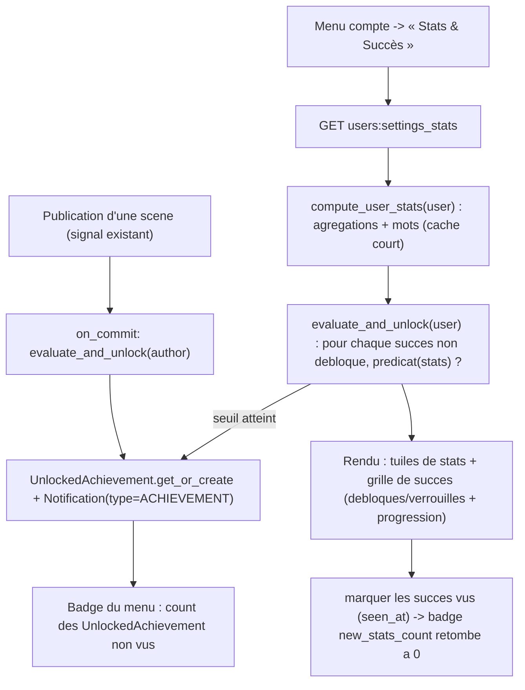

# #153 « Page Stats & Succès » — stats à la demande + catalogue de succès déclenchés

## Objectif

L'issue : « cette page n'existe pas encore. il faut créer une liste des succès, et ensuite les
déclencher quand ils sont atteints. pour les stats, des valeurs précises sur le nombre de signes,
de mots, d'interactions, d'acceptation, etc. »

Cible :
- **Page Stats & Succès** (onglet des réglages, `settings_base.html`) montrant :
  - une grille de **stats chiffrées** de l'utilisateur courant ;
  - une grille de **succès** (débloqués vs verrouillés, avec progression).
- **Déclenchement des succès** : un service évalue les seuils et débloque + notifie ; appelé à la
  visite de la page **et** à la publication d'une scène.
- Câblage du **lien du menu compte** (mort aujourd'hui) et de son **badge** (« N nouveaux succès »).

> Vocabulaire (`08-display-vocabulary.md`) : afficher « scènes »/« posts », jamais « reports »/
> « rapports ».

## Décisions itération 1 (validées par défaut — ajustables)

La question interactive n'a pas abouti ; défauts retenus (les plus sains pour une v1) :

1. **Déclenchement des succès = à la visite + à la publication** (hybride léger). Un service
   `evaluate_and_unlock(user)` tourne (a) sur le GET de la page Stats, (b) depuis le signal
   `post_save` de publication de scène (déjà existant), via `transaction.on_commit`. **Pas** de
   signal sur chaque like/follow/message → un succès purement « interactions reçues » apparaît à
   la prochaine visite/publication. (Alternatives écartées : instantané-via-signaux-partout =
   lourd ; page-seulement = rien ne se débloque sans visite.)
2. **Stats = à la demande + cache court**. Agrégations SQL (counts indexés, `Sum(Length("content"))`
   pour les signes) + comptage de mots en Python sur le corpus de l'utilisateur, mémoïsé via
   `cache.get_or_set` (TTL court, invalidé à la publication). **Aucun compteur dénormalisé** (pas
   de migration de compteurs, pas de dérive).
3. **Succès = catalogue défini en code** (registre Python de définitions : `key`, libellés i18n,
   icône Lucide, seuil/prédicat sur le dict de stats) + une table `UnlockedAchievement(user, key,
   unlocked_at, seen_at)`. Pas de modèle `Achievement` en base (définitions versionnées dans le
   code, pas de seeding).

## Parcours utilisateur

## Contexte technique vérifié

| Élément | Emplacement | Rôle |
|---------|-------------|------|
| Layout onglets | `templates/users/settings_base.html` | Patron sidebar + `` ; ajouter l'onglet « Stats & Succès » |
| Routes users | `suddenly/users/urls.py` (`app_name="users"`) | Ajouter `path("settings/stats/", settings_views.settings_stats, name="settings_stats")` **au-dessus** du catch-all `<str:username>/` |
| Vues réglages | `suddenly/users/settings_views.py` | Patron `@login_required` fonction (ex. `settings_data`) — y ajouter `settings_stats` |
| Lien menu (mort) | `templates/components/_user_menu_items.html:35-38` | `href="#"` → `` ; badge `new_stats_count` |
| Badges menu | `suddenly/core/context_processors.py:40-64` `account_badges` | Peupler `new_stats_count` = succès non vus |
| Scène / post | `suddenly/games/models.py:195` `Report.content`, `:500` `Rapport.content` | Sources texte ; **Rapport n'a pas d'auteur user** → rattaché via `report__author` |
| Like / Recommendation | `games/models.py:325`, `:354` | `filter(user=u)` (donnés) / `filter(report__author=u)` (reçus) |
| Follow (polymorphe) | `characters/models.py:633` | Abonnés via `content_type=user_ct, object_id=u.id, accepted=True` (patron `users/views.py:58` `_get_follow_stats`) |
| LinkRequest / statut | `characters/models.py:342` `LinkRequestStatus.ACCEPTED`, `:353` `LinkRequest` | Acceptées faites `filter(requester=u, status=ACCEPTED)` / reçues `filter(target_character__creator=u, status=ACCEPTED)` |
| DM | `messaging/models.py:64` `DirectMessage.sender` | Messages envoyés `filter(sender=u).count()` |
| Wall filter | `games/models.py:118` `Report.objects.released()` | Scènes publiées user-facing = `filter(author=u).released()` |
| Notifications | `core/models.py:39` `NotificationType`, `:58` `Notification` | **Ajouter** `ACHIEVEMENT` ; `Notification.objects.create(recipient, type, target=<succès>)` |
| Signal publication | `core/notification_signals.py:121` `notify_on_report_published` + `:162` `_track_usage_and_prompt` | Point d'accroche du déclenchement (patron « incrément sur publication ») |
| Enregistrement signaux | `core/apps.py:9` `ready()` importe `notification_signals` | Convention `dispatch_uid` + imports lazy + `on_commit` (`03-django-signals.md`) |

Points confirmés :
- **Aucun** modèle/registre de succès, badge, ou service d'unlock n'existe (grep vide).
- **Aucun** compteur mots/signes dénormalisé ; `UserUsageStats` est lié aux dons, `gated` par
  `donation_enabled`, ne suit que `total_posts` (scènes) — **non réutilisé** pour ces stats.
- **Rapport sans auteur user** : « mots écrits » = `Report.content` (author=u) + `Rapport.content`
  (report__author=u) ; un post d'un autre joueur dans ma scène compte pour l'auteur de la scène
  (limite assumée, documentée).
- `NotificationType` = `TextChoices` (`max_length=30`) → ajout d'une valeur = migration `AlterField`.

## Projection d'architecture

### Créer
- `suddenly/core/stats.py` — `compute_user_stats(user) -> dict[str, int]` : un petit nombre
  d'agrégations (counts indexés + `Sum(Length("content"))` pour les signes) ; mots via split Python
  sur les contenus de l'utilisateur ; mémoïsé `cache.get_or_set(f"user_stats:{user.pk}", …, TTL)`.
- `suddenly/core/achievements.py` — le **registre** : `ACHIEVEMENTS: list[AchievementDef]` (chaque
  `key`, `name`/`description` `gettext_lazy`, `icon` Lucide, `predicate(stats) -> bool`, `progress`
  optionnel) ; `evaluate_and_unlock(user) -> list[str]` (calcule les stats, débloque les nouveaux
  via `UnlockedAchievement.get_or_create`, crée les `Notification`, retourne les clés neuves) ;
  `achievements_view_model(user)` (débloqués + verrouillés + progression pour le template). Logique
  **hors modèle** (service).
- `suddenly/core/models.py` — `class UnlockedAchievement(BaseModel)` : `user` FK CASCADE
  (`related_name="unlocked_achievements"`), `key` CharField (valeur du registre), `seen_at`
  DateTimeField null, `UniqueConstraint(["user","key"])`, `Index(["user"])`. (Le libellé/desc/icône
  vivent dans le registre, pas en base.)
- Migration `core/00XX_unlockedachievement_and_more.py` — nouveau modèle + `AlterField` du champ
  `type` de `Notification` (ajout `ACHIEVEMENT`). Additive.
- `suddenly/users/settings_views.py` — `settings_stats(request)` : `compute_user_stats` +
  `evaluate_and_unlock` + `achievements_view_model` ; marque les succès **vus** (`seen_at`) ; rend
  `settings_stats.html`.
- `templates/users/settings_stats.html` — `` :
  section **Stats** (tuiles chiffrées) + section **Succès** (grille débloqués/verrouillés + barre de
  progression). Design tokens `color.*`, icônes Lucide, état ≠ couleur seule.
- `tests/users/test_stats.py` + `tests/core/test_achievements.py`.

### Modifier
- `suddenly/core/models.py` — `NotificationType` : `ACHIEVEMENT = "achievement", _("Succès débloqué")`.
- `suddenly/core/notification_signals.py` — dans `notify_on_report_published` (ou un receiver dédié
  `dispatch_uid`), `transaction.on_commit(lambda: evaluate_and_unlock(author))` (import lazy).
- `suddenly/users/urls.py` — route `settings_stats` **avant** le catch-all username.
- `templates/components/_user_menu_items.html` — `href` du lien → `users:settings_stats`.
- `suddenly/core/context_processors.py` `account_badges` — `new_stats_count =
  UnlockedAchievement.objects.filter(user=request.user, seen_at__isnull=True).count()`.
- `templates/users/settings_base.html` — onglet « Stats & Succès » dans la sidebar.

### Supprimer
- Rien.

## Règles applicables

| Nom | Chemin | Pourquoi |
|-----|--------|----------|
| django-models | `03-frameworks-and-libraries/03-django-models.md` | `UnlockedAchievement(BaseModel)`, `on_delete`, `Meta.constraints`/`indexes` ; logique d'unlock **hors modèle** |
| django-services | `03-frameworks-and-libraries/03-django-services.md` | `compute_user_stats`/`evaluate_and_unlock` en service, vue mince |
| django-signals | `03-frameworks-and-libraries/03-django-signals.md` | `dispatch_uid`, import lazy, `transaction.on_commit` pour l'unlock au publish |
| data-pivots-django-orm | `07-quality/data-pivots-django-orm.md` | agrégations (pas de N+1) ; cache `get_or_set` + invalidation ; `Sum(Length(...))` pour les signes |
| temporal-wall | `08-domain/08-temporal-wall.md` | scènes publiées comptées via `released()` |
| display-vocabulary | `08-domain/08-display-vocabulary.md` | UI « scènes »/« posts », jamais « reports »/« rapports » |
| mobile-first / enforce | `08-design/*` | tuiles/grille responsives, tokens `color.*`, Lucide, état ≠ couleur seule, lint 0 |
| i18n-patterns | `08-domain/08-i18n-patterns.md` | libellés stats/succès via ``/`gettext_lazy` ; `.mo` recompilés |
| pytest | `05-testing/05-pytest.md` | factory-boy ; un comportement/test ; pas de réseau |

## Milestones

Chaîne : M1 (stats) → M2 (succès modèle+registre+service) → M3 (déclencheurs) → M4 (page+câblage
menu/badge) → M5 (tests+i18n+design). M1 et M2 sont indépendants ; M3 dépend de M2 ; M4 de M1+M2.

### Milestone 1 — Service de stats (à la demande + cache)
- `compute_user_stats(user)` : scènes publiées, posts, signes, mots, personnages, parties,
  likes/recommandations donnés & reçus, abonnés/abonnements, demandes acceptées (faites/reçues),
  messages envoyés. Agrégations bornées ; mots en Python ; `cache.get_or_set` TTL court.
- **Acceptation** : valeurs exactes sur un jeu de données fabriqué ; `assertNumQueries` borné
  (indépendant du volume au-delà des agrégats) ; cache hit au 2ᵉ appel.
- **Vérif** : `pytest tests/users/test_stats.py -q --no-cov && mypy suddenly/core/stats.py`.

### Milestone 2 — Modèle + registre + service d'unlock
- `UnlockedAchievement` + migration ; `NotificationType.ACHIEVEMENT` (AlterField).
- Registre `ACHIEVEMENTS` (jeu initial : 1re scène, 10/50 scènes, 10k/100k mots, 1er personnage,
  5 personnages, 1er like reçu, 100 likes reçus, 1er abonné, 10 abonnés, 1re demande acceptée).
- `evaluate_and_unlock(user)` idempotent (`get_or_create` sur `(user,key)`), crée les
  `Notification(type=ACHIEVEMENT, target=<row>)`, retourne les clés neuves.
- **Acceptation** : franchir un seuil débloque **une seule** ligne + une notification ; re-run =
  no-op ; un succès jamais atteint reste verrouillé ; `makemigrations --check` propre après commit.
- **Vérif** : `pytest tests/core/test_achievements.py -q --no-cov && ruff check suddenly/core && mypy suddenly/core/achievements.py`.

### Milestone 3 — Déclencheurs (visite + publication)
- Appel `evaluate_and_unlock` dans `settings_stats` (GET) et via `transaction.on_commit` dans le
  signal de publication de scène (`dispatch_uid`, import lazy). Invalider le cache stats à la
  publication.
- **Acceptation** : publier une scène franchissant un seuil crée la notification sans visiter la
  page ; ouvrir la page débloque les succès « interactions » atteints ; pas de double-unlock.
- **Vérif** : `pytest tests/core/test_achievements.py -k "trigger or publish or view" -q --no-cov`.

### Milestone 4 — Page + câblage menu/badge
- `settings_stats.html` (tuiles stats + grille succès + progression) ; onglet dans `settings_base`.
- Lien `_user_menu_items.html` → `users:settings_stats` ; `new_stats_count` peuplé dans
  `account_badges` ; `seen_at` posé à la visite (badge retombe à 0).
- **Acceptation** : page 200 pour l'utilisateur connecté (login requis) ; anonyme → redirection
  login ; le badge reflète les succès non vus et se vide après visite ; libellés « scènes »/« posts ».
- **Vérif** : `pytest tests/users/test_stats.py -k "view or badge" -q --no-cov && node design/lint/lint-files.mjs templates/users/settings_stats.html && python manage.py check`.

### Milestone 5 — Tests + i18n + design gate
- Couverture : valeurs de stats, unlock par seuil, idempotence, déclenchement publish, badge,
  accès (login), i18n. Libellés stats + succès (fr) ; `.mo` recompilés (babel). `ruff check .` +
  `ruff format --check .` **repo-wide** (leçon #154 : la CI lint tout le repo, tests inclus).
- **Acceptation** : suite verte ; lint 0 ; `makemigrations --check` = No changes ; chaînes fr présentes.
- **Vérif** : la commande `success_condition` + `ruff check . && ruff format --check .`.

## Points de vigilance
- **Attribution des posts** : `Rapport` n'a pas d'auteur user ; « mots/posts » sont comptés via
  `report__author`. Un post d'un autre joueur dans ma scène compte pour moi (auteur de la scène) —
  limite assumée, à documenter dans l'UI si besoin (« mots dans vos scènes »).
- **Coût du comptage de mots** : O(corpus de l'utilisateur) par calcul → **cache court obligatoire**
  + invalidation à la publication ; ne jamais compter les mots dans une boucle par carte/liste.
- **CI lint repo-wide** (leçon #154) : lancer `ruff check .` **et** `ruff format --check .` sur tout
  le repo avant push, pas seulement les dossiers modifiés.
- **Ordre des routes** : `settings/stats/` **avant** le catch-all `<str:username>/` sinon capté
  comme un username.
- **`released()` pour les scènes** : compter les scènes publiées via le filtre de mur canonique,
  pas un `filter(status=...)` inline.
- **Idempotence unlock** : `UniqueConstraint (user, key)` = filet contre un double déclenchement
  (visite + publish quasi-simultanés) ; `get_or_create`, jamais `create` nu.
- **Badge** : `seen_at` posé à la visite de la page — définir « vu » = affiché sur la page Stats,
  pas « notification lue » (deux surfaces distinctes).
- **Migration `NotificationType`** : `AlterField` du champ `choices` — purement additive, pas de
  data migration.

## Évaluation de confiance : 7/10

Raisons (✓)
- Toutes les sources de données sont identifiées et requêtables ; patrons existants à réutiliser
  (signal publish, `_get_follow_stats`, `settings_*` views, `settings_base.html`, badges context
  processor) ; lien menu + badge déjà stubés.
- Périmètre découpé, décisions d'archi tranchées (à la demande + cache ; registre code ; hybride
  visite+publish), chaque milestone vérifiable.

Risques (✗)
- **Déclenchement** : le défaut hybride ne débloque pas *instantanément* les succès « interactions
  reçues » (like/abonné) hors visite/publication — à confirmer si l'utilisateur veut l'instantané
  (option signaux-partout, plus lourde).
- **Choix du catalogue de succès** : seuils/liste initiale = proposition ; à ajuster au produit.
- **Mots/signes** : définition « par scène de l'auteur » (pas d'attribution par post) — sémantique
  à valider.
- **Coût agrégations** : sûr pour une page perso ; deviendrait un sujet si exposé en listing/leaderboard
  (hors périmètre).
