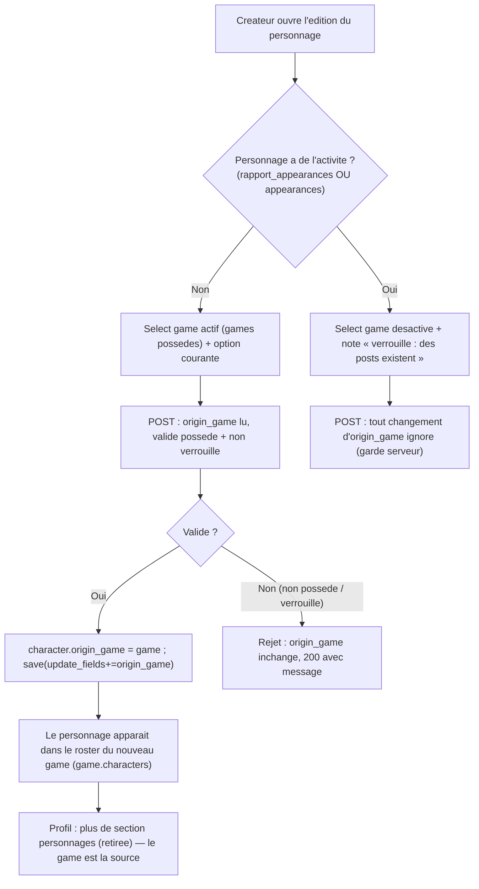

# #154 « personnage et game » — game éditable + verrou sur activité, retrait section profil

## Objectif

Deux demandes de l'issue :

1. **(A) Éditer le game d'un personnage** — « on doit pouvoir dans l'édition choisir un game
   pour le personnage. une fois qu'il y a des posts associés au personnage, on ne devrait plus
   pouvoir modifier son game. »
2. **(B) Rattachement au game, pas au profil** — « les personnages doivent apparaître dans la
   game à laquelle ils sont liés, il n'y a pas besoin d'avoir une section personnages dans mon
   profil, c'est une sous-section de chaque game. »

Cible :
- Le formulaire d'édition d'un personnage expose un **sélecteur de game** (`origin_game`),
  scoppé aux games de l'éditeur (comme à la création), **verrouillé** dès que le personnage a
  de l'activité (posts/appearances).
- La **sous-section personnages d'un game existe déjà** → (B)-apparition est acquise ; on
  **retire** la section personnages du profil (template + contexte de vue).

> Vocabulaire (`08-display-vocabulary.md`) : `Rapport` = **post**, `Report` = **scène**. « posts
> associés au personnage » = `Rapport` dont `actor` = ce personnage.

## Décision de périmètre (tranchée, ancrée sur les règles domaine)

`08-characters.md` distingue **trois** relations personnage↔game, à ne jamais confondre :

| Relation | Sens | Rôle #154 |
|----------|------|-----------|
| **`origin_game`** (FK non-null, `related_name=characters`) | naissance + **maison AP** (`attributedTo`) | **c'est LE « game du personnage »** de l'issue : roster + édition |
| `GameCast` (`castings`) | pool incarnable (qui peut poster) | hors périmètre |
| `CharacterAppearance` (`appearances`) | présence jouée dans une scène (a posteriori) | **hors verrou** (décision : posts seuls) |

**Décisions itération 1 (validées, non négociables)** :
- **Verrou = posts seuls** : `origin_game` figé dès que `character.rapport_appearances.exists()`
  (un `Rapport` dont le personnage est l'`actor`). `CharacterAppearance` **n'entre pas** dans le
  verrou (littéral à l'issue « des posts associés »).
- **Re-home AP = hors périmètre** : aucun `Update(Person)` émis au changement d'`origin_game`.
  Acceptable car le verrou borne le changement aux personnages **sans post** ; propagation
  fédérée différée (travail ultérieur si un perso a déjà fédéré du contenu).

- Le **roster d'un game** s'affiche déjà via le reverse `origin_game` (`game.characters`) — donc
  « apparaître dans la game » = `origin_game`. Éditer « le game du personnage » = éditer
  `origin_game`. **Ne jamais** basculer le roster sur `castings` (régression : masquerait les PC
  créés hors composer — règle explicite).
- **`origin_game` reste non-null** (`08-characters.md` : maison AP, load-bearing pour
  `serializers`/`tasks`). On change sa **valeur**, jamais sa nullabilité → **aucune migration**.
- **Verrou** : dès que le personnage a de l'activité, on fige `origin_game`. Re-homer un
  personnage actif déplacerait sa maison AP et scinderait ses `CharacterAppearance`/`Rapport`
  (qui suivent la game de leur scène, pas `origin_game`) → incohérence. Le verrou est correct.

## Parcours utilisateur

## Contexte technique vérifié

| Élément | Emplacement | Rôle |
|---------|-------------|------|
| FK game | `suddenly/characters/models.py:80-86` `origin_game` (non-null, CASCADE, `related_name=characters`, indexé) | Le champ à rendre éditable ; **rester non-null** |
| Signal du verrou | `suddenly/games/models.py` `Rapport.actor` → `related_name=rapport_appearances` (SET_NULL) | **le** signal retenu : « a des posts » (décision : posts seuls) |
| (non retenu) | `CharacterAppearance.character` → `related_name=appearances` (CASCADE) | présence durable — **hors verrou** par décision |
| Vue édition | `suddenly/characters/front_views.py:362-402` `character_edit` (creator-only) | POST à étendre : lire `origin_game`, valider possédé + non verrouillé, ajouter à `update_fields` (l.391) |
| Vue création (patron) | `characters/front_views.py:423-505` `character_create` | Scoping `games=Game.objects.filter(owner=request.user)` (l.439), lecture+validation `origin_game` (l.458-477) — **patron à mirrorer** |
| Template édition | `templates/characters/character_form.html` (edit-only) | Ajouter le `<select origin_game>` + état verrouillé ; pas de branche create ici |
| Select à réutiliser | `templates/characters/character_create.html:41-53` `<select name="origin_game" required>` | Copier le pattern (options `games`, `selected` sur valeur courante) |
| Roster game (déjà là) | `suddenly/games/game_views.py:104-111` + `templates/games/detail.html:111-138` | **(B)-apparition acquise** : liste `game.characters.filter(parent__isnull=True)[:12]` |
| Section profil à retirer | `templates/users/profile.html:122-164` (bloc `<!-- Characters -->`) | **Supprimer** |
| Contexte profil à retirer | `suddenly/users/views.py:41-43` `context["characters"] = profile_user.created_characters...` | **Supprimer** (query morte sinon) |
| Tests édition | `tests/characters/test_character_edit.py` | À étendre (changement de game + verrou) ; POST valides peuvent devoir porter `origin_game` |
| Règles domaine | `.claude/rules/08-domain/08-characters.md` | origin_game non-null = maison AP ; roster via origin_game ; 3 relations distinctes |

Points confirmés :
- **Aucune migration** : `origin_game` existe et reste non-null ; on modifie sa valeur.
- La création scoppe `origin_game` aux games **possédés** par l'utilisateur → mirrorer à l'édition.
- Aucun helper « a de l'activité » n'existe (grep) → **à créer** (service, pas dans le modèle).
- Le verrou doit être **serveur** : un `<select disabled>` ne soumet rien, mais un POST forgé
  pourrait tenter le changement → garde serveur obligatoire (ignorer/rejeter si verrouillé).

## Projection d'architecture

### Modifier
- `suddenly/characters/services.py` — ajouter `character_has_posts(character) -> bool` :
  `character.rapport_appearances.exists()` (posts seuls — décision). Source de vérité unique du
  verrou (réutilisée vue + template via contexte). (Règle : logique hors modèle.)
- `suddenly/characters/front_views.py` `character_edit` :
  - Contexte GET/erreur : passer `games = Game.objects.filter(owner=request.user)` et
    `game_locked = character_has_posts(character)`.
  - POST : si **non** verrouillé, lire `origin_game` (POST), valider qu'il est **possédé**
    (`games.get(pk=...)`, sinon rejet message) et l'affecter ; ajouter `"origin_game"` à
    `save(update_fields=[...])`. Si **verrouillé**, ignorer toute valeur `origin_game`
    (garde serveur) — `origin_game` inchangé.
  - Conserver la convention de la vue : erreur = re-render **200** (pas 422).
- `templates/characters/character_form.html` — ajouter un bloc game :
  - `<select name="origin_game">` (options `games`, `selected` sur `character.origin_game_id`),
    **inclure l'option courante** même si absente des games possédés (ne pas la perdre).
  - Si `game_locked` : `disabled` + note explicite (« Verrouillé : des posts existent déjà »),
    icône Lucide + texte (état ≠ couleur seule). Champ labellisé, cible ≥44px.
- `templates/users/profile.html` — **supprimer** le bloc `<!-- Characters -->` (l.122-164).
- `suddenly/users/views.py` — **supprimer** `context["characters"] = ...` (l.41-43) et l'import
  devenu inutile s'il y en a un.
- `tests/characters/test_character_edit.py` — les POST valides existants passent désormais par une
  vue qui lit `origin_game` ; s'assurer qu'un POST sans `origin_game` sur un personnage **non
  verrouillé** ne casse pas (origin_game conservé si champ absent/vide → ne pas écraser par nul).

### Créer
- `character_has_posts` (dans `services.py`, cf. Modifier).
- Tests neufs dans `tests/characters/test_character_edit.py` (ou `test_character_game_edit.py`) :
  changement de game réussi (non verrouillé, game possédé) ; rejet game non possédé ; **verrou**
  (personnage avec un `Rapport` dont il est l'`actor` → `origin_game` non modifiable, select
  `disabled`, POST forgé ignoré) ; le personnage apparaît dans le roster du **nouveau** game.
- (Optionnel) test de non-régression profil : le profil ne rend plus la section personnages.

### Supprimer
- Bloc template `profile.html:122-164` + ligne contexte `users/views.py:41-43`. Aucune
  fonctionnalité unique perdue : création de personnage depuis `games/detail.html` (GM, par game),
  édition depuis `characters:detail` et le GM dashboard, suppression via `characters:delete`.

### Ne PAS toucher (déjà conforme)
- `game_views.game_detail` + `games/detail.html` roster : **(B)-apparition déjà en place**
  (reverse `origin_game`, forks exclus). Ajuster **seulement** si le produit veut lever le cap
  `[:12]` ou changer le traitement des forks — hors périmètre par défaut.

## Règles applicables

| Nom | Chemin | Pourquoi |
|-----|--------|----------|
| characters (domain) | `.claude/rules/08-domain/08-characters.md` | 3 relations distinctes ; `origin_game` non-null = maison AP ; roster via `origin_game`, jamais `castings` |
| django-services | `.claude/rules/03-frameworks-and-libraries/03-django-services.md` | `character_has_posts` en service, pas dans le modèle ; vue mince |
| django-models | `.claude/rules/03-frameworks-and-libraries/03-django-models.md` | `origin_game` reste non-null ; `update_fields` explicite |
| data-pivots §7 (sécurité) | `.claude/rules/07-quality/data-pivots-django-orm.md` | scope `origin_game` cible aux games `owner=request.user` ; verrou serveur (jamais faire confiance au `disabled` client) |
| htmx-patterns | `.claude/rules/03-frameworks-and-libraries/03-htmx-patterns.md` | vue édition rend du HTML (form partial) ; garde serveur sur mutateur |
| mobile-first / enforce | `.claude/rules/08-design/*` | select labellisé, état verrouillé = icône+texte (pas couleur seule), ≥44px, tokens `color.*`, lint 0 |
| i18n-patterns | `.claude/rules/08-domain/08-i18n-patterns.md` | libellés « Game d'origine »/note de verrou via `` ; recompiler `.mo` (babel) |
| pytest | `.claude/rules/05-testing/05-pytest.md` | factory-boy, un comportement/test, fixture « personnage avec activité » via `Rapport(actor=...)`/`CharacterAppearance` |

## Milestones

Chaîne : M1 (service verrou) → M2 (édition backend+template) → M3 (retrait profil) →
M4 (roster : vérification) → M5 (tests + i18n/design). M3/M4 indépendants de M2.

### Milestone 1 — Service `character_has_posts`
- `character_has_posts(character) -> bool` dans `characters/services.py` :
  `character.rapport_appearances.exists()` (posts seuls — décision).
- **Acceptation** : True dès qu'un `Rapport(actor=perso)` existe ; False sur un personnage neuf ;
  une `CharacterAppearance` seule (sans post) **ne** verrouille **pas**.
- **Vérif** : `pytest tests/characters -k has_posts -q --no-cov && mypy suddenly/characters/services.py`.

### Milestone 2 — Édition `origin_game` (backend + template) avec verrou
- Vue : contexte `games` + `game_locked` ; POST valide/affecte `origin_game` (possédé, non
  verrouillé) et l'ajoute à `update_fields` ; garde serveur si verrouillé ; option courante
  toujours présente dans le select.
- Template : `<select origin_game>` (réutilise le pattern create) + état `disabled` + note si
  verrouillé.
- **Acceptation** : personnage neuf → changement de game persistant et visible dans le roster
  cible ; game non possédé → rejeté (200 + message), `origin_game` inchangé ; personnage avec
  activité → select `disabled` + POST forgé ignoré (`origin_game` inchangé) ; erreur nom vide →
  toujours 200.
- **Vérif** : `pytest tests/characters/test_character_edit.py -q --no-cov && ruff check suddenly/characters && mypy suddenly/characters/front_views.py`.

### Milestone 3 — Retrait de la section personnages du profil
- Supprimer `profile.html:122-164` + `users/views.py:41-43` (et import mort éventuel).
- **Acceptation** : le profil rend 200 sans section « personnages » ; les sections games et
  autres inchangées ; aucune query `created_characters` résiduelle dans la vue.
- **Vérif** : `pytest tests/test_views.py -q --no-cov && ruff check suddenly/users && python manage.py check`.

### Milestone 4 — Roster game (vérification (B)-apparition)
- Confirmer que `game_detail` liste bien les personnages (`game.characters`) — **déjà en place**.
- Décision produit ouverte : lever le cap `[:12]` / afficher les forks ? **Hors périmètre** par
  défaut ; ne rien changer sauf demande explicite.
- **Acceptation** : un personnage dont `origin_game=G` apparaît dans le roster de `G`
  (test de bout en bout avec le changement de M2).
- **Vérif** : `pytest tests/games -k "detail and character" -q --no-cov` (ou test dédié).

### Milestone 5 — Tests + i18n + design gate
- Tests neufs (changement, rejet non-possédé, verrou, apparition roster, profil sans section).
- Libellés neufs (« Game d'origine », note de verrou) via `` ; extraction + fr +
  recompilation `.mo` (babel — gettext absent en local).
- `lint-files.mjs` sur `character_form.html` + `profile.html`.
- **Acceptation** : suite verte ; lint 0 ; `makemigrations --check` = No changes ; chaînes fr présentes.
- **Vérif** : la commande `success_condition`.

## Points de vigilance
- **`origin_game` non-null** : ne jamais rendre nullable ni écraser par nul quand le champ POST
  est absent/vide sur un personnage non verrouillé — conserver la valeur courante.
- **Verrou serveur, pas seulement `disabled`** : un `<select disabled>` ne soumet rien, mais un
  POST forgé pourrait porter `origin_game` → la vue **doit** ignorer/refuser le changement quand
  `character_has_posts` est vrai.
- **Signal du verrou = posts seuls** (décision) : `character.rapport_appearances.exists()`.
  `Rapport.actor` est `SET_NULL` — un post dont l'acteur a été dé-lié ne compte plus ; assumé.
  `CharacterAppearance` est volontairement **hors** verrou (littéral à l'issue).
- **Re-home AP hors périmètre** (décision) : changer `origin_game` déplace la maison AP
  (`attributedTo`) mais **aucun** `Update(Person)` n'est émis. Borné au cas « aucun post » par le
  verrou ; propagation fédérée = travail ultérieur si un perso a déjà fédéré un `Create(Person)`.
- **Scope de sécurité** : options du select = games `owner=request.user` (+ l'option courante) ;
  valider côté serveur que la cible est possédée (jamais un pk arbitraire).
- **Roster forks** : un FORK hérite d'`origin_game` et apparaît dans le roster du parent — **par
  design** (`08-characters.md`), pas un bug ; ne pas « corriger » en changeant la requête roster.
- **Perte de la gestion profil** : le profil cesse d'être un hub de gestion des personnages ;
  confirmer qu'aucun raccourci « + Nouveau personnage » au niveau profil n'est requis (la création
  exige de toute façon un game possédé → bouton présent sur `games/detail.html`).

## Évaluation de confiance : 9/10

Raisons (✓)
- Périmètre cadré par les règles domaine : `origin_game` = « game du personnage », roster déjà
  branché dessus, non-null à préserver — aucune ambiguïté de modélisation, **aucune migration**.
- Patron d'implémentation existant et testé (vue/ template `character_create` pour le select +
  scoping possédé) ; signaux d'activité identifiés (`rapport_appearances`/`appearances`).
- (B)-apparition déjà acquise → le travail (B) se réduit à un retrait propre (template + contexte).
- Chaque milestone est vérifiable (pytest/ruff/mypy/lint dédiés).

Ambiguïtés levées (itération 1)
- **Sémantique du verrou** : tranchée → **posts seuls** (`rapport_appearances`), `CharacterAppearance`
  exclue. Plus de OR.
- **Re-home AP** : tranchée → **hors périmètre**, aucun `Update(Person)`.

Risques résiduels (✗)
- **Post à acteur dé-lié** (`Rapport.actor` `SET_NULL`) : un perso ayant posté puis dé-lié
  redeviendrait techniquement déverrouillé — cas de bord assumé (rare, cohérent avec « posts seuls »).
- **Tests profil** : peu/pas de test existant sur la section profil ; vérifier qu'aucun test de
  rendu n'assert « Characters » avant suppression.
