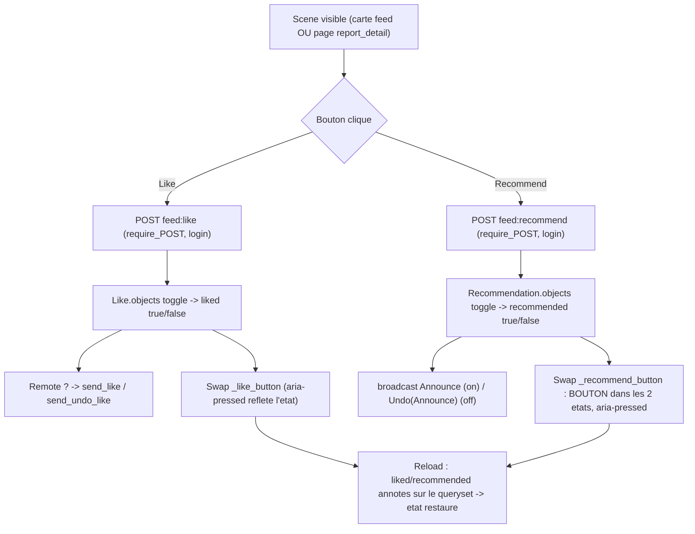

# #155 « boutons sur la scène » — like réparé + recommend en toggle réversible

## Objectif

Deux boutons d'engagement vivent sur la carte de scène (`feed/_scene_card.html`) : **Like**
(#138) et **Recommend** (boost / AP `Announce`, US-28). L'issue #155 rapporte deux pannes
distinctes :

1. **Like** : « on ne peut pas like ou unlike, ça ne fonctionne pas » — cliquer ne swappe rien.
2. **Recommend** : « change de couleur, mais ça ne fait rien, et on ne peut pas repasser à
   l'état initial » — un swap visuel inerte, sans persistance ni retour arrière.

Cible :
- **Like fonctionnel** partout où il apparaît.
- **Recommend = vrai toggle persistant réversible** (comme Like) : on/off, état survit au reload,
  fédération `Announce` / `Undo(Announce)` cohérente.
- **Les deux boutons présents sur la page de lecture d'une scène** (`report_detail`) — « boutons
  sur la scène ».

> Vocabulaire (`08-display-vocabulary.md`) : `Report` = **scène** en UI.

## Diagnostic (vérifié contre le code)

### Like — le backend est correct et testé ; la panne est quasi-certainement opérationnelle
- Vue `like_report` (`suddenly/core/feed_views.py:246`) : `@require_POST @login_required`, toggle
  réel `Like.objects.create/delete`, renvoie `feed/_like_button.html` avec `liked`. **Correct.**
- Modèle `Like` (`suddenly/games/models.py:325`) + migration `games/0024_like_like_unique_user_report_like.py`.
- Annotation `liked=Exists(...)` présente sur **tous** les querysets feed
  (`feed_views.py:112,166,202` ; `core/services.py:88`).
- CSRF HTMX câblé globalement (`frontend/src/main.js:38` → header `X-CSRFToken`).
- Suite `tests/games/test_like.py` (170 l.) : toggle create/delete, 405/302/404, annotation,
  N+1 — **verte**.
- **Le seul écart serveur qui casse le Like mais pas le Recommend** (même carte, même HTMX, même
  CSRF) : `like_report` **écrit dans la table `Like`** alors que `recommend_report` ne touche
  aucune table. Si **migration 0024 non appliquée** sur l'instance → `like_report` lève (table
  absente) → **500** → HTMX ne swappe pas → « ça ne fonctionne pas ». `recommend_report` → 200 →
  swap couleur. **La paire exacte de symptômes découle de là.**
- ⇒ **Correctif Like = appliquer la migration** (opérationnel), pas de changement de logique.
  Un doute résiduel subsiste (voir Confiance) : Milestone 1 valide d'abord ce diagnostic.

### Recommend — stub entièrement expliqué par le code (correctif = code)
- Vue `recommend_report` (`feed_views.py:219`) : n'écrit **rien** localement, `_safe_delay`
  d'un `send_announce_activity` fire-and-forget, puis renvoie `_recommend_button.html` avec
  `recommended=True` **codé en dur**.
- `_recommend_button.html` : branche `recommended` = **`<span>` non-interactif** (« change de
  couleur, ne fait rien ») ; aucune route de retour ; l'include dans `_scene_card.html:48` **ne
  passe pas `recommended`** → au reload, toujours l'état « Recommander » (« pas de retour arrière »).
- **Aucune annotation `recommended`**, **aucun modèle de persistance** (grep `recommended` →
  seulement le `True` codé en dur ; `Announce` n'existe que comme dict AP sortant sans état local).
- ⇒ **Correctif Recommend = le rendre persistant et réversible**, calqué sur Like.

## Décision de périmètre (tranchée — ajustable)

La question interactive n'a pas abouti ; défaut retenu, le plus aligné avec l'intitulé et les
symptômes :

- **Surface** : réparer sur les cartes du feed (leur emplacement actuel) **ET** ajouter les deux
  boutons sur `report_detail` (la page « scène »). Les symptômes prouvent une interaction avec les
  boutons de carte ; « boutons **sur la scène** » justifie aussi la page de lecture.
- **Recommend** : **toggle persistant réversible** (« repasser à l'état initial » l'exige) — pas un
  simple undo visuel non persistant.

Si l'utilisateur veut restreindre (feed seul, ou undo visuel sans persistance), retirer M6
(surface `report_detail`) et/ou simplifier M2–M4.

## Parcours utilisateur



## Contexte technique vérifié

| Élément | Emplacement | Rôle |
|---------|-------------|------|
| Vue like | `suddenly/core/feed_views.py:246` `like_report` | Patron de toggle correct — calquer recommend dessus |
| Vue recommend (stub) | `suddenly/core/feed_views.py:219` `recommend_report` | À réécrire en toggle persistant `@require_POST @login_required` |
| Modèle Like | `suddenly/games/models.py:325` | Patron du nouveau `Recommendation` (FK user+report, unique, index) |
| Migration Like | `games/0024_like_like_unique_user_report_like.py` | **À appliquer sur l'instance** (M1) ; modèle du fichier de migration `Recommendation` |
| Annotation `liked` | `feed_views.py:112,166,202` ; `core/services.py:88` | 4 sites → extraire un helper `annotate_viewer_reactions` (DRY, rule-of-three) |
| Tâche Announce | `suddenly/activitypub/tasks.py:382` `send_announce_activity` | Réutilisée on-create ; extraire `_announce_activity_id` (id déterministe) |
| Undo directed | `tasks.py:455` `send_undo_like_activity` | Patron de `send_undo_announce_activity` (mais **broadcast**, pas directed) |
| Bouton like | `templates/feed/_like_button.html` | Patron (toggle, `aria-pressed`, `<button>` dans les 2 états) |
| Bouton recommend | `templates/feed/_recommend_button.html` | À réécrire : `<button>` dans les 2 états, pas `<span>` |
| Carte scène | `templates/feed/_scene_card.html:44-49` | Passe `liked=report.liked` ; **ajouter** `recommended=report.recommended` |
| Page scène | `templates/games/report_detail.html` | **Ni like ni recommend** aujourd'hui → à ajouter (M6) |
| Vue page scène | `suddenly/games/report_views.py:210` `report_detail` | N'annote **pas** `liked`/`recommended` → à annoter (auth-only) |
| Tests like | `tests/games/test_like.py` | Régression à préserver ; modèle de `tests/games/test_recommend.py` |

Points confirmés :
- `Announce` est un **broadcast** aux followers (boost), local **ou** distant — contrairement au
  `Like` (directed à l'auteur distant uniquement). Le dispatch AP diffère → garder deux vues
  parallèles, ne pas sur-abstraire le dispatch (extraire seulement l'annotation, gain DRY net).
- `recommend_report` n'est pas `@require_POST` (check manuel) — devenu mutateur pur, le passer
  `@require_POST @login_required` (cohérent avec `like_report`, `03-htmx-patterns.md`).

## Projection d'architecture

### Modifier
- `suddenly/games/models.py` — ajouter `class Recommendation(BaseModel)` : FK `user`
  (`related_name="recommendations"`), FK `report` (`related_name="recommendations"`),
  `UniqueConstraint(["user","report"], name="unique_user_report_recommendation")`,
  `Index(fields=["report"])`. Calqué sur `Like`. **Zéro logique métier dans le modèle.**
- `suddenly/core/feed_views.py` — réécrire `recommend_report` en toggle
  (`@require_POST @login_required`) : `Recommendation.objects` create/delete → `recommended`
  bool ; on-create `send_announce_activity`, on-delete `send_undo_announce_activity` (via
  `_safe_delay`) ; renvoyer `_recommend_button.html` avec `recommended`. Remplacer les 4
  annotations `liked=Exists(...)` par un appel au helper (voir Créer).
- `suddenly/core/services.py` — la popular-scenes queryset (`:88`) utilise aussi le helper.
- `suddenly/activitypub/tasks.py` — extraire `_announce_activity_id(domain, username, report_pk)`
  (id déterministe, utilisé par `send_announce_activity` **et** l'undo) ; ajouter
  `send_undo_announce_activity(user_id, report_id)` = `Undo` enveloppant l'`Announce` (même `id`),
  **broadcast** via `broadcast_activity.delay` (pas `sign_and_deliver` directed).
- `suddenly/games/report_views.py` — `report_detail` : annoter `liked`/`recommended` sur le
  report rendu **quand `request.user.is_authenticated`** (`.annotate(liked=Exists(...),
  recommended=Exists(...))` via le helper, ou annotation ciblée sur l'objet unique).
- `templates/feed/_recommend_button.html` — réécrire : `<button hx-post=""
  hx-vals hx-target="this" hx-swap="outerHTML">` dans **les deux** états, `aria-pressed`,
  libellé + icône reflétant l'état (calqué sur `_like_button.html`).
- `templates/feed/_scene_card.html:48` — passer `recommended=report.recommended`.
- `templates/games/report_detail.html` — inclure `_like_button.html` + `_recommend_button.html`
  (avec `report`, `liked`, `recommended`) dans une barre d'actions, **auth-only**, scène publiée.
- `tests/games/test_like.py` — inchangé (régression).

### Créer
- `suddenly/games/migrations/0026_recommendation.py` — additive (dernière = `0025_game_completed_at`).
- Helper d'annotation (DRY) — `annotate_viewer_reactions(qs, user)` dans `suddenly/core/services.py`
  (ou `suddenly/games/services.py`) : ajoute `liked` **et** `recommended` (`Exists` par user).
  Remplace les 4 sites dupliqués + sert `report_detail`.
- `send_undo_announce_activity` (dans `tasks.py`, cf. Modifier).
- `tests/games/test_recommend.py` — calqué sur `test_like.py` : toggle create/delete, `aria-pressed`
  flip, GET→405, anon→302, uuid invalide/inexistant→404, draft→404, annotation initiale, N+1.
- `tests/activitypub/test_announce_federation.py` — `Announce` on-create (broadcast) +
  `Undo(Announce)` on-delete (même `id`), tâches en `CELERY_TASK_ALWAYS_EAGER`.

### Supprimer
- Le `<span>` non-interactif et le `JsonResponse`/check manuel de méthode dans `recommend_report`
  (remplacés). Aucun fichier supprimé.

## Règles applicables

| Nom | Chemin | Pourquoi |
|-----|--------|----------|
| django-models | `.claude/rules/03-frameworks-and-libraries/03-django-models.md` | `BaseModel`, `on_delete` explicite, `Meta.constraints`/`indexes`, zéro logique métier |
| dry-refactor (rule of three) | `.claude/rules/07-quality/dry-refactor.md` | `liked`+`recommended` annotés sur 4 sites → helper unique `annotate_viewer_reactions` |
| htmx-patterns | `.claude/rules/03-frameworks-and-libraries/03-htmx-patterns.md` | `@require_POST` sur mutateur pur ; `hx-target/​swap=outerHTML` ; `` namespacé ; front rend du HTML (partial) |
| activitypub (domain) | `.claude/rules/08-domain/08-activitypub.md` | `Announce`/`Undo` types AS2 ; `id` URL stable et déterministe pour corréler l'Undo ; broadcast vs directed |
| ap-pivots §3/§8 | `.claude/rules/07-quality/ap-pivots-django-activitypub.md` | Livraison via Celery/`_safe_delay`, jamais dans la vue ; `Undo` référence le même `id` |
| data-pivots §1 | `.claude/rules/07-quality/data-pivots-django-orm.md` | Annotation `Exists` (pas de requête par carte) ; `assertNumQueries` borné ; index sur `report` |
| temporal-wall | `.claude/rules/08-domain/08-temporal-wall.md` | Boutons sur `report_detail` : scène publiée/visible seulement ; ne pas exposer une scène derrière le mur |
| mobile-first / enforce | `.claude/rules/08-design/*` | Boutons ≥44px, état ≠ couleur seule (icône + `aria-pressed` + libellé), Lucide, tokens `color.*`, lint exit 0 |
| i18n-patterns | `.claude/rules/08-domain/08-i18n-patterns.md` | Libellés « Recommander/Recommandé » via `` ; recompiler `.mo` (babel) |
| pytest | `.claude/rules/05-testing/05-pytest.md` | factory-boy, un comportement/test, AP en `ALWAYS_EAGER`, `--no-cov` sur run ciblé |

## Milestones

Chaîne : M1 (diag/like) indépendant. M2→M3→M4→M5 (recommend backend→AP→annotation→bouton).
M6 (surface page scène) dépend de M4+M5. M7 tests suit chaque milestone. M8 i18n/design en fin.

### Milestone 1 — Diagnostic & réparation du Like (opérationnel d'abord)
- Confirmer le diagnostic sur l'instance : `python manage.py showmigrations games` → si
  `0024_like_...` est `[ ]`, `python manage.py migrate games` (le correctif Like réel).
- Écrire un **test de non-régression de contrat** (si absent) prouvant qu'un POST `feed:like`
  authentifié sur une scène publiée renvoie **200** + `aria-pressed="true"` puis toggle → `false`
  (déjà couvert par `test_toggle_creates_then_deletes` ; sinon compléter).
- **Aucune modification de logique Like** si le diagnostic tient. Si le POST échoue malgré 0024
  appliquée, ré-instruire (log serveur, 500 réel) avant de coder — le plan bascule alors sur un
  vrai bug à localiser.
- **Critères d'acceptation** : `test_like.py` vert ; sur une DB migrée, POST `feed:like` → 200 +
  swap ; `showmigrations` documenté dans le journal de tâche.
- **Vérification** :
  ```bash
  cd app && python manage.py showmigrations games | grep 0024 \
    && pytest tests/games/test_like.py -q --no-cov
  ```

### Milestone 2 — Modèle `Recommendation` + migration
- `class Recommendation(BaseModel)` calqué sur `Like` (FK user/report `CASCADE`, unique
  `(user, report)`, index `report`, `ordering = ["-created_at"]`).
- `makemigrations games` → `0026_recommendation.py` additive (pas de prompt : additive nullable).
- **Critères d'acceptation** : `makemigrations --check --dry-run` propre après commit ; `migrate`
  applique ; unique constraint rejette un doublon `(user, report)`.
- **Vérification** :
  ```bash
  cd app && python manage.py makemigrations games && python manage.py migrate \
    && ruff check suddenly/games/models.py && mypy suddenly/games/models.py
  ```

### Milestone 3 — Vue recommend en toggle + fédération Undo(Announce)
- `recommend_report` réécrite (`@require_POST @login_required`) : toggle `Recommendation.objects`,
  `recommended` bool, `_safe_delay(send_announce_activity | send_undo_announce_activity, ...)`,
  renvoie `_recommend_button.html` avec `report` + `recommended`.
- `tasks.py` : `_announce_activity_id(domain, username, report_pk)` déterministe (extrait de
  `send_announce_activity`) ; `send_undo_announce_activity` = `Undo` enveloppant l'`Announce`
  (même `id`), **broadcast** aux followers (`broadcast_activity.delay`), no-op si user/report absent.
- **Critères d'acceptation** : POST recommend crée puis supprime la `Recommendation` (2e POST =
  off) ; on-create enqueue `Announce`, on-delete enqueue `Undo(Announce)` avec le **même** `id`
  d'objet ; GET→405, anon→302, scène draft/inexistante→404.
- **Vérification** :
  ```bash
  cd app && pytest tests/games/test_recommend.py tests/activitypub/test_announce_federation.py -q --no-cov \
    && ruff check suddenly/core/feed_views.py suddenly/activitypub/tasks.py \
    && mypy suddenly/core/feed_views.py suddenly/activitypub/tasks.py
  ```

### Milestone 4 — Annotation `recommended` + helper DRY
- `annotate_viewer_reactions(qs, user)` : ajoute `liked` **et** `recommended`
  (`Exists(Like...)`, `Exists(Recommendation...)`) ; anonyme → annotations `False` (ou court-circuit).
- Remplacer les 4 sites `liked=Exists(...)` (`feed_views.py:112,166,202` ; `services.py:88`) par le
  helper. Aucune requête par carte (annotation set-based).
- **Critères d'acceptation** : chaque queryset feed expose `liked` **et** `recommended` ;
  `assertNumQueries` borné (pas de N+1 après ajout du 2e `Exists`) ; un seul site de vérité pour
  les deux annotations.
- **Vérification** :
  ```bash
  cd app && pytest tests/games/test_like.py tests/games/test_recommend.py tests/core/test_popular_scenes.py -q --no-cov \
    && mypy suddenly/core/feed_views.py suddenly/core/services.py
  ```

### Milestone 5 — Bouton recommend réversible + carte
- `_recommend_button.html` : `<button>` dans **les deux** états (hx-post toggle, `aria-pressed`,
  icône `i-lucide-sparkles`, libellé « Recommander »/« Recommandé »), calqué sur `_like_button.html`.
- `_scene_card.html:48` : ``.
- **Critères d'acceptation** : état recommandé rendu comme **bouton** cliquable (plus de `<span>`) ;
  clic off → repasse à « Recommander » ; après reload, l'état reflète l'annotation ; `aria-pressed`
  correct dans les deux états.
- **Vérification** :
  ```bash
  cd app && pytest tests/games/test_recommend.py -q --no-cov \
    && node design/lint/lint-files.mjs templates/feed/_recommend_button.html
  ```

### Milestone 6 — Surfacer like + recommend sur la page scène (`report_detail`)
- `report_views.report_detail` : annoter `liked`/`recommended` sur le report **quand authentifié**
  (via le helper ou `Exists` ciblé sur l'objet unique) ; passer au contexte.
- `report_detail.html` : barre d'actions incluant `_like_button.html` + `_recommend_button.html`
  (`report`, `liked`, `recommended`), **auth-only**, scène publiée/visible (respect du mur —
  `08-temporal-wall.md`).
- **Critères d'acceptation** : utilisateur connecté sur une scène publiée voit les deux boutons
  fonctionnels (toggle + swap) ; anonyme ne les voit pas ; aucun bouton sur une scène derrière le
  mur pour un non-auteur ; pas de N+1 (annotation unique).
- **Vérification** :
  ```bash
  cd app && pytest tests/games/test_report_detail_actions.py -q --no-cov \
    && node design/lint/lint-files.mjs templates/games/report_detail.html \
    && mypy suddenly/games/report_views.py
  ```

### Milestone 7 — Tests (récapitulatif)
- `tests/games/test_recommend.py` (nouveau, calqué sur `test_like.py`).
- `tests/activitypub/test_announce_federation.py` (nouveau) : `Announce` + `Undo(Announce)`.
- `tests/games/test_report_detail_actions.py` (nouveau) : présence/fonction des boutons sur
  `report_detail` (auth-only, mur respecté).
- `tests/games/test_like.py` (préservé).
- **Critères d'acceptation** : tous verts ; `assertNumQueries` bornés ; AP en `ALWAYS_EAGER`.
- **Vérification** : la commande `success_condition`.

### Milestone 8 — i18n + design gate
- Nouvelles chaînes « Recommander »/« Recommandé »/`aria-label` via `` ; extraire +
  traduire FR ; recompiler `.mo` via babel (`08-i18n-patterns.md`).
- `lint-files.mjs` sur les templates touchés (état ≠ couleur seule : `aria-pressed` + icône +
  libellé ; tokens `color.*` ; ≥44px).
- **Critères d'acceptation** : lint exit 0 ; chaînes FR présentes ; `.mo` recompilés et versionnés.
- **Vérification** :
  ```bash
  cd app && node design/lint/lint-files.mjs templates/feed/_recommend_button.html templates/feed/_scene_card.html templates/games/report_detail.html
  ```

## Points de vigilance
- **Diagnostic Like non prouvé sur l'instance** : le plan suppose migration 0024 non appliquée.
  M1 le vérifie **avant** toute autre chose. Si 0024 est appliquée et le Like échoue quand même,
  c'est un vrai bug à localiser (log 500 réel) — ne pas coder à l'aveugle.
- **Announce broadcast vs Like directed** : ne pas sur-abstraire le dispatch AP en un helper
  commun — les cibles diffèrent (followers vs auteur distant). Seule l'**annotation** est mutualisée.
- **Id AP déterministe** : `Undo(Announce)` doit réutiliser exactement l'`id` de l'`Announce`
  (`_announce_activity_id`) pour que le récepteur corrèle — sinon boost fantôme côté distant.
- **Idempotence toggle** : la `UniqueConstraint (user, report)` est le filet contre le double-clic
  (deux create concurrents) — comme pour Like.
- **Mur temporel sur `report_detail`** : n'exposer les boutons que sur une scène publiée visible du
  spectateur ; jamais sur une scène derrière le mur pour un non-auteur.
- **N+1** : après ajout du 2e `Exists` (`recommended`), re-borner `assertNumQueries` sur le feed et
  la popular-scenes queryset.
- **Cohérence UI recommend** : l'état « recommandé » doit rester un **bouton** (retour arrière),
  pas un `<span>` — c'est le cœur du bug #155.

## Évaluation de confiance : 7/10

Raisons (✓)
- Recommend entièrement expliqué par le code (stub non-persistant, `<span>` inerte, pas
  d'annotation, pas d'undo) ; correctif = réplication exacte du patron Like (#138) déjà éprouvé
  et testé.
- Symboles vérifiés : `like_report`/`recommend_report`, modèle `Like`, migration 0024,
  `send_announce_activity` (id `.../announce/{pk}`), `send_undo_like_activity` (patron d'undo),
  4 sites d'annotation `liked`, absence des boutons dans `report_detail.html`.
- Périmètre découpé, chaque milestone vérifiable (pytest/ruff/mypy/lint dédiés) ; DRY traité
  (helper d'annotation) sans sur-abstraction du dispatch AP.

Risques (✗)
- **Cause du Like non confirmée sur l'instance** (migration probable mais non prouvée à distance) —
  M1 est un garde-fou, mais la confiance globale en pâtit tant que `showmigrations` n'est pas lu
  sur l'environnement réel.
- **Surface `report_detail`** = interprétation de « sur la scène » (décision de périmètre prise
  faute de réponse interactive) — retirable si l'utilisateur visait seulement les cartes du feed.
- **Sémantique Announce local** : booster sa propre scène locale diffuse un `Announce` aux
  followers — comportement voulu (US-28) à confirmer si une règle métier restreint le boost.
