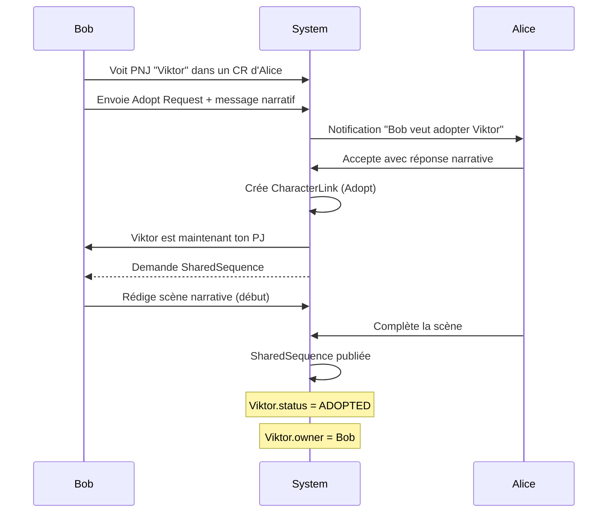
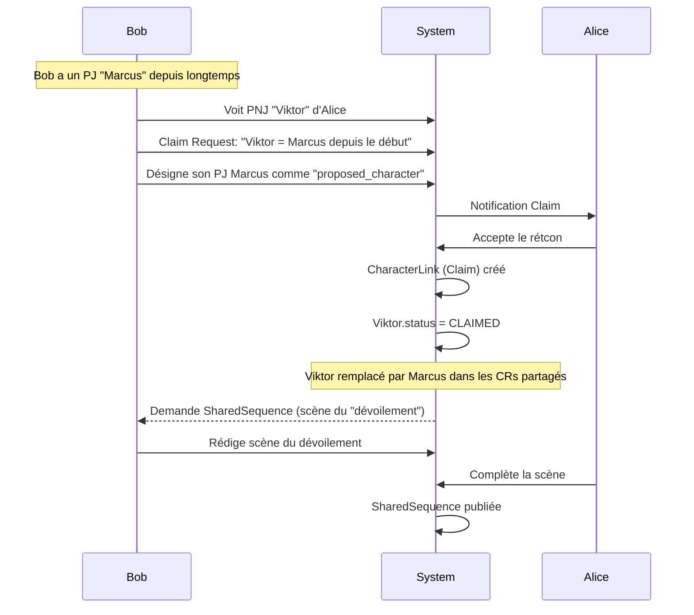
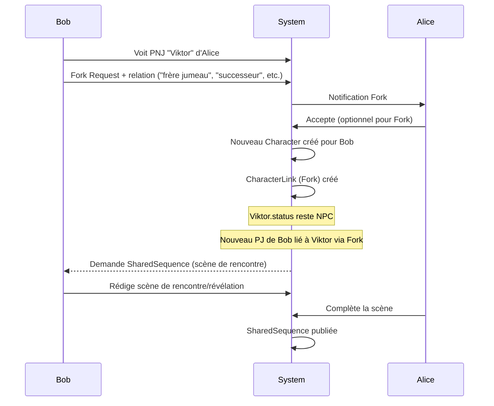
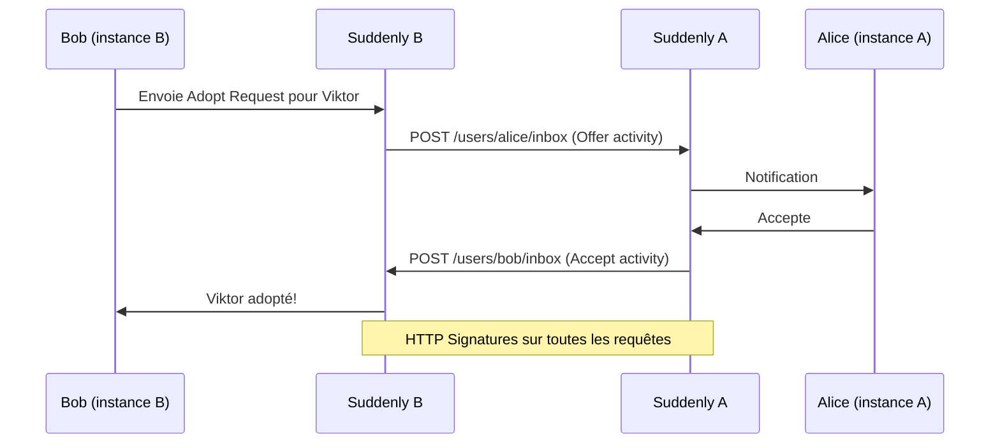
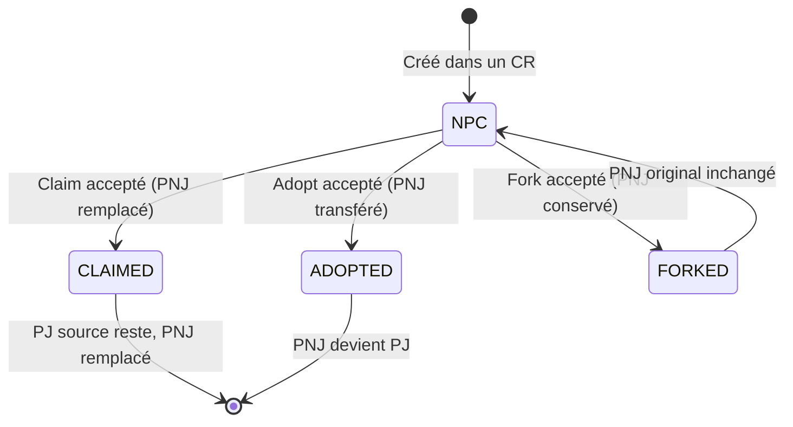

# Flows — Claim / Adopt / Fork

Les trois types de liens narratifs qui constituent le cœur de Suddenly.

---

## Vue d'ensemble

| Type | Signification | Résultat | PNJ original |
|------|--------------|----------|--------------|
| **Claim** | "Ce PNJ était mon PJ depuis le début" — rétcon | PNJ remplacé par le PJ existant | Remplacé |
| **Adopt** | "Je reprends ce PNJ comme mon PJ" — transfert | PNJ devient le PJ du demandeur | Transféré |
| **Fork** | "Mon PJ est inspiré de ce PNJ" — dérivation | Nouveau PJ lié, PNJ reste intact | Conservé |

---

## Flow Adopt (le plus courant)



## Flow Claim (rétcon)



## Flow Fork (dérivation)



## Flow Cross-Instance (fédération)



## Statuts Character



## SharedSequence — Règle MVP

**Un lien sans SharedSequence est invalide.**

La séquence partagée est la scène narrative co-écrite par les deux joueurs qui justifie le lien. Elle est obligatoire pour tous les types (Claim, Adopt, Fork).

```
Workflow SharedSequence:
1. Lien accepté → notification aux deux joueurs
2. Initiateur rédige sa partie de la scène (Markdown)
3. Accepteur complète la scène
4. Les deux valident → publication sur les deux instances
5. La SharedSequence apparaît dans les deux parties concernées
```
