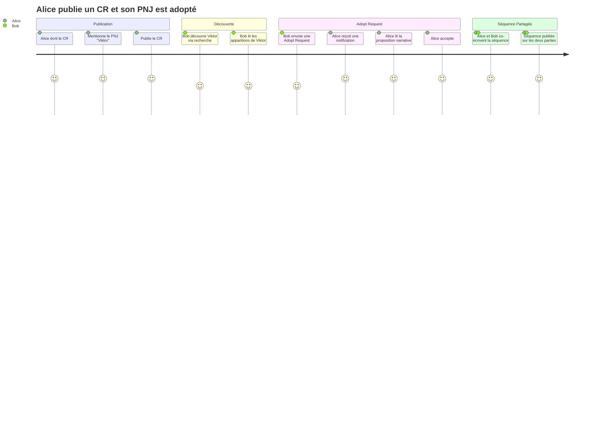
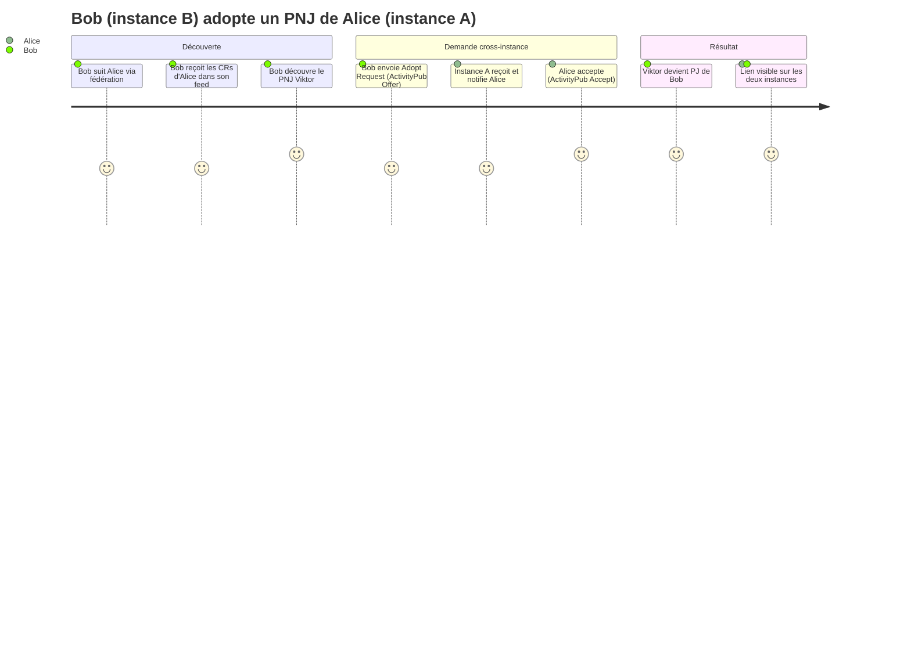

# PROJECT_BRIEF — Suddenly

## Executive Summary

- **Projet** : Suddenly
- **Vision** : Réseau fédéré de fiction partagée où les personnages traversent les histoires
- **Mission** : Permettre aux joueurs de JdR de publier des comptes-rendus et d'interconnecter leurs personnages via ActivityPub

### Description complète

Suddenly est un réseau social fédéré dédié aux joueurs de jeux de rôle. Les joueurs publient des comptes-rendus de leurs parties et peuvent mentionner des personnages (PNJ). Ces personnages deviennent des points d'ancrage narratifs que d'autres joueurs peuvent réclamer, adopter ou dériver pour leurs propres histoires.

**"Suddenly"** = ce moment où l'inattendu surgit, quand un personnage apparaît soudainement dans une autre histoire.

**Instances prévues** :
- `suddenly.social` — Instance internationale (principale)
- `soudainement.fr` — Instance française

---

## Contexte

### Domaine métier

Le jeu de rôle sur table génère des histoires riches peuplées de personnages mémorables. Ces personnages restent souvent confinés à une seule table, alors qu'ils pourraient circuler entre les histoires via la fiction partagée (shared fiction).

Suddenly s'inspire du concept de **"shared world"** (monde partagé) pour créer un réseau où :
- Les PNJ d'une partie peuvent devenir les PJ d'une autre
- Les histoires se croisent via des séquences narratives partagées
- La fédération ActivityPub permet l'interopérabilité entre instances

### Langage Ubiquitaire

| Terme | Définition | Synonymes |
|-------|------------|-----------|
| **Partie** (Game) | Campagne ou session de JdR | Campagne, session |
| **Compte-rendu** (Report) | Récit d'une session de jeu | CR, session report |
| **Personnage** (Character) | PJ ou PNJ mentionné dans un CR | PC, NPC |
| **PJ** | Personnage Joueur — contrôlé par un joueur | PC (Player Character) |
| **PNJ** | Personnage Non-Joueur — créé par un MJ | NPC (Non-Player Character) |
| **Lien** (Link) | Connexion narrative entre deux personnages | Link |
| **Claim** | "Ce PNJ était mon PJ depuis le début" — rétcon | Réclamation |
| **Adopt** | "Je reprends ce PNJ comme mon PJ" — transfert | Adoption |
| **Fork** | "Mon PJ est inspiré de ce PNJ" — dérivation | Dérivation |
| **Séquence Partagée** | Scène narrative co-écrite justifiant un lien | Shared Sequence |
| **Citation** (Quote) | Réplique mémorable d'un personnage | Quote |
| **Instance** | Serveur Suddenly autonome fedéré | Server, node |
| **Fédération** | Communication inter-instances via ActivityPub | Federation |

---

## Features & Use-cases

### Fonctionnalités principales

1. **Publication de comptes-rendus** — Écrire et publier des CRs de parties avec mise en forme Markdown
2. **Mention de personnages** — Tagger PJ et PNJ dans les CRs pour constituer leur historique
3. **Claim/Adopt/Fork** — Demander des liens narratifs entre personnages de joueurs différents
4. **Séquences partagées** — Co-écrire la scène narrative justifiant un lien
5. **Citations** — Collecter les répliques mémorables des personnages
6. **Fédération** — Suivre des joueurs/personnages/parties d'autres instances
7. **Recherche** — Trouver des personnages par nom, jeu, statut via PostgreSQL FTS

### Use-cases principaux

- **Joueur publie un CR** → mentionne PNJ → PNJ devient disponible pour Claim/Adopt/Fork
- **Joueur voit un PNJ intéressant** → envoie Adopt request + proposition narrative → accepté → séquence co-écrite
- **Joueur distant** (autre instance) → suit un personnage → reçoit les CRs via ActivityPub
- **MJ** → crée une partie publique → joueurs la suivent → reçoivent les nouvelles sessions

---

## User Journey Maps

### Persona 1 : Alice (Joueuse / MJ)

- Joue à City of Mist, publie des CRs réguliers
- Crée des PNJ détaillés dans ses parties
- Veut voir ses PNJ "prendre vie" dans d'autres histoires

#### Journey : Alice publie un CR et son PNJ est adopté

### Persona 2 : Bob (Joueur distant)

- Instance différente (soudainement.fr vs suddenly.social)
- Suit des joueurs d'autres instances via fédération
- Veut adopter un PNJ qu'il a découvert sur une autre instance

#### Journey : Bob adopte un PNJ depuis une autre instance

