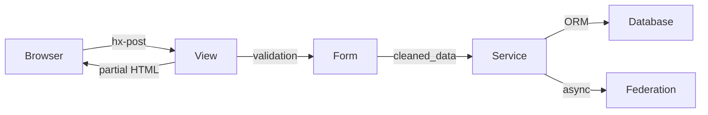
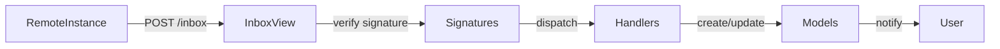

# Architecture — Règles

## Backend

- **Framework** : Django 5.x → @requirements.txt
- **API Style** : REST + ActivityPub (JSON-LD)
- **Architecture** : Fat Models / Service Layer / Thin Views
- **ORM** : Django ORM
- **Schema** : `apps/*/models.py`
- **Database** : PostgreSQL 16+
- **Cache** : Redis (optionnel, fallback DB cache)
- **Tests** : pytest + mypy + ruff

## Frontend

- **Templating** : Django Templates (SSR)
- **Interactions** : HTMX (pas de SPA)
- **État UI** : Alpine.js léger (modals, toggles)
- **CSS** : Tailwind (CDN ou build)
- **Pas de** : React, Vue, Next.js, build step obligatoire

## Structure du projet

```
suddenly/
├── config/        # Django settings (base/dev/prod)
├── apps/          # Applications métier
│   ├── users/     # Auth + profils + AP Person
│   ├── games/     # Game (AP Group) + Report (AP Article)
│   ├── characters/# Character (AP Person) + liens
│   ├── quotes/    # Quote (AP Note)
│   └── federation/# Core ActivityPub
├── core/          # BaseModel, ActivityPubMixin, utils
├── templates/     # Templates + composants HTMX
└── tests/
    ├── contracts/ # Tests logique métier (20%)
    └── e2e/       # Tests critiques (10%)
```

## Conventions obligatoires

### Patterns

1. **Fat Models** : la logique métier appartient aux models/services, pas aux vues
2. **UUID PKs** : tous les modèles utilisent UUID comme clé primaire
3. **Soft Delete** : ne jamais supprimer du contenu fédéré (ajouter `deleted_at`)
4. **Service Layer** : opérations complexes dans `services.py` (Claim/Adopt/Fork)
5. **select_related/prefetch_related** : obligatoire sur toutes les querysets paginées

### ActivityPub

- Tous les acteurs (User, Game, Character) ont `ap_id`, `inbox`, `outbox`, `local`
- `local=True` pour le contenu local, `local=False` pour le contenu distant
- HTTP Signatures obligatoires pour toutes les requêtes AP sortantes
- Vérifier signatures sur toutes les activités AP entrantes

### Nommage

| Élément | Convention | Exemple |
|---------|------------|---------|
| Fichiers | `snake_case` | `character_service.py` |
| Classes | `PascalCase` | `CharacterService` |
| Fonctions | `snake_case` | `get_user_characters()` |
| Constants | `SCREAMING_SNAKE` | `MAX_THEME_CARDS` |
| URLs | `kebab-case` | `/characters/my-character/` |
| Templates | `app/template_name.html` | `characters/detail.html` |

## Services communication

### HTMX → Django View → Service → Model



### ActivityPub Inbox Flow


