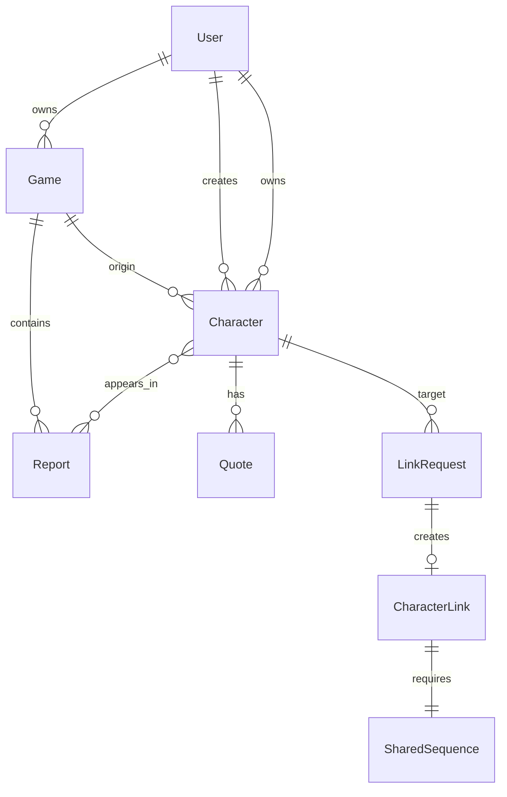

# Database — Règles

## Information

- **Schema** : `apps/*/models.py` + `docs/models/README.md`
- **Type** : PostgreSQL 16+
- **ORM** : Django ORM
- **Connection** : `DATABASE_URL` (env variable)

## Entités principales et relations



## Conventions obligatoires

### Clés primaires

```python
# TOUJOURS UUID, jamais auto-increment
id = models.UUIDField(primary_key=True, default=uuid.uuid4, editable=False)
```

### BaseModel

Tous les modèles héritent de `BaseModel` (dans `core/models.py`) :

```python
class BaseModel(models.Model):
    id = models.UUIDField(primary_key=True, default=uuid.uuid4, editable=False)
    created_at = models.DateTimeField(auto_now_add=True)
    updated_at = models.DateTimeField(auto_now=True)
    class Meta:
        abstract = True
```

### ActivityPubMixin

Les modèles fédérables héritent aussi de `ActivityPubMixin` :

```python
class ActivityPubMixin(models.Model):
    ap_id = models.URLField(unique=True, null=True, blank=True)
    inbox = models.URLField(null=True, blank=True)
    outbox = models.URLField(null=True, blank=True)
    local = models.BooleanField(default=True)
    class Meta:
        abstract = True
```

**`local=True`** = contenu local | **`local=False`** = contenu distant fédéré

### Index obligatoires

- Toujours indexer `ap_id` (lookups fréquents en fédération)
- Toujours indexer `local` + champs de filtrage principaux
- Indexer `status` sur Character, Report, Follow, LinkRequest
- Créer des index composites pour les requêtes combinées fréquentes

### Soft Delete

```python
# Ne JAMAIS supprimer du contenu fédéré
deleted_at = models.DateTimeField(null=True, blank=True)

# Utiliser un manager par défaut qui exclut les supprimés
class ActiveManager(models.Manager):
    def get_queryset(self):
        return super().get_queryset().filter(deleted_at__isnull=True)
```

### Contraintes DB importantes

```sql
-- Un PNJ ne peut pas avoir de owner
CHECK (status != 'NPC' OR owner_id IS NULL)

-- Un Claim nécessite un proposed_character
CHECK (link_type != 'CLAIM' OR proposed_character_id IS NOT NULL)
```

## Migrations

Django migrations standard :

```bash
# Créer les migrations
python manage.py makemigrations [app]

# Appliquer
python manage.py migrate

# Ordre de création : users → federation → games → characters → quotes
```

## Seeding / Fixtures

```bash
# Créer superuser
python manage.py createsuperuser

# Charger fixtures de dev
python manage.py loaddata fixtures/dev_data.json
```

## Full-text Search

PostgreSQL FTS sur Character et Report :

```sql
-- Index FTS personnages
CREATE INDEX idx_character_fts ON characters_character
USING gin(to_tsvector('french', name || ' ' || description));

-- Index FTS comptes-rendus
CREATE INDEX idx_report_fts ON games_report
USING gin(to_tsvector('french', title || ' ' || content));
```
